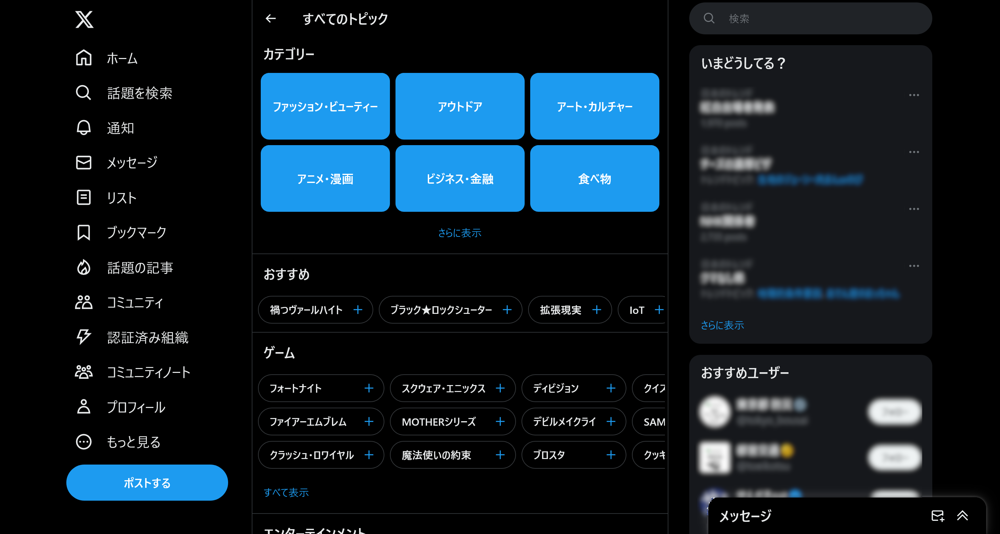

Twitter（X）では、特定の話題に関するツイート（ポスト）をまとめて見られる「トピック」という機能が存在しています。

ところが、いつからかトピックの選択画面が消えてしまいました。また、以前は検索結果からもトピックをフォローできましたが、キーワードによるトピックの検索ができなくなってしまっています。

しかし、トピック機能自体は消えていないので、ある手順を踏むことでトピックの選択画面やタイムラインを表示できます。

## トピックとは？

トピックは、Twitter上の特定の話題に関する人気なツイートをまとめて閲覧できる機能です。トピックをフォローすると、その話題についての情報を見逃さずに確認できます。

Twitter上の会話のうち、広範に見られ、かつ一過性でない話題がトピックに反映されています。

Twitterでは、さまざまなカテゴリーの多くのトピックをフォローできます。トピックは常に追加されており、ツイート数と健全性にもとづいて選ばれています。

- [Xのトピック | Xヘルプ](https://help.twitter.com/ja/using-x/follow-and-unfollow-topics)

## トピックが消えた？

いつからかは不明ですが、過去のあるタイミングから、トピックの選択画面を表示できなくなってしまいました。

以前はアプリの［トピック］タブからトピックの選択画面を表示し、気になったトピックをフォローできました。また、検索結果やタイムラインにもトピックのフォローボタンが表示されるときがありました。

しかし、現在ではどちらも表示されなくなっています。

## トピックを復活させる方法

このようにトピックは通常の画面から消えてしまいましたが、内部ではまだ残っているため、特定の手順を踏むことで使い続けられます。

### トピックの選択画面を表示する

トピックの選択画面を表示するには、Web版のTwitterを使う必要があります。アプリ版では選択画面が完全に削除されており、利用できません。

TwitterのWeb版にログインしたら、次のURLを開いてください。

- [https://twitter.com/i/topics/picker/home](https://twitter.com/i/topics/picker/home)

このURLは、トピックの選択画面を直接開けるリンクです。このリンクを開くと、トピックの選択画面が表示されます。

### フォロー中のトピックを確認する方法

フォロー中のトピックを確認するには、Web版のTwitterで次のURLにアクセスしてください。ただし、``<自分のスクリーンネーム>``は、実際の自分のスクリーンネームに置き換えてください。

``https://twitter.com/<自分のスクリーンネーム>/topics/followed``

たとえば、あなたのアカウントのスクリーンネームが``@abc123``なら、``https://twitter.com/abc123/topics/followed``にアクセスします。

### 既存のトピックを閲覧する方法

既存のトピックのURLが判明している場合は、そのトピックのタイムラインを閲覧できます。また、フォロー中のトピックはURLが分からなくても閲覧できます。

ただし、これについてもアプリ版では削除されているため、Web版から閲覧する必要があります。

まず、トピックのURLが判明している場合は、そのURLをWeb版のTwitterで開けば閲覧できます。たとえば、次のURLをWeb版のTwitterで開くと、ゲーム「ブルーアーカイブ」のトピックのタイムラインを表示できます。

- [https://twitter.com/i/topics/1407086410884993026](https://twitter.com/i/topics/1407086410884993026)

また、URLが判明していなくても、すでにフォローしているトピックであれば閲覧できます。

まず、[フォロー中のトピックを確認する方法](#フォロー中のトピックを確認する方法)で解説した手順で、フォロー中のトピックを表示してください。

現在フォローしているトピックの一覧が表示されるので、その中から閲覧したいトピックをクリックします。すると、そのトピックに関するツイートがまとまったタイムラインを閲覧できます。

### ［興味なし］を選択したトピックを確認する方法

タイムラインなどで［興味なし］に設定したトピックは、Web版のTwitterで次のURLを開くことで確認できます。ただし、``<自分のスクリーンネーム>``は、実際の自分のスクリーンネームに置き換えてください。

``https://twitter.com/<自分のスクリーンネーム>/topics/not_interested``

たとえば、あなたのアカウントのスクリーンネームが``@abc123``なら、``https://twitter.com/abc123/topics/not_interested``にアクセスします。

## まとめ

Twitterのトピック機能は、特定の話題に関するツイートを見つけやすくする便利な機能ですが、アプリ版では消えてしまいました。

しかし、Web版のTwitterで特定のURLを開くことで、トピック機能を復活させられます。この記事では、その方法を詳しく紹介しました。Twitterで気になる話題を見逃したくない方は、ぜひ試してみてください。
