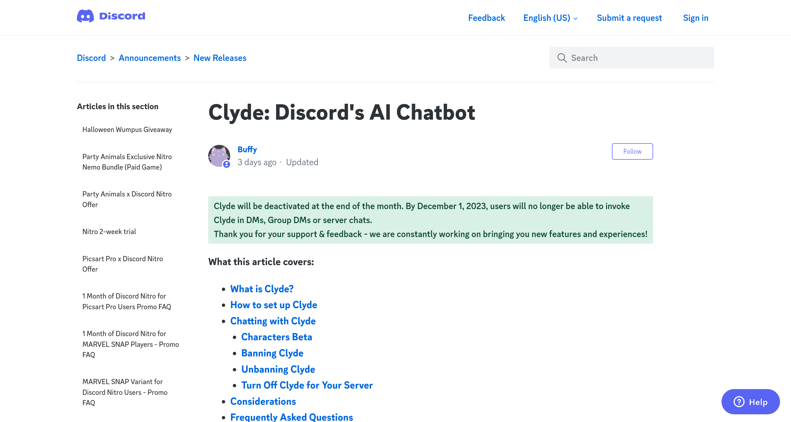

2023年3月、DiscordはAIとチャットできる機能「Clyde」を[発表](https://discord.com/blog/ai-on-discord-your-place-for-ai-with-friends)しました。Clydeは[ChatGPT](https://chat.openai.com/)などを開発している[OpenAI](https://openai.com/)の技術を利用しており、DiscordのユーザーはClydeとチャットできます。

Clydeがいつになったら使えるのか、待っているユーザーも多いと思います。Clydeが使えない理由を解説します。

## Clydeが使えない2つの理由

Clydeが使えない理由は、2つあります。

まず1つは、Clydeがベータ版だからです。現在、ごく少数のサーバーに展開されており、Clydeを使えるサーバーにはバナーが表示されます。Clydeが利用可能なサーバーではデフォルトでオンになっており、無効にしない限りClydeを使えます。

では、まだClydeを使えないサーバーでは、待っていれば使えるようになるのでしょうか？答えは、**いいえ**です。Clydeが使えない理由は、もう1つあります。

## Clydeは廃止される

残念ながら、Clydeは廃止されることが発表されました。そのため、現時点でClydeを使えないサーバーは、今後も使えるようになることはないでしょう。

*[Clyde: Discord's AI Chatbot – Discord](https://support.discord.com/hc/en-us/articles/13066317497239-Clyde-Discord-s-AI-Chatbot)より*

DiscordのClydeについてのサポートページには、次のように書かれています。

> Clyde will be deactivated at the end of the month. By December 1, 2023, users will no longer be able to invoke Clyde in Group DMs or server chats.
>
> Thank you for your support & feedback - we are constantly working on bringing you new features and experiences!
>
> ── [Clyde: DiscordのAIチャットBot – Discord](https://support.discord.com/hc/ja/articles/13066317497239-Clyde-Discord%E3%81%AEAI%E3%83%81%E3%83%A3%E3%83%83%E3%83%88Bot)

日本語にすると、次のとおりです。

> Clydeは今月末に停止されます。2023年12月1日までに、ユーザーはグループDMやサーバーチャットでクライドを呼びだせなくなります。
>
> サポートとフィードバックをありがとうございます。私たちは常に新しい機能とエクスペリエンスを提供できるよう取り組んでいます。

このように、Clydeは2023年12月1日に廃止されます。すでに廃止が発表されているわけですから、Clydeを使えるようになるサーバーが新たに増える可能性は低いと考えられます。

また、現在使えているサーバーでも、2023年12月1日までに使えなくなります。

なお、Clydeが廃止される理由については明かされていません。
