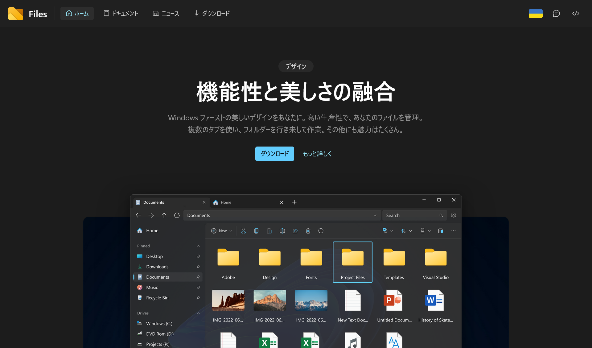

## Filesとは


*[Files公式サイト](https://files.community/)より*

Filesは、Windows向けのサードパーティーのファイルマネージャーです。Windows 11になじむ美しいデザインや、生産性を高めるさまざまな機能が特徴です。

Filesには安定版とInsider Preview版があり、Insider Preview版は新しい機能をいち早く試せます。しかし、Insider Preview版は安定版よりも不安定なため、バグが発生する可能性があります。

## Insider Previewのアップデート方法

FilesのInsider Previewのv3.0.8からv3.0.9へは、自動ではアップデートできません。そのため、手動でアップデートする必要があります。Filesの[公式ドキュメント](https://files.community/docs/configuring/updates#:~:text=updating%20the%20preview%20version%20to%20v3.0.9)には、次のように書かれています。

> Updating the preview version to v3.0.9
>
> In order update the preview version to v3.0.9, you’ll need to uninstall and reinstall Files. We appologize for the inconvenience and hope the process goes smoothly for you.

このように、v3.0.9へのアップデートには、Filesをアンインストールしてから再インストールする必要があります。しかし、この方法では、設定がすべて初期化されてしまいます。

設定を引き継ぐには、Filesをアンインストールする前に［設定］>［高度な設定］>［設定をエクスポート］で設定をエクスポートしておき、再インストール後に［設定］>［高度な設定］>［設定をインポート］で設定をインポートします。

しかし、私の場合はFilesをアンインストールしたにもかかわらず、エラーが出てアップデートできませんでした。うろ覚えですが、「appinstaller URI [https://cdn.files.community/files/preview/Files.Package.appinstaller](https://cdn.files.community/files/preview/Files.Package.appinstaller)はすでに別のパッケージで使用されているため、関連付けが削除されるまでFilesPreview_1y0xx7n9077q4パッケージに適用できません（0x80004005）」といったようなメッセージが表示されていたと思います。

## アップデートできない理由

まず、Filesが正しくアンインストールされているか確認する必要があります。**管理者権限で（コマンドラインではなく）PowerShellを開き**、次のコマンドを実行します。

```powershell
Get-AppxPackage -AllUsers *Files*
```

これで何も表示されなければ、Filesは正しくアンインストールされています。しかし、私の場合は、次のように表示されました。

```powershell
RunspaceId             : af9b8bf9-e7b5-4430-91ab-d1594af2c71a
Name                   : FilesPreview
Publisher              : [パブリッシャーの情報]
PublisherId            : wvne1zexy08sa
Architecture           : X64
ResourceId             :
Version                : 3.0.8.0
PackageFamilyName      : FilesPreview_wvne1zexy08sa
PackageFullName        : FilesPreview_3.0.8.0_x64__wvne1zexy08sa
InstallLocation        : C:\Program Files\WindowsApps\FilesPreview_3.0.8.0_x64__wvne1zexy08sa
IsFramework            : False
PackageUserInformation : {S-1-5-21-1430687874-36005168-1587451183-1001 [ユーザー名]: Staged}
IsResourcePackage      : False
IsBundle               : False
IsDevelopmentMode      : False
NonRemovable           : False
Dependencies           : {}
IsPartiallyStaged      : False
SignatureKind          : Developer
Status                 : Ok
```

このように表示されたら、Filesは正しくアンインストールされていません。私の場合、アンインストールしたはずでしたが、どこかにデータが残ってしまっていたようです。次のコマンドを実行すると、残っているデータを削除できます。

```powershell
Remove-AppxPackage -AllUsers -Package FilesPreview_3.0.8.0_x64__wvne1zexy08sa
```

``FilesPreview_3.0.8.0_x64__wvne1zexy08sa``の部分は、``PackageFullName``の値にしてください。これで、Filesがアンインストールされます。アンインストールしたあとは、Filesの公式サイトからInsider Previewのインストーラーをダウンロードしてインストールします。

## それでも解決しない場合

今回の問題の解決策を探すために、[Filesの公式Discord](https://discord.gg/files)を見ていたのですが、上記の手順でも解決しない場合があるようでした。

WindowsのInsider Previewを使用している場合は、Windows App SDKのバグでFilesをアップデートできないようです。この場合は、Microsoftが問題を修正するのを待つしかないとのことでした。

## まとめ

FilesのInsider Previewをアップデートできない問題について解説しました。私の場合は問題の解決に2日かかったので、同じ問題に遭遇した方の参考になれば幸いです。
