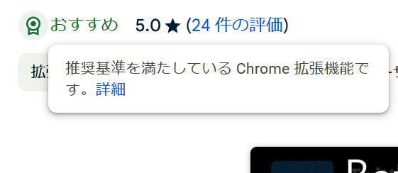
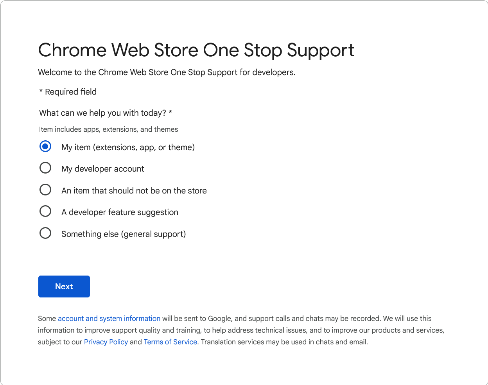
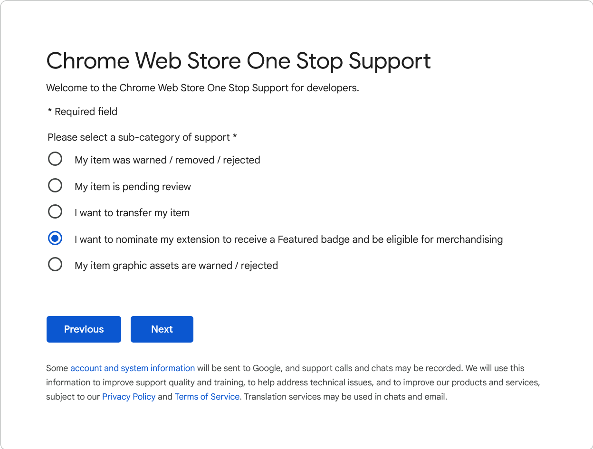
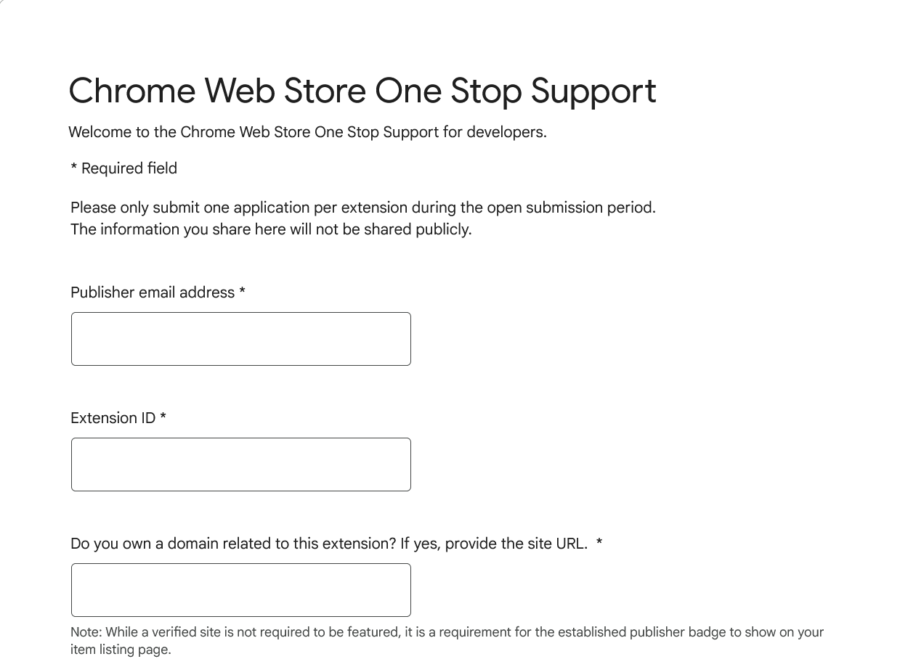
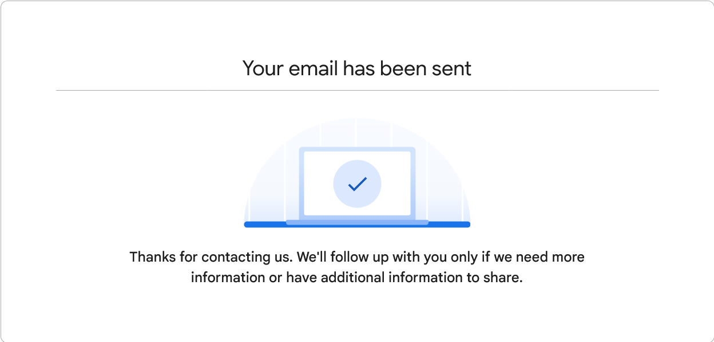

私が開発している拡張機能「[Shadowban Scanner](https://roboin.io/shadowban-scanner/)」にChromeウェブストアの「Featured（おすすめ）バッジ」を申請したので、その手順をまとめます。

## Featuredバッジとは

Chromeウェブストアには「定評のあるパブリッシャーバッジ」と「Featured（おすすめ）バッジ」があります。

Chromeウェブストアのヘルプによれば、次のように書かれています。

> おすすめの拡張機能は、Google の技術に関するベスト プラクティスに沿っており、ユーザー エクスペリエンスとデザインの面で高い基準を満たしています。
>
> おすすめのバッジは、Chrome ウェブストア チームによる審査を経て付与されます。Chrome ウェブストアのベスト プラクティスを遵守しているか、直感的なユーザー エクスペリエンスを提供しているか、最新のプラットフォーム API を使用しているかなどが審査されます。
>
> —— [Chrome ウェブストアを活用するためのヒント - Chrome ウェブストア ヘルプ](https://support.google.com/chrome_webstore/answer/1050673?hl=ja#zippy=%2Cchrome-%E3%82%A6%E3%82%A7%E3%83%96%E3%82%B9%E3%83%88%E3%82%A2%E3%81%AE%E3%83%90%E3%83%83%E3%82%B8%E3%81%AB%E3%81%A4%E3%81%84%E3%81%A6)

私が開発している別の拡張機能「[Hide View Count](https://chromewebstore.google.com/detail/hide-view-count/mmefeobjcchickbjelledfhagoddcklp)」では、何もせずにおすすめバッジが付きました。このように、自動的に審査され、バッジが付くこともあるようです。

しかし、勝手にバッジが付かない場合もあります。そのときは自分でバッジの審査の申請を出せるようなので、Shadowban Scannerの申請をしてみました。

## 申請手順

まずは、Chromeウェブストアの[サポートページ](https://support.google.com/chrome_webstore/contact/one_stop_support?hl=en)を開きます。メニューから日本語を選択できますが、**必ず英語のままにしてください**。記事執筆時点では、日本語にするとバッジの申請項目が表示されませんでした。

サポートページではこのような画面が表示されるので、［My item (extensions, app, or theme)］を選択し、［Next］をクリックします。

次に表示される画面では、［I want to nominate my extension to receive a Featured badge and be eligible for merchandising］を選択し、次に進みます。

必要事項を入力する長いフォームが表示されるので、それらの項目を埋めてください。

記事執筆時点では、フォームには次のような項目がありました。

- Publisher email address
- Extension ID
- Do you own a domain related to this extension? If yes, provide the site URL.
- Confirm that your extension is published to all public users.
- Confirm that your extension is relevant to a broad set of users.
- Is this publisher account clear from any active violations on the Chrome Web Store or other Google services?
- Confirm that your extension meets our extension development best practices. Select all that apply.
- Confirm that your extension’s listing page lists all the main functionalities provided.
- Confirm that your extension’s listing page follows our best practices. Select all that apply.
- What is the purpose of your extension? Describe the value it provides to Chrome users.
- How should your extension be used? Provide examples of main use cases.
- Specify any access to other products, platforms or restricted sites your extension requires to satisfy its purpose (i.e. Netflix account, Adobe creative suite account, banking, internal domains etc.)

なお、フォームの最後に「An extension can only be considered for self-nomination review once every 6 months.」という記載がありました。つまり、このフォームは拡張機能1つにつき、6か月に1回しか申請できないようです。フォームの送信前に、入力した内容を注意深く確認しましょう。

フォームに入力し終わったら［Next］をクリックし、この画面が表示されたら申請完了です。

私の場合は数分でメールが届きました。申請内容を確認のうえ、再度メールで連絡してくれるとのことでした。

## 参考

- [Chrome ウェブストアを活用するためのヒント - Chrome ウェブストア ヘルプ](https://support.google.com/chrome_webstore/answer/1050673?hl=ja#zippy=%2Cchrome-%E3%82%A6%E3%82%A7%E3%83%96%E3%82%B9%E3%83%88%E3%82%A2%E3%81%AE%E3%83%90%E3%83%83%E3%82%B8%E3%81%AB%E3%81%A4%E3%81%84%E3%81%A6)
- [Find great extensions with new Chrome Web Store badges](https://blog.google/products/chrome/find-great-extensions-new-chrome-web-store-badges/amp/)
