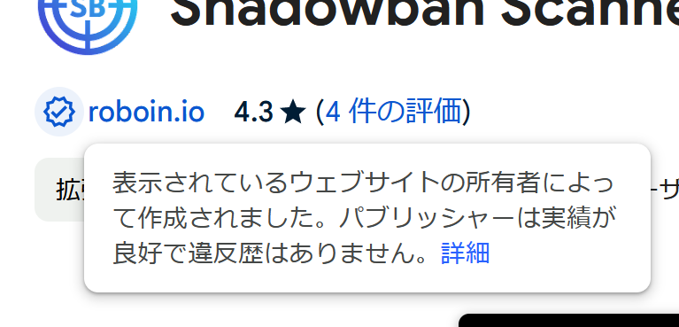
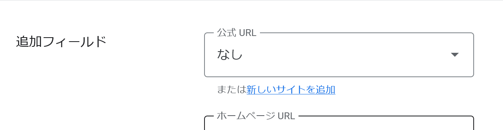

import ArticleCard from "/src/components/ArticleCard.astro";

Chromeウェブストアの「Established Publisher（定評のあるパブリッシャー）バッジ」を申請したので、その手順をまとめます。

「Featured（おすすめ）バッジ」の申請手順は、別の記事でまとめています。

<ArticleCard link="/article/2023/12/06/apply-for-a-featured-badge-for-chrome-extensions/"/>

## Established Publisherバッジとは

Chromeウェブストアには「定評のあるパブリッシャーバッジ」と「Featured（おすすめ）バッジ」があります。

Chromeウェブストアのヘルプによれば、次のように書かれています。

> 定評のあるパブリッシャーのバッジは、身元が確認済みで、デベロッパー プログラム ポリシーを遵守しているパブリッシャーであることを示しています。このバッジは、次の条件を両方とも満たしているパブリッシャーに付与されます。
>
> - 身元が確認済みである。
> - Google サービスにおいて、一貫して良好な実績がある。
>
> —— [Chrome ウェブストアを活用するためのヒント - Chrome ウェブストア ヘルプ](https://support.google.com/chrome_webstore/answer/1050673?hl=ja#zippy=%2Cchrome-%E3%82%A6%E3%82%A7%E3%83%96%E3%82%B9%E3%83%88%E3%82%A2%E3%81%AE%E3%83%90%E3%83%83%E3%82%B8%E3%81%AB%E3%81%A4%E3%81%84%E3%81%A6)

おすすめバッジと違い、定評のあるパブリッシャーバッジは自動的に付与されることはなく、手動で設定が必要です。

## 前提条件

ドキュメントによれば、定評のあるパブリッシャーバッジを設定するには、次の条件を満たす必要があります。

>
> 1. パブリッシャーの身元が確認されていること。
> 2. Google サービスでの実績が常に良好で、デベロッパー プログラム ポリシーに準拠していること。
>
> Chrome ウェブストア デベロッパー プログラム ポリシーに準拠し、未解決の違反がない、そのデベロッパーが作成した拡張機能が対象となります。新規のデベロッパーの場合、この条件を遵守するため、数か月以上かかります。現在、Chrome ウェブストアの全拡張機能の 75% 近くを占めており、この数は今後も増え続けると予想されます。
>
> —— [Chrome ウェブストアでの検索  |  Extensions  |  Chrome for Developers](https://developer.chrome.com/docs/webstore/discovery?hl=ja#badges)

つまり、何らかのポリシー違反があったり、新規のデベロッパーだったりすると、申請できないようです。私の場合は違反がなく、以前から拡張機能を公開しているため、申請できるようです。

また、身元の確認には、自分で所有しているWebサイトが必要です。

## 申請手順

まずは、自分が所有するWebサイトを用意します。Google Search Consoleで、拡張機能を公開しているアカウントにそのサイトの「オーナー」権限が付与されている必要があります。オーナー権限について、詳しくは公式のヘルプを参照してください。

- [サイトの所有権を確認する - Search Console ヘルプ](https://support.google.com/webmasters/answer/9008080?hl=ja)

私の場合は、サイトを管理しているアカウントと拡張機能を公開しているアカウントが別でした。

そのような場合は、サイトを管理しているアカウントでSearch Consoleを開き、［設定］>［ユーザーと権限］>［ユーザーを追加］から、拡張機能を公開しているアカウントを追加します。このとき、［権限］を **［フル］ではなく［オーナー］に設定**してください。

ここまでできたら、Chromeウェブストアのデベロッパーダッシュボードで、バッジを付けたい拡張機能の管理画面を開きます。［ストアの掲載情報］の［追加フィールド］までスクロールします。

［公式URL］がデフォルトでは［なし］に設定されているので、プルダウンから自分のサイトを選択します。

作業が終わったら、拡張機能をアップデートするときと同様に、［下書きとして保存する］をクリックしてから［審査のため送信］をクリックします。

私の場合は、申請した翌日にバッジが付きました。審査がとおると、メールが届くようです。

なお、バッジはアイテムごとに付与されるようなので、公開しているすべてのアイテムにバッジを付けたければ、それぞれのアイテムの管理画面で設定する必要があります。これは、おそらくアイテムごとに公式サイトを変えたい、といった場合に対応するためだと思われます。
