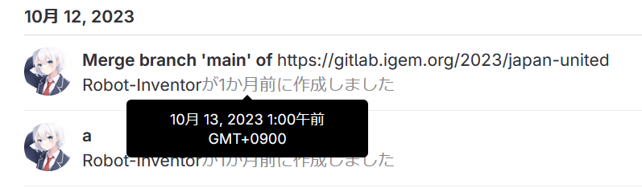

import { YouTube } from "@astro-community/astro-embed-youtube";

この記事は、アドベントカレンダー「[iGEM･Synthetic biology(合成生物学)･Japan Advent Calendar 2023](https://adventar.org/calendars/8876)」の8日目の記事です。

-----

こんにちは。iGEM 2023のJapan-UnitedチームでWikiを担当した ろぼいん です。

普段ブログではこういった記事は書かないのですが、せっかくなのでiGEMの振り返りを書いてみます。振り返りと言っても、私がやったこと、とくにWikiについての工夫した点や反省点などの裏側について書いていこうと思います。

技術的な話が多かったり、書きたいことを書きたいように書いていたりするので読みにくかったらすみません。

## Wikiの構築方法や工夫した点

さっそくですが、まずはWikiについてです。

これは私の力不足でもあるのですが、Wikiの開発はかなりギリギリのスケジュールでした。

そのため、無駄を省いて徹底的に生産性を上げ、かつチーム全員に作業を分散させて、効率よく構築できるよう工夫しました。

### フレームワーク

Wikiの構築には「[Astro](https://astro.build/)」を使用しました。Astroはオープンソースの静的サイトジェネレーターで、JSXライクな記法やMarkdownなどを使って、静的サイトを手軽に構築できます。

Vue.jsやReactなどのライブラリーに依存しないため、Astroで構築したサイトは読み込みが早く、軽量なところが特徴です。

また、ページはMarkdownで執筆でき、必要であれば関数を書いてCSVなどから生成することもできます。これにより、ページごとにHTMLを書く必要がなく、柔軟性も確保されています。

ちなみに、このブログもAstroで構築しています。iGEMのWikiには関係ないですが、Astroは画像の最適化もできるのでとても便利です。

### ページの作成方法

Astroには欠点があります。それは、当然ではありますが非プログラマーには扱いにくいという点です。

Markdownで記事を書けますが、ある程度の学習コストを要します。しかし、スケジュール的に、Wikiの文章を執筆するメンバー全員にMarkdownを習得してもらう時間はありませんでした。

そこでJapan-Unitedチームでは、Googleドキュメントで文章を書き、それをMarkdownに変換するという形を取りました。もともと、チーム内でのファイル共有にGoogleドライブを使っており、Googleドキュメントは共同編集できることもあって、これは合理的な選択でした。

まず担当者がGoogleドキュメントに文章を書き、それが終わり次第、翻訳担当が翻訳と校正をします。それらが終わると、私がMarkdownに変換し、必要であれば画像を挿入したうえでAstroに投入するという流れでした。

これらの作業の進行状況はGoogleスプレッドシートで管理し、それぞれの担当者が確認できるようになっていました。

GoogleドキュメントからMarkdownへの変換には、Docs to Markdownというアドオンを使いました。

- [Docs to Markdown - Google Workspace Marketplace](https://workspace.google.com/marketplace/app/docs_to_markdown/700168918607)

ただし、変換後のMarkdownに画像がバンドルされないため、画像は手作業で挿入する必要があります。Markdown中の画像を挿入する箇所は分かりやすいようになっていますが、Googleドキュメントからダウンロードした画像のファイル名と、Markdown中に書かれているそれが異るので、注意が必要です（この注意はアドオンによるコメントにも書かれています）。

### Notebookページの構築方法

Notebookページは、他のページとは少し異なる方法で構築されています。他のページは基本的にMarkdownで作られていますが、このページはCSVから生成しています。

Notebookに記載する内容は、Googleフォームを使って各担当者から集めました。そして、その回答データをCSVにエクスポートし、CSVからページを生成しています。

この「CSVからページを生成」といったことも、Astroのおかげで簡単に実装できました。

ただし、Googleフォームにアップロードされた画像については、Googleドライブ経由でダウンロードし、iGEM指定のサーバーにアップロードする必要があります。そのため、CSVの中の画像のURLは、そのままでは使えません。

そこで、CSVの中の画像URLを、GoogleドライブのものからiGEMサーバーのものへ変換テーブルで変換したうえで、画像を表示しています。

直接CSVを編集することもできますが、CSVの差し替えなどが発生した場合に、更新後のCSVファイルにそのまま置き換えれば済むため、変換テーブルを使いました。

また、プロトコルについては、フォームにはPDFのリンクを貼ってもらうようにしました。実際のNotebookページでは変換テーブルを使って、PDFへのリンク付きのプロトコル名を表示しています。

### レスポンシブ対応

Japan-UnitedチームのWikiは、レスポンシブデザインになっています。そのため、PCでもスマホでも、小さめの画面でも大きな画面でも、適切に表示されるようになっています。

過去のiGEMでは審査時の画面サイズが固定だったようで、最低限そのサイズで正しく表示されていれば大丈夫だったようです。

しかし、今年はそのような記述が見当たらなかったため、どの画面サイズでもよいようにレスポンシブ対応にしました。

## 反省点など

反省点は、やはりスケジュールがギリギリになってしまったことですね。

Wikiに掲載する文章の締め切りを私が適切にリマインドできなかったことで、締め切り直前まで文章が集まらないということが起こってしまいました。

文章ができたのは、文字通り直前でした。10月13日午前1時（日本時間）が締め切りだったわけですが、ほとんどのページは12日に文章を書き始めています。

最終的に完成したのは、13日午前1時ちょうどでした。いくつか修正点は残っていましたが、最低限の部分はギリギリ間に合いました。

*2023年10月13日午前1時0分のコミット履歴*

最低限の部分は間に合ったとはいえ、本当はトップページを凝ったり、アニメーションを付けたりする予定だったので、そういったことができなかったのは残念です。

これは開発者であり、スケジュールの遅れを認識していたにもかかわらず適切にリマインドできなかった私の問題です。

### iGEMの画像サーバーについて

これは反省点とは違うのですが、来年以降のチームの参考になるかもしれないので書いておきます。

結論からいうと、**iGEMの静的アセット用サーバーはファイルを更新できません**。

Wikiで使う画像やPDFなどのアセットはすべて、[uploads.igem.org](https://uploads.igem.org)からアップロードする必要があります。アップロードしたファイルは、[static.igem.wiki](https://static.igem.wiki)から配信されます。

画像やPDFは必ずこのサーバーにアップロードしないといけないので、すべてのチームが使うことになるわけです。

しかし、このシステムには欠陥があります。それは、一度アップロードしたファイルを更新できないというものです。

**管理画面上では**、既存のファイルと同じ名前のファイルをアップロードすると上書きできているように見えます。実際、最終更新日時も変更されます。しかし、**更新後のファイルは配信されません**。配信されるのは1番最初のバージョンのみです。

また、一度アップロードしたファイルは削除もできません。ファイルの更新と同じように、管理画面上では削除したことになっています。しかし、削除後もサーバーから配信され続けます。

当然、ブラウザーのキャッシュも削除しましたが、ファイルを更新・削除できませんでした。おそらくはシステムのバグか、CDN側のキャッシュの問題だと思われます。

最終的に、私は別のファイル名でアップロードすることでこの問題を回避しました。ファイルを更新するごとに、ファイル名のうしろに`-1`、`-2`、`-3`…と付いていくわけですねw

あとは、iGEMの静的アセットサーバーは（当たり前ですが）ファイルサイズの制限があります。画像が多めのPDFはサイズ制限に引っかかるかもしれません。

実際、私が作業しているときもいくつかのPDFをアップロードできませんでした。

そういった場合は、Adobe公式の無料のオンラインツールがオススメです。PDFを圧縮できます。

- [【軽量化】PDFのファイルサイズを圧縮する | Adobe Acrobat](https://www.adobe.com/jp/acrobat/online/compress-pdf.html)

ログインしていない状態では1回しか使えないので、Adobeのアカウント（Googleなどのアカウントでも可）でログインして使うことをオススメします。

サーバー関連の注意点はもう1つあります。それは、iGEMの静的アセットサーバーにファイルをアップロードすると、ファイル名が勝手に変わることがあるという点です。

「ファイルをアップロード→URLをコピー」という手順なら問題ないのですが、複数のファイルをまとめてアップロードして「ファイル名はそのままだろう」と思ってコードを書くと、困ることがあるかもしれません。

実際に私が遭遇したのは、ファイル名からα（アルファ）が勝手に消されるというものです。

アップロード前にURLフレンドリーなファイル名に変更していたつもりだったのですが、アルファベットの小文字のaだと思って見逃していました。

ちゃんとアップロード後のURLを確認しましょう。

余談ですが、URLフレンドリーなファイル名への一括変更は、GitHub Copilotに書いてもらったコードを使いました。

「指定したフォルダー内のすべてのファイルのファイル名の、スペースやアンダーバーはハイフンに変えて、全部小文字にしてね」的な指示を英語で書いたらほぼ完璧なコードを書いてくれました。（もちろん実行前にコードの内容は確認しています）

### 素材のライセンスについて

これも反省とは少し違うのですが、Wikiを作っていて疑問に思ったことがありました。

iGEMのWikiは、Creative Commons Attribution 4.0 Internationalライセンスにすることが求められています。また、著作権で保護された素材の利用は許可されていませんが、再利用が許可された素材は利用できるとされています。

再利用が許可されたフリー素材を使用した場合、フリー素材のライセンスとCCライセンスが競合しそうな気がするのですが、どうなんでしょうね…？🤔（「ライセンスロンダリング」になってしまいそう）

## 動画編集

さて、ここからは少し話が変わります。

私はJapan-Unitedチームで、おもにWikiの開発を担当していましたが、動画編集も一部だけ担当していました。

私が担当したのは、この動画です。デザインは別の方の担当で、私は音声合成ソフトを使った音声の挿入と、アニメーションの作成をしました。また、動画の最後のロゴアニメーションも私が作成しました（ロゴデザインは別の方です）。

<YouTube id="c6nS3VggPmY"/>

同様に、こちらの動画の最後のロゴアニメーションも担当しました（動画本編とロゴデザインは別の方です）。あとは、iGEMの大会サイトから閲覧できる動画の字幕データ（テロップではない）も作ったりしました。

<YouTube id="uwQ4JTHa4cc"/>

動画編集ソフトには無料の[DaVinci Resolve](https://www.blackmagicdesign.com/jp/products/davinciresolve)を使いました。

モーショングラフィックスを多用した関係で、メモリーは32GBだとギリギリでした。3/4くらいの確率でメモリースワップが起きて、書き出しが激遅になります。

DaVinci Resolveを一度閉じてからメモリー開放系のソフトを使い、再度DaVinci Resolveを開いて書き出すと、メモリースワップは起きませんでした。

とはいえかなりギリギリなので、今度メモリーを64GBかそれ以上に増やしたいですね。DDR5もだいぶ安くなってますし。（128GBにしたい気もするけど、安くなったとはいえさすがに高い）

## 最後に

今回の記事は、iGEMの振り返りでした。

そういえば、我らがJapan-Unitedのリーダの記事に書いてあったのですが、彼はほとんど寝てなかったんですね…。確かに深夜でも明け方でもいつでも返信が来るとは思ってました。ぜひまだ読んでいない方は読んでみてください。

- [iGEMを終えて｜大竹海碧](https://note.com/kaisei_synbio/n/n3f351d43c81e)

Japan-Unitedのみんなは優秀な人たちばかりで、そんなチームの一員としてiGEMに参加できたことを誇りに思います。

私は、動画編集やプログラミングなどは基本的に1人でやることが多いので、こういったチームで多くの人とかかわりながらひとつの目標に向かって、世界に向かって挑戦できたことがとても刺激的でよい経験になりました。

最後まで読んでいただきありがとうございました。
