YouTubeチャンネルにおけるコメント機能は、クリエイターと視聴者のコミュニティー形成に不可欠な要素です。しかし、場合によってはネガティブなコメントや過剰な量のコメントにより、管理が困難になることもあります。

このような課題を解決する新機能として、YouTubeは「一時停止」機能を導入しました。この機能を使うと、既存のコメントを残しつつ、一時的に新規コメントの受け付けを停止できます。これにより、クリエイターは自身のペースでコメントを管理し、健全なコミュニティーの構築に注力できます。

## 一時停止機能とは？

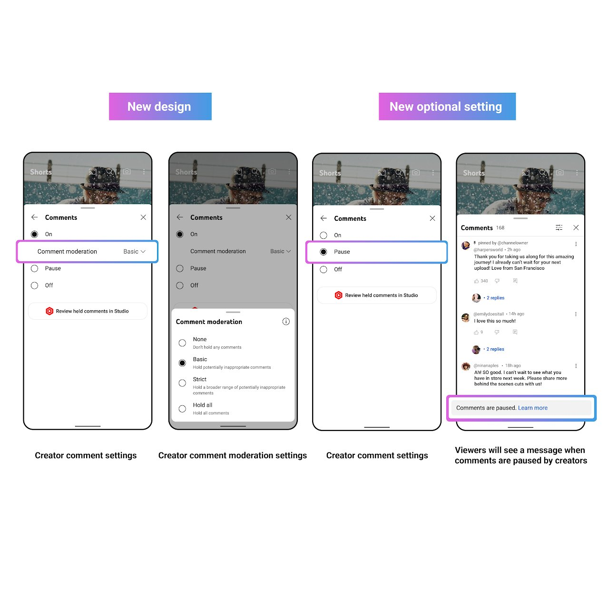
*[YouTube公式Twitterアカウント](https://twitter.com/YouTubeCreators/status/1732822286418252078)より*

一時停止機能は、クリエイターが自分の動画へのコメントの投稿を一時的に停止できる機能です。この機能を使うと、既存のコメントは残したまま、新規コメントの受け付けを停止できます。

クリエイターはコメントモデレーションを中断し、コンテンツ制作や他の活動に集中できるようになります。また、議論を招きやすいトピックやセンシティブな内容を扱う動画で、一時的にコメントを制限し、過熱した議論や不適切なコメントを防止できます。

他にも、ネガティブなコメントの影響を最小限に抑え視聴者との建設的な対話を促進したり、ネガティブなコメントから距離を置いてメンタルヘルスを保護し、創作活動を継続するための手助けとなったりします。

また、一時停止機能の実装にあわせて、コメントの設定が簡素化されました。新しいコメント設定は次のようになっています。

* **オン:** コメントの投稿を許可し、モデレーションの程度を選択できる
  * **なし:** コメントを保留せずに公開する
  * **標準:** 不適切な可能性があるコメントを保留する
  * **強:** 不適切な可能性がある多様なコメントを保留する
  * **すべて保留:** すべてのコメントを保留する
* **一時停止:** 新規コメントの投稿を停止し、既存のコメントは公開された状態のまま維持する
* **オフ:** すべてのコメントの投稿と表示を無効にする

## 一時停止機能の使い方

コメント機能は現在、私が確認した範囲ではスマホ版YouTubeアプリ、スマホ版YouTube Studioアプリ、およびPC版YouTube Studioで利用可能です。一時停止機能の使い方は次のとおりです。

### スマホ版YouTubeアプリの場合

まずはYouTubeアプリを開き、コメントを一時停止したい動画のコメント欄を表示します。次に、コメントパネル右上にある歯車アイコンをタップします。

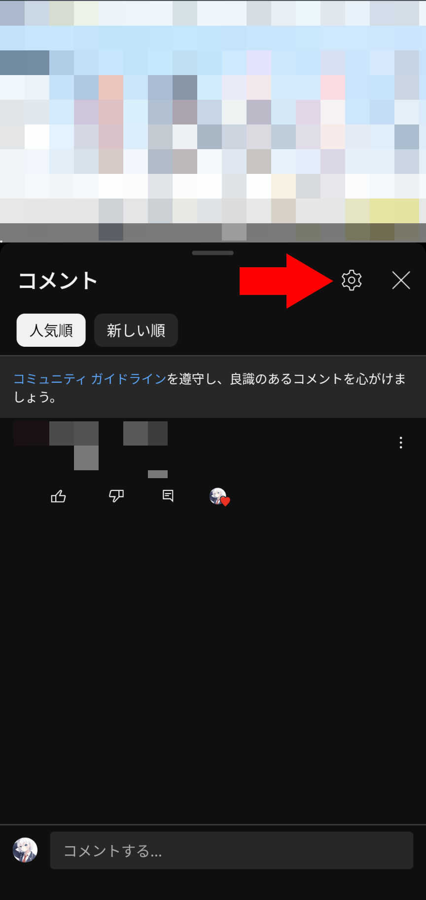

［この動画の設定］セクションの［コメント］をタップし、［一時停止］を選択します。

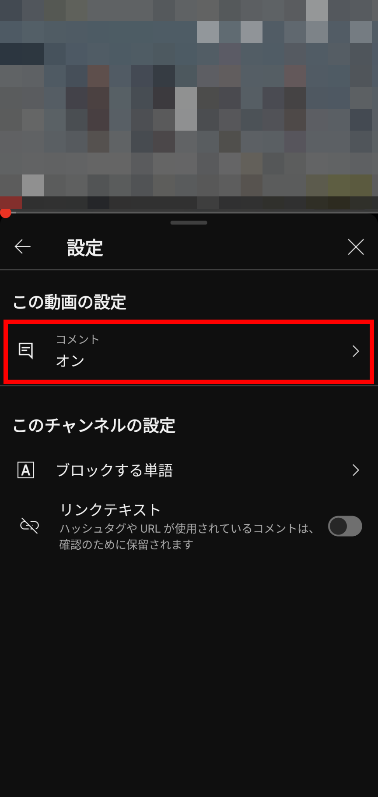

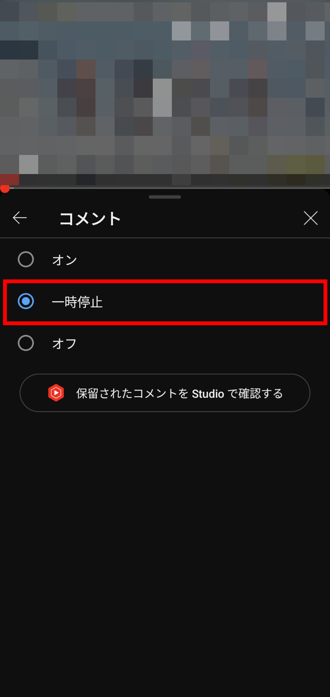

### スマホ版YouTube Studioアプリの場合

まずは、YouTube Studioアプリを開き、コメントを一時停止したい動画を選択します。次に、右上のメニューボタンから鉛筆アイコンをタップし、動画の設定の編集画面を表示します。

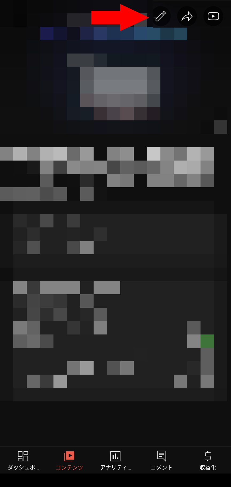

動画の編集画面を開いたら、［その他のオプション］を選択します。

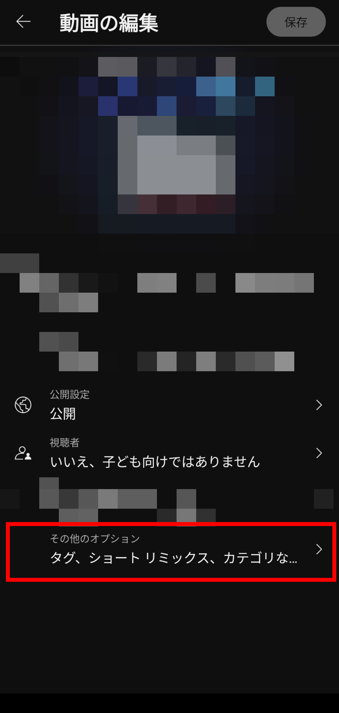

［コメント］をタップし、［一時停止］を選択します。

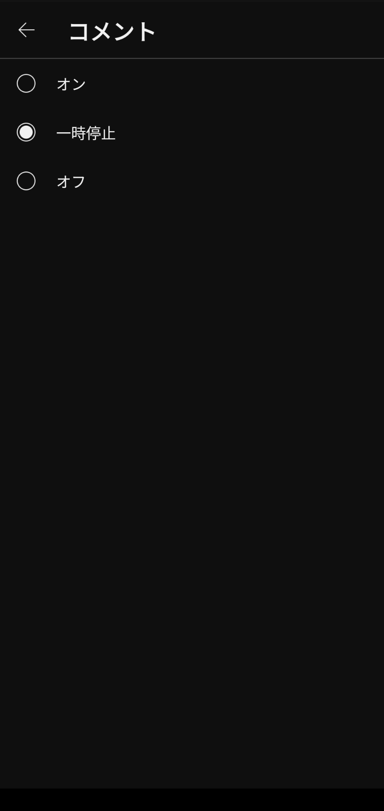

**この状態ではまだ設定が保存されていないので**、動画の編集画面に戻って右上の［保存］をタップします。

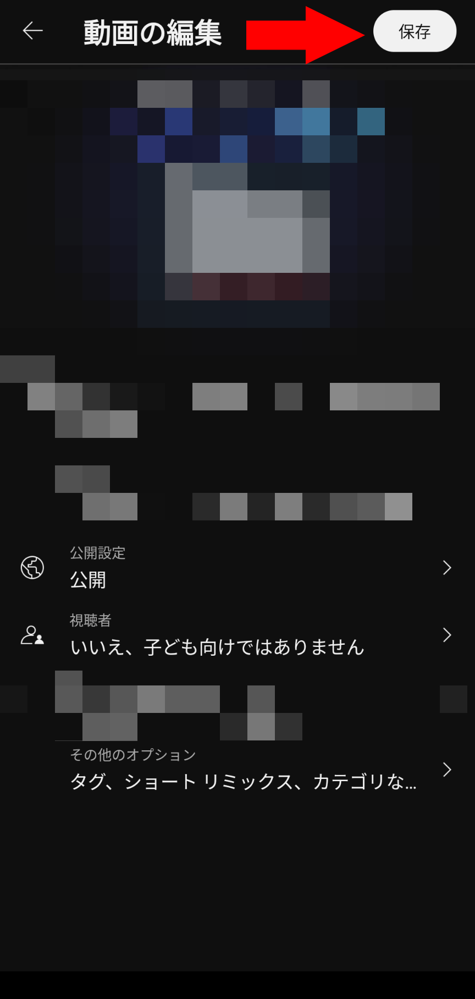

### PC版YouTube Studioの場合

まずは、YouTube Studioを開き、コメントを一時停止したい動画を選択します。次に、［詳細］タブの一番下に表示されている［すべて表示］をクリックします。

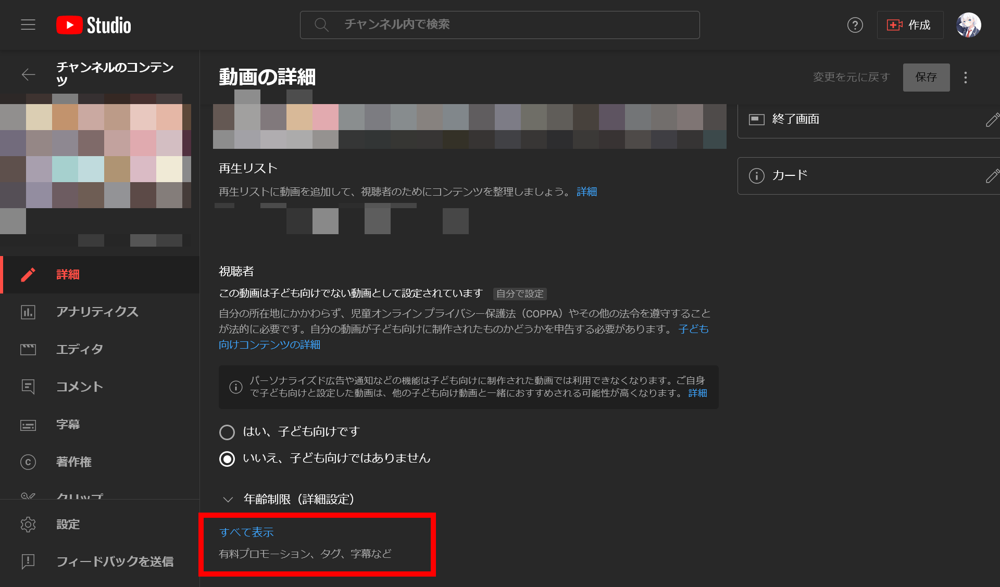

下までスクロールし、［コメントと評価］で［一時停止］を選択します。

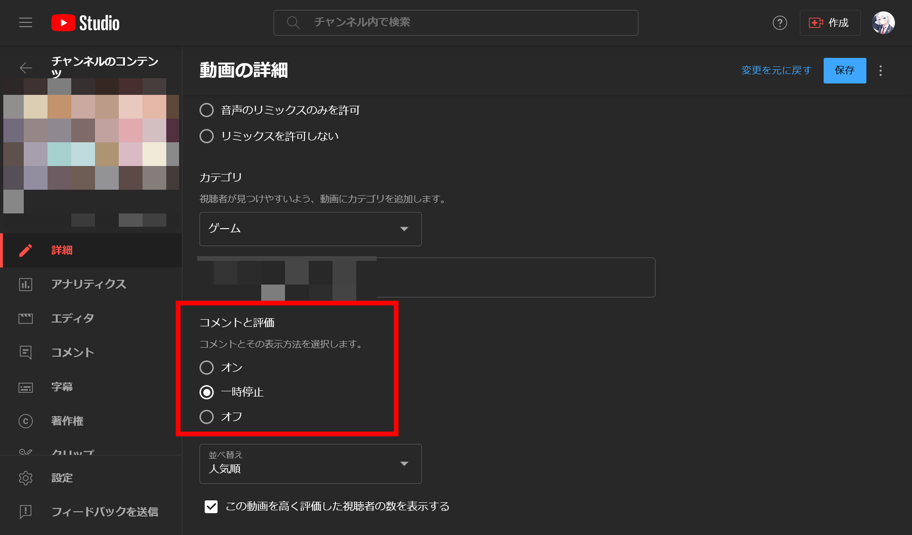

**この状態ではまだ設定が保存されていないので**、右上の［保存］ボタンをクリックして設定を保存します。

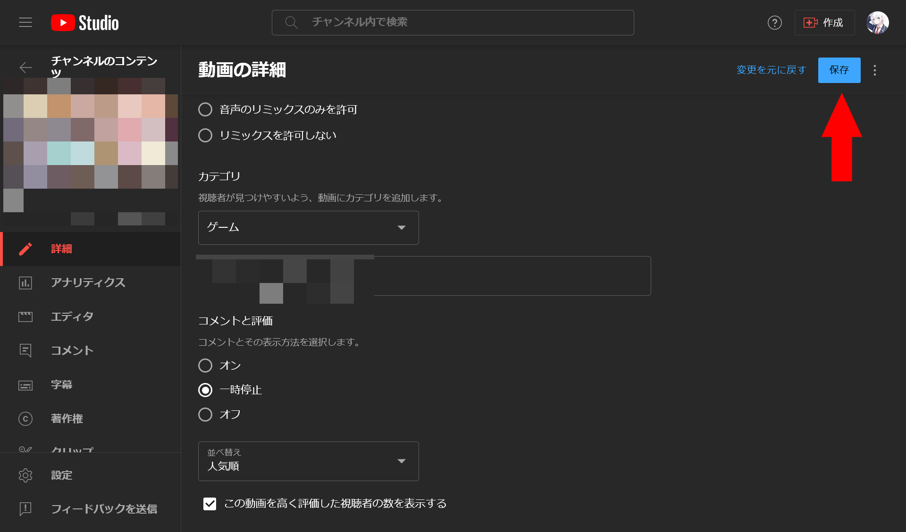

## まとめ

YouTubeの新機能「一時停止」と簡素化されたコメント設定について解説しました。これらの設定を活用し、チャンネルのコメント管理を最適化しましょう。

## 参考

- [YouTube Creators - YouTube](https://www.youtube.com/channel/UCkRfArvrzheW2E7b6SVT7vQ/community?lb=UgkxP6pziafkHJ4fyaHxfK38vNh5mtk6oYoM)
- [コメント設定について - YouTube ヘルプ](https://support.google.com/youtube/answer/9483359)
- [XユーザーのYouTube Creatorsさん: 「say hello to a new moderation setting for your channel: pause comments ⏸️ in addition to "on" and "off," you can now "pause" comments. existing comments will remain visible, new comments will be disabled, giving you more flexibility and control 🌟 more → https://t.co/wNAspRiR4s https://t.co/AY9MWQDsvw」 / X](https://twitter.com/YouTubeCreators/status/1732822286418252078)
