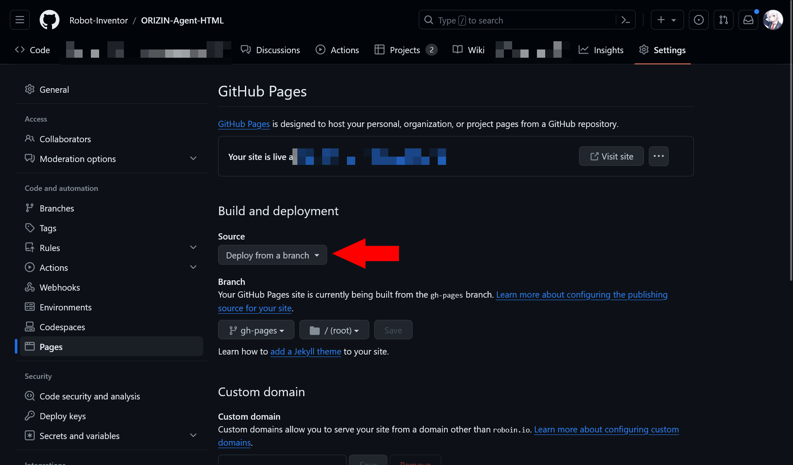
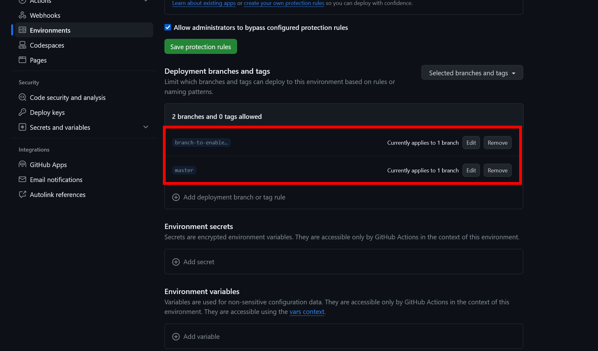
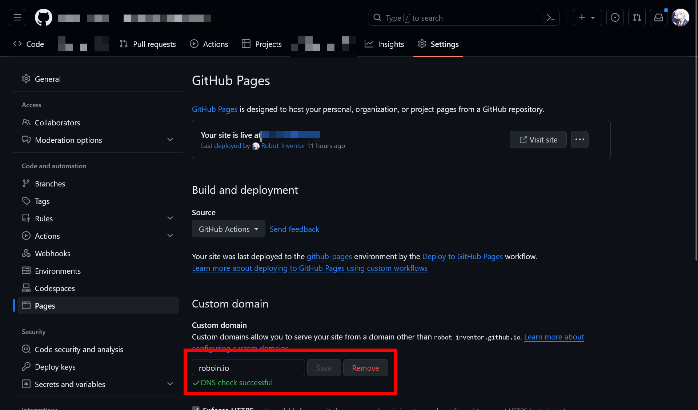

## はじめに

このブログはもともと[GitHub Pages](https://pages.github.com/)でホストしていたのですが、独自ドメインと[Cloudflare Pages](https://pages.cloudflare.com/)に移行したのでその手順をまとめます。リダイレクトの方法なども含め、全体としてやるべきことをまとめています。

本当はカスタムドメインだけを使って、サーバーそのままでもよかったのですが、広告付きのブログとしてGitHub Pagesの本来の使い方から外れている気がしたのでサーバーも移行しました。

## 対象読者

この記事は、GitHub PagesからCloudflare Pagesに移行する流れを知りたいという方を対象にしています。

各ステップの細かい手順は、ネットを探せば素晴らしい記事がたくさんあるので割愛します。この記事では、全体としてどのような流れで、どのようなことをすればよいのかを説明します。

また、GitHubやgitの基本的な操作ができ、「ドメイン」「リダイレクト」などの言葉の意味を理解していることを前提としています（GitHub Pagesを使っている時点でこのあたりの心配は不要だと思いますが）。

## 事前に用意するもの

- GitHubアカウント
- Cloudflareアカウント
- Search Consoleアカウント
- ドメインを買うお金

## 全体の流れ

全体としては、次のような順番で作業しました。

1. ドメインを購入する
2. GitHub Pagesのブランチを複製する
3. Cloudflare Pagesを設定する
4. GitHub PagesからCloudflare Pagesへの301リダイレクトを設定する
5. Search Consoleを使って、サイトの移転をGoogleに通知する
6. Google AdSenseの再審査

これらのひとつずつについて、もう少し詳しく説明します。

## 1. ドメインを購入する

GitHub PagesからCloudflare Pagesに移転すると、それまでのGitHub Pagesのドメインは使えなくなります。

この「使えなくなる」というのは、無効化されて一生使えなくなるという意味ではなく、Cloudflare PagesのサイトとGitHub Pagesのドメインは組み合わせられないという意味です。

そのため、移転後のサイトで使いたいドメインを購入する必要があります。

私は、Cloudflare Registrarでドメインを購入しました。Cloudflare Registrarのドメインの価格はドルです。昨今の円安を考慮しても、他と比べて安かったのでCloudflare Registrarで買いました。

*Cloudflare Registrarでドメインを購入した画面*

Cloudflare Registrarでドメインを購入する手順は、これらの記事が分かりやすいです。

- [Cloudflare Registrarでのドメインの購入方法](https://zenn.dev/mikan0528_akn/articles/276b36caf55776)
- [Cloudflare Registrar でドメイン取得する #cloudflare - Qiita](https://qiita.com/khayama/items/fdda7884033b519aa1fe)

## 2. GitHub Pagesのブランチを複製する

私は、GitHub Pagesで使っていたリポジトリーをそのまま使いたかったため、ブランチを複製しました。

複製の詳しい理由は後述しますが、複製しないとGitHub PagesからCloudflare Pagesへのリダイレクトができなくなります。

同じリポジトリーを使わずに新しいリポジトリーを使いたい場合は、ブランチではなくリポジトリーを複製します。

複製元のブランチやリポジトリーは、GitHub Pagesで使っているものにしてください。複製後のブランチ名やリポジトリー名はお好きなものでどうぞ。

いずれの場合でも、複製元のブランチやリポジトリーは残しておいてください。あとで使います。

リポジトリーを複製する場合（つまり新しいリポジトリーでサイトを作る場合）は、ただ複製するだけで大丈夫です。「[3. Cloudflare Pagesを設定する](#3-cloudflare-pagesを設定する)」に進んでください。

ブランチを複製する場合（つまり今までと同じリポジトリーでサイトを作る場合）は、GitHub Pagesのソースとなるブランチを変更しなければならない場合があります。

複製元のブランチ（今までと同じブランチ。たとえば`master`ブランチなど）からCloudflare Pagesを作りたいですか？

それとも、複製後のブランチ（先ほど作ったブランチ）から作りたいですか？

後者であれば追加の作業は必要ないので、「[3. Cloudflare Pagesを設定する](#3-cloudflare-pagesを設定する)」に進んでください。

前者の場合は、GitHub Pagesのソースとなるブランチを、複製後のブランチに変更する必要があります。

まず、リポジトリーの設定の［Pages］タブを開きます。

［Build and deployment］が［Deploy from a branch］になっている場合は、「[ブランチからGitHub Pagesを生成している場合](#ブランチからgithub-pagesを生成している場合)」に進んでください。多くの方はこのパターンだと思います。

［GitHub Actions］になっている場合は、「[GitHub ActionsでGitHub Pagesを生成している場合](#github-actionsでgithub-pagesを生成している場合)」に進んでください。

### ブランチからGitHub Pagesを生成している場合

この場合は、非常に単純です。［Build and deployment］の［Branch］を、複製後のブランチに変更します。

変更したら、「[3. Cloudflare Pagesを設定する](#3-cloudflare-pagesを設定する)」に進んでください。

### GitHub ActionsでGitHub Pagesを生成している場合

この場合は、GitHub Actionsの設定を書き換える必要があります。

使っているActionによって設定方法が異なる可能性がありますが、私が使用している[Astro](https://astro.build/)では、`.github/workflows/deploy.yml`の`on.push.branches`の値を複製後のブランチ名に変更すれば大丈夫でした。

他のActionでも、おそらくは同じように変更すれば大丈夫だと思います。もしActionの設定内で、他にブランチを指定している箇所があれば、その修正も必要かもしれません。

Actionの設定を変更したら、branch protectionの設定を変更する必要があります。初期設定では`master`ブランチからのみGitHub Pagesにデプロイできるようになっているようです。

リポジトリーの設定の［Environments］タブで［github-pages］を選択します。

［Deployment branches and tags］の［Add deployment branch or tag rule］で、複製後のブランチを追加します。

これが終わったら、「[3. Cloudflare Pagesを設定する](#3-cloudflare-pagesを設定する)」に進んでください。

## 3. Cloudflare Pagesを設定する

さて、ここからは実際にCloudflare Pagesでサイトを構築しましょう。

細かい手順はこちらの記事が分かりやすかったです。

- [【Cloudflare Pages】ブログを公開したい？...5分もあれば十分だ](https://zenn.dev/rivine/articles/2023-06-23-deploy-hugo-to-cloudflare-pages)

Cloudflare Pagesの生成元となる「プロダクションブランチ」には、使用したいブランチを指定してください。

たとえば、今までと同じブランチを使いたければそれを、別のブランチを使いたければ先ほど複製した複製後のブランチを指定します。

また、当然ながらドメインには購入したものを指定します。

- [はじめての Pages その５ 専用ドメイン (Custom Domain) をセットアップする方法](https://zenn.dev/kameoncloud/articles/9154d4dd27fe15)

## 4. GitHub PagesからCloudflare Pagesへの301リダイレクトを設定する

さて、ここまでで新しいサイトを立ち上げられました。

しかし、今の状態ではGitHub PagesとCloudflare Pagesが別々に存在してしまっています。

GitHub PagesにアクセスしたユーザーをCloudflare Pagesにリダイレクトしてあげる必要があります。

リダイレクトにはいくつかの種類がありますが、今回はサイトの移転なので、永続的なリダイレクトを表す301リダイレクトを使います。

GitHub Pagesで301リダイレクトを設定するには、カスタムドメイン設定を使います。

リポジトリーの設定の［Pages］タブを開き、［Custom domain］に購入したドメインを入力して［Save］をクリックします。

これで301リダイレクトの設定は完了です。GitHub Pagesにアクセスしたユーザーは、新しいドメインのCloudflare Pagesに飛ばされます。

ちなみに、ブランチやリポジトリーを複製する必要があるのは、この301リダイレクトを使うためです。

このリダイレクト方法は、GitHub Pagesが稼働していないと使えません。

また、既存のページを削除すると、そのページにアクセスしたときに、リダイレクトされずに404エラーになってしまうようです。

そのため、ブランチやリポジトリーを複製して、既存のGitHub Pagesのすべてのページを維持する必要があるわけです。リダイレクトするので、それらのページが人目に触れることはありませんけどね。

## 5. Search Consoleを使って、サイトの移転をGoogleに通知する

これで、検索結果やリンクなどから古いドメインにアクセスしたユーザーは、新しいドメインに転送されるようになりました。

次は、Googleにサイトの移転を通知します。これにより、Googleの検索結果が徐々に新しいドメインに更新されます。

この記事を参考に、アドレス変更ツールを使って、Googleにサイトの移転を通知します。

- [アドレス変更ツール - Search Console ヘルプ](https://support.google.com/webmasters/answer/9370220)

[Googleのヘルプ](https://developers.google.com/search/docs/crawling-indexing/site-move-with-url-changes?visit_id=638377102555719013-512553080&rd=1&hl=ja)によると、「小規模から中規模のサイトで大半のページの移転が反映されるのには数週間かかり、より大規模なサイトであればそれより長くかかります」とのことです。気長に待ちましょう。

### Googleの検索結果の移行にかかった時間

Googleの検索結果の移行にかかった時間は次のとおりです。なお、移行当時のページ数は100ページ程度でした。それよりも多い場合は、より長い時間がかかると思われます。

※次の表は随時更新します。

| 2023/12/6  | ドメインを購入・metaタグによるリダイレクトを開始                                                                                                                                                                                                                                       |
| ---------- | -------------------------------------------------------------------------------------------------------------------------------------------------------------------------------------------------------------------------------------------------------------------------------------- |
| 2023/12/8  | いくつかのページがインデックスされ、「site:」演算子を使うと検索結果に表示されることを確認。通常の検索結果には表示されない                                                                                                                                                              |
| 2023/12/9  | GitHub PagesからCloudflare Pagesへの301リダイレクトを開始。Googleの検索結果にfaviconが反映される。GitHub Pagesから移行したためか、一部の検索結果に表示されるサイト名が「GitHub」になってしまう                                                                                         |
| 2023/12/11 | 一部の検索結果で旧ドメインから新ドメインに置き換わる（=「site:」演算子を使わなくても表示されるようになる）。検索結果の順位はほぼ変わらないか、一部の記事では向上                                                                                                                       |
| 2023/12/14 | さらに多くの記事で新ドメインに置き換わる。まだ旧ドメインが表示される記事もある。構造化タグで定義しているサイト名を「Robot Inventor」から「ろぼいんブログ」に変更。[Googleのヘルプ](https://developers.google.com/search/docs/appearance/site-names?hl=ja)を参考に、alternateNameも設定 |

## 6. Google AdSenseの再審査

最終段階です。サイトに広告を付けていない場合は、Googleに移転を通知したら、それですべての作業が完了です。

サイトに広告を付けている場合は、再審査が必要になります。

Google AdSenseでは、広告を掲載している既存のサイトのドメインを変更できないので、新しいサイトとして審査してもらう必要があります。

Google AdSenseの審査の申請方法については、GitHub Pagesに広告を付けていたならすでに一度やったことがあると思うので、ここでは割愛します。

## まとめ

お疲れ様でした。これで、サイト移転の長旅は終了です。

私のときは、リダイレクト方法を含めてこういったGitHub PagesからCloudflare Pagesに移行する全体的な流れを解説した記事がなく、右往左往してしまいました。

同じようなことをしようとしている人のお役に立てれば幸いです。
