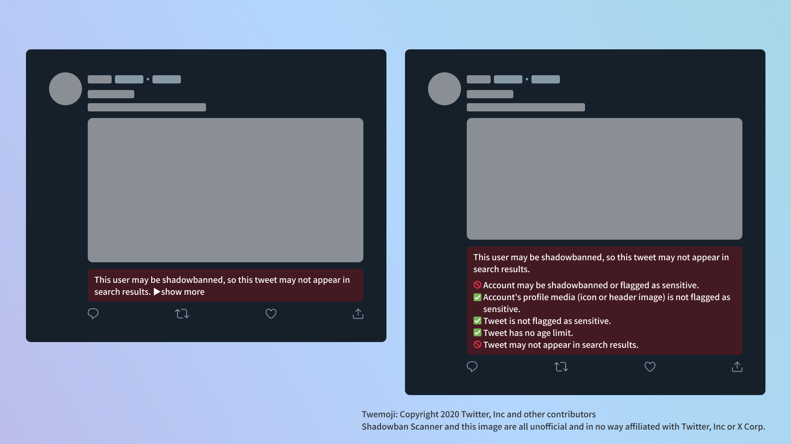
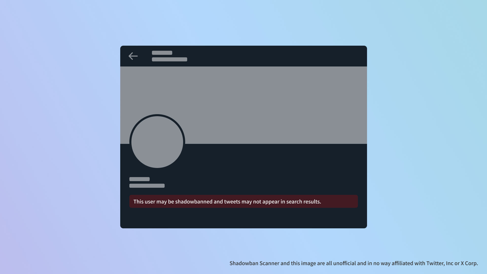

import { YouTube } from "@astro-community/astro-embed-youtube";
import ExtensionBadges from "../../../../09/30/shadowban-scanner-v2-release/ExtensionBadges.astro";

Shadowban Scanner has been updated to v3.0. This version includes several new features.

The main changes are as follows. All changes can be viewed on the [release page](https://github.com/Robot-Inventor/shadowban-scanner/releases/tag/v3.0.0) on GitHub.

Also, **in the next update, a dialog will appear asking for additional permissions to accommodate changes in Twitter's specifications**. For more information, please see　the screen displayed when updating to v3.0 or the link provided on the settings page.

## 🎉New Features

- Added a button to tweet the results. If you don't need it, you can hide it from the settings
- The settings screen has been reorganized
- Added the ability to detect countries that have blocked accounts for legal reasons
- Added initial setup screen. Not shown to existing users

## 🩹Fixed

- Fixed a bug where messages were displayed out of place due to a change in Twitter specifications

## 📝Other

**In the next update, a dialog will appear asking for additional permissions to accommodate changes in Twitter's specifications**. For more information, please see　the screen displayed when updating to v3.0 or the link provided on the settings page.

Approval of additional permissions is not required, but if you do not approve, you will not receive subsequent updates due to browser specifications.

## What is Shadowban Scanner?

Shadowban Scanner is an extension that allows you to check Twitter's so-called shadowban and sensitive judgments on the fly without having to go to an external site.

<YouTube id="6c4MCItd7wY" />

- [Shadowban Scanner official website](https://robot-inventor.github.io/shadowban-scanner/)

Shadowban Scanner can be downloaded from the following links:

<ExtensionBadges/>

Just install it on your web browser and you will have access to the following features

- Per-account shadowban and sensitive flag detection
- Sensitive flag detection for profile media (icons and header images)
- Detection of sensitive flags per tweet
- Detect age restrictions on tweets

All processing is done on the user's computer. There is no communication with external servers or access to Twitter's internal APIs to obtain your credentials without your permission, as is the case with some extensions. Your data and privacy are protected.

Shadowban Scanner is available in the latest versions of Google Chrome, Microsoft Edge, and Mozilla Firefox for PCs. For technical reasons, it is not available on smartphones (except Firefox Nightly for Android).

More information on how it works can be found on the following page.

- [How Shadowban Scanner Works and About Shadowban - Shadowban Scanner](https://github.com/Robot-Inventor/shadowban-scanner/blob/main/doc/en/about-shadowban.md)

:::note info
Shadowban Scanner, like other similar tools, can produce false positives and false negatives; I recommend using it in conjunction with other tools while continuously checking account and tweet status with Shadowban Scanner.
:::
