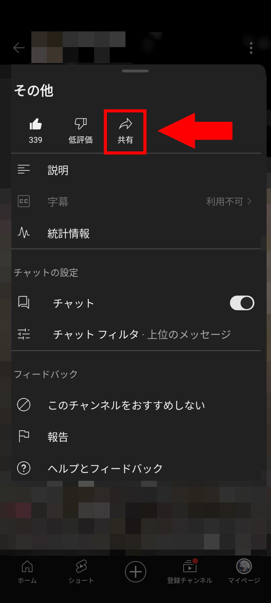

最近、YouTubeでは縦長の画面のライブ配信が増えてきました。そんな縦型配信をバックグラウンド再生する方法を紹介します。

## 縦型配信とは

縦型配信とは、YouTubeのライブ配信のうち、縦長の画面で配信されるものです。縦型配信は、スマートフォンのYouTubeアプリとWeb版のYouTubeの両方で視聴できます。

スマートフォンで視聴する場合は全画面で表示され、YouTubeショートのフィードにも表示されます。通常のライブ配信ではショートフィードに表示されません。

スマートフォンの画面いっぱいに表示されたり、ショートフィードに表示されたりすることから、縦型配信は、スマートフォンでの視聴に最適です。

一方で、PCのブラウザーで視聴する場合は見にくいといった意見もあります。PCのブラウザーで視聴する場合は、縦型配信の画面の左右に黒い帯が表示され、画面の中央に映像が表示されます。

## 前提条件

縦型配信をバックグラウンド再生するには、**PCのブラウザー**を使うか、**YouTube Premiumに加入**する必要があります。

YouTube Premiumに加入していないスマートフォンでバックグラウンド再生する方法も存在はしますが、正規の方法ではないのでここでは紹介しません。

## PCのブラウザーの場合

PCのブラウザーの場合は、通常のYouTubeのライブ配信と同じようにバックグラウンド再生ができます。

## スマートフォンの場合

YouTube Premiumに加入している場合は、スマートフォンのYouTubeアプリでバックグラウンド再生ができます。

ただし、縦型配信は、そのままではバックグラウンド再生できません。縦型配信をバックグラウンド再生するには、2つの方法があります。

### 1. 通知から開く

見たいライブ配信の通知をオンにしている場合は、通知から開くとバックグラウンド再生できます。

この場合、YouTubeのアプリ内の通知タブからでも、スマートフォンに届くプッシュ通知からでも大丈夫です。

いずれの場合でも、通知をタップしてライブ配信を開くと、ショート画面ではなく通常のライブ配信と同じ画面で再生されます。これにより、他の動画やライブ配信と同じようにバックグラウンド再生できるようになります。

### 2. URLを書き換える

通知をオンにしていない場合は、URLを書き換えることで、バックグラウンド再生できます。URLをコピーする方法と、書き換える方法を紹介します。

縦型配信のURLは、次のいずれかの形式になっています。URLは、縦型配信の画面の長押しで表示されるメニューの［共有］からコピーできます。

- `https://www.youtube.com/live/<英数記号の文字列>`
- `https://www.youtube.com/live/<英数記号の文字列>?si=<英数記号の文字列>`

これを、通常の動画と同じように、`https://www.youtube.com/watch?v=<英数記号の文字列>`の形式に書き換えます。そうすることで、通常の動画やライブ配信と同じようにバックグラウンド再生できるようになります。

下のテキストボックスに縦型配信のURLを入力すると、自動で書き換えたURLが表示されます。入力されたURLはサーバーに送信されず、お使いのブラウザー上でのみ処理されます。

<input id="youtube-url-input"><button id="youtube-url-submit">変換</button>

変換後のURL：

## 参考

- https://twitter.com/DiscoTeiMeteo/status/1733120731075207344
- [ライブ配信を始める - パソコン - YouTube ヘルプ](https://support.google.com/youtube/answer/2474026?hl=ja&sjid=511280253973336248-AP)
