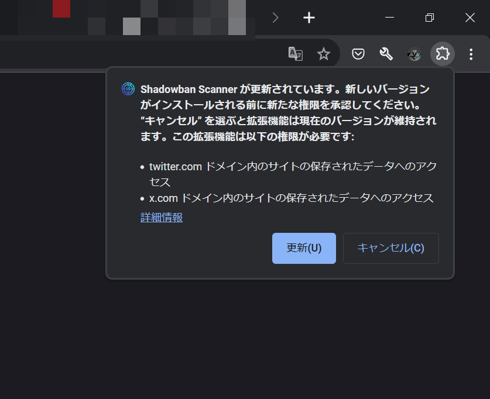

こんにちは。Shadowban Scannerの開発者の ろぼいん です。

現在、一部のユーザーで次の画像のようなダイアログが表示されているかと思います。この件について、詳しく説明します。

## 要約

- 拡張機能は事前に宣言したURLにしかアクセスできない
- TweetDeckのURLが変わってしまったため、新しいURLを宣言する必要がある
- 新しいURLを宣言すると前述のようなダイアログが表示される
- TweetDeckの再サポート以外に、これによる変化はない

## 詳細

ここからは、もう少し詳しく書きます。とはいっても、ほぼ要約で書いたとおりです。

まず前提として、ブラウザー拡張機能は事前に宣言したURLにだけアクセスできる仕組みになっています。

すべてのURLにアクセスできるように宣言することもできますが、通常は必要最低限のURLだけを宣言します。Shadowban Scannerでは、Web版のTwitterとTweetDeckのURLを宣言しています。

しかし最近、TweetDeckのURLが変わってしまいました。事前に宣言したURLにしかアクセスできないので、Shadowban ScannerはTweetDeckで動作しなくなってしまいました。

そのため、変更後のURLに対応する必要があります。拡張機能がアクセスできるURLを変更すると、画像のようなダイアログが表示されるわけです。

> Shadowban Scannerが更新されています。新しいバージョンがインストールされる前に新たな権限を承認してください。"キャンセル"を選ぶと拡張機能は現在のバージョンが維持されます。この拡張機能は以下の権限が必要です。
>
> - twitter.comドメイン内のサイトの保存されたデータへのアクセス
> - x.comドメイン内のサイトの保存されたデータへのアクセス

「保存されたデータへのアクセス」という表記を見ると、少し怪しく感じるかもしれません。しかし、この「保存されたデータへのアクセス」の権限は、Shadowban Scannerを含め、ほとんどのブラウザー拡張機能が利用しています。今回の変更によって、アクセスできるURLの範囲が変わっただけです。

変更後も依然として、Shadowban ScannerはTwitterとTweetDeckでしか動作しませんし、データを外部に送信することもありません。

ブラウザー拡張機能はその性質上、権限をもつサイトにアクセスし、データを読み取り、何らかの処理を行い、閲覧中のページに変更を加えることができます。

これは拡張機能の基本的な性質です。たとえば、広告ブロッカーは広告をブロックするために、ページのコンテンツにアクセスし、内容を読み取って解析し、ページ上の広告を削除するという変更を加えます。

Shadowban Scannerも同様です。Twitterのページにアクセスし、データを読み取って解析し、ページを変更して結果を表示します。

権限の変更後も今までと同様に、**Shadowban Scannerは外部にデータを送信しません**。すべてのデータはお使いのコンピューター上で安全に処理されます。当然ながら、私のサーバーにもデータは送信されません。

今回の変更によって、Twitterの現在および将来の仕様変更に備え、Shadowban ScannerはTwitterのすべてのURLにアクセスできるようになりますが、今まで通りTwitterとTweetDeckでのみ動作します。

## まとめ

以上、Shadowban Scannerで「新たな権限を承認してください」と表示される件についてでした。

今回の変更について、ご理解いただければ幸いです。ご不明な点などがあれば、私のTwitterアカウントまでお気軽にお問い合わせください。

- Twitter：[@keita_roboin](https://twitter.com/keita_roboin)
