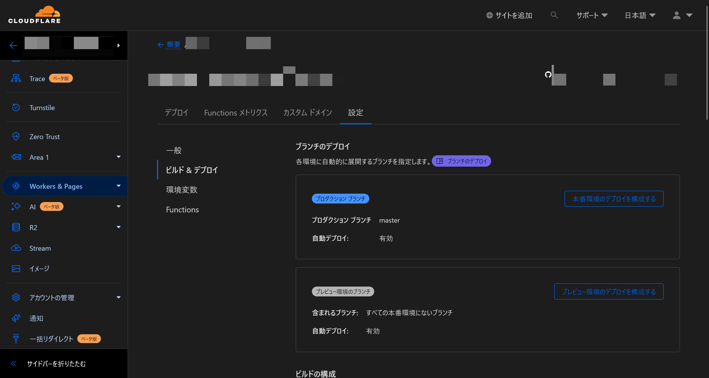
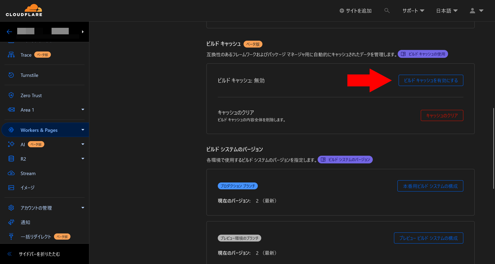

Cloudflare Pagesは、静的サイトのホスティングのための優れたプラットフォームですが、開発プロセスにおいてビルド時間がネックとなる場合があります。とくに、大規模なプロジェクトや頻繁に更新するプロジェクトでは、毎回すべての依存関係をダウンロードしてビルドし直すことは非効率的です。

そこで、Cloudflare Pagesのビルドキャッシュ機能が役立ちます。ビルドキャッシュを使うと、依存関係と出力ファイルをキャッシュし、次回以降のビルドを高速化できます。

## 対応している環境

ビルドキャッシュは、次のパッケージマネージャーとフレームワークで利用できます。

### パッケージマネージャー

- yarn
- npm
- pnpm
- bun

### フレームワーク

- Gatsby
- Next.js
- Astro

## 有効にする方法

ビルドキャッシュを有効にするにはまず、Cloudflare Pagesの設定画面を開き、［ビルド＆デプロイ］タブを選択します。

［ビルドキャッシュ］セクションまでスクロールし、［ビルドキャッシュを有効にする］をクリックします。

これによって、次回のビルドからビルドキャッシュが有効になります。キャッシュを削除したい場合は、［キャッシュのクリア］ボタンをクリックします。

有効化してから最初のビルドでは、またビルド結果がキャッシュされていないため、通常のビルドと同じ時間がかかります。2回目からはビルドキャッシュが有効になり、ビルド時間が短縮されます。

Astroを使っているこのブログで実際に試したところ、1分程度かかっていたビルドが30秒程度に短縮されました。実際にビルドを開始するまでの処理（フレームワークがファイルをスキャンする時間など）は短縮できないので、ページ数が多いサイトほど効果が大きいと考えられます。

## まとめ

Cloudflare Pagesのビルドキャッシュ機能を使うと、ビルド時間を短縮できます。ビルド時間がネックとなっている場合は、ぜひ有効にしてみてください。

## 参考

- [Build caching · Cloudflare Pages docs](https://developers.cloudflare.com/pages/platform/build-caching/#frameworks)
