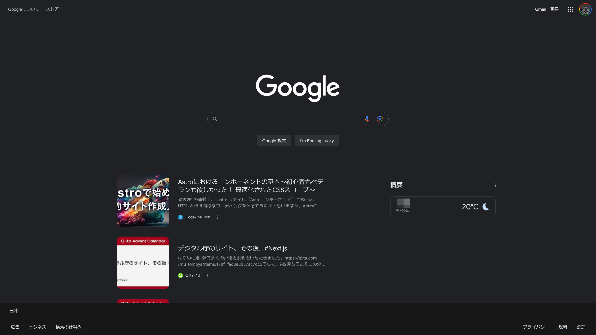
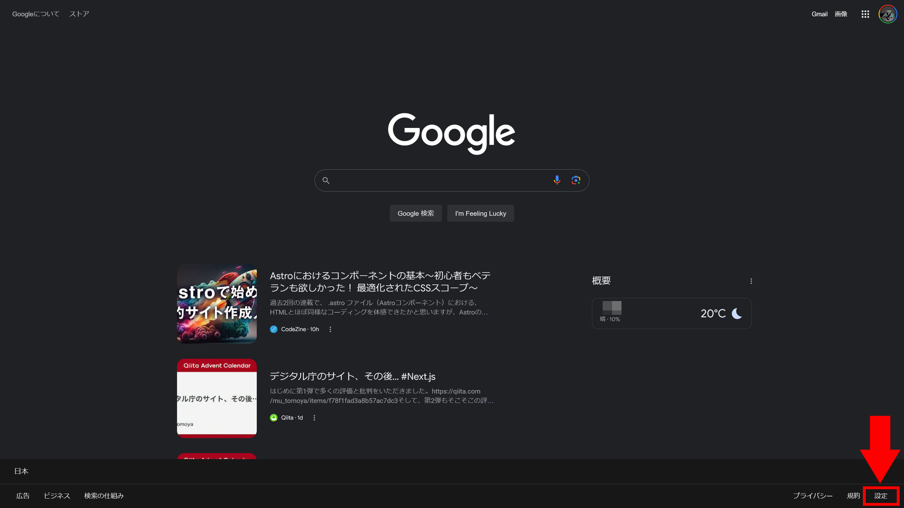
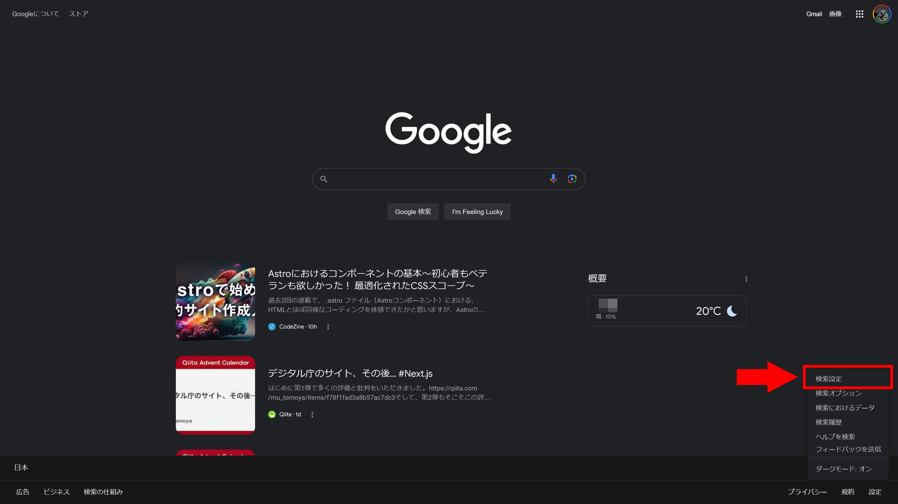
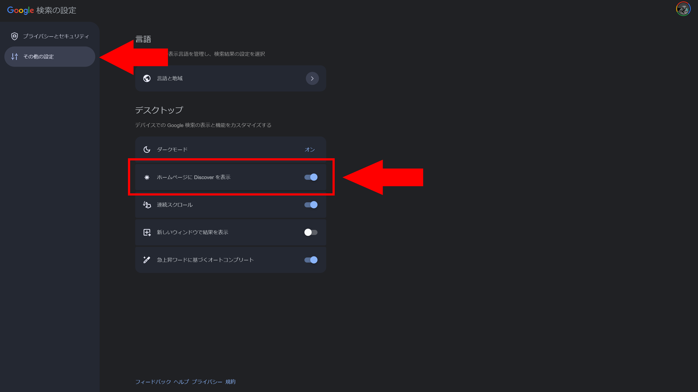

2023年12月15日ごろから、Google検索のトップページにオススメのニュースやブログ記事のフィードが表示されるようになりました。この記事では、このフィードを非表示にする方法について解説します。

## フィードの正体

Googleのトップページに表示されるようになったオススメのニュース記事は、Googleが以前からインドでテストしていたものです。それが今回、日本にも展開されたものと思われます。

これらのオススメ記事は、すでにスマートフォンで利用できる「Discover」フィードと同じ仕組みで、Googleがユーザーの興味に合わせて表示しています。

- [Google tests Discover Feed on desktop version of Google.com - MSPoweruser](https://mspoweruser.com/google-new-desktop-homepage-with-discover-feed/)
- [Googleのシンプルなトップ画面がなくなるかも - GIGAZINE](https://gigazine.net/news/20231016-google-discover-feed/)

Discoverについて、Googleの公式ドキュメントでは、次のように説明されています。

> Discover は Google 検索の一部で、ウェブとアプリのアクティビティに基づいて、ユーザーの興味や関心に関連するコンテンツを表示する機能です。
>
> （中略）
>
> Discover に表示されるコンテンツには、ユーザーの興味や関心に合ったさまざまなトピックが含まれます。ユーザーの興味や関心に基づいて、古いコンテンツでも有用で関連性が高い場合は表示されることがあります。
>
> —— [Google Discover の概要、掲載、表示方法 | Google 検索セントラル  |  ドキュメント  |  Google for Developers](https://developers.google.com/search/docs/appearance/google-discover?hl=ja)

このように、Discoverは自分の興味に合ったオススメのコンテンツを表示してくれる便利な機能です。しかし、今までのシンプルなトップページが好きな人にとっては、邪魔なだけの機能になってしまいます。

では、このDiscoverフィードがいらないという人のために、非表示にする方法を見ていきましょう。

## オススメ記事を非表示にする方法

オススメの記事のフィードを非表示にするには、Google検索のトップページの右下にある［設定］をクリックします。

表示されるメニューの中から［検索設定］をクリックします。

設定画面が開くので、左側のメニューバーから［その他の設定］タブを開き、［ホームページにDiscoverを表示］のトグルスイッチをオフにします。

Google検索のトップページに戻って再読み込みすると、それまで表示されていたDiscoverフィードや天気・気温などの情報が非表示になります。

## まとめ

この記事では、Google検索のトップページに表示されるオススメの記事を消す方法について解説しました。

Discoverフィードは、自分の興味に合ったオススメのコンテンツを表示してくれる便利な機能です。しかし、今までのシンプルなトップページが好きな人にとっては、邪魔なだけの機能になってしまいます。

この記事を参考に、自分の好みに合わせてDiscoverフィードを表示するかどうかを設定してみてください。
