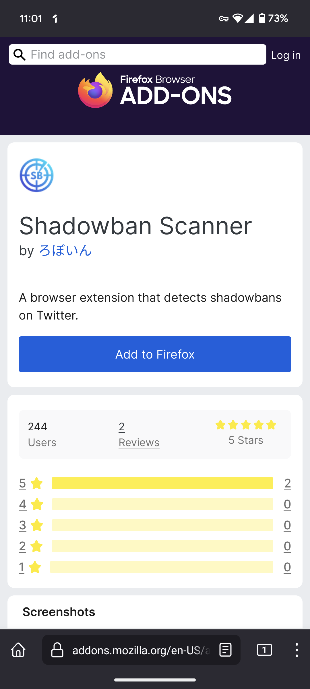

Great news! As of December 14th, I'm excited to announce that Shadowban Scanner is now compatible with the Firefox for Android! You can now use Shadowban Scanner on your Android devices.

Until now, it has been a common understanding that browser extensions were not available for use on smartphone web browsers. Therefore, it was natural that Shadowban Scanner couldn't be installed on smartphones.

However, that situation has come to an end. On December 14th, Firefox for Android started supporting an open extension ecosystem, making more than 480 extensions available!

Firefox for Android has become the leading web browser for smartphones that allows access to an open extension ecosystem. From now on, you can use various extensions, including Shadowban Scanner, on your smartphone.

## Installation

First, install the Firefox for Android from Google Play.

- [Firefox Fast & Private Browser - Apps on Google Play](https://play.google.com/store/apps/details?id=org.mozilla.firefox)

Next, open the Shadowban Scanner distribution page.

- [Shadowban Scanner – Get this Extension for 🦊 Firefox Android (en-US)](https://addons.mozilla.org/android/addon/shadowban-scanner/)

Tap the [Add to Firefox] button, and the extension will be installed.

Please note that Shadowban Scanner only works when using the web version of Twitter and TweetDeck through the Firefox for Android. It does not function with other web browsers or the app version of Twitter.

## FAQ

### Which web browsers does Shadowban Scanner support?

Currently, Shadowban Scanner is compatible with the following web browsers:

- Chrome for Mac and Windows
- Firefox for Mac and Windows
- Firefox for Android

### What about iOS Firefox?

Currently, iOS Firefox does not support extensions. Therefore, Shadowban Scanner is not available for use on iOS Firefox.

### How about Chrome on Android and iOS?

Currently, the mobile versions of Chrome do not support extensions. Consequently, Shadowban Scanner cannot be used on the mobile versions of Chrome.

### What about Safari on macOS and iOS?

Although Safari on macOS and iOS supports extensions, there are no plans at the moment to make Shadowban Scanner installable on these platforms. The reasons are as follows:

- Lack of ownership of Mac or iPhone for testing purposes
- Need to build the extension on a Mac to distribute it for Safari
- To distribute extensions for Safari, a yearly fee of $99 must be paid as a commission, even for completely free extensions!

If Apple lifts restrictions on third-party app stores and eases these constraints, there may be a possibility of releasing Shadowban Scanner for macOS and iOS Safari (though this is not confirmed).
