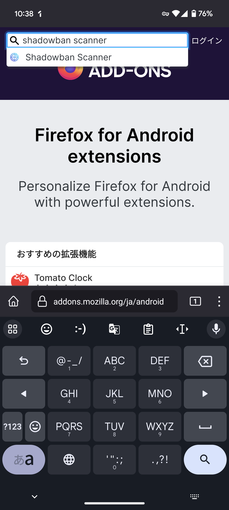
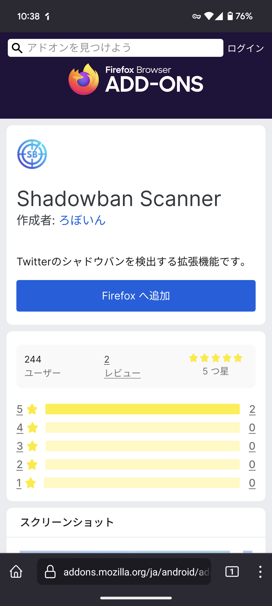

うれしいお知らせです。Shadowban Scannerが12月15日（日本時間）より、Android版Firefoxに対応しました！これからはAndroidでもShadowban Scannerを使えるようになります。

今までは、スマートフォンのWebブラウザーでは拡張機能を利用できないのが常識でした。そのため当然ながら、Shadowban Scannerもスマートフォンにはインストールできませんでした。

しかし、そのような状況はもう終わりです。12月15日、Android版Firefoxはオープンな拡張機能エコシステムをサポートし、480を超える拡張機能が利用できるようになりました！

Android版Firefoxはスマートフォン向けで唯一、オープンな拡張機能を利用できる主要なWebブラウザーとなりました。これからはShadowban Scannerを含め、多くの拡張機能をスマートフォンで利用できます。

## インストール方法

まずは、Google PlayからAndroid版Firefoxをインストールします。

- [Firefox 高速プライベートブラウザー - Google Play のアプリ](https://play.google.com/store/apps/details?id=org.mozilla.firefox)

次に、Firefoxの拡張機能ストア（通称「AMO」）を開きます。

- [Firefox Android (ja) 向けアドオン](https://addons.mozilla.org/android/)

検索ボックスに「Shadowban Scanner」と入力し、検索結果の中から［Shadowban Scanner］を選択します。

［Firefoxへ追加］ボタンをタップすると、拡張機能がインストールされます。

Shadowban Scannerは、Android版Firefoxを使ってWeb版のTwitterおよびTweetDeckを利用している場合にのみ動作します。他のWebブラウザーやアプリ版のTwitterでは動作しません。

## FAQ

### Shadowban Scannerが対応しているWebブラウザーは？

現在、Shadowban Scannerは次のWebブラウザーに対応しています。

- MacおよびWindowsのChrome
- MacおよびWindowsのFirefox
- AndroidのFirefox

### iOS版Firefoxは？

現在、iOS版Firefoxは拡張機能をサポートしていません。そのため、Shadowban ScannerはiOS版Firefoxで利用できません。

### AndroidとiOSのChromeは？

現在、スマートフォン版のChromeは拡張機能をサポートしていません。そのため、Shadowban Scannerはスマートフォン版のChromeで利用できません。

### macOSとiOSのSafariは？

macOSとiOSのSafariは拡張機能をサポートしているものの、現時点ではShadowban Scannerをインストールできるようにする予定はありません。理由は次のとおりです。

- MacやiPhoneを所有しておらず、動作確認できない
- Safari向けに拡張機能を配布するには、Macでビルドする必要がある
- Safari向けに拡張機能を配布するには、手数料として年間99ドルを支払う必要がある（たとえ完全無料の拡張機能でも！）

Appleがサードパーティーのアプリストアを解禁してこれらの制約が緩和されれば、macOSやiOSのSafari向けにShadowban Scannerを公開できるようになる可能性もあります（が、確定ではありません）。
