## はじめに

Arduinoは、電子工作やIoT開発に広く使われているマイコンボードです。Arduinoの開発環境には、Arduino IDEが標準で用意されていますが、Visual Studio Code（VS Code）でもArduinoの開発ができます。

VS Codeは、Microsoftが開発しているテキストエディターです。Arduino IDEよりも機能が豊富で、さまざまな拡張機能を利用できます。

Arduino IDEは少し前にバージョン2にアップデートされ、VS Codeと同じMonaco Editorベースになった（？）ようです。以前と比べて圧倒的に使いやすくなりましたが、それでもVS Codeの方が機能が豊富ですし、ひとつのエディターで完結した方が便利です。

この記事では、使い慣れたVS CodeでArduinoの開発をするための最低限かつある程度快適な環境を構築する方法について解説します。

## 対象読者

VS Codeの基本的な使い方を理解しており、VS Codeを使ってArduinoの開発をしたい人を対象としています。

## 前提条件

まずは、パソコンにVS CodeとArduino IDEをインストールしておきましょう。

Arduino IDEは、インストール後に一度だけ起動します。ドライバーなどのインストールが始まるので、すべてインストールします。インストールが終わったら、Arduino IDEは閉じておきます。

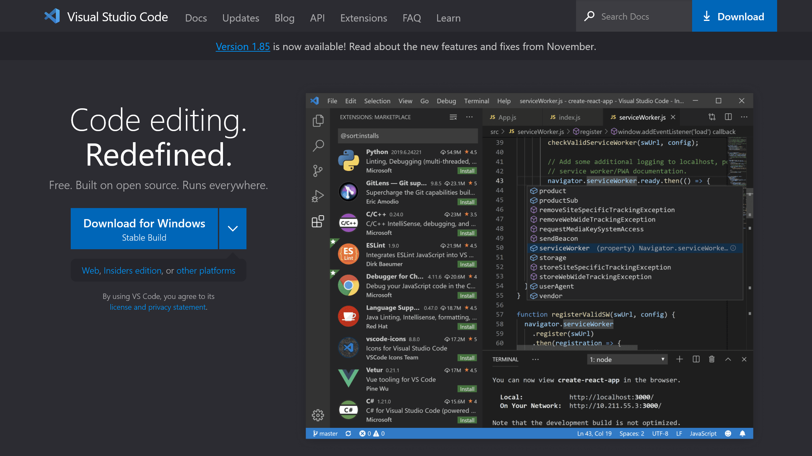
[Visual Studio Code - Code Editing. Redefined](https://code.visualstudio.com/)

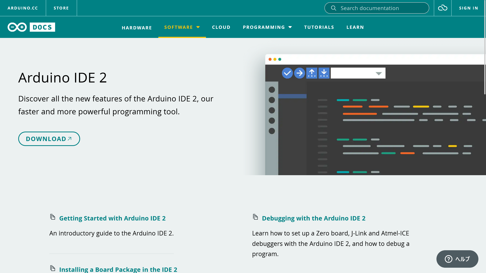
[Arduino IDE 2 | Arduino Documentation](https://docs.arduino.cc/software/ide-v2)

## 拡張機能編

VS CodeでArduinoを扱うための拡張機能をインストールします。

Microsoftが公式にリリースしている、Arduino用の拡張機能を使います。

- [Arduino - Visual Studio Marketplace](https://marketplace.visualstudio.com/items?itemName=vsciot-vscode.vscode-arduino)

C/C++用の拡張機能もインストールしておきます。

- [C/C++ - Visual Studio Marketplace](https://marketplace.visualstudio.com/items?itemName=ms-vscode.cpptools)

また、スニペットを利用できるようにする「arduino-snippets」もインストールしておきます。これによって入力補完も効くようになります。

- [arduino-snippets - Visual Studio Marketplace](https://marketplace.visualstudio.com/items?itemName=ronaldosena.arduino-snippets)

## 設定編

拡張機能をインストールしたら、それらの設定をします。

VS Codeの設定で`arduino.useArduinoCli`と検索し、チェックを入れます。

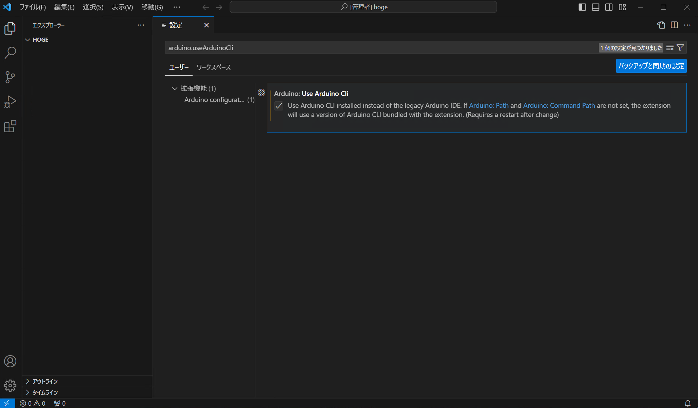

または、`settings.json`に次の設定を追加します。

```json title="settings.json"
"arduino.useArduinoCli": true
```

次に、`C_Cpp.intelliSenseEngine`と検索し、`Tag Parser`を選択します。

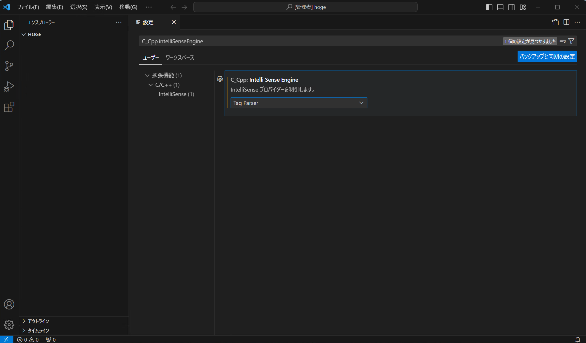

または、`settings.json`に次の設定を追加します。

```json title="settings.json"
"C_Cpp.intelliSenseEngine": "Tag Parser"
```

また、お好みで`Clang_format_fallback`を好きな値に設定します。これは、フォーマットのスタイルを指定するものです。私の場合は`{ BasedOnStyle: Chromium, IndentWidth: 4 }`を指定しています。

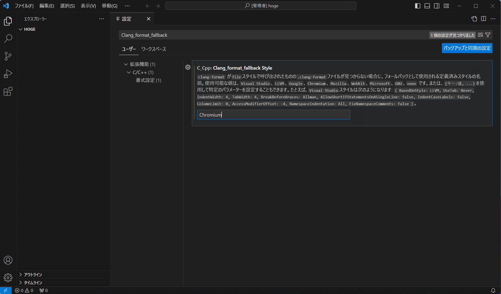

`settings.json`を使う場合は、次のように設定します。

```json title="settings.json"
"C_Cpp.clang_format_fallbackStyle": "{ BasedOnStyle: Chromium, IndentWidth: 4 }"
```

したがって、設定後の`settings.json`は次のようになります。

```jsonc title="settings.json" ins={3-5}
{
    // ...他の設定
    "arduino.useArduinoCli": true,
    "C_Cpp.intelliSenseEngine": "Tag Parser",
    "C_Cpp.clang_format_fallbackStyle": "{ BasedOnStyle: Chromium, IndentWidth: 4 }"
}
```

これで、コード補完やフォーマッターが使えるようになりました。

## 使い方編

Arduinoのプロジェクトを始めるには、既存のスケッチのフォルダーをVS Codeで開くか、新しく`.ino`ファイルを作成します。

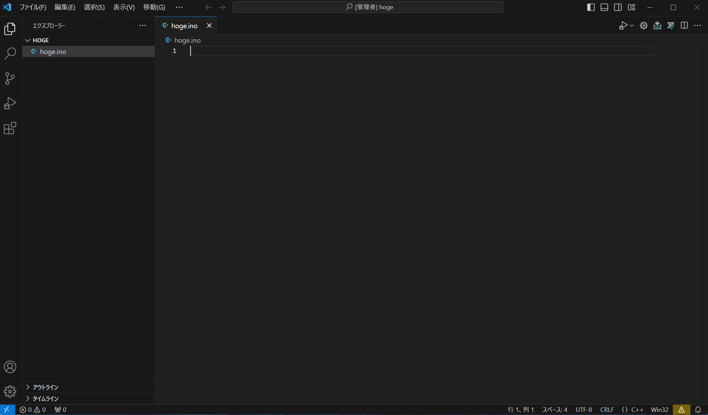

VS Codeの下部のナビゲーションバーに、Arduinoのボードやポートを選択するボタンが表示されます。これをクリックすると、ボードやポートを選択できます。

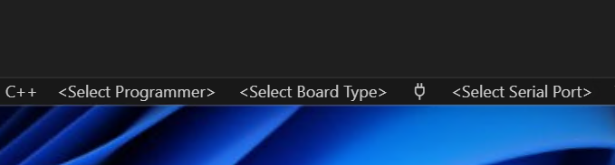

`<Select Board Type>`をクリックすると、使用するボードを選択するための画面が表示されます。

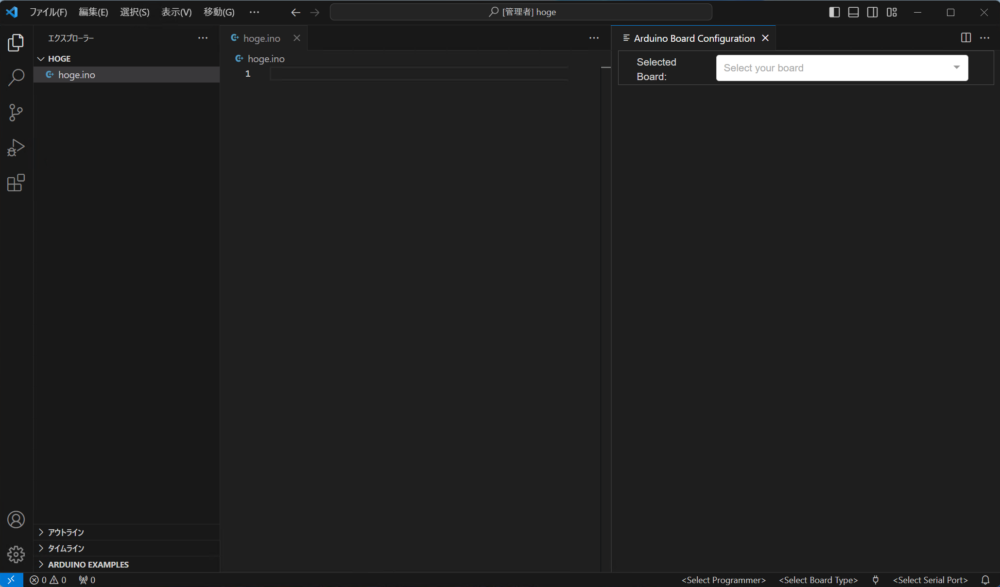

［Select your board］から、使いたいボードを選択します。プルダウンリストになっていますが、テキストを入力すると絞り込めます。私の場合は、［Arduino Uno（Arduino AVR Boards）］を選択しました。


ボードを選択したら、このパネルは閉じて大丈夫です。

同様に、［Select Serial Port］から使用したいシリアルポートを選択します。記録し忘れていてうろ覚えですが、シリアルポートを選択するとドライバーか何かのインストール画面が表示されるかもしれません。その場合は、インストールしておきます。

次に、`Ctrl + Shift + P`でコマンドパレットを開き、［Arduino: Board Manager］を選択します。

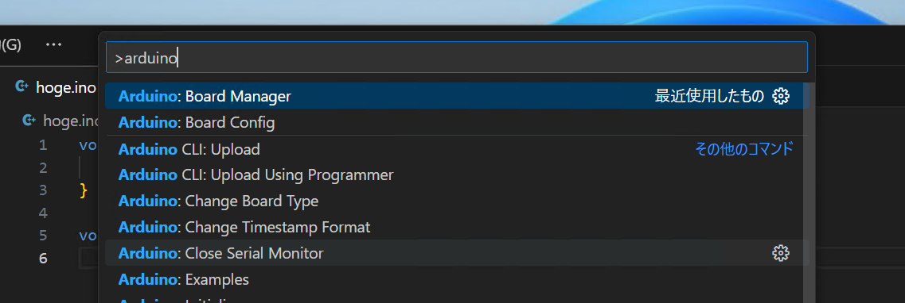

右側のパネルにボードマネージャーが表示されるので、適切なものを探して［Install］をクリックします。私の場合は、Arduino UNO R4 Minimaを使っているので、［Arduino UNO R4 Boards］を選択しました。

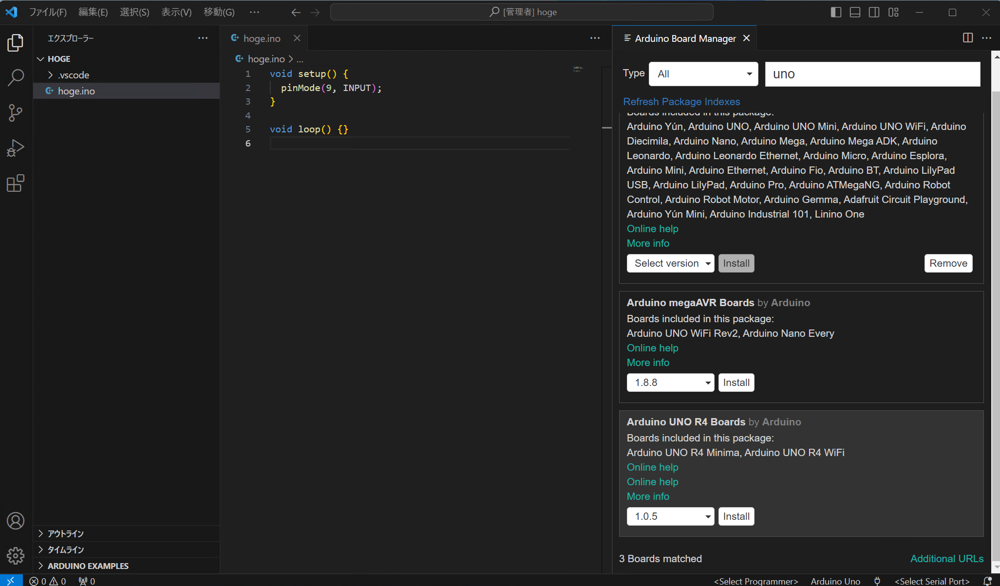

コンソールに進捗が表示され、インストールが完了すると［[Done] Installed board package - arduino］と表示されます。

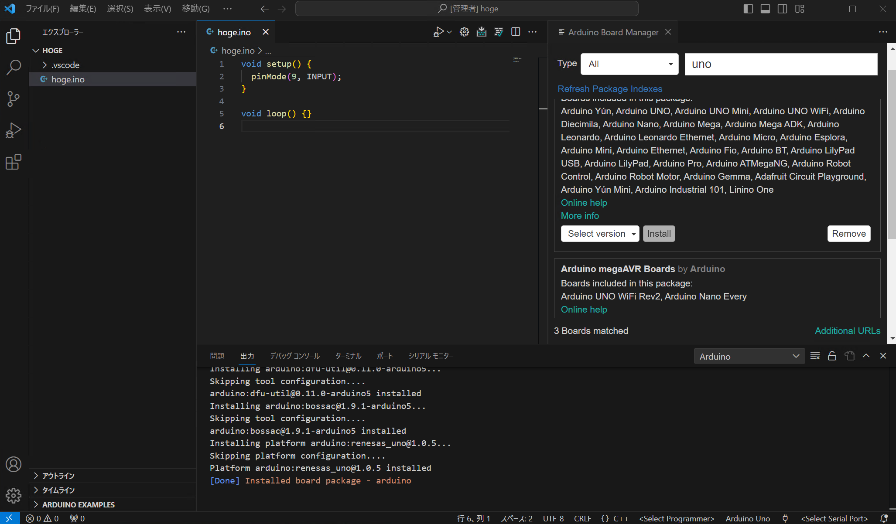

これが表示されたら、コンソールとボードマネージャーは閉じて大丈夫です。終わったらスケッチに戻って、コードを書きます。

ボードへの書き込みや検証は、画面右上のボタンから実行できます。

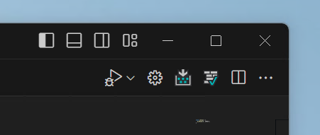

書いたスケッチを検証するには、チェックマークが目印の［Arduino: Verify］ボタンをクリックするか、`Ctrl + Alt + R`を押します。

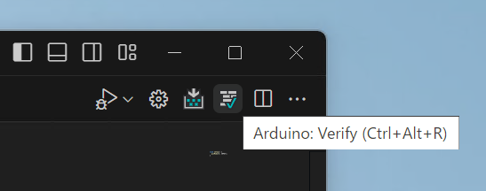

コンソールが表示されるので、「[Done] Verifying sketch '<ファイル名>'」と表示されれば成功です。

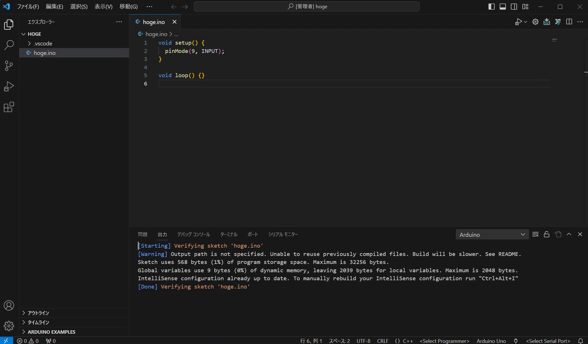

スケッチを書き込む場合は、検証ボタンの左隣の矢印が目印の［Arduino: Upload］ボタンをクリックするか、`Ctrl + Alt + U`を押します。

（アイコンが分かりにくくてダウンロードっぽく見えますよね…）

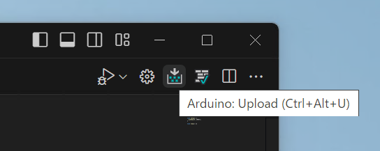

複数のスケッチが含まれるフォルダーを開いている場合は、**現在開いているスケッチではなく選択したスケッチ**が書き込まれます。

書き込むスケッチを切り替えるには、コマンドパレットで［Arduino: Select Sketch］を実行し、スケッチを選択します。


また、シリアルモニターを開くには、コマンドパレットで［Arduino: Open Serial Monitor］を選択します。適切なポート速度を選択すると、シリアルモニターが開きます。

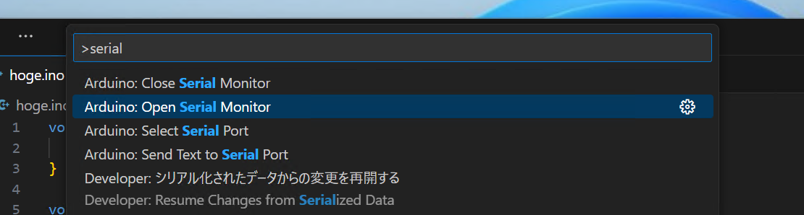

シリアルモニターは、同時にArduino IDEとVS Codeのどちらか一方しか開けません。VS Codeで開いている場合は、Arduino IDEで開けなくなります。片方で使うときは、もう片方を閉じておきましょう。

## まとめ

本記事では、VS Codeで最低限かつ快適なArduino環境を構築する方法と使い方について解説しました。

VS Codeは、Arduino IDEよりも機能が豊富で、コード補完やデバッグ機能などが利用できます。また、プラグインによって機能を拡張できます。

本記事を参考に、VS Codeで快適なArduino開発環境を構築してみてください。

## 参考

環境の構築にあたり、次の記事を参考にしました。

- [【2022年版】VSCodeでArduinoの開発をする方法｜めかとろな日々](https://www.mechatronahibi.com/arduino-vscode-dev/)
- [ラジオペンチ VSCode for Arduino の自動フォーマットの設定](http://radiopench.blog96.fc2.com/blog-entry-1112.html)
