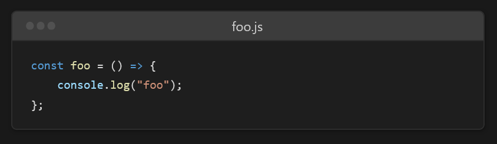
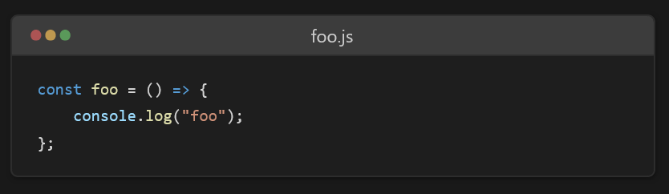

QiitaなどのサイトではMarkdown構文が独自に拡張されており、たとえばコードブロックにファイル名を表示したりできます。しかし、通常のMarkdownでは、そのようなことはできません。

[Expressive Code](https://github.com/expressive-code/expressive-code)を使うと、ファイル名を表示したり、特定の行を強調表示したりなど、MarkdownまたはMDXを使ってWebでリッチなコードブロックを表現できます。

実際にこのブログではExpressive Codeを使っており、次のコードブロックのように美しく機能的な表現ができます。

```javascript title="foo.js" mark={5} ins={8} "テキスト"
const foo = () => {
    // コード中の「テキスト」という文字列を強調
    console.log("テキスト");
    console.log("テキスト");
    // この行だけ強調
};

foo();
```

この記事では、そんなExpressive Codeの使い方を説明します。

## Expressive Codeとは

Expressive Codeは、Webでソースコードを美しく表示するためのエンジンです。VS Codeと同じ正確なエンジンでシンタックスハイライトを処理しており、またテキストマーカーや差分表示、フレームなどの機能を備えています。

クライアントサイドのフレームワークに依存せず、高パフォーマンスで軽量なことが特徴です。

また、コードブロックの右上にはコピーボタンが表示され、クリックするとコードをクリップボードにコピーできます。

## 前提条件

Expressive Codeは、Markdownパーサーのremarkと、静的サイトジェネレーターのAstroに対応しています。

コア部分のパッケージは独立して提供されており、自分で他のフレームワークに対応させることもできます。しかし、通常はremarkかAstroを使うことになるでしょう。

## インストール方法

remarkで使う場合とAstroで使う場合に分けて説明します。

### remarkの場合

Expressive Codeをremarkで使う場合は、プラグインとしてインストールします。

```console title="terminal"
npm install remark-expressive-code
```

他のプラグインと同じように利用できます。第2引数としてオプションを指定できます。詳細は[公式リポジトリー](https://github.com/expressive-code/expressive-code/blob/main/packages/remark-expressive-code/README.md)を確認してください。

※コード例は公式リポジトリーより

````javascript title="example.js"
import { unified } from 'unified'
import remarkParse from 'remark-parse'
import remarkDirective from 'remark-directive'
import remarkExpressiveCode from 'remark-expressive-code'
import remarkRehype from 'remark-rehype'
import rehypeRaw from 'rehype-raw'
import rehypeStringify from 'rehype-stringify'

const markdownExample = `
# Hello world

\`\`\`js title="hello-world.js" ins={1}
console.log('Hello world')
\`\`\`
`

main()

async function main() {
  const file = await unified()
    .use(remarkParse)
    .use(remarkDirective)
    // Here we add the plugin to the remark pipeline
    // (you can also pass options as a second argument)
    .use(remarkExpressiveCode)
    // As remark-expressive-code generates HTML nodes,
    // we need to pass `allowDangerousHtml: true`
    // to prevent remark-rehype from dropping them
    .use(remarkRehype, { allowDangerousHtml: true })
    // We also need `rehype-raw` to prevent HTML tags
    // inside the output from being escaped
    .use(rehypeRaw)
    .use(rehypeStringify)
    .process(markdownExample)

  console.log(String(file))
}
````

### Astroの場合

Astroの場合は、インテグレーションが用意されています。次のコマンドを実行するだけで、自動的に使えるようになります。

```console title="terminal"
npx astro add astro-expressive-code
```

## 設定

Expressive Codeでは、コードブロックの配色（テーマ）などをカスタマイズできます。また、閲覧しているユーザーの環境がライトモードかダークモードかに応じた自動切り替えもできます。

詳細は[公式ドキュメント](https://github.com/expressive-code/expressive-code/blob/main/packages/astro-expressive-code/README.md#configuration)を確認してください。

## 使い方

Expressive Codeは、通常のMarkdownのコードブロック構文に加え、いくつかの独自の構文をサポートしています。

### タイトル

コードブロックにタイトルを表示するには、次のように書きます。

````markdown
```javascript title="foo.js"
const foo = () => {
    console.log("foo");
};
```
````

すると、次のように表示されます。

```javascript title="foo.js"
const foo = () => {
    console.log("foo");
};
```

### 行の強調

コードの特定の行を強調表示するには、`mark={}`で行番号を指定します。

````markdown
```javascript title="foo.js" mark={2}
const foo = () => {
    console.log("foo");
    alert("foo");
};
```
````

```javascript title="foo.js" mark={2}
const foo = () => {
    console.log("foo");
    alert("foo");
};
```

たとえば、2〜3行目を強調表示したい場合は、`mark={2-3}`とします。

````markdown
```javascript title="foo.js" mark={2-3}
const foo = () => {
    console.log("foo");
    alert("foo");
};
```
````

```javascript title="foo.js" mark={2-3}
const foo = () => {
    console.log("foo");
    alert("foo");
};
```

複数の行を強調表示したい場合は、`mark={1,4}`のようにカンマ区切りで指定します。

````markdown
```javascript title="foo.js" mark={1,4}
const foo = () => {
    console.log("foo");
    alert("foo");
};
```
````

```javascript title="foo.js" mark={1,4}
const foo = () => {
    console.log("foo");
    alert("foo");
};
```

### 行の挿入

コードの特定の行を挿入したような差分表示をするには、`ins={}`で行番号を指定します。

````markdown
```javascript title="foo.js" ins={3}
const foo = () => {
    console.log("foo");
    alert("foo");
};
```
````

```javascript title="foo.js" ins={3}
const foo = () => {
    console.log("foo");
    alert("foo");
};
```

複数行にまたがって挿入したい場合や、複数箇所に挿入したい場合の指定方法は、[行の強調](#行の強調)と同じです。

### 行の削除

コードの特定の行を削除したような差分表示をするには、`del={}`で行番号を指定します。

````markdown
```javascript title="foo.js" del={3}
const foo = () => {
    console.log("foo");
    alert("foo");
};
```
````

```javascript title="foo.js" del={3}
const foo = () => {
    console.log("foo");
    alert("foo");
};
```

複数行にまたがって削除したい場合や、複数箇所に削除したい場合の指定方法は、[行の強調](#行の強調)や[行の挿入](#行の挿入)と同じです。

### ラベル付きマーカー

コードの特定の行を強調表示し、そこにラベルを付与するには`mark={"ラベル":行番号}`で行番号を指定します。また、`del`や`ins`でも同様にできます。

````markdown
```javascript title="foo.js" mark={"1":2}
const foo = () => {
    console.log("foo");
    alert("foo");
};
```
````

```javascript title="foo.js" mark={"1":2}
const foo = () => {
    console.log("foo");
    alert("foo");
};
```

### テキストマーカー

コード中の特定の文字列を強調表示するには、`"テキスト"`のようにダブルクォーテーションで囲みます。

````markdown
```javascript title="foo.js" mark={5} ins={8} "テキスト"
const foo = () => {
    // コード中の「テキスト」という文字列を強調
    console.log("テキスト");
    console.log("テキスト");
    // この行だけ強調
};
```
````

```javascript title="foo.js" mark={5} ins={8} "テキスト"
const foo = () => {
    // コード中の「テキスト」という文字列を強調
    console.log("テキスト");
    console.log("テキスト");
    // この行だけ強調
};
```

また、正規表現も利用できます。正規表現ではキャプチャーされた範囲のみが強調表示されるので、キャプチャーしたくない場合は`(?:)`でグループ化します。

````markdown
```markdown /(?:hoge)+/
- foo
- hoge
- bar
- hogehoge
```
````

```markdown /(?:hoge)+/
- foo
- hoge
- bar
- hogehoge
```

### フレームの変更

デフォルトではエディター風のフレームが表示されます。

コードの言語として次のいずれかを指定すると、ターミナルウィンドウ風のフレームが表示されます。

- `bash`
- `shellscript`
- `shell`
- `sh`
- `zsh`

````markdown
```bash title="terminal"
echo "foo"
```
````

```bash title="terminal"
echo "foo"
```

フレームの設定を上書きしたい場合は、`frame=`で指定します。`frame`オプションには`code`、`terminal`、`none`、`auto`のいずれかを指定できます。デフォルトでは`auto`です。

````markdown
```javascript title="foo.js" frame="terminal"
const foo = () => {
    console.log("foo");
};
```
````

```javascript title="foo.js" frame="terminal"
const foo = () => {
    console.log("foo");
};
```

## Tips

### ターミナルウィンドウをmacOS風にする

Expressive Codeのターミナルウィンドウ風フレームの左上には、3つのボタンのような飾りがついています。これらのボタンは、デフォルトでは灰色です。



これをmacOSのウィンドウ風の配色にするには、次のようなCSSを追加します。

```css
.expressive-code .frame.is-terminal .header::before {
    background-image: linear-gradient(to right, #c95b5b 30%, 30%, #e0b054 70%, 70%, #62b162);
    opacity: 0.8 !important;
}
```



### 行番号の表示

Expressive Codeには、記事執筆時点では行番号を表示するオプションが存在しません。[Issue](https://github.com/expressive-code/expressive-code/issues/37)は上がっていますが、現時点では実装方法を検討中のようです。

そこで、Expressive Codeが内部で使用している[Shiki](https://github.com/shikijs/shiki)に上がっていた[Issue](https://github.com/shikijs/shiki/issues/3#issuecomment-830564854)を参考に、次のようなCSSを追加すると、行番号を表示できます。

ただし、行の強調表示（差分表示を含む）との**非互換性があるため、オススメしません**。

```css
.expressive-code pre > code {
    counter-reset: step !important;
    counter-increment: step 0 !important;
}


.expressive-code pre > code .ec-line::before {
    content: counter(step);
    counter-increment: step;
    width: 1rem;
    margin-right: 1rem;
    display: inline-block;
    text-align: right;
    color: rgba(115, 138, 148, 0.4);
}
```

## まとめ

MarkdownやMDXを使って、Webでリッチなコードブロックを表現できるExpressive Codeを紹介しました。

Expressive Codeは、Astroの公式ドキュメント（が使っている[Starlight](https://github.com/withastro/starlight)）でも利用されているようです。

通常のMarkdownではできない、高度で美しいコードブロックを表現できるので、ぜひ使ってみてください。
