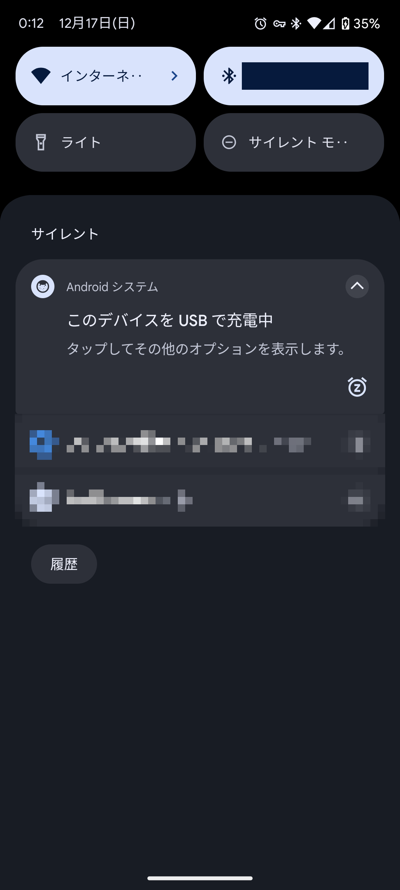
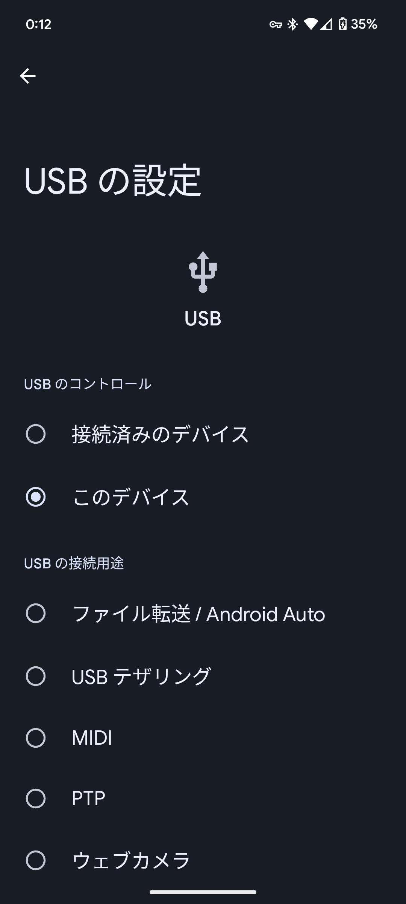
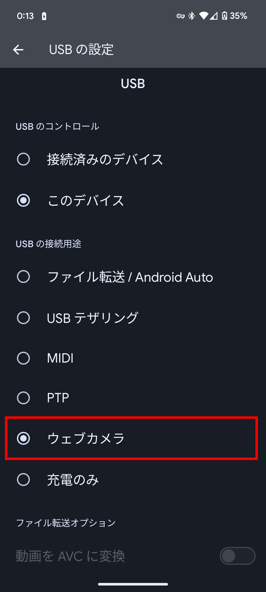
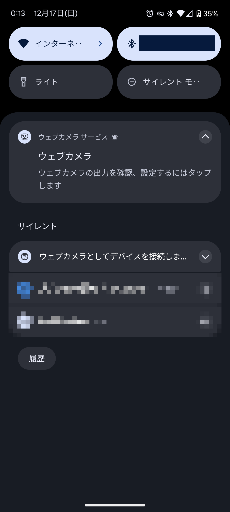

近年、リモートワークが増えてきています。リモートワークでは、カメラを使ったオンライン会議が欠かせません。しかし、デスクトップパソコンなど、一部のパソコンではカメラが搭載されていないことがあります。あるいは、パソコンのインカメではなく、外付けで高画質なカメラを使いたいという場合もあるでしょう。

この記事では、パソコンやスマホにアプリをインストールせずに、AndroidスマホをWebカメラとして使う方法を紹介します。

## 前提条件

AndroidスマホをWebカメラとして使うには、使用しているスマホがAndroid 14以降を搭載している必要があります。

Google Pixelの場合は、[2023年12月のFeature Drop](https://support.google.com/pixelphone/thread/247298790/2023-%E5%B9%B4-12-%E6%9C%88%E3%81%AE-feature-drop?hl=ja)を適用している、Pixel 6以降の機種が必要です。Pixel Tabletは対象外です。

また、パソコンとスマホをつなぐUSBケーブルが必要です。

## AndroidスマホをWebカメラとして使う方法

まずは、スマホとパソコンをUSBケーブルでつなぎます。

すると、スマホに［このデバイスをUSBで充電中］という通知が表示されるので、タップして開きます。場合によっては、少し違うメッセージが表示されるかもしれません。

通知をタップすると、［USBの設定］画面が開きます。

［USBのコントロール］に［このデバイス］が選択されていることを確認したら、少し下にスクロールします。

［USBの接続用途］で［ウェブカメラ］を選択します。

これで、スマホをWebカメラとして使う準備が整いました。パソコン側のZoomなどでカメラとして［Android Webcam］を選択すると、スマホのカメラの映像が表示されるようになります。

### カメラの設定を変える方法

デフォルトではスマホの背面のカメラが使用されますが、インカメに切り替えたり、倍率を変えたりもできます。

これらの設定を変更するには、スマホの通知パネルを開きます。［ウェブカメラサービス］の［**ウェブカメラ**　ウェブカメラの出力を確認、設定するにはタップします］という通知が表示されています。この通知をタップして開いてください。

通知をタップすると、カメラのプレビューが表示されます。画面の中央にカメラのプレビューが表示されており、右側には倍率の設定とカメラの切り替えのボタンが表示されています。

［1.0］［2.0］と書かれているボタンをタップすると、カメラの倍率を変更できます。［1.0］をタップすると、通常の倍率に戻ります。

また、回転する矢印のマークが書かれたボタンをタップすると、カメラを切り替えられます。ボタンをタップするごとに、背面カメラとインカメラが切り替わります。

## カメラの終了方法

Androidスマホをカメラとして使用するのをやめるには、単純にパソコンとスマホのUSBケーブルを外します。

ケーブルを外さずにスマホをパソコンから充電したい場合は、ウェブカメラ機能を有効化したときと同じように［USBの設定］画面を開き、［充電のみ］を選択してください。

## まとめ

この記事では、AndroidスマホをWebカメラとして使う方法を紹介しました。

パソコンやスマホにアプリをインストールせずに、AndroidスマホをWebカメラとして使えます。ぜひ、試してみてください。
