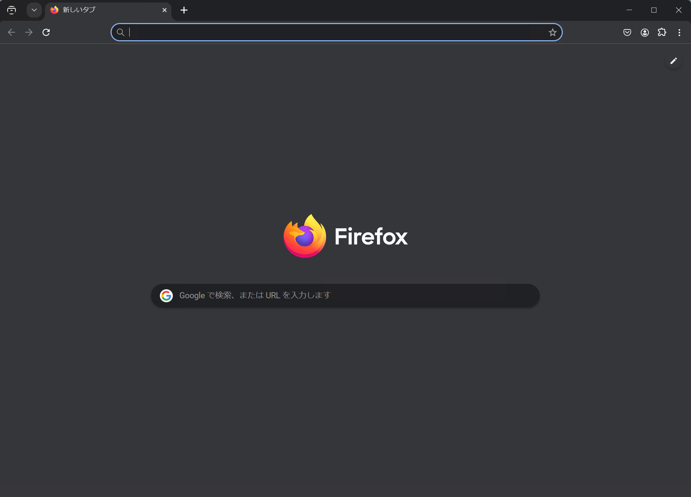
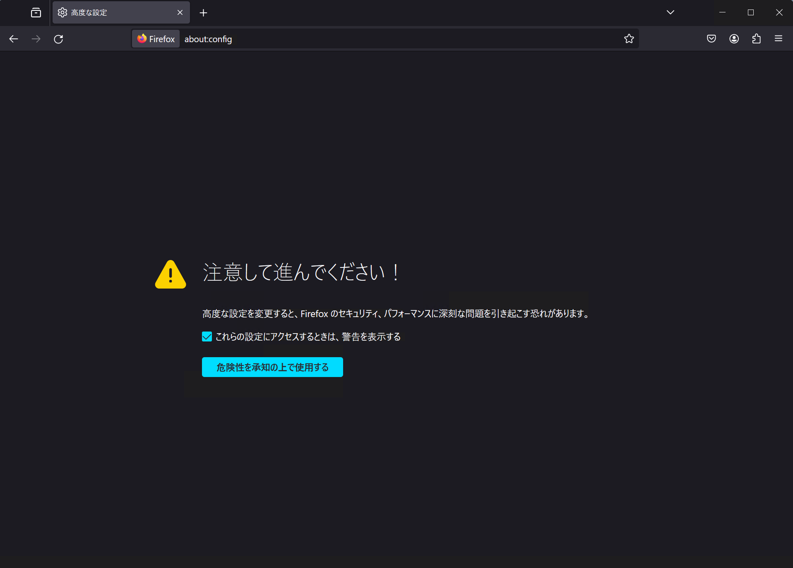
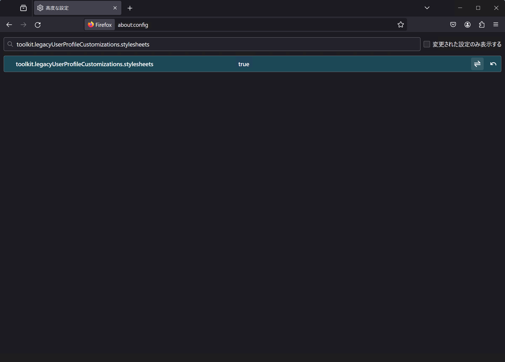
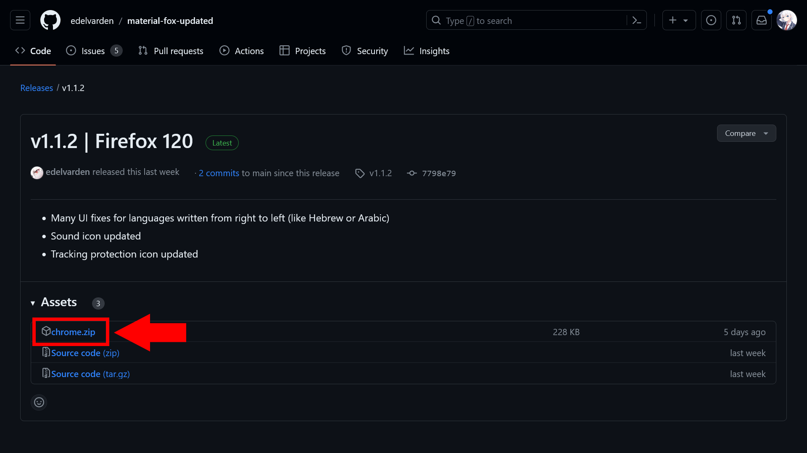
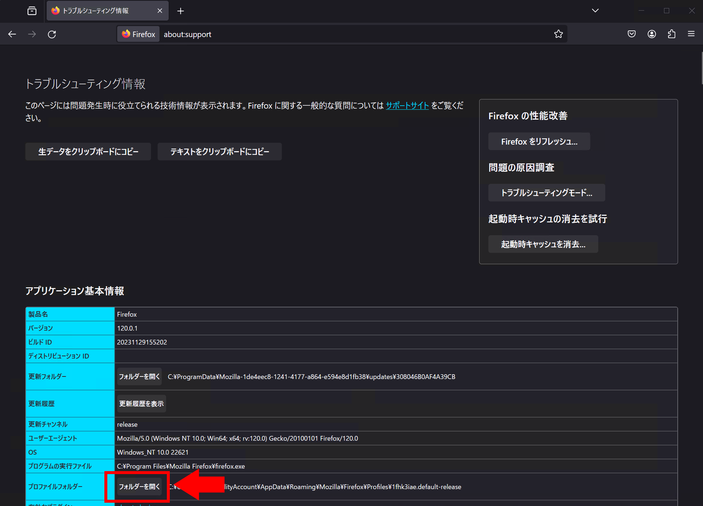
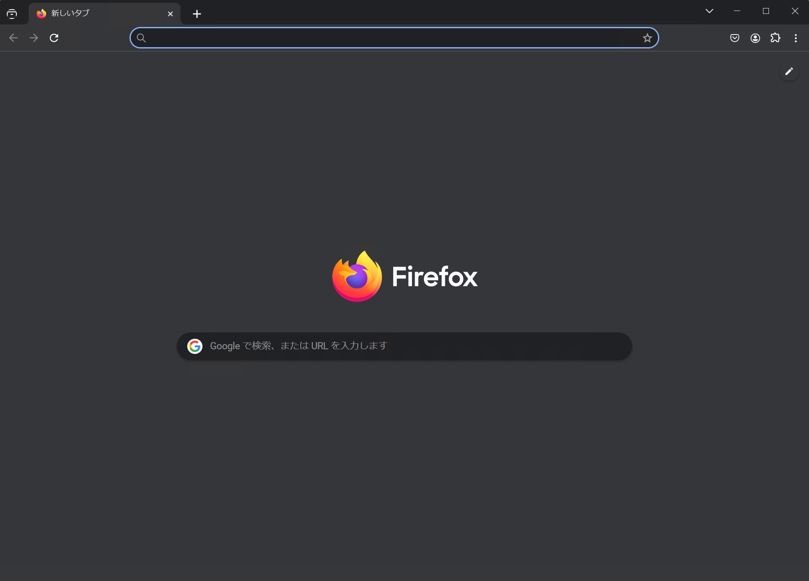
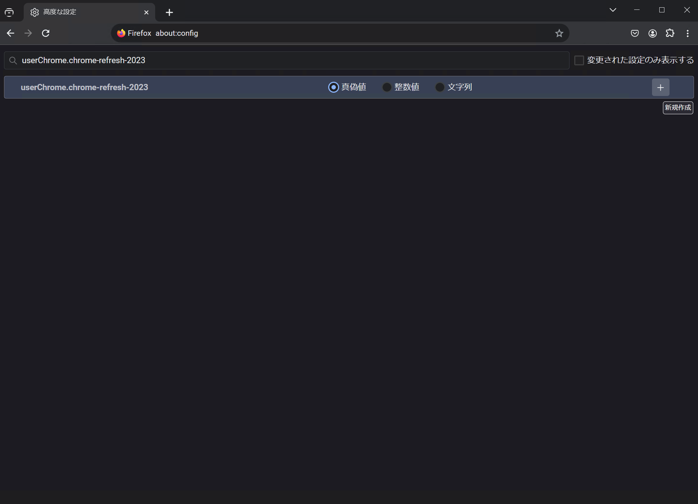
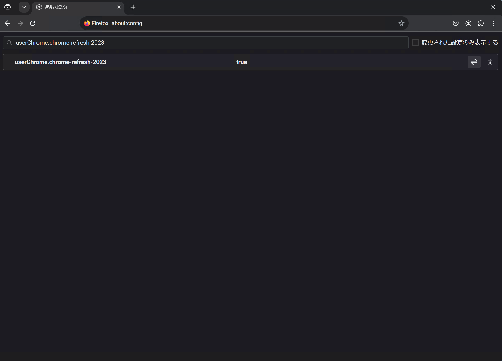

[MaterialFox UPDATED](https://github.com/edelvarden/material-fox-updated)は、ChromeなどのGoogle製品で採用されている[Material Design](https://m3.material.io/)からインスピレーションを得た、Firefox用のユーザーCSSです。

すでに更新が止まっているMaterialFoxをフォークしたもので、頻繁に更新されています。また、MaterialFox UPDATEDは「[Chrome Refresh 2023](/article/2023/11/10/revert-chrome-refresh-2023/)」と呼ばれる最近のChromeのデザイン変更にも対応しています。


*MaterialFox UPDATEDを適用したFirefoxのスクリーンショット*

## インストール方法

MaterialFox UPDATEDを使えるようにするには、Firefox側でいくつかの設定が必要です。

まずは、Firefoxのアドレスバーに`about:config`と入力して開きます。警告が表示されるので、内容を読んで理解したら［危険性を承知の上で使用する］を押して次に進みます。



ページ内の検索ボックスに次のそれぞれの項目を入力し、それらを`true`に設定します。

- `toolkit.legacyUserProfileCustomizations.stylesheets`
- `svg.context-properties.content.enabled`
- `layout.css.color-mix.enabled`



次に、MaterialFox UPDATEDの[配布ページ](https://github.com/edelvarden/material-fox-updated/releases/latest)を開き、［Assets］の`chrome.zip`をダウンロードします。



Firefoxに戻り、`about:support`を開きます。［プロファイルフォルダー］の［フォルダーを開く］ボタンをクリックするとフォルダーが開くので、そのフォルダーに`chrome`フォルダーを作成します。



`chrome.zip`を解凍し、その中のファイルやフォルダーを`chrome`フォルダーにコピーします。

バージョンによって変わる可能性がありますが、コピー後は概ね次のような構造になっているはずです。

```console title="ユーザープロファイルフォルダー"
📁[ユーザープロファイルフォルダー]
└── 📁chrome
     ├── 📁fonts
     │    └── [フォントファイルたち]
     ├── 📁icons
     │    └── [アイコンファイルたち]
     └── custom_example.css
     └── userChrome.css
     └── user-chrome.css
     └── userContent.css
     └── user-content.css
```

最後に、Firefoxを再起動します。これでMaterialFox UPDATEDが適用されます。

## その他の設定

MaterialFox UPDATEDには、いくつかの設定が用意されています。これらは、`about:config`で該当する項目を`true`または`false`にすることで設定できます。

ここでは一部の設定のみ紹介しますが、すべての設定は[公式リポジトリー](https://github.com/edelvarden/material-fox-updated#available-preferences)で確認できます。

### Chrome Refresh 2023の有効化

Google Chromeは2023年にデザインを大幅に変更しました。このデザイン変更は「Chrome Refresh 2023」と呼ばれています。MaterialFox UPDATEDは、デフォルトでは変更前のデザインを採用しています。好みに応じて、Chrome Refresh 2023のデザインに変更できます。

次の画像はそれぞれ、Chrome Refresh 2023の適用前と適用後のMaterialFox UPDATEDのデザインです。


*MaterialFox UPDATEDのデフォルトのデザイン*


*Chrome Refresh 2023を適用したMaterialFox UPDATEDのデザイン*

Chrome Refresh 2023を有効化するには、`about:config`の検索ボックスに`userChrome.chrome-refresh-2023`と入力します。［真偽値］が選択されていることを確認したらプラスボタンをクリックします。



`userChrome.chrome-refresh-2023`が`true`に設定されていることを確認してください。Firefoxを再起動しなくても、すぐにChrome Refresh 2023のデザインに変更されます。



## まとめ

MaterialFox UPDATEDは、ChromeなどのGoogle製品で採用されているMaterial Designからインスピレーションを得た、Firefox用のユーザーCSSです。

頻繁に更新されているので、ぜひ使ってみてください。
