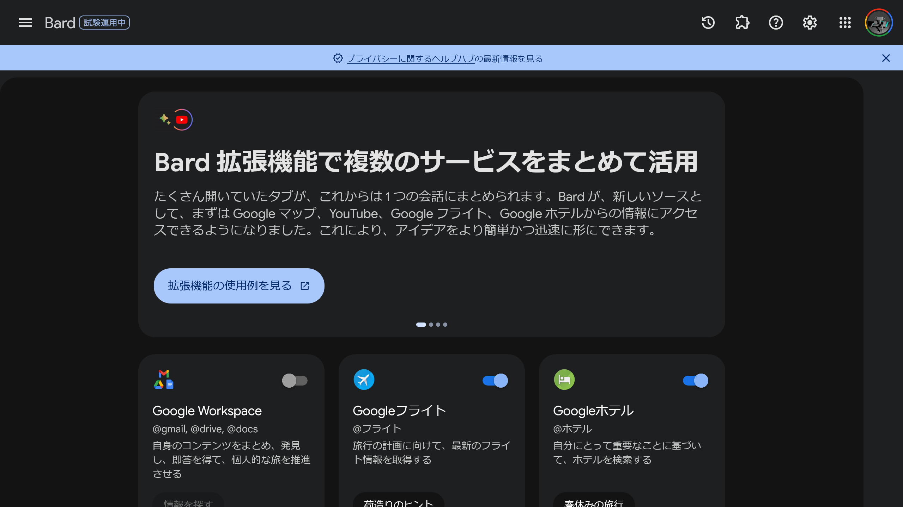
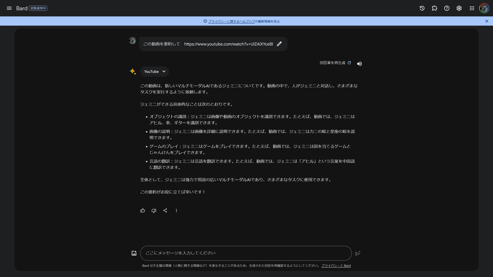
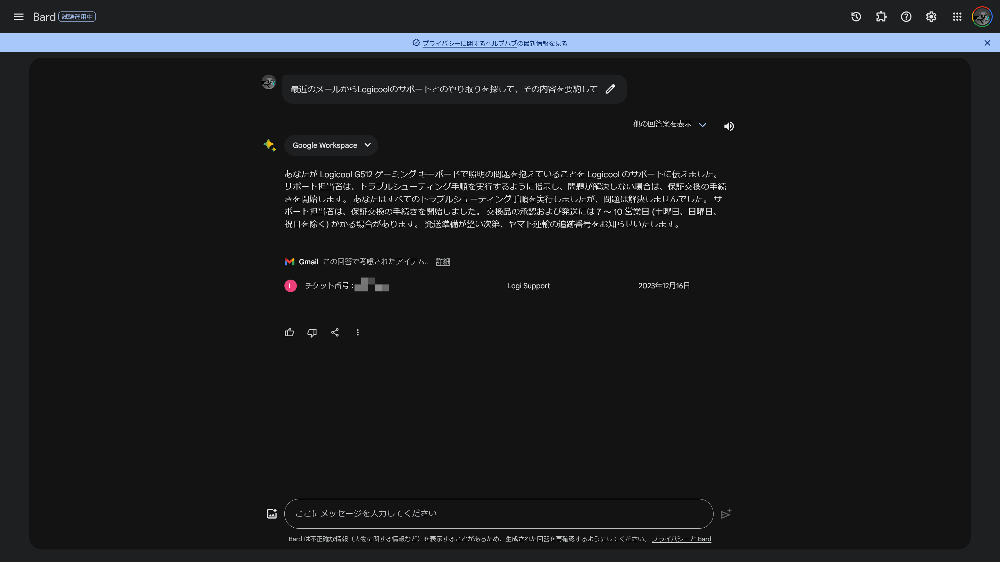
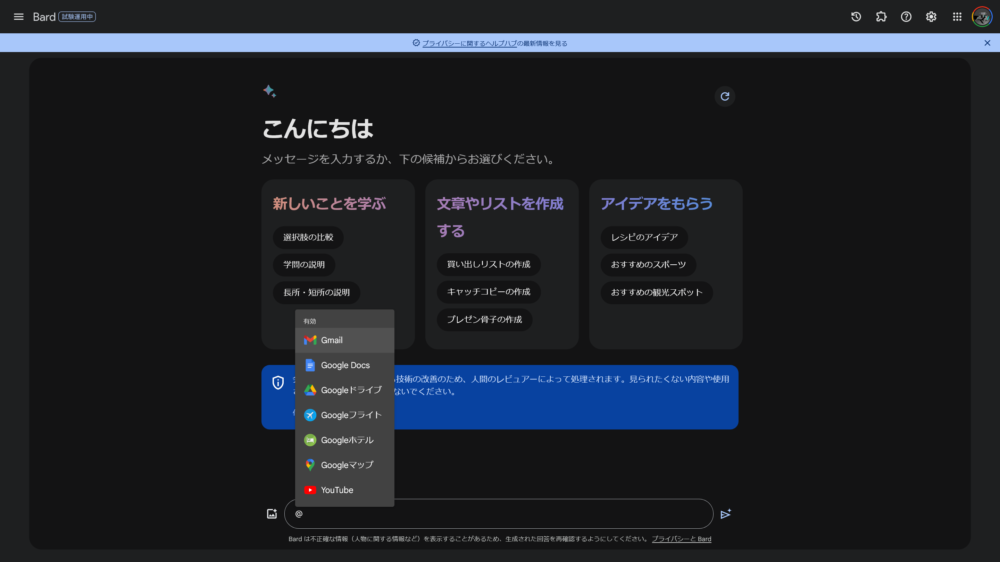

import { YouTube } from "@astro-community/astro-embed-youtube";
import ArticleCard from "@components/ArticleCard.astro";

## Bardの拡張機能とは

Google Bardの拡張機能は、Bardが他のGoogleアプリやサービスとやり取りできるようにするものです。拡張機能を使用すると、Bardはより有益な応答を生成できます。

たとえば、Bardを使用して、リアルタイムの航空券やホテルの予約情報を取得したり、YouTube動画を要約したりできます。

ほとんどの拡張機能はデフォルトでオンになっていますが、設定でオフにもできます。

Bardの拡張機能は英語ユーザーにのみ提供されていましたが、12月18日に、日本語と韓国語のユーザーにも提供されるようになりました。

*Bardの拡張機能の提供範囲が日本語と韓国語のユーザーにも拡大されたことを知らせる[最新情報ページ](https://bard.google.com/updates)のスクリーンショット*

:::note
拡張機能を使用するには、個人のGoogleアカウントでログインする必要があります。今のところ、職場や学校のアカウントでは利用できません。また、「[Bardアクティビティー](https://myactivity.google.com/product/bard/controls)」が有効になっている必要があります。
:::

## 拡張機能をオンにする方法

ほとんどの拡張機能はデフォルトでオンになっていますが、オフになっているものもあります。

どの拡張機能がオンになっているか確認し、設定を変更するには、[拡張機能の設定](https://bard.google.com/extensions)を開きます。

*Bardの[拡張機能の設定画面](https://bard.google.com/extensions)のスクリーンショット*

それぞれの拡張機能の名前と説明、トグルスイッチが表示されています。設定を切り替えるには、該当する拡張機能のトグルスイッチをクリックします。

## 拡張機能の一覧

記事執筆時点で、私のアカウントでは次の拡張機能が利用できました。

- Google Workspace
- Googleフライト
- Googleホテル
- Googleマップ
- YouTube

## 拡張機能の使い方

Bardの拡張機能は、必要なときに自動的に使用されます。

たとえば、YouTube動画を要約してみましょう。今回は、Googleが開発したマルチモーダルAI「[Gemini](https://deepmind.google/gemini)」の紹介動画を要約してみます。この動画は「ねつ造だった」という[記事](https://techcrunch.com/2023/12/07/googles-best-gemini-demo-was-faked/)もありますが、今回は要約の例として使用します。

<YouTube id="UIZAiXYceBI" />

Bardに「この動画を要約して」と、YouTubeのリンクを送信します。すると、動画の内容を要約してくれました。

> この動画は、新しいマルチモーダルAIであるジェミニについてです。動画の中で、人がジェミニと対話し、さまざまなタスクを実行するように依頼します。
>
> ジェミニができる具体的なことは次のとおりです。
>
> - オブジェクトの識別：ジェミニは画像や動画のオブジェクトを識別できます。たとえば、動画では、ジェミニはアヒル、車、ギターを識別できます。
> - 画像の説明：ジェミニは画像を詳細に説明できます。たとえば、動画では、ジェミニはカニの絵と星座の絵を説明できます。
> - ゲームのプレイ：ジェミニはゲームをプレイできます。たとえば、動画では、ジェミニは国を当てるゲームとじゃんけんをプレイできます。
> - 言語の翻訳：ジェミニは言語を翻訳できます。たとえば、動画では、ジェミニは「アヒル」という言葉を中国語に翻訳できます。
>
> 全体として、ジェミニは強力で用途の広いマルチモーダルAIであり、さまざまなタスクに使用できます。
>
> この要約がお役に立てば幸いです！

内容としては概ね合っていそうです。

次に、メールの検索と要約を試してみます。Bardに「最近のメールからLogicoolのサポートとのやり取りを探して、その内容を要約して」と入力してみました。

このメールのやり取りの詳細は、こちらの記事で紹介しています。

<ArticleCard link="/article/2023/12/19/warranty-replacement-for-logicool-keyboards/" />

少し待つと、メールの検索と要約の結果が返ってきました。

> あなたが Logicool G512 ゲーミング キーボードで照明の問題を抱えていることを Logicool のサポートに伝えました。 サポート担当者は、トラブルシューティング手順を実行するように指示し、問題が解決しない場合は、保証交換の手続きを開始します。 あなたはすべてのトラブルシューティング手順を実行しましたが、問題は解決しませんでした。 サポート担当者は、保証交換の手続きを開始しました。 交換品の承認および発送には 7 ～ 10 営業日 (土曜日、日曜日、祝日を除く) かかる場合があります。 発送準備が整い次第、ヤマト運輸の追跡番号をお知らせいたします。

メールの検索と要約のどちらも正しく実行できています。また、［この回答で考慮されたアイテム］として、メールのやり取りのリンクも表示されています。このリンクをクリックすると、該当するメールを表示できました。

## 拡張機能が使用できない場合

Bardで拡張機能を使用できない場合は、まずは次の項目を確認してください。

- 拡張機能が対応している言語を使用しているかどうか
- 拡張機能がオンになっているかどうか

これらを確認しても解決しない場合は、その質問の回答に拡張機能が必要だと認識されていない可能性があります。その場合は、明示的に拡張機能を使うように指示できます。

テキストの入力欄で`@`と入力すると、使用できる拡張機能の一覧が表示されます。その中から使いたい拡張機能をクリックし、続けて質問を入力します。こうすることで、その拡張機能を使うように明示的に指定できます。

## 注意点

BardやChatGPTのような大規模言語モデルは、「幻覚」と呼ばれる症状を起こすことが知られています。これは、モデルが事実と異なる回答を生成する現象です。

そのため、Bardを使用するときは、生成された回答が正しいかどうかを確認する必要があります。

また、機密情報や個人情報は、Bardに送信しないようにしてください。

## まとめ

Bardの拡張機能は、Bardが他のGoogleアプリやサービスとやり取りできるようにするものです。拡張機能を使用すると、Bardはより有益な応答を生成できます。

ChatGPTの拡張機能は有料ユーザーしか使えませんが、Bardの拡張機能は無料ユーザーでも使えます。ぜひ、Bardの拡張機能を使ってみてください。

## 参考

- [Bard で拡張機能を使用する - Bard ヘルプ](https://support.google.com/bard/answer/13695044)
- [Bardのニュースや最新情報 - Google Bard](https://bard.google.com/updates)
- [Bardの拡張機能の設定ページ](https://bard.google.com/extensions)
- [Gemini - Google DeepMind](https://deepmind.google/technologies/gemini/#introduction)
- [Google’s best Gemini demo was faked | TechCrunch](https://techcrunch.com/2023/12/07/googles-best-gemini-demo-was-faked/)
- [ハンズオン Gemini: マルチモーダル AI とやりとりする - YouTube](https://www.youtube.com/watch?v=UIZAiXYceBI)
