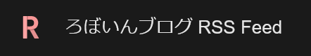

import ArticleCard from "@components/ArticleCard.astro";

この記事では、Feedlyのフィード選択画面に表示されるfaviconをカスタマイズする方法をまとめます。

Feedlyのサムネイルをカスタマイズする方法は、こちらの記事で解説しています。

<ArticleCard link="/article/2023/12/22/how-to-customize-feedly-thumbnail/" />

## Feedlyのデフォルトのfavicon

Feedlyのデフォルトのfaviconは、Googleの非公式APIから取得されているようです。次のURLにアクセスすると、任意のドメインのfaviconを取得できます。

```markdown frame="terminal"
http://www.google.com/s2/favicons?domain=<ドメイン名>
```

たとえば、`example.com`のfaviconを取得するには、次のURLにアクセスします。

```markdown frame="terminal"
http://www.google.com/s2/favicons?domain=example.com
```

## faviconをカスタマイズする方法

GoogleのAPIから取得したfaviconはfaviconは解像度が低く、またデータが古いことがあります。そのため、Feedlyのフィード選択画面で使用されるfaviconをカスタマイズしたい場合があります。

次の画像は、Feedlyでこのブログを検索した場合や、フィード選択画面を開いたときに表示されるfaviconです。



FeedlyのfaviconのカスタマイズではSVG画像を利用できるので、画面解像度に依存しない高品質のfaviconを提供できます。

Feedlyでfaviconをカスタマイズするには、次のような形式でRSSフィードを作成します。コード中の`［］`で囲まれた部分は、**`［］`を削除したうえで**実際の値に置き換えてください。

```xml title="rss.xml"
<rss xmlns:content="http://purl.org/rss/1.0/modules/content/"  xmlns:webfeeds="http://webfeeds.org/rss/1.0" version="2.0">
    <channel>
    <title>［フィードのタイトル］</title>
    <atom:link href="［フィードのRSSファイルのURL］" rel="self" type="application/rss+xml"/>
    <link>［トップページのURL］</link>
    <description>［フィードの概要］</description>
    <webfeeds:icon>［faviconのURL］</webfeeds:icon>
    </channel>
</rss>
```

このRSSフィードをFeedlyに登録すると、`webfeeds:icon`で指定したfaviconがフィード選択画面に表示されます。

:::danger
1行目の`xmlns:webfeeds="http://webfeeds.org/rss/1.0"`がない場合、Feedlyでは動作しますが、他のXMLパーサーではエラーになる可能性があります。

たとえば、Firefoxで開くと「XML パースエラー: 接頭辞の名前空間が定義されていません。」というエラーが、Chromeで開くと「Namespace prefix webfeeds on icon is not defined」というエラーが表示されます。必ず`xmlns:webfeeds`を指定してください。
:::

### Astroでの実装方法

このブログでは、静的サイトジェネレーターの[Astro](https://astro.build/)を使用しています。Astroの[@astrojs/rss](https://www.npmjs.com/package/@astrojs/rss)パッケージを使用したRSSフィードでfaviconをカスタマイズするには、次のようにします。

```javascript title="./src/pages/rss.xml.js"
import rss from "@astrojs/rss";

export const GET = async () => {
    const posts = await getCollection('article');
    return rss({
        title: "RSSフィードのタイトル",
        description: "RSSフィードの概要",
        site: import.meta.env.SITE,
        items: [
            // ...フィードのアイテム
        ],
        customData: "<webfeeds:icon>［faviconのURL］</webfeeds:icon>",
        xmlns: {
            webfeeds: "http://webfeeds.org/rss/1.0"
        }
    });
};
```

## まとめ

この記事では、Feedlyのフィード選択画面に表示されるfaviconをカスタマイズする方法をまとめました。

Feedlyのfaviconを適切にカスタマイズして、ユーザーにとって使いやすく美しいRSSフィードを提供しましょう。

## 参考

- [10 ways to optimize your feed for feedly – Feedly Blog](https://blog.feedly.com/10-ways-to-optimize-your-feed-for-feedly/)
- [@astrojs/rss - npm](https://www.npmjs.com/package/@astrojs/rss)
