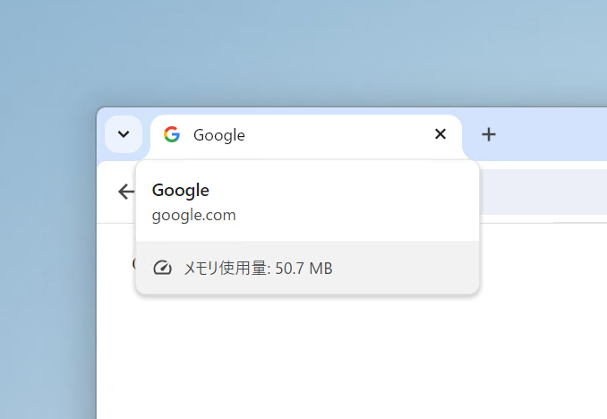
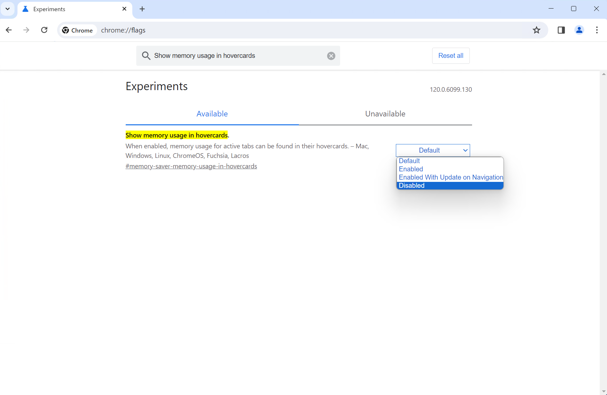
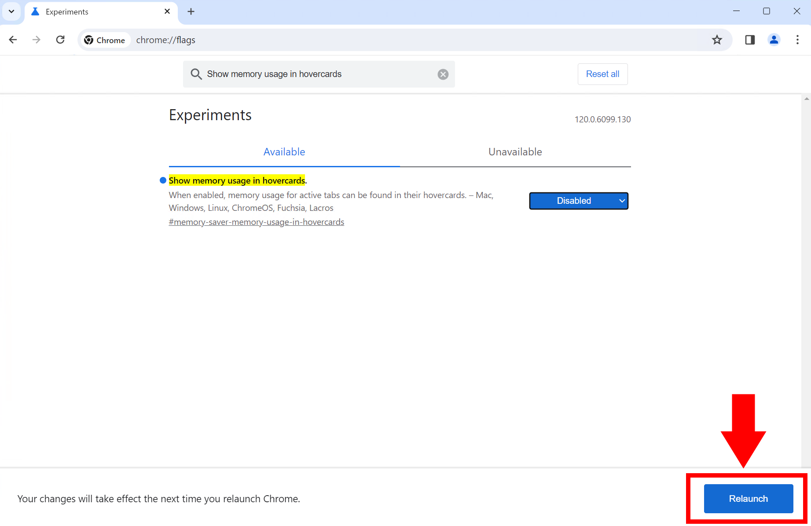
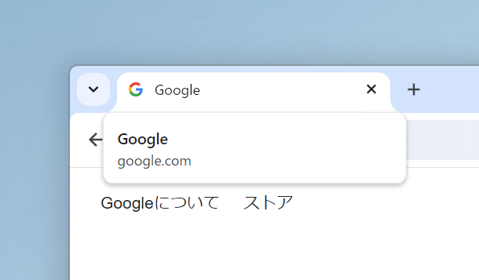

最近、Google Chromeのタブにマウスをホバーすると、タブのメモリ使用量が表示されるようになりました。この機能は、タブのメモリー使用量を監視するのに役立ちます。

しかし、常に表示されていると気が散ったり、不要だったりするかもしれません。Chromeのメモリー使用量表示を無効にする方法を紹介します。

## メモリー使用量を非表示にする方法

Chromeのタブのメモリー使用量を非表示にするには、次の手順を実行します。

:::danger[注意]
この記事で紹介する方法は、Chromeの内部フラグを変更するものです。予期しない動作やバグに遭遇する可能性があり、この方法が将来的に使えなくなる可能性もあります。実際に試す際は自己責任でお願いします。
:::

まず、Chromeを開いてアドレスバーに「chrome://flags」と入力します。

（アドレスバーではなく）ページ内に表示される検索ボックスに`Show memory usage in hovercards`と入力します。

該当する項目の［Default］を［Disabled］に変更します。

画面の右下に青い［Relaunch］というボタンが表示されるので、これをクリックしてChromeを再起動します。

これで、タブにマウスホバーしてもメモリー使用量が表示されなくなりました。

:::tip
メモリー使用量の表示が含まれるタブカードを一時的に非表示にするだけの場合は、マウスをタブのアドレスバーの上に置きます。そうするとカードが非表示になります。
:::

## 設定を元に戻す方法

Chromeのメモリー使用量表示を無効にしたものの、やっぱり表示したいという場合は、設定を元に戻せます。

「chrome://flags」にアクセスして、`Show memory usage in hovercards`を［Default］に戻します。無効にしたときと同様に、Chromeを再起動すると設定が適用されます。

もしも、これでもメモリー使用量が表示されない場合は、`Show memory usage in hovercards`を［Default］ではなく［Enabled］に変更してみてください。

## まとめ

Chromeのタブのメモリー使用量を非表示にする方法を紹介しました。この機能は、タブのメモリー使用量を監視するのに役立ちますが、常に表示されていると気が散ったり、不要だったりするかもしれません。

この記事で紹介した方法を使って、メモリー使用量の表示を無効にしてみてください。
