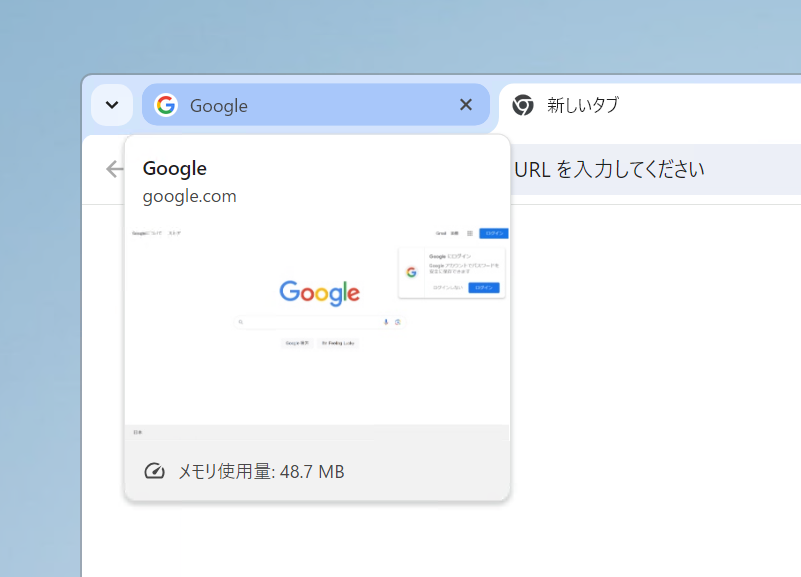
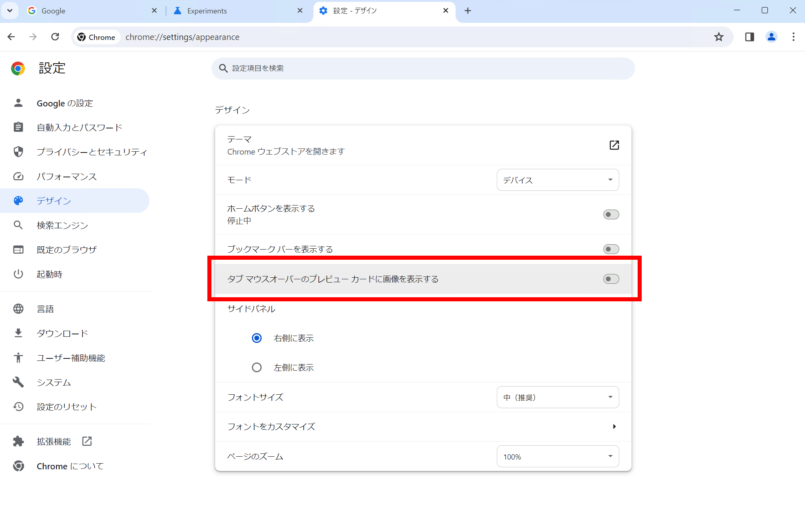
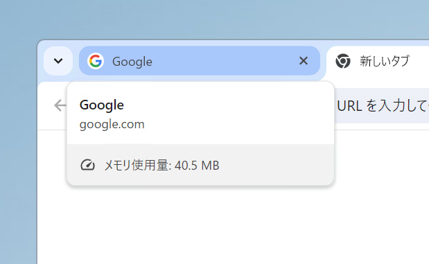
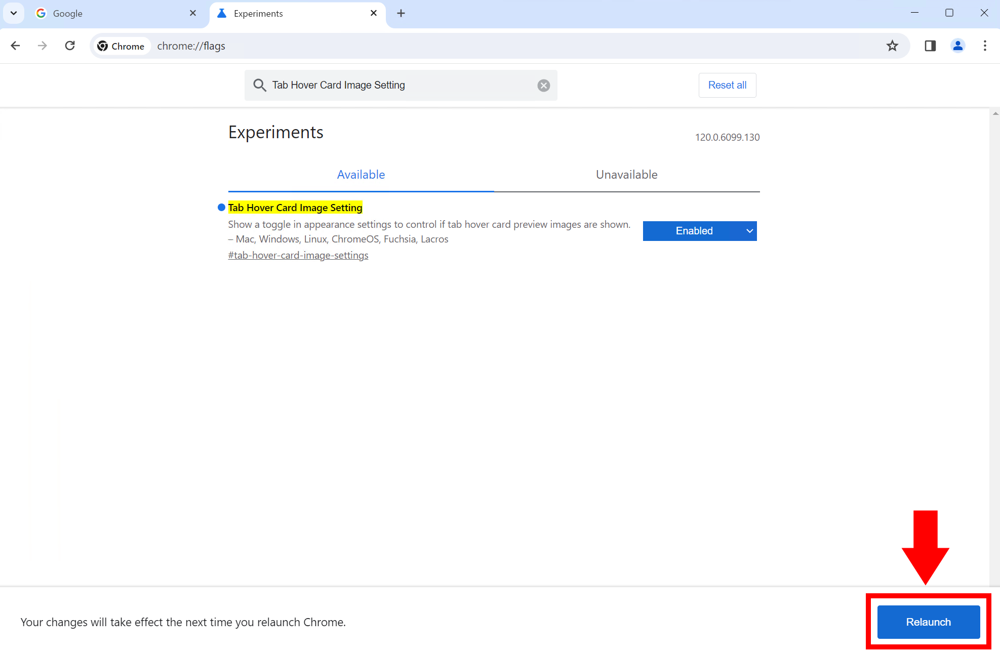

import ArticleCard from "@components/ArticleCard.astro";

Chromeでは、タブの上にマウスを置くと、そのタブのプレビューが表示されます。これは、大量のタブを開いているときに便利ですが、一方でタブの上にマウスを置くたびにプレビューが表示されるのは、邪魔に感じることもあります。

この記事では、Chromeのタブにマウスホバーしたときに表示されるカードの画像を非表示にする方法を紹介します。

タブカードに表示されるメモリー使用量だけを非表示にする方法は、こちらの記事で解説しています。

<ArticleCard link="/article/2023/12/23/how-to-hide-memory-usage-displayed-on-tab-hover-in-chrome/" />

また、Firefoxに搭載されている類似の機能については、こちらの記事で解説しています。

<ArticleCard link="/article/2024/02/08/firefox-now-supports-tab-preview/" />

## タブカードの画像を非表示にする方法

タブのプレビュー画像を非表示にするには、Chromeの設定を開き、［デザイン］タブを表示します。［タブマウスオーバーのプレビューカードに画像を表示する］のトグルスイッチをオフにします。

これで、タブにマウスホバーしてもカードに画像が表示されなくなりました。

:::tip
プレビュー画像が表示されるタブカードを一時的に非表示にするだけの場合は、マウスをタブのアドレスバーの上に置きます。そうするとカードが非表示になります。
:::

## 設定が表示されない場合

上の手順で設定が表示されない場合は、次の手順を試してみてください。

:::danger[注意]
この手順は、Chromeの内部フラグを変更するものです。予期しない動作やバグに遭遇する可能性があり、この方法が将来的に使えなくなる可能性もあります。実際に試す際は自己責任でお願いします。
:::

まず、Chromeを開いてアドレスバーに「chrome://flags」と入力します。

（アドレスバーではなく）ページ内に表示される検索ボックスに`Tab Hover Card Image Setting`と入力します。

該当する項目の［Default］を［Enabled］に変更します。

画面の右下に青い［Relaunch］というボタンが表示されるので、これをクリックしてChromeを再起動します。

Chromeの再起動後に設定を開き、［デザイン］タブを表示します。［タブマウスオーバーのプレビューカードに画像を表示する］のトグルスイッチが表示されていることを確認します。

## 設定を元に戻す方法

Chromeのタブのプレビュー画像を無効にしたものの、やっぱり表示したいという場合は、設定を元に戻せます。

Chromeの設定を開き、［デザイン］タブを表示します。［タブマウスオーバーのプレビューカードに画像を表示する］のトグルスイッチをオンにします。

## まとめ

Chromeのタブのプレビュー画像を非表示にする方法を紹介しました。この機能は、大量のタブから目的のタブを探すのに役立ちますが、常に表示されていると気が散ったり、不要だったりするかもしれません。

この記事で紹介した方法を使って、タブのプレビュー画像を無効にしてみてください。
