import ArticleCard from "@components/ArticleCard.astro";

ネットの記事を読んでいるとき、広告や煩雑なレイアウト、読みにくいテキストに悩まされたことはありませんか？実は、Chromeには気を散らすものを非表示にして記事を読みやすくする「リーディングモード」が存在します。リーディングモードは、Webページをすっきりとした外観に変えてくれます。この記事では、リーディングモードの使い方について詳しく説明します。

## リーディングモードとは

リーディングモードとは、Webページをすっきりとした外観に変えてくれる機能です。リーディングモードを使うと次のようなメリットがあります。

- 広告やサイドバーなどの気を散らす要素を非表示にできる
- テキストのフォントサイズや行間を調整できる
- テキストの背景色や文字色を変更できる

リーディングモードは、Chromeの標準機能として提供されています。最新バージョンのChromeなら、リーディングモードを使えます。また、標準のリーディングモードが気に入らない場合は、サードパーティーの拡張機能を利用できます。

## Chrome標準搭載のリーディングモードを使う

Chromeには、リーディングモードが標準搭載されています。リーディングモードを使うには、次の手順を実行します。

まずは、リーディングモードを使いたいWebページを開きます。ここでは例として、本サイトのこの記事を開きます。

<ArticleCard link="/article/2023/12/24/how-to-hide-tab-hover-card-in-chrome/" />

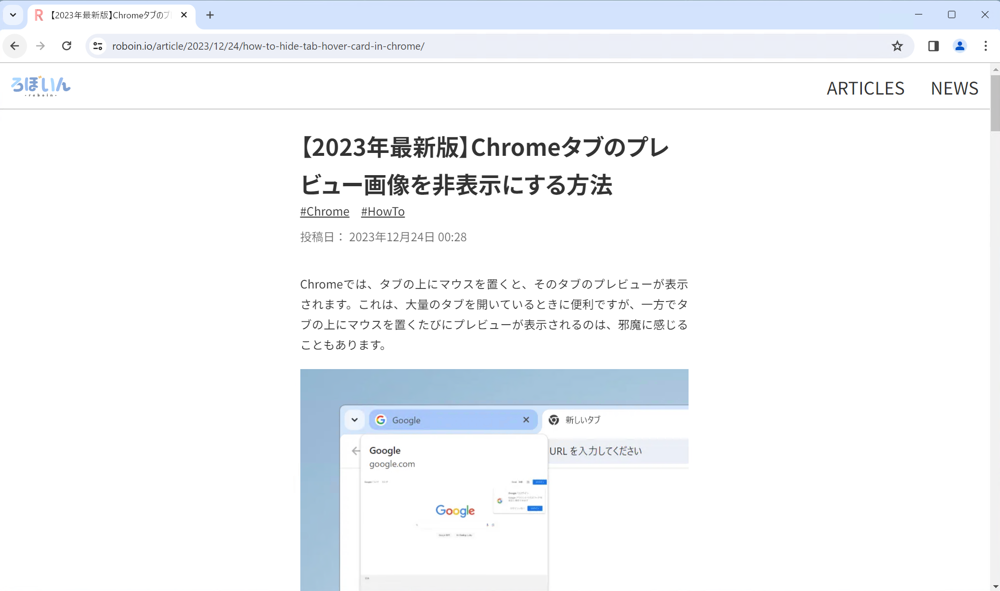

次に、記事の何もないところを右クリックして、コンテキストメニューを表示します。コンテキストメニューの中から［リーディングモードで開く］を選択します。

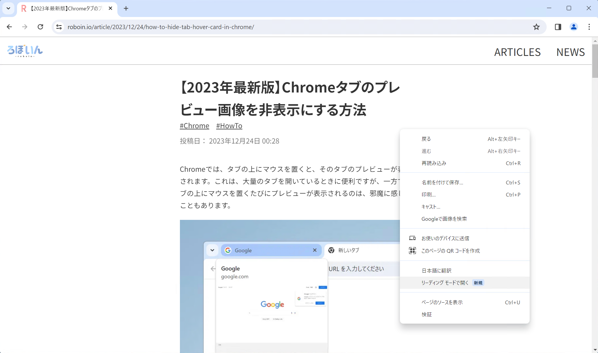

ウィンドウの右側にサイドパネルが開き、リーディングモードが表示されます。リーディングモードでは、記事のコンテンツに集中できるように、広告やサイドバー、画像などの気を散らす要素が非表示になります。

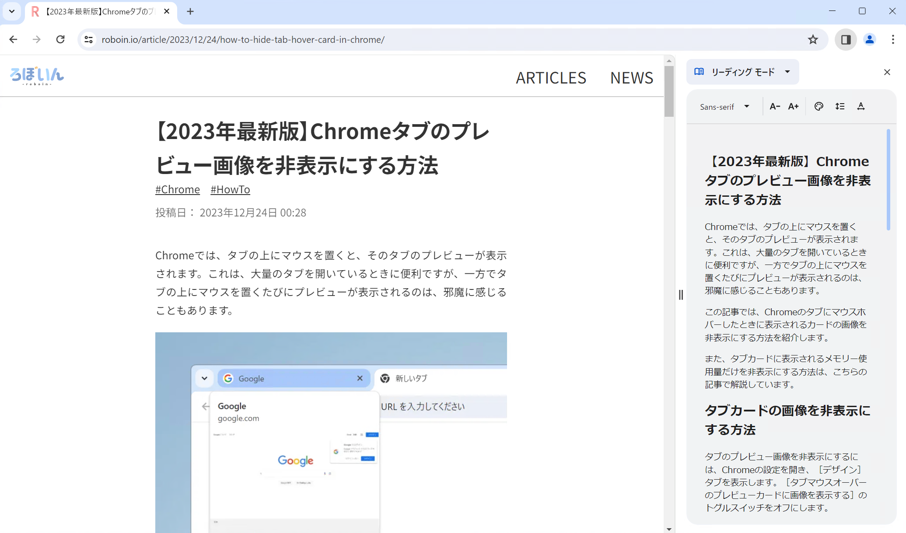

リーディングモードでは、必要に応じてサイドパネルの左端をドラッグすると、幅を変更できます。

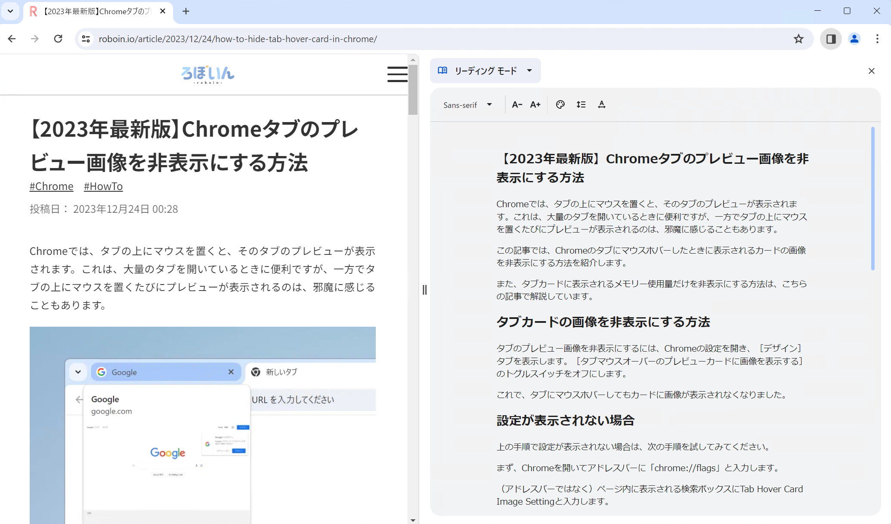

### 外観をカスタマイズする

また、リーディングモードのパネルの左上には、いくつかのボタンが表示されています。これらのボタンを使うと、外観をカスタマイズできます。

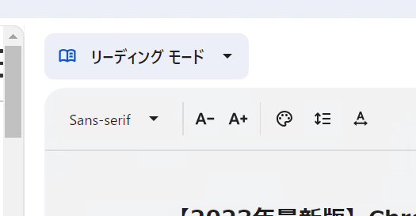

［Sans-serif］と書かれたドロップダウンリストをクリックすると、フォントを変更できます。また、［A-］［A+］と書かれたアイコンをクリックすると、フォントサイズを変更できます。

パレットのアイコンをクリックすると、配色を変更できます。配色は、「既定」「明」「暗」の他に、「黄」「青」が用意されています。［既定］を選択すると、システムのテーマ設定に合わせて、「明」「暗」のどちらかが選択されます。

行間は、パレットアイコンの右隣のボタンで調整できます。「標準」「広くする」「かなり広くする」の3種類が用意されており、その中から1つを選択できます。

一番右端のボタンは、文字間隔を調整するボタンです。文字間隔は、行間と同様に「標準」「広くする」「かなり広くする」の3種類が用意されています。

### リーディングモードを終了する

リーディングモードを終了するには、サイドパネルの右上にあるバツ印をクリックします。これによってサイドパネルが閉じられ、リーディングモードが終了します。

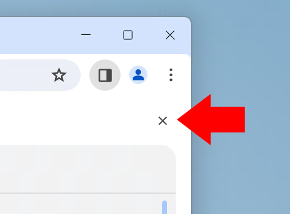

## 拡張機能を使う

Chromeに標準搭載されているリーディングモードは、シンプルで便利です。何よりも、Chromeに組み込まれているのが大きな強みです。一方で、Chromeのリーディングモードはサイドパネルに表示されるため、通常表示の記事と、リーディングモードの記事の2つが同時に表示されてしまい、見づらくなります。

また、外観のカスタマイズの自由度が限られていたり、画像が表示されなかったりと、不便な点もあります。

Chromeの標準搭載のリーディングモードで満足できない場合は、サードパーティーの拡張機能を利用できます。拡張機能を使うと、リーディングモードの外観を自由にカスタマイズできます。

しかも、サイドパネルではなく現在のタブで表示できるので、通常表示の記事とリーディングモードの記事を同時に表示することがありません。

リーディングモードの拡張機能は数多く公開されていますが、その中でインストール数が多くオススメなのが「[Reader Mode](https://chromewebstore.google.com/detail/reader-mode/llimhhconnjiflfimocjggfjdlmlhblm)」という拡張機能です。

### インストール方法

Reader Modeをインストールするにはまず、Chromeウェブストアの[配布ページ](https://chromewebstore.google.com/detail/reader-mode/llimhhconnjiflfimocjggfjdlmlhblm)にアクセスします。

［Chromeに追加］という青いボタンをクリックします。

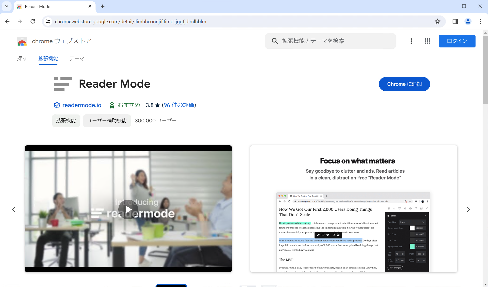

［「Reader Mode」を追加しますか？］というダイアログが表示されるので、問題がなければ［拡張機能を追加］をクリックします。

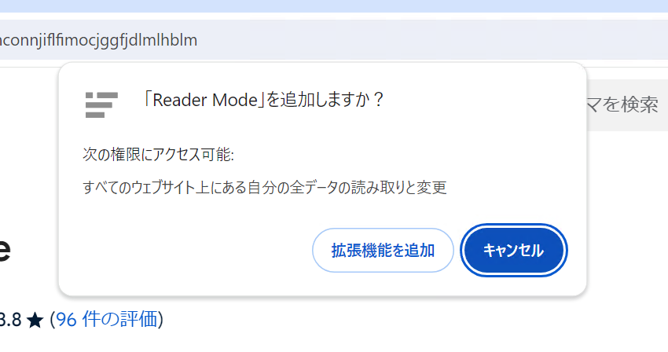

次の画像のようなダイアログが表示されれば、Reader Modeのインストールは完了です。場合によっては、［同期を有効にする］という部分は表示されないかもしれませんが、問題ありません。

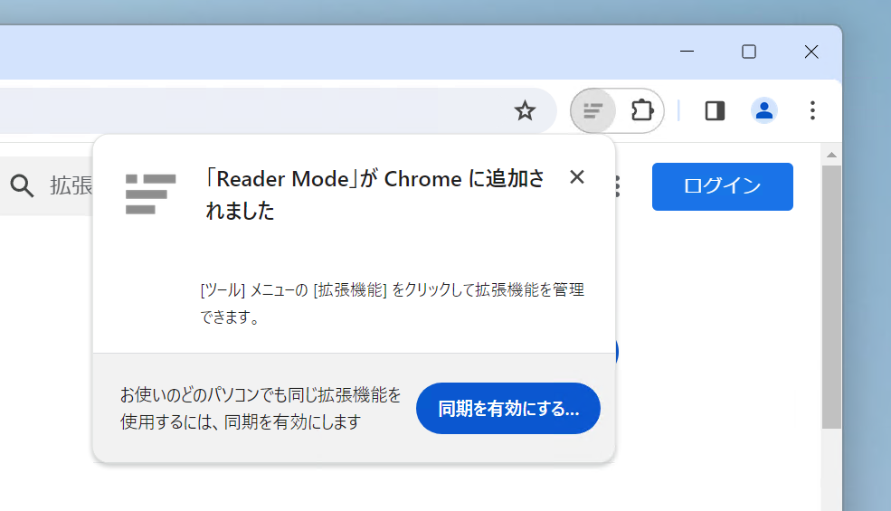

### Reader Modeの使い方

Reader Modeをインストールできたら、実際に使ってみましょう。まずは、リーディングモードを使いたいWebページを開きます。ここでは例として、先ほどのChrome標準搭載のリーディングモードの説明で使ったのと同じ記事を開きます。

記事を開いたら、ツールバーの中のパズルのようなアイコンをクリックします。表示されたメニューの中から、［Reader Mode］をクリックします。

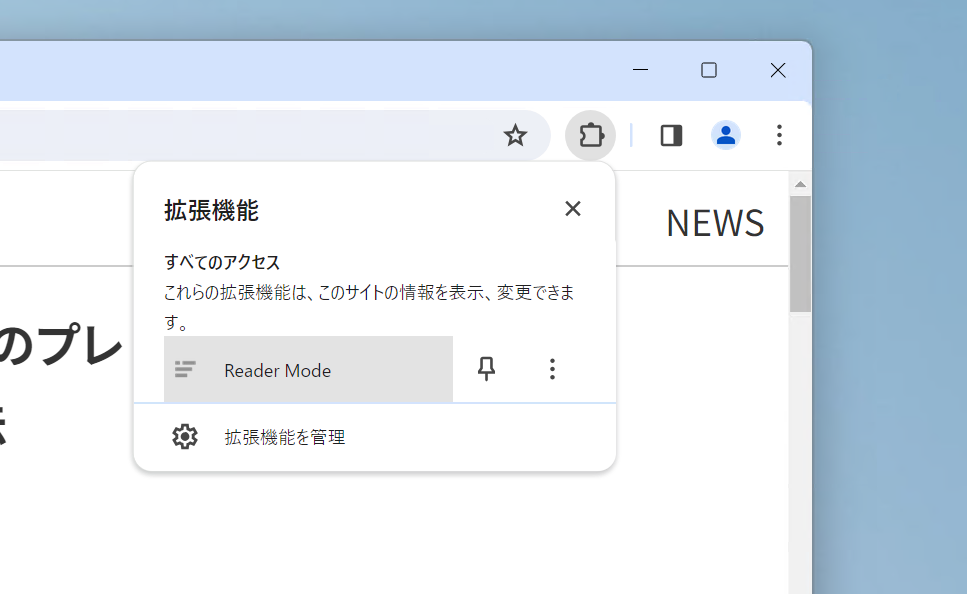

Reader Modeの最初の起動時には、拡張機能の改善のためにWebブラウジングのデータの収集の許可を求める画面が表示されます。許可する場合は［Agree & Continue］を、拒否する場合は［Decline］をクリックします。このボタンはどちらを選択しても、問題なくReader Modeを使用できます。心配なら、［Decline］をクリックして、データの収集を拒否しておきましょう。

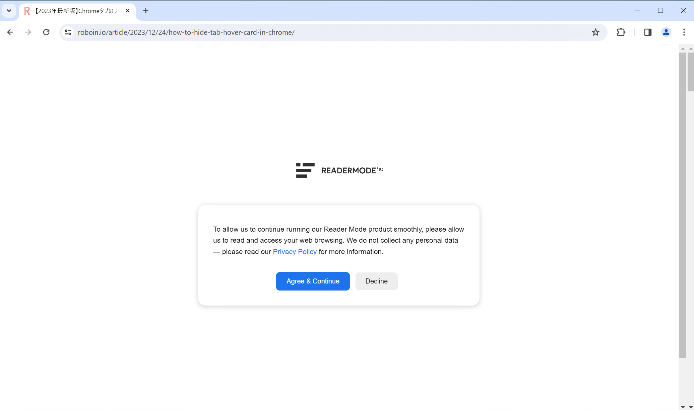

画面の右下に有料プランの宣伝が表示されますが、基本的な機能は無料で使えます。このバナーは、［Not interested］をクリックすると非表示にできます。

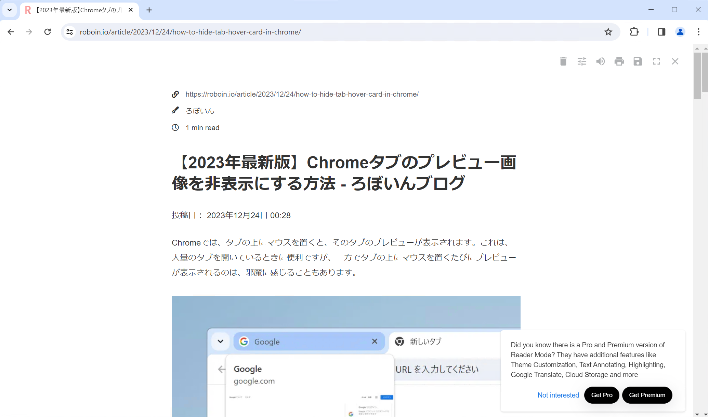

画面の右上の設定アイコンをクリックすると、外観の設定を開けます。この設定では、フォントスタイルやフォントサイズ、行間、文字間隔、配色などを変更できます。

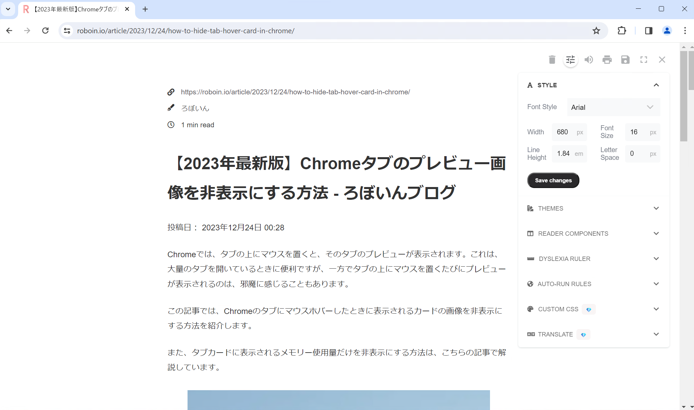

また、設定アイコンの隣に並んでいるアイコン群を使うと、記事の読み上げや保存、全画面表示などの機能を使えます。

### Reader Modeを終了する

Reader Modeを終了するには、画面の右上にあるバツ印をクリックします。これによって、Reader Modeが終了し、通常表示の記事に戻ります。

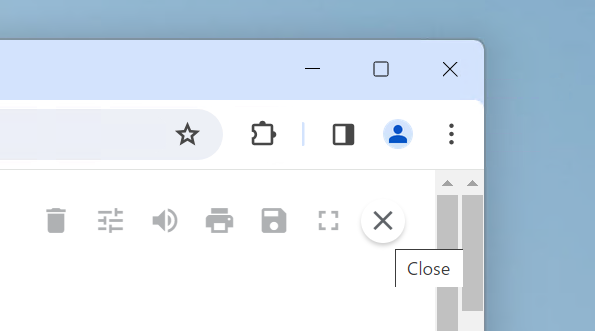

### Reader Modeを開きやすくする

Reader Modeを開くには、ツールバーの中のアイコンをクリックして、メニューを開いて［Reader Mode］をクリックする必要があります。この手順は、少し面倒です。Reader Modeのアイコンをツールバーに追加して、Reader Modeを開きやすくしましょう。

まずは、ツールバーの中のパズルのようなアイコンをクリックします。表示されたメニューの［Reader Mode］のピンマークをクリックします。

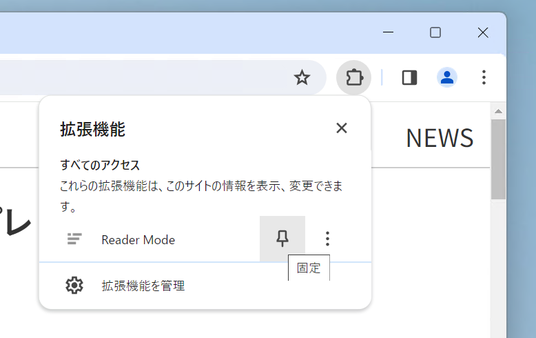

これで、Reader Modeのアイコンがツールバーにピン止めされ、瞬時にアクセスできるようになりました。

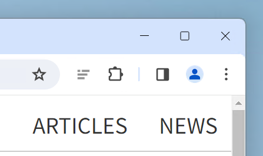

## まとめ

Chromeのリーディングモードを使って、記事のコンテンツに集中しましょう。（Firefoxのリーダービューほどではないものの）便利で使いやすいので、ぜひ使ってみてください。
