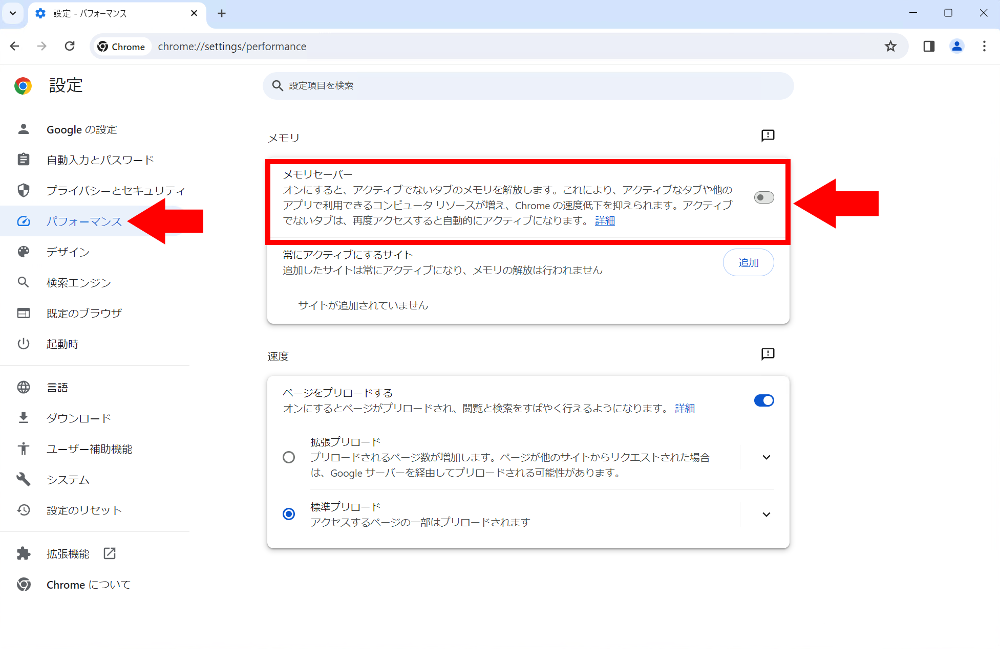
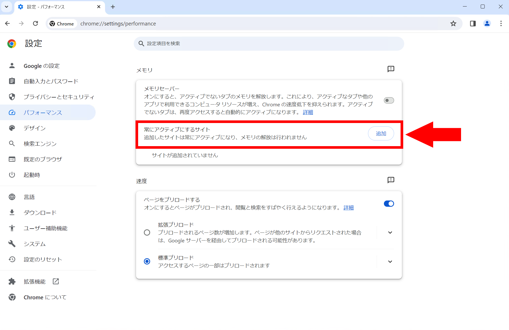
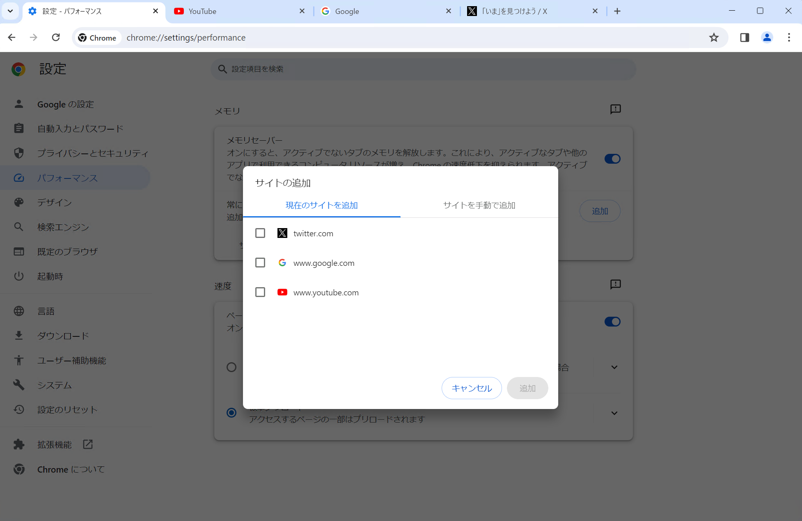
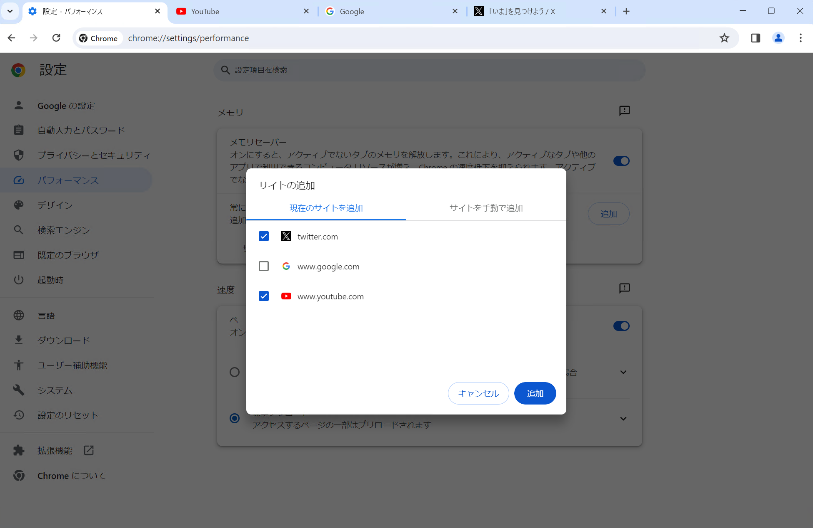

Webアプリケーションの複雑化に伴い、Webの閲覧で要求されるリソースは年々増加しています。とくに、Chromeは多くのメモリーを消費することが知られています。

Chromeのメモリーセーバーを使うと、消費するメモリーの量を削減できます。潤沢なメモリーを搭載したパソコンでは効果が少ないですが、メモリー容量が限られたパソコンではChromeだけでなくシステム全体のパフォーマンス向上が期待できます。

この記事では、メモリーセーバーの仕組みと使い方を詳しく解説し、潜在的な影響についても紹介します。

## メモリーセーバーとは

Chromeのメモリーセーバーは、メモリー消費量を削減して、現在使っているタブの動作をスムーズにする機能です。メモリーセーバーを有効にすると、Chromeは使っていないタブを自動的に無効にし、その分のメモリーを解放します。

メモリーセーバーによって無効化されたタブを再度開くと、自動的に再読み込みされます。このため、メモリーセーバーを有効にすると、非アクティブなタブを開いたときに少し待たされることがあります。

## メリットとデメリット

メモリーセーバーを有効にすると、メモリー消費量が削減されるため、システム全体のパフォーマンスが向上します。とくに、メモリー容量が限られたパソコンでは、メモリーセーバーを有効にすることで、Chromeの動作がスムーズになることが期待できます。

一方で、メモリーセーバーを有効にすると、非アクティブなタブを開いたときに少し待たされることがあります。また、この動作によって一部のサイトでは問題が発生する可能性があります。

## メモリーセーバーの制限

一部のタブは、メモリーセーバーによって無効化されません。[Chromeのヘルプページ](https://support.google.com/chrome/answer/12929150)によると、次のようなタブは無効化できない場合があるとのことです。

- アクティブな音声や動画（再生または通話）
- 画面共有
- ページ通知
- アクティブなダウンロード
- 一部記入済みのフォーム
- 固定タブ
- 接続済みのデバイス（USBまたはBluetooth）

## 有効化・無効化する方法

Chromeのメモリーセーバーのオン/オフを切り替えるにはまず、右上の3点ドット（`⋮`）をクリックして、メニューを開きます。表示されたメニューの中から、［設定］を選択します。

設定画面の［パフォーマンス］タブを開き、［メモリセーバー］のトグルスイッチをクリックします。オン/オフを切り替えると、［メモリセーバー］のトグルスイッチの色が変わります。

### 一部のサイトでのみ無効にする方法

基本的にはメモリーセーバーを使いたいものの、一部のサイトでのみメモリーセーバーを無効にしたい場合は、次の手順で設定を変更します。

まずは、メモリーセーバーを無効にしたいサイトを開きます。次に、Chromeのメモリーセーバーの設定画面を開き、［常にアクティブにするサイト］の［追加］ボタンをクリックします。

現在開いているタブの一覧のダイアログが表示されるので、メモリーセーバーを無効にしたいサイトのチェックボックスをオンにします。

メモリーセーバーを無効にしたいサイトを選択したら、［追加］ボタンをクリックします。これで、メモリーセーバーを無効にしたいサイトが追加されます。

:::tip[パワーユーザー向け]
メモリーセーバーを無効にするサイトを選択するダイアログで［現在のサイトを追加］タブではなく［サイトを手動で追加］タブを選択すると、URLを手動で入力できます。

この機能を使うと、サブドメインを含むかどうかを指定したり、ワイルドカードを使ったりできます。詳細は[Chromeのヘルプページ](https://support.google.com/chrome/answer/12929150#zippy=%2C%E7%89%B9%E5%AE%9A%E3%81%AE%E3%82%B5%E3%82%A4%E3%83%88%E3%82%92%E5%B8%B8%E3%81%AB%E3%82%A2%E3%82%AF%E3%83%86%E3%82%A3%E3%83%96%E3%81%AB%E3%81%99%E3%82%8B)を参照してください。
:::

## まとめ

Chromeのメモリーセーバーモードは、その有効化/無効化によって得られる効果が大きく異なる強力な機能です。Chromeブラウザーのパフォーマンスを自在に調整し、快適なWeb体験を手に入れるための第一歩として、ぜひご活用ください。

## 参考

- [Chrome のパフォーマンスをカスタマイズする - Google Chrome ヘルプ](https://support.google.com/chrome/answer/12929150)
