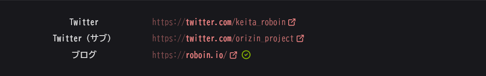
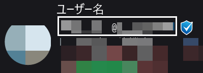
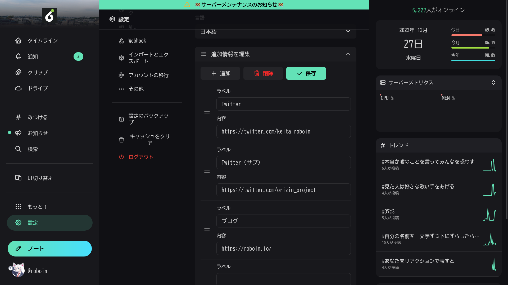
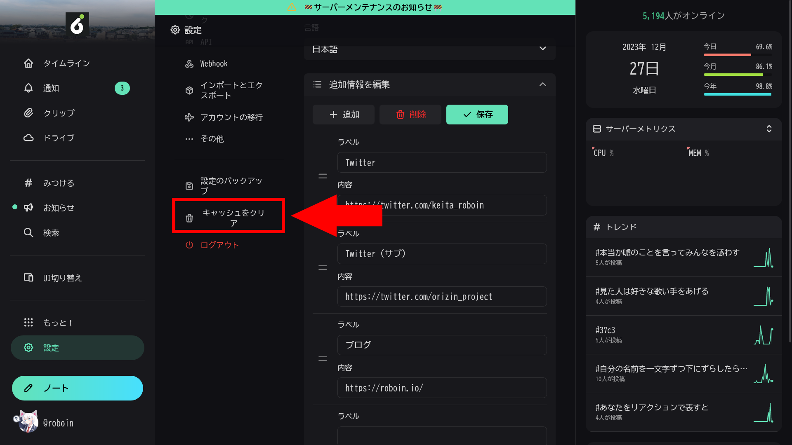
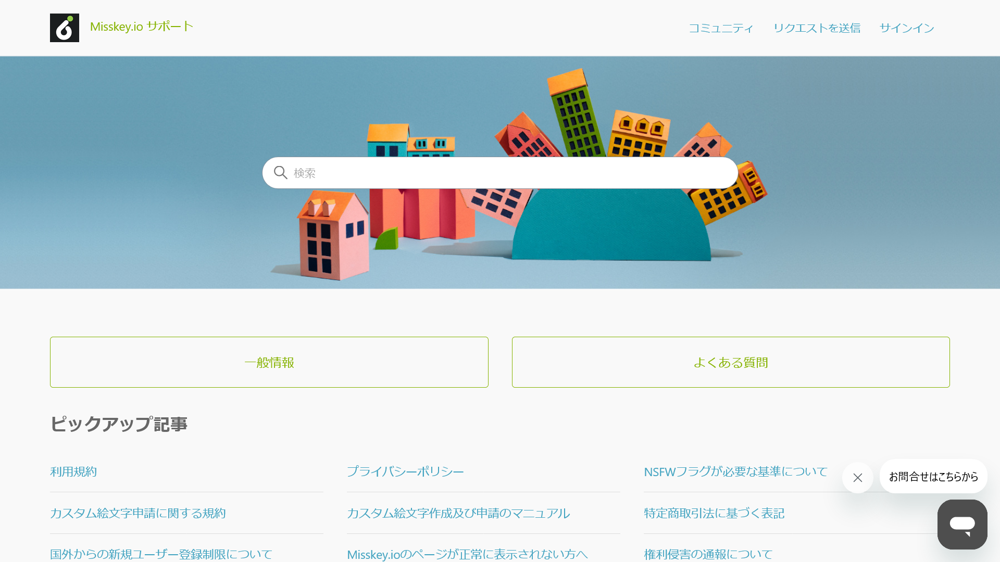
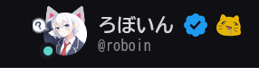
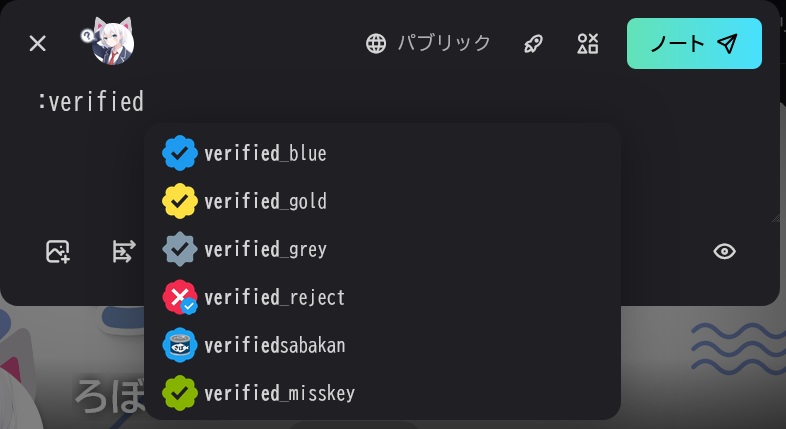
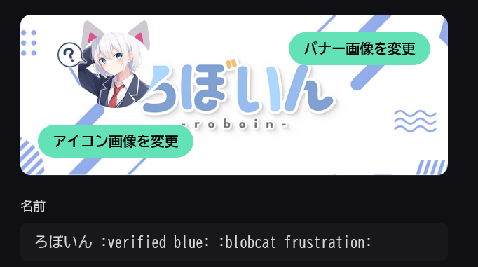

Misskeyには、Twitter（X）の本人確認や公式バッジと同等の役割をもつものが2つあります。この記事では、それらの違いと申請方法を紹介します。

## Misskeyの2つの本人確認制度

Misskeyには、公式バッジと同等のものが2種類あります。1つはMisskey全体で使える本人確認制度で、もう1つはサーバー（インスタンス）が独自に用意している公式バッジ制度です。それぞれの違いと特徴は次のとおりです。

### Misskey全体で使える本人確認

Misskey全体で使える本人確認では、自分で所有しているWebサイトを使って、本人ということを証明します。この本人確認をすると、プロフィールのURL欄に緑のチェックマークが表示されます。

画像は[私のMisskeyアカウント](https://misskey.io/@roboin)のプロフィールです。ブログのURLの隣に緑のチェックマークが表示されています。



この本人確認に審査は存在せず、Webサイトを所有していれば誰でも利用できます。厳密には本人確認ではなく「そのWebサイトの所有者であること」を証明するものですが、自分の公式サイトを持っている場合は、これによって間接的に公式であることを証明できます。

:::note[補足]
これはMastodonの[リンク検証](https://docs.joinmastodon.org/ja/user/profile/#verification)機能と同等のものです。この方法を使うにはHTMLに関する簡単な知識が必要です。
:::

### インスタンス独自の公式バッジ

Misskeyには複数のインスタンスが存在しますが、一部のインスタンスでは独自の公式バッジ制度を用意しています。この制度を利用すると、ユーザー名の横に公式バッジが表示されます。

画像は[Misskey.io](https://misskey.io)のとあるアカウントのスクリーンショットです。ユーザー名の横に公式バッジが表示されています。



この制度は一部のインスタンスが独自に実施しているものなので、すべてのインスタンスで利用できるわけではありません。また、申請には条件を満たしている必要があります。

たとえば、Misskey.ioでは「なりすまされそうか」が公式マークの判断基準になっており、TwitterやYouTubeのフォロワーが1万人を超えていると[審査が通りやすい](https://misskey.io/notes/9dtf2wmuhu)そうです。

## Misskey全体で使える本人確認をする

この方法はHTMLに関する簡単な知識と自身が所有するWebサイトが必要ですが、それさえあれば誰でも利用できます。

Webサイトのソースコードを開き、`<head>`要素内に次のような`<link>`タグを追加します。

```html
<link rel="me" href="MisskeyのプロフィールのURL" />
```

たとえば、私のMisskeyアカウントのプロフィールのURLは`https://misskey.io/@roboin`なので、次のようになります。

```html
<link rel="me" href="https://misskey.io/@roboin" />
```

次に、Misskeyのプロフィールの設定画面を開き、［追加情報を編集］をクリックします。



［内容］欄に自分のWebサイトのURLを入力します。このURLは、先ほど`<link>`タグを追加したページのURLを入力します。［ラベル］欄には自由なテキストを入力できますが、「公式サイト」や「ブログ」などが分かりやすいでしょう。

［保存］ボタンをクリックすると、自動的に本人確認が完了します。設定画面を閉じて自分のアカウントのプロフィールを表示し、URL欄に緑のチェックマークが表示されていることを確認してください。


:::tip
緑のチェックマークが表示されない場合は、設定から［キャッシュをクリア］を実行したあと、再読み込みしてみてください。



それでも表示されない場合は、次のような原因が考えられます。

- `<link>`タグが正しく設定されていない
- ［追加情報を編集］で入力したURLが間違っている
- ［追加情報を編集］で入力したURLのページに`<link>`タグが設定されていない
- ［保存］ボタンをクリックしていない
:::

## インスタンス独自の公式バッジを申請する

インスタンス独自の公式バッジ制度は、インスタンスごとに申請方法が異なったり、そもそも制度が用意されていなかったりする場合があります。

この記事では、Misskey.ioで公式バッジを申請する方法を紹介します。他のインスタンスの場合は、そのインスタンスのヘルプページや問い合わせなどで確認してみてください。

:::caution
Misskey.io以外のインスタンスを使っている場合は、**Misskey.ioのサポートに問い合わせないで**ください。Misskeyには複数のインスタンス（サーバー）が存在し、それらは独立して別々の個人や組織によって運営されています。問い合わせは、自分のアカウントのインスタンスのサポートに送信してください。
:::

Misskey.ioで公式バッジを申請するには、[サポートページ](https://go.misskey.io/support)を開きます。［お問い合わせはこちらから］と書かれたチャットマークをクリックし、チャット画面を開きます。用件の選択画面で［公式バッジの付与］を選択します。



## おまけ

絵文字を利用することで、公式バッジ気分を味わえます。



ただし、これは名前に「**Twitterの公式バッジの見た目をした絵文字**」を付けているだけなので、実際の公式バッジではありません。また、インスタンスごとに利用できる絵文字は異なります。

Misskey.ioの場合は、ノートの投稿画面で`:verified`と入力すると、候補としてさまざまな公式バッジ風の絵文字が表示されます。



この中で気に入ったものがあれば絵文字の名前をコピーし、プロフィールの設定でユーザー名のうしろに追加してみてください。

たとえば、Twitterの青バッジ風の絵文字は`:verified_blue:`です。



## 参考

- [io公式バッジに関して | Misskey.io](https://misskey.io/clips/9i6n3dt0ie)
- [プロフィールでのリンク検証機能 · Issue #11099 · misskey-dev/misskey](https://github.com/misskey-dev/misskey/issues/11099)
- [プロフィールの設定 - Mastodon documentation](https://docs.joinmastodon.org/ja/user/profile/#verification)
