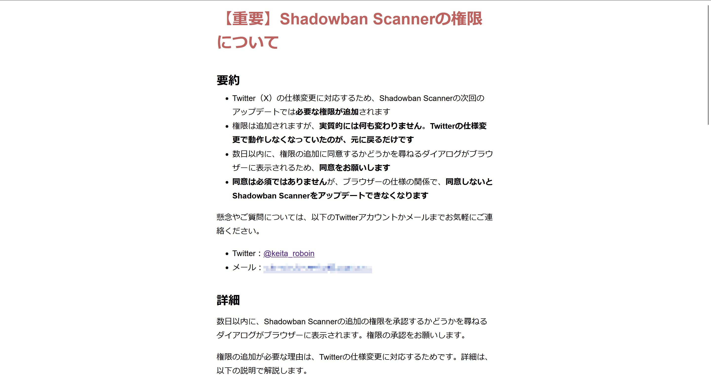
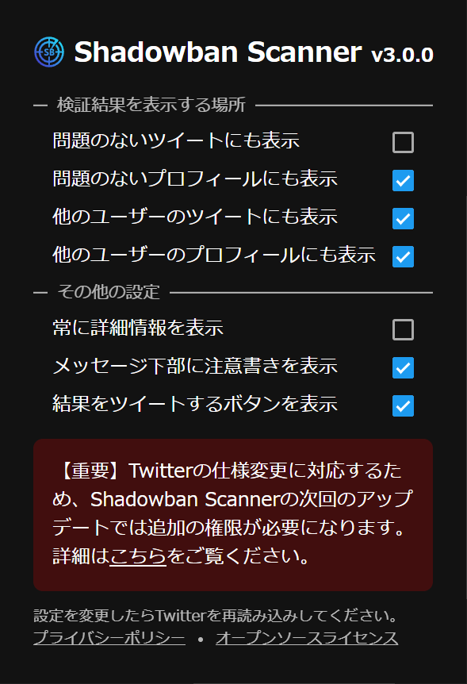
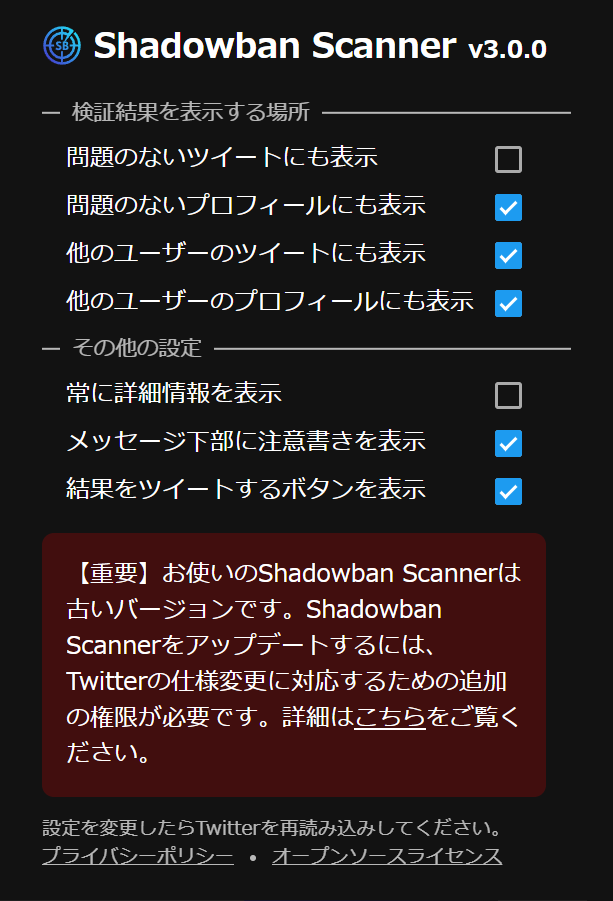
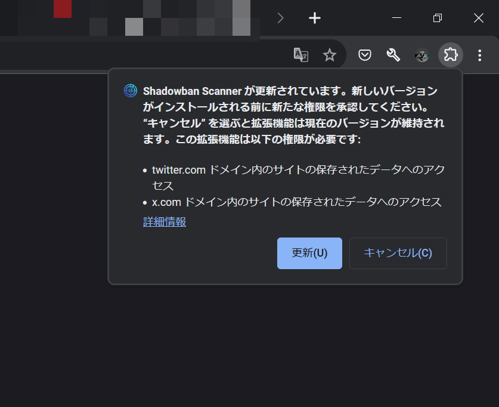
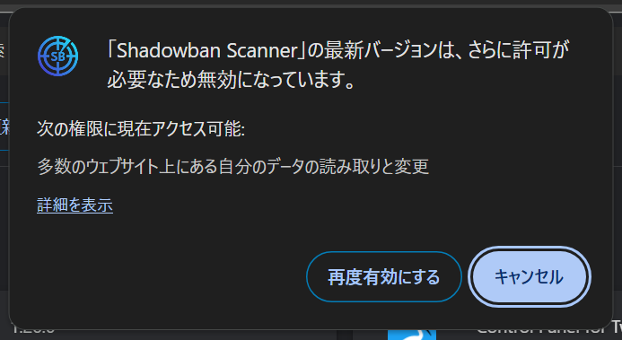
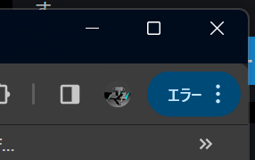
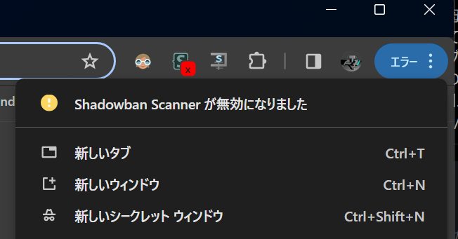
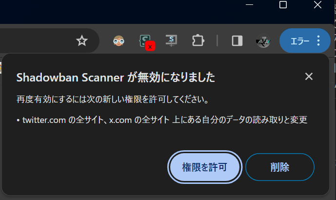
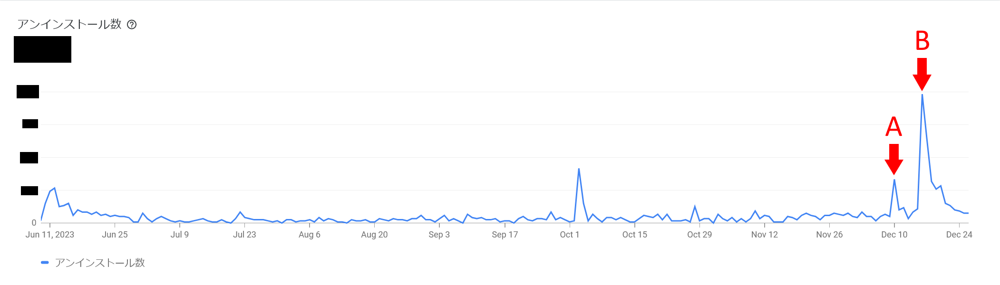

import ArticleCard from "@components/ArticleCard.astro";

## はじめに

私は、Twitter（X）のシャドウバンなどを検出する「[Shadowban Scanner](https://shadowban-scanner.roboin.io/)」というブラウザー拡張機能を開発しています。

この拡張機能はTwitterの通常のWebクライアントとTweetDeck（X Pro）で動作します。

`manifest.json`で通常のWebクライアントとモバイル版のWebクライアント、そしてTweetDeckのURLを指定していました。しかし、TweetDeckのURLの変更によって、TweetDeckで動作しなくなってしまいました。

そこで、manifestで宣言しているホスト権限を変更しました。

権限を変更すると、ブラウザーによって拡張機能が一時的に無効化されます。また、そのことを示すエラーメッセージやダイアログが表示され、ユーザーが権限の変更を承認するまでアップデートが適用されなくなります。

ユーザー数への影響を最小限に抑え、かつユーザーを驚かせないために適切な周知が必要です。この記事では、権限を追加したときに工夫したことや、変更によるユーザー数への影響などをまとめました。

## 変更内容

従来は、ホスト権限として、次のURLを指定していました。

- `https://twitter.com/*`
- `https://mobile.twitter.com/*`
- `https://tweetdeck.twitter.com/*`

今回、TweetDeckのURLが変更されたので、次のように変更しました。

- `https://*.twitter.com/*`
- `https://*.x.com/*`

本来はTweetDeckのURLを新しいものに変更するだけでもよかったのですが、今後のさらなる変更の可能性に備えて、x.comを含むTwitterのすべてのURLを対象にしました。

## 変更の告知

まずは、権限の変更についてユーザーに告知しました。告知の手段として、次の4つを実施しました。

- 拡張機能のアップデート時に表示
- 拡張機能の設定ページにリンクを記載
- Twitterでの告知
- ブログでの告知

### 拡張機能のアップデート時に表示

Shadowban Scannerでは、拡張機能のアップデート時にリリースノートを表示するようにしています。権限を追加する1つ前のバージョンのアップデート時に、次回のアップデートで権限を追加すること、権限の変更内容と変更理由、そして連絡先を記載した画面を表示しました。

数行の箇条書きにまとめた概要と、より詳細な情報の2つを記載しました。次の画像は、実際に表示した画面のスクリーンショットです。

文章の全文は、[GitHub](https://github.com/Robot-Inventor/shadowban-scanner/blob/a9234c7affb1b190a5593f6f54674583edf5b31e/src/html/aboutPermissions.ja.html)で確認できます。

### 拡張機能の設定ページにリンクを記載

アップデート時に表示される画面を見逃したユーザーのために、拡張機能の設定ページにもリンクを記載しました。このリンクをクリックすると、アップデート時に表示したのと同じページが表示されます。

また、これらの告知を表示するバージョンをリリースしたのは12月10日だったのですが、1月1日以降は、追加の権限を承認しないとアップデートできないことを示す画面が表示されるようにしました。

### Twitterでの告知

Twitterでは、権限の追加の概要と、権限の追加の理由、そして権限の承認は必須ではないものの承認しないと以降のアップデートを受け取れないことを告知しました。

この告知は複数回にわたって実施し、追加の権限が必要になる1つ前のバージョンのリリースを告知するツイートにも記載しました。

また、Shadowban Scannerのとあるユーザーの方が、権限の追加の件と、ユーザー側で承認作業が必要な件についてフォロワーさんに周知してくださいました。

### ブログでの告知

アップデート時に表示される画面ほどは詳しくないものの、ブログでも権限の追加についての説明を投稿しました。

<ArticleCard link="/article/2023/12/13/shadowban-scanner-new-permissions/" />

## 権限の追加で表示されるダイアログ

権限の追加によって、拡張機能は一時的に無効化されます。また、ユーザーには次のようなダイアログが表示されます。

次の画像は、Firefoxで表示されるダイアログです。

*拡張機能の権限が追加されたことを示すFirefoxのダイアログ*

Chromeでは、次のいずれかの画面が表示されます。前者はFirefoxと似たダイアログです。後者ではダイアログは表示されず、メニューボタンに［エラー］と表示されるだけです。しっかり確認したわけではありませんが、ほとんどのユーザーには後者の画面が表示されたようです。

*拡張機能の権限が追加されたことを示すChromeのダイアログ*

*Chromeのメニューボタンに［エラー］という表示が出ている*

後者のエラー表示が出た場合は、メニューボタンをクリックすると［Shadowban Scannerが無効になりました］という表示が出ます。この表示をクリックすると、権限の追加についてのダイアログが表示されます。

*Chromeのメニューボタンに［Shadowban Scannerが無効になりました］という表示が出ている*

*権限の追加についてのChromeのダイアログ*

## ユーザー数への影響

ここからは、権限の追加によるユーザー数への影響について説明します。12月10日に権限の追加についての画面が表示されるアップデートを配信し、12月16日に実際に権限を追加するアップデートを配信しました。

### WAUへの影響

WAU（週間アクティブユーザー数）は、12月23日から12月24日にかけて約2.6%減少しました。この期間に減少したWAUは、おおむね3〜4日分の新規インストール数に相当します。WAUは、12月25日には増加に転じました。

### アンインストール数への影響

アンインストール数も一時的に増加しました。

次のグラフは、拡張機能のリリース時からのアンインストール数の推移です。［A］と書かれた部分が、権限の追加についての画面が表示されるアップデートを配信した12月10日です。［B］と書かれた部分が、実際に権限を追加するアップデートを配信した12月16日です。

これらの付近で、アンインストール数が増加していることが分かります。12月25日ごろには、アンインストール数はおおむね通常と同程度になりました。

12月10日から12月24日までの15日間の1日あたりの平均アンインストール数は、9月9日から12月9日までの3か月間と比較して、約5.8倍でした。アンインストール数がもっとも多かった12月16日には、1日でWAUの約2.4%に相当する数のアンインストールがありました。

### アップデート状況への影響

拡張機能の新しいバージョンを公開した際、DAU（日間アクティブユーザー数）のうち95%がアップデートするまでにかかる日数は、通常では3〜4日です。今回の権限の追加によるアップデートでは、DAUのうち95%がアップデートするまでに5日間かかり、通常よりもわずかに長くなりました。

## 分析

拡張機能の権限の追加によって、ユーザー数は一時的に減少し、アンインストール数は一時的に増加しました。また、ユーザーが最新バージョンにアップデートするまでの日数もわずかに長くなりました。

しかし、これらの影響は一時的なもので、2週間程度で収束しました。また、ユーザー数（WAU）の減少は割合でみると2.6%であり、想定よりも低く抑えられました。

権限の追加について事前に告知しなかった場合のデータがないため、事前の告知の影響を正確に評価することはできません。しかし、権限の追加について事前に告知したことで、ユーザー数への影響を最小限に抑えられたと考えています。

## まとめ

この記事では、私が開発しているブラウザー拡張機能「Shadowban Scanner」が要求する権限を追加したときに工夫したことや、変更によるユーザー数への影響などをまとめました。

もし、拡張機能の権限を追加する場合は、影響を最小限に抑えるためにも、事前に告知することをオススメします。
