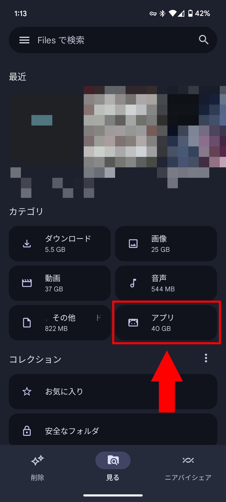
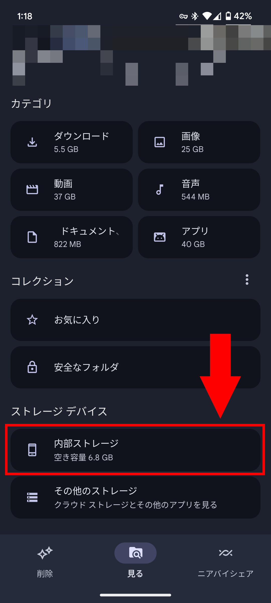

## はじめに

この記事では、XAPKファイルの作り方について説明します。

XAPKファイルは、Androidアプリのパッケージファイルの一種です。一般的に使われているAPKファイルにはファイルサイズの制限があるため、ゲームなどではAPKファイルとは別にOBBファイルを用意して、アプリのデータを格納することがあります。XAPKファイルは、APKファイルとOBBファイルを1つにまとめたものです。

XAPKファイルを作成することで、Androidアプリを自由に配布・インストールできます。

XAPKファイルを作成するには、AndroidアプリのソースコードをAndroid Studioなどの開発環境でビルドする必要はありません。必要なファイルをそろえて、いくつかの手順を実行するだけでXAPKファイルが完成します。

:::danger
必ずアプリの利用規約やライセンスを確認して、XAPKファイルの作成が問題ないか確認してください。

また、作成したXAPKファイルを、アプリの元の作成者の許可なくインターネットで配布すると、著作権侵害にあたる可能性があります。十分に注意してください。
:::

## 必要なもの

XAPKファイルを作るには、アプリのAPKファイルとOBBファイルが必要です。APKファイルは、Androidアプリのパッケージファイルです。OBBファイルは、APKファイルとは別に用意されている、アプリのデータを格納するファイルです。

### APKファイルの入手方法

APKファイルは、Androidの実機からファイルマネージャーなどで取りだせます。ここでは、Google製のファイルマネージャーの「[Files by Google](https://play.google.com/store/apps/details?id=com.google.android.apps.nbu.files)」を使ってAPKファイルを取りだす方法を説明します。

すでにAPKファイルを用意してある場合は、この手順は飛ばしてください。

まず、Androidの実機に「[Files by Google](https://play.google.com/store/apps/details?id=com.google.android.apps.nbu.files)」をインストールします。

次に、Filesのホーム画面から［アプリ］をタップします。



インストールされているアプリの一覧が表示されるので、APKファイルを取りだしたいアプリの右の3点ドットをタップし、［共有］を選択します。


あとは、共有先を選択する画面が表示されるので、ニアバイシェアやGoogle Drive、Dropboxなど任意の手段でPCに送信します。

### OBBファイルの入手方法

OBBファイルはAPKファイルと同じく、Androidの実機から取りだせます。

Filesを使う場合は、ホーム画面から［内部ストレージ］をタップします。



次に、［Android］>［obb］と進んでいくと、アプリのパッケージ名のフォルダーが表示されます。該当するフォルダーを開くと`.obb`ファイルが格納されているので、これをPCに送信します。

:::tip
OBBファイルが見つからない場合は、次のような理由が考えられます。

- アプリがOBBファイルを使用していない
- アプリがOBBファイルを使用しているが、すでに削除されている

前者の場合は、OBBファイルを使用せずにXAPKファイルを作成できます。後者の場合は、アプリを再インストールしてすぐに確認すると、OBBファイルが見つかるかもしれません。
:::

## XAPKファイルの作り方

### ファイルの準備

PCにAPKファイルとOBBファイルがあることを確認したら、それらを1つのフォルダーにまとめます。このフォルダーには、他のファイルは含めないでください。ここでは、`xapk`という名前のフォルダーを作成し、その中にAPKファイルとOBBファイルを格納します。

APKファイルは`[パッケージ名].apk`という名前にしてください。たとえば、`com.example.app.apk`のようにします。

`xapk`フォルダーの中に`Android`フォルダーを作り、さらにその中に`obb`フォルダーを作ります。`obb`フォルダーの中には、`[パッケージ名]`という名前のフォルダーを作ります。たとえば、`com.example.app`のようにします。このフォルダーの中に、OBBファイルを格納します。

OBBファイルの名前は、`main.[バージョンコード].[パッケージ名].obb`という形式になっていることを確認してください。たとえば、`main.12345.com.example.app.obb`のようにします。`main`の部分は`patch`でも（おそらくは）大丈夫だと思われます。

ここまで終わると、`xapk`フォルダーの中身は次のようになります。

```console title="xapkフォルダー"
📁xapk
└── 📁Android
    ├── 📁obb
    │    └── 📁com.com.example.app
    │        └── main.12345.com.example.app.obb
    └── com.example.app.apk
```

ここまでできたら、次の手順に進みます。

### manifest.jsonの作成

次は、`xapk`フォルダーに`manifest.json`という名前のファイルを作成します。このファイルには、XAPKファイルの情報を記述します。

任意のテキストエディターを開き、`manifest.json`に次の内容を記入します。

```json title="manifest.json"
{
  "xapk_version": 1,
  "package_name": "[パッケージ名]",
  "name": "[アプリ名]",
  "version_code": "[バージョンコード]",
  "version_name": "[バージョン番号]",
  "min_sdk_version": "18",
  "target_sdk_version": "27",
  "total_size": 158572944,
  "expansions": [
    {
      "file": "Android/obb/[パッケージ名]/main.[バージョンコード].[パッケージ名].obb",
      "install_location": "EXTERNAL_STORAGE",
      "install_path": "Android/obb/[パッケージ名]/main.[バージョンコード].[パッケージ名].obb"
    }
  ]
}
```

`[パッケージ名]`、`[アプリ名]`、`[バージョンコード]`、`[バージョン番号]`はそれぞれ、実際の値に置き換えてください。`min_sdk_version`や`target_sdk_version`、`total_size`は、分かる場合はその値を設定してください。分からない場合は適当な値で大丈夫です。

たとえば、`[パッケージ名]`が`com.example.app`、`[アプリ名]`が`Example App`、`[バージョンコード]`が`12345`、`[バージョン番号]`が`1.0.0`の場合は、次のようになります。

```json title="manifest.json"
{
  "xapk_version": 1,
  "package_name": "com.example.app",
  "name": "Example App",
  "version_code": "12345",
  "version_name": "1.0.0",
  "min_sdk_version": "18",
  "target_sdk_version": "27",
  "total_size": 158572944,
  "expansions": [
    {
      "file": "Android/obb/com.example.app/main.12345.com.example.app.obb",
      "install_location": "EXTERNAL_STORAGE",
      "install_path": "Android/obb/com.example.app/main.12345.com.example.app.obb"
    }
  ]
}
```

OBBファイルが複数個ある場合は、`expansions`の中に複数のオブジェクトを記述します。

```json title="manifest.json"
{
  "xapk_version": 1,
  "package_name": "com.example.app",
  "name": "Example App",
  "version_code": "12345",
  "version_name": "1.0.0",
  "min_sdk_version": "18",
  "target_sdk_version": "27",
  "total_size": 158572944,
  "expansions": [
    {
      "file": "Android/obb/com.example.app/main.12345.com.example.app.obb",
      "install_location": "EXTERNAL_STORAGE",
      "install_path": "Android/obb/com.example.app/main.12345.com.example.app.obb"
    },
    {
      "file": "Android/obb/com.example.app/patch.12345.com.example.app.obb",
      "install_location": "EXTERNAL_STORAGE",
      "install_path": "Android/obb/com.example.app/patch.12345.com.example.app.obb"
    }
  ]
}
```

`manifest.json`に必要な内容を入力したら、保存します。

### ZIP化

ここまでできたら、**`xapk`フォルダーの中身**をZIP圧縮します。`xapk`フォルダー自体を圧縮するわけではありません。`xapk`フォルダーを開き、中身をすべて選択した状態でZIP圧縮します。

ZIPファイルの名前は、`[パッケージ名].xapk`という形式にしてください。たとえば、`com.example.app.xapk`のようにします。

これで、XAPKファイルの完成です。任意のXAPKインストーラーでアプリをインストールできるようになります。

:::note
XAPKファイルはAPKファイルと違い、Androidは標準で対応していません。XAPKファイルをインストールするには、対応したインストーラーが必要です。
:::

## まとめ

今回はXAPKファイルの作り方について説明しました。XAPKファイルを作成するためにビルドは不要で、必要なファイルを揃えてZIP圧縮するだけで完成します。

## おまけ

[自動でXAPKファイルを作成するツール](https://github.com/BryghtShadow/xapktool)もありましたが、Pythonのライブラリーのバージョン関連のエラーで動きませんでした。

## 参考

- [How to create XAPK file](https://openxapkfile.net/create.html)
- [How to form a XAPK file-Game Installation-LDPlayer](https://www.ldplayer.net/blog/How-to-form-a-xapk-file.html)
- [BryghtShadow/xapktool: Python tool for creating XAPK file](https://github.com/BryghtShadow/xapktool)
