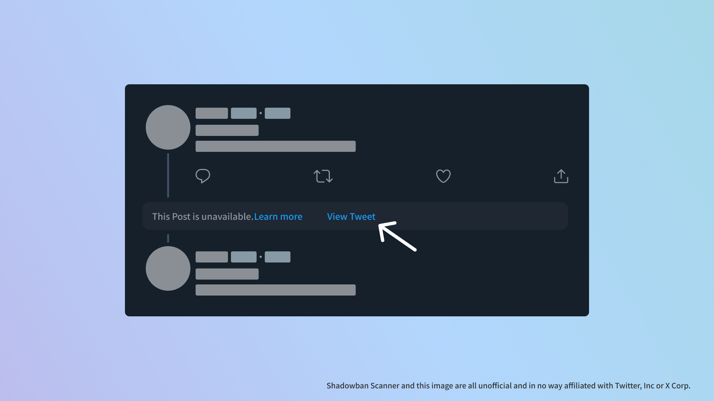

import WhatIsShadowbanScannerEn from "@templates/ShadowbanScanner/WhatIsShadowbanScannerEn.mdx";

Shadowban Scanner has been updated to v3.1. This version adds the ability to **"resurrect" tweets with external links** that have been hidden.

The main changes are as follows. All changes can be viewed on the [release page](https://github.com/Robot-Inventor/shadowban-scanner/releases/tag/v3.1.0) on GitHub.

## 🎉New Features

Recently, a problem with Twitter hiding tweets with external links has made headlines in Japan; it is [called a "tombstone" inside Twitter](https://0115765.com/archives/50433), and it seems to be an intentional behavior.

Shadowban Scanner was quick to address this issue and added the ability to "restore" hidden tweets!

When a hidden tweet with an external link is detected, a button is added to show the tweet. Clicking this button will display the hidden tweets.

## 🩹Fixed

- Fixed a bug that sometimes caused the share button to not work properly in TweetDeck

## FAQ

### Can I view hidden tweets without clicking the button?

No, you can't.

For technical reasons, it is difficult to display hidden tweets without clicking the button. Instead, clicking the button will display the tweet in a new tab.

<WhatIsShadowbanScannerEn />
