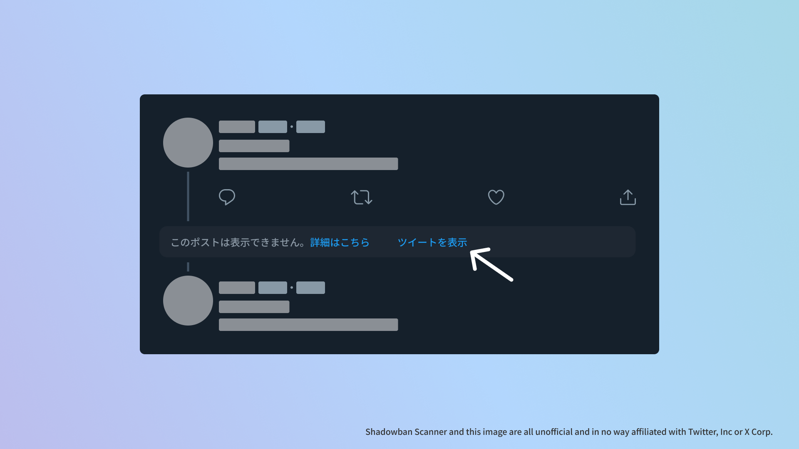

import WhatIsShadowbanScanner from "@templates/ShadowbanScanner/WhatIsShadowbanScanner.mdx";

Shadowban Scannerがv3.1にアップデートされました。このバージョンでは、非表示にされた**外部リンク付きツイートを「復活」させる機能**が追加されています。

おもな変更点は次のとおりです。すべての変更点はGitHubの[リリースページ](https://github.com/Robot-Inventor/shadowban-scanner/releases/tag/v3.1.0)で閲覧できます。

## 🎉新機能

最近、Twitterでは外部リンク付きのツイートが非表示になるという問題が話題になりました。Twitter内部では[「tombstone（墓石）」と呼ばれており](https://0115765.com/archives/50433)、意図的な挙動のようです。

Shadowban Scannerはこの問題にいち早く対処し、非表示にされたツイートを「復活」させる機能を追加しました！！

非表示にされた外部リンク付きツイートを検出すると、ツイートを表示するボタンを追加します。このボタンをクリックすると、非表示にされたツイートが表示されます。

## 🩹修正点

- TweetDeckで共有ボタンが正しく動作しないことがあるバグを修正しました

## FAQ

### ボタンをクリックしなくても、非表示にされたツイートを表示できますか？

いいえ、できません。

技術的な理由により、ボタンをクリックせずに非表示にされたツイートを表示するのは困難です。代わりに、ボタンをクリックすると新しいタブでツイートが表示されます。

<WhatIsShadowbanScanner />
