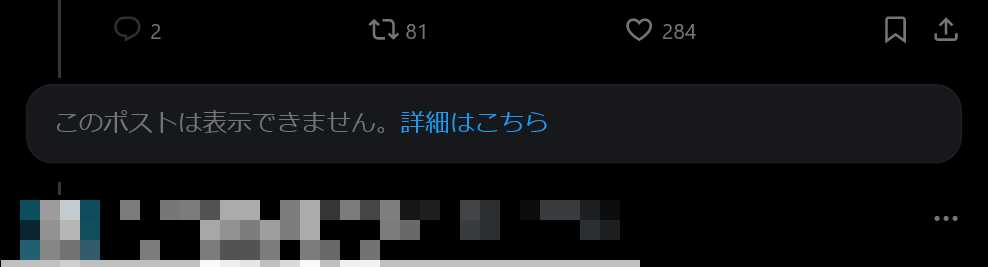

import ArticleCard from "@components/ArticleCard.astro";

2023年12月ごろから、Twitter（X）で外部リンク付きツイートを投稿すると、非表示にされるという現象が[話題](https://togetter.com/li/2276996)になりました。

この記事では、非表示にされた外部リンク付きツイートを「復活」させる方法を紹介します。

## 外部リンク付きツイートが非表示にされる問題

2023年12月ごろに投稿された[ツイート](https://twitter.com/takatoh_life/status/1734064949876674572)を発端に、外部リンク付きツイートが非表示にされるという現象が話題になりました。

*非表示にされた外部リンク付きツイートの例*

直接ツイートのURLにアクセスすると表示できますが、リプライなどからたどろうとすると［このポストは表示できません。詳細はこちら］と表示されてしまいます。

YouTubeやInstagram、Yahoo!ニュースなどの外部リンクを含むツイートが非表示にされるようで、ツイートを投稿したユーザーは「シャドウバンされたのでは？」と不安になったようです。

また、さまざまなリンクを投稿して[検証している方](https://twitter.com/999cc/status/1735684862177398990)もいました。話題になった当時と現在では、非表示にされたリンクの種類が変わっているようなので、非表示対象は固定ではないようです。

### 非表示にされる理由

外部リンク付きのツイートが非表示にされる明確な理由は分かっていません。

しかし、アニメなどの公式アカウントの告知では非表示にされていないことや、リンクを多く投稿すると非表示にされやすくなることなどから、Twitterが「スパム」と判断しているという可能性が考えられます。

このように非表示にされたツイートは、Twitterの内部では[「tombstone（墓石）」と呼ばれており](https://0115765.com/archives/50433)、意図的な挙動のようです。したがって、この問題は仕様なので、「調整」されることはあっても撤回されることはないでしょう。

### 非表示にされたらどうなるか

非表示にされたツイートは、ツイートのURLに直接アクセスしない限り表示できなくなってしまいます。そのため、インプレッション数は大幅に減少します。

スパム扱いされているのが原因というのは、あくまで推測でしかありません。しかし、もしこの仮説が正しければ、非表示にされたツイートが多いと何らかのペナルティーを受ける可能性があります。

外部リンクの投稿が原因でシャドウバンや凍結されたという報告は見つけられませんでしたが、リスクはあると考えておいた方がよいでしょう。

### 対策

対策はいくつか考えられます。ただし、明確な原因が分からない以上、これらの対策は効果があるか不明という点に注意してください。

まず、スパム扱いされているという仮説が正しければ、外部リンクを投稿する頻度を減らすと、非表示にされにくくなるかもしれません。

また、外部リンクだけを投稿するのではなく、外部リンク以外のテキストをできるだけ多く含めると、スパム扱いされにくくなる可能性があります。

他にも、URLから「h」を抜くという方法もあります。たとえば、pixivのURLは`https://www.pixiv.net/`ですが、これを`ttps://www.pixiv.net/`にするということです。

ただし、この方法を使うとリンクではなくなるので、タップしてもリンク先に飛べなくなります。代わりに、コピーして「h」を付けてからブラウザーに貼り付ける必要があります。

リンクを開くのにかなり手間がかかってしまうので、「h」を抜くとリンク先の閲覧数はかなり減少すると考えられます。

また、非表示にされたツイートを引用リツイートすることで見られるようになるという噂もあります。

## 非表示にされたツイートを復活させる方法

さて、ここまでの対策は、ツイートの投稿者が行う必要があります。では、投稿者が何もしなかった場合、非表示にされたツイートを見ることはできないのでしょうか？

実は、非表示にされたツイートを復活させる方法があります。それは、「[Shadowban Scanner](https://shadowban-scanner.roboin.io/)」というブラウザー拡張機能を使う方法です。

この拡張機能は筆者が開発しているもので、シャドウバンやセンシティブ判定を外部サイトに飛ばずに確認できるものです。

Shadowban Scannerを使うと、アカウントのプロフィールやツイートに、シャドウバンやセンシティブ判定の状況が直接表示されます。

*ツイートの下にシャドウバンされていることを示すメッセージが表示される*

*プロフィールの画面にシャドウバンされていることを示すメッセージが表示される*

外部リンク付きツイートが非表示にされるという問題を受けて、Shadowban Scannerに非表示にされたツイートを復活させる機能を追加しました！

Shadowban Scannerをインストールすると、非表示にされたツイートに［ツイートを表示］というボタンが追加されます。このボタンをクリックすると、非表示にされたツイートを表示できます。

*非表示にされたツイートに［ツイートを表示］というボタンが表示される*

技術的な理由で、ボタンを押さずにツイートを復活させるのは難しいです。しかし、ボタンをクリックするだけで、非表示にされたツイートが新しいタブで開き、表示できるようになります。

:::note
この機能は非表示にされたツイートを新しいタブで開くというものです。このボタンを押すとすべての人から見えるようになるわけではありません。あくまで、自分のブラウザーで見えるようになるだけです。
:::

### Shadowban Scannerのインストール方法

Shadowban Scannerは、Webブラウザーにインストールして使う拡張機能です。現時点では、PCのChrome、Firefox、EdgeとAndroid版Firefoxに対応しています。

次のリンクから、お使いのブラウザーに合ったものをインストールしてください。

- [Chrome版](https://chrome.google.com/webstore/detail/enlganfikppbjhabhkkilafmkhifadjd/)
- [Edge版](https://microsoftedge.microsoft.com/addons/detail/shadowban-scanner/kfeecmboomhggeeceipnbbdjmhjoccbl)
- [Firefox版](https://addons.mozilla.org/firefox/addon/shadowban-scanner/)

Shadowban Scannerの詳しい使い方は、こちらの記事で解説しています。

<ArticleCard link="/article/2023/09/30/detect-twitter-shadowban/" />

## まとめ

2023年12月ごろから、Twitter（X）で外部リンク付きツイートを投稿すると、非表示にされるという現象が話題になりました。

この記事では、非表示にされた外部リンク付きツイートを「復活」させる方法を紹介しました。

非表示にされたツイートを復活させるには、ブラウザー拡張機能「Shadowban Scanner」を使います。この拡張機能を使うと、非表示にされたツイートに［ツイートを表示］というボタンが追加されます。

Shadowban Scannerは、外部サイトに飛ばずにその場でリアルタイムでシャドウバンやセンシティブ判定を確認できる拡張機能です。ぜひ、インストールして使ってみてください！
