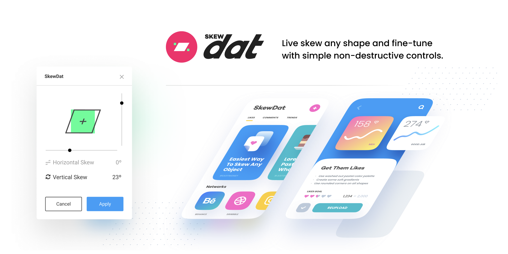
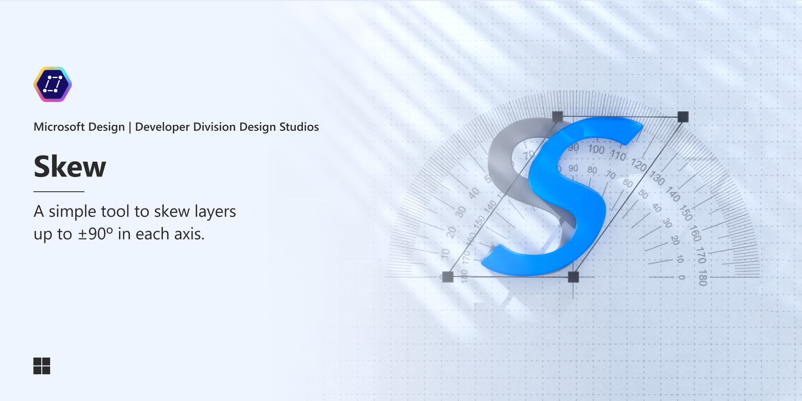
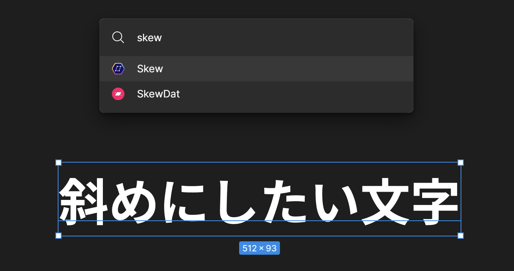
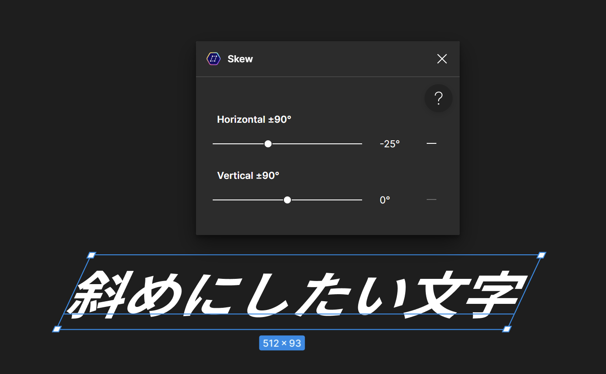

ブラウザーベースのデザインツールの[Figma](https://www.figma.com/)で図形や文字を斜めにするプラグインとして、[SkewDat](https://www.figma.com/community/plugin/741472919529947576/skewdat)が有名です。

しかし、SkewDatは最近になって有料化されてしまいました。この記事では、SkewDatの代替となるMicrosoft製の無料のプラグイン「[Skew](https://www.figma.com/community/plugin/1219749104610050886/skew)」を紹介します。

## SkewDatの有料化

*画像は[SkewDatの配布ページ](https://www.figma.com/community/plugin/741472919529947576/skewdat)より*

SkewDatは、図形を斜めにしたり、文字を斜体にしたりできるFigmaのプラグインです。

SkewDatは有名で人気なプラグインでしたが、最近になって有料化されてしまいました。

2023年9月9日に、「why dis cost money now :(」というコメントが投稿されているので、その頃に有料化されたようです。

配布ページには現在、「FREE 7-day trial」と書かれており、7日間だけ無料で使えるようです。その後は、課金しないと使えません。

## Skewの紹介

*画像は[Skewの配布ページ](https://www.figma.com/community/plugin/1219749104610050886/skew)より*

SkewDatの代替となるプラグインを探していたところ、Microsoft製の無料のプラグイン「[Skew](https://www.figma.com/community/plugin/1219749104610050886/skew)」を見つけました。

Skewは、SkewDatと同等の機能が無料で使えます。また、Microsoft製なので、安心感もあります。

2023年3月21日に公開され、10月20日にはダークモードに対応したようです。

## Skewの使い方

Skewを使うにはまず、他のFigmaプラグインと同じようにインストールします。

斜めにしたい文字や図形を選択した状態で、`Ctrl + /`を押して検索ボックスに「skew」と入力し、Skewを選択します。

表示された画面の［Horizontal ±90°］のスライダーを動かすと、水平方向に斜めになります。同様に、［Vertical ±90°］のスライダーを動かすと、垂直方向に斜めになります。

スライダーの右隣に表示されている数字をクリックすると、数値を直接入力できます。また、さらにその右に表示されている横棒をクリックすると、数値を0にリセットできます。

## まとめ

有料化されてしまったSkewDatの代替となる無料のFigmaプラグインとして、Microsoft製のSkewを紹介しました。

Skewと同等の機能を無料で使えるので、使ってみてはいかがでしょうか。
