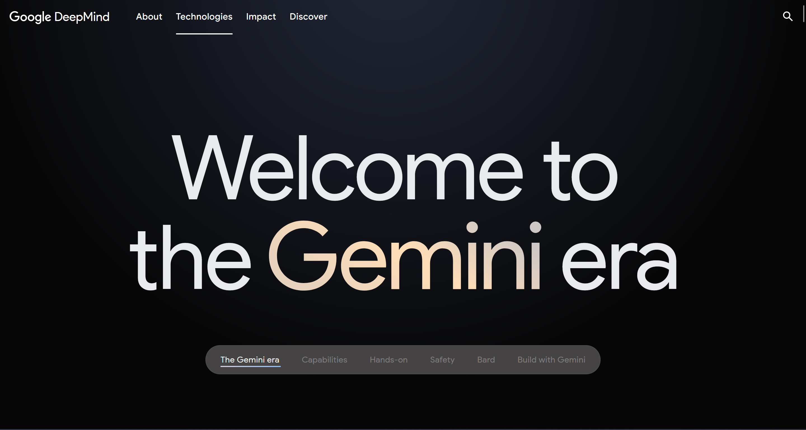
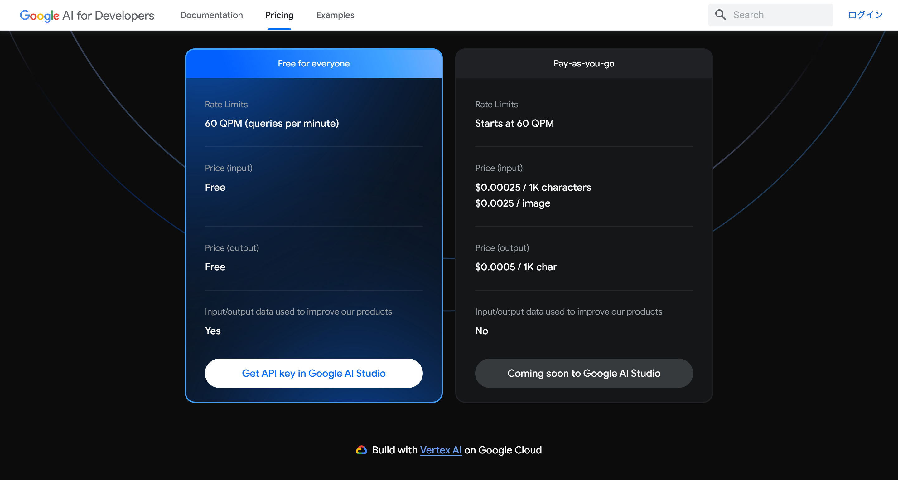
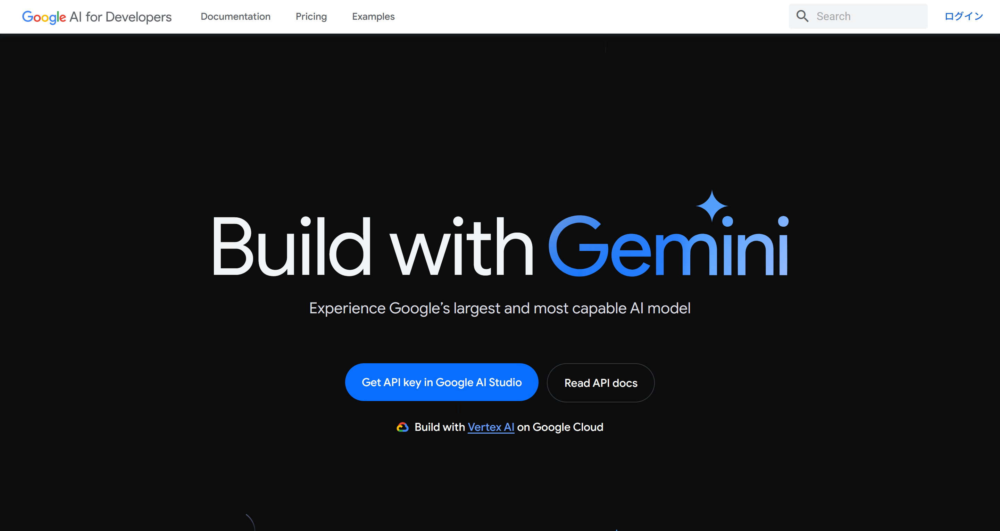
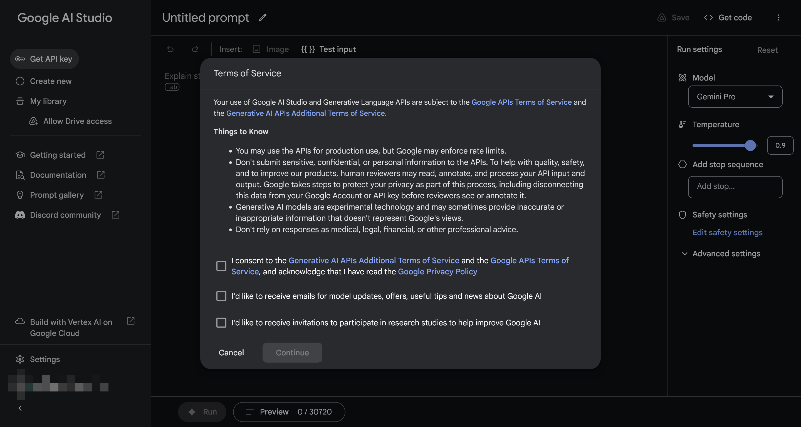
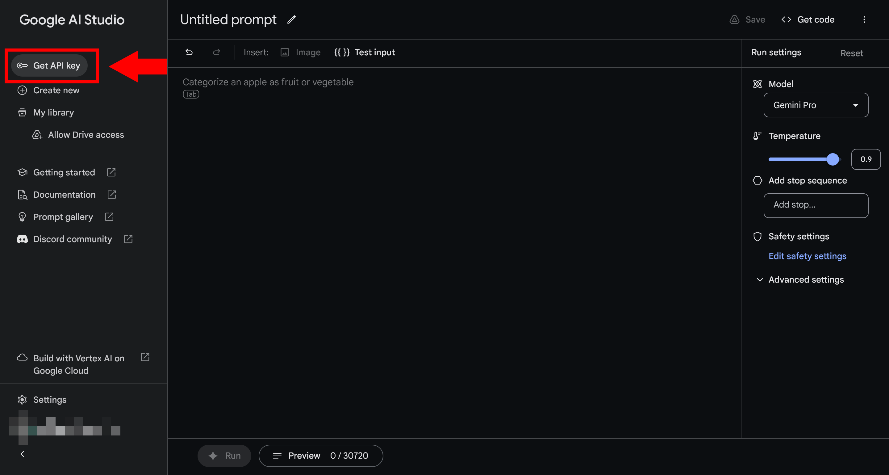
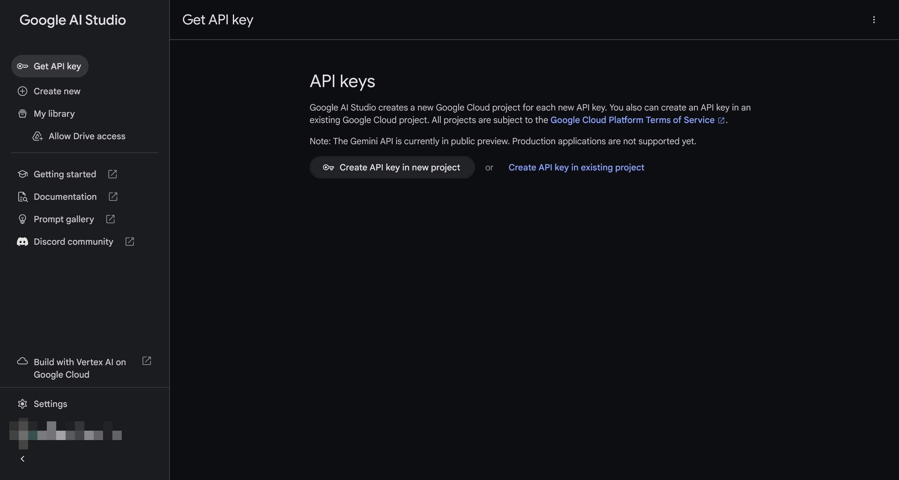
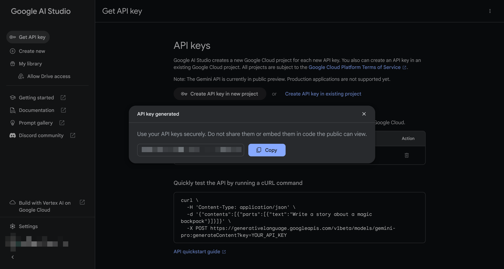

import { YouTube } from "@astro-community/astro-embed-youtube";

Google製の大規模言語モデル（LLM）のGeminiのAPIを使ってみたので、その使い方を紹介します。

## Geminiとは


*Geminiの[公式サイト](https://deepmind.google/gemini)のスクリーンショット*

[Gemini](https://deepmind.google/gemini)は、Googleが開発した大規模言語モデル（LLM）です。ChatGPTのように、テキストで対話できるAIです。Google I/O 2023で[発表](https://www.itmedia.co.jp/news/articles/2305/11/news113.html#:~:text=PaLM%202%E3%81%AF%E5%90%8C%E6%97%A5%E3%81%8B%E3%82%89%E3%83%97%E3%83%AC%E3%83%93%E3%83%A5%E3%83%BC%E7%89%88%E3%82%92%E6%8F%90%E4%BE%9B%E3%81%99%E3%82%8B%E3%80%82-,%E3%83%9E%E3%83%AB%E3%83%81%E3%83%A2%E3%83%BC%E3%82%BF%E3%82%99%E3%83%AB%E3%81%AA%E3%80%8Cgemini%E3%80%8D,-%E3%83%94%E3%83%81%E3%83%A3%E3%82%A4%E6%B0%8F%E3%81%AF%E6%AC%A1%E3%81%AB%E3%80%81Google%20Deepmind%E3%81%AE%E7%AB%8B%E3%81%A1%E4%B8%8A%E3%81%92%E3%81%AB%E3%81%A4%E3%81%84%E3%81%A6%E8%AA%9E%E3%82%8A)され、12月7日に[公開](https://japan.googleblog.com/2023/12/gemini.html)されました。

GeminiにはUltra、Pro、Nanoの3つのサイズがあり、もっとも小さいNanoではGoogle Pixel 8 Proで動作します。また、ProはGoogle Bardの英語版のモデルとして採用されており、APIとしても利用できます。

Ultraはデモ動画が公開されており、YouTubeで閲覧できます。ただし、このデモは[ねつ造だった](https://techcrunch.com/2023/12/07/googles-best-gemini-demo-was-faked/)と報道されています。

<YouTube id="UIZAiXYceBI" />

### Gemini APIの価格


*Geminiの[公式サイト](https://ai.google.dev/pricing)の価格ページスクリーンショット*

Gemini APIは記事執筆時点では1分あたり60クエリーまで、入力・出力ともに無料です。

これを超えると、入力は1,000文字あたり$0.00025、出力は1,000文字あたり$0.0005です。また、画像も入力でき、1枚あたり$0.0025です。

ChatGPTやGPT-3.5、GPT-4などのOpenAIのAPIではトークン数に応じて課金されるのに対し、Gemini APIでは文字数に応じて課金されるのが特徴です。

英語では1トークン≒1単語ですが、日本語では1トークン≒1文字です。そのため、OpenAIのAPIでは英語の方が安くなる傾向がありますが、Gemini APIでは日本語の方が安くなると思われます。

また、無料版では入力したテキストがAIの学習に利用されますが、有料版では利用されません。

## Geminiの使い方

### APIキーの取得

まずは、[Geminiの公式サイト](https://ai.google.dev/)にアクセスし、［Get API key in Google AI Studio］をクリックします。



注意書きが表示されるので、よく読んで理解したらチェックボックスにチェックを入れて［Continue］をクリックします。3つのチェックボックスのうち、下の2つは必須ではありません。



もし、APIを使うことが目的ではなく単にGeminiを試してみたいだけなら、中央の大きなテキストボックスにテキストを入力して［Run］をクリックすれば使えます。

APIとして使いたい場合は、左上から［Get API key］をクリックします。



新しくプロジェクトを作成してAPIキーを追加するか、既存のプロジェクトにAPIキーを追加するか尋ねられるので、どちらかを選択します。



APIキーが生成されるので、コピーしておきます。APIキーは他人に知られないように注意してください。



### APIを使う

ここからは、取得したAPIキーで実際にAPIを使ってみます。

ここではJavaScript（Node.js）を使います。Pythonの場合は、公式の[ノートブック](https://colab.research.google.com/github/google/generative-ai-docs/blob/main/site/en/tutorials/python_quickstart.ipynb)が分かりやすいです。他のプログラミング言語を使う場合は、[公式チュートリアル](https://ai.google.dev/tutorials?hl=ja)を参考にしてみてください。

Node.jsでGemini APIを使うには、[Google AI JavaScript SDK](https://www.npmjs.com/package/@google/generative-ai)をインストールします。

```console
npm install @google/generative-ai
```

Gemini APIでは、テキストからテキストの生成と、マルチターンのチャットが用意されています。また、ここでは説明しませんが、テキストと画像からテキストの生成もできます。

テキストからテキストを生成するには、次のようにします。

```javascript title="index.js"
const { GoogleGenerativeAI } = require("@google/generative-ai");

const API_KEY = "ここにAPIキーを入力";

const genAI = new GoogleGenerativeAI(API_KEY);

const run = async(prompt) => {
  const model = genAI.getGenerativeModel({ model: "gemini-pro"});

  const result = await model.generateContent(prompt);
  const response = await result.response;
  const text = response.text();
  console.log(text);
}

run("魔法のリュックサックについての物語を書いてください。");
```

スクリプトを実行します。

```console
node index.js
```

すると、次のようなテキストが出力されます。出力結果は実行するたびに変わります。

```text
むかしむかし、あるところに魔法のリュックサックを持つ男の子がいました。リュックサックはどんなものでも詰め込むことができ、決して重くなりませんでした。男の子はリュックサックを学校に持っていき、本や文房具を詰めました。リュックサックは重くならず、男の子は一日中楽に持ち歩くことができました。

ある日、男の子は森を散歩していると、一匹の迷子の猫を見つけました。猫は寒そうで、お腹が空いているようでした。男の子は猫をリュックサックに入れ、家に連れて帰りました。リュックサックは重くならなかったので、男の子は猫を楽に持ち帰ることができました。

家に帰ると、男の子は猫にエサと水をあげました。猫は喜んで食べました。男の子は猫を毛布にくるみ、暖かくしてあげました。猫は毛布の中にもぐりこんで、すぐに寝入ってしまいました。

次の日、男の子は猫を森に連れて帰りました。猫は男の子に甘えて、なかなか離れませんでした。男の子は猫をなでて、「また会おうね」と声をかけました。そして、リュックサックに猫を入れて、家へと帰りました。

男の子は魔法のリュックサックのおかげで、猫を助けることができました。そして、猫は男の子の親友になりました。二人は毎日一緒に遊び、とても幸せに暮らしました。
```

次に、マルチターンのチャットを試してみます。

```javascript title="index.js"
const { GoogleGenerativeAI } = require("@google/generative-ai");
const readline = require("readline");

const API_KEY = "ここにAPIキーを入力";

const genAI = new GoogleGenerativeAI(API_KEY);

const run = async (history, message) => {
    const model = genAI.getGenerativeModel({ model: "gemini-pro" });

    const chat = model.startChat({
        history,
        generationConfig: {
            maxOutputTokens: 500,
        },
    });

    const result = await chat.sendMessage(message);
    const response = await result.response;
    const text = response.text();
    return text;
}

const rl = readline.createInterface({
    input: process.stdin,
    output: process.stdout,
});

const ask = async (question) => {
    return new Promise((resolve) => {
        rl.question(question, (answer) => {
            resolve(answer);
        });
    });
};

const main = async () => {
    const history = [];

    while (true) {
        const message = await ask("ユーザー：");
        const response = await run(history, message);
        console.log("モデル：" + response);
        history.push(...[
            {
                role: "user",
                parts: message,
            },
            {
                role: "model",
                parts: response,
            },
        ])
    }
};


main();
```

スクリプトを実行すると、コマンドラインに［ユーザー：］と表示されるので、そこにテキストを入力してEnterキーを押します。すると、［モデル：］と表示され、AIの返答が表示されます。

実際に試したところ、次のようになりました。

````markdown
ユーザー：あなたは優秀なアシスタントです。簡潔で適切な応答を返してください。では、自己紹介してください。
モデル：私は、あなたのリクエストやタスクに対して、正確で有益な応答を生成できるよう設計された、高度な言語モデルです。
ユーザー：Node.jsを使って天気を取得する簡単なコードを書いてください。
モデル：
```javascript
const request = require('request');

// OpenWeatherMap API キーを取得する
const apiKey = process.env.OPENWEATHERMAP_API_KEY;

// 都市名を取得する
const city = process.argv[2];

// 天気を取得するためのリクエスト URL を構築する
const url = `http://api.openweathermap.org/data/2.5/weather?q=${city}&appid=${apiKey}&units=metric`;

// リクエストを送信する
request(url, (error, response, body) => {
  // エラーが発生した場合はエラーメッセージを表示する
  if (error) {
    console.error(error);
    return;
  }

  // ステータスコードが 200 以外の場合もエラーメッセージを表示する
  if (response.statusCode !== 200) {
    console.error(`Error: ${response.statusCode}`);
    return;
  }

  // 天気情報を JSON としてパースする
  const data = JSON.parse(body);

  // 天気情報を出力する
  console.log(`都市: ${data.name}`);
  console.log(`天気: ${data.weather[0].description}`);
  console.log(`気温: ${data.main.temp}℃`);
});
```
````

また、先ほどのコードは完全に応答が返ってくるまでテキストが表示されませんが、次のようにすると応答の途中経過が表示されます。

```javascript title="index.js"
const { GoogleGenerativeAI } = require("@google/generative-ai");
const readline = require("readline");

const API_KEY = "ここにAPIキーを入力";

const genAI = new GoogleGenerativeAI(API_KEY);

const run = async (history, message) => {
    const model = genAI.getGenerativeModel({ model: "gemini-pro" });

    const chat = model.startChat({
        history,
        generationConfig: {
            maxOutputTokens: 500,
        },
    });

    const result = await chat.sendMessageStream(message);
    return result;
}

const rl = readline.createInterface({
    input: process.stdin,
    output: process.stdout,
});

const ask = async (question) => {
    return new Promise((resolve) => {
        rl.question(question, (answer) => {
            resolve(answer);
        });
    });
};

const main = async () => {
    const history = [];

    while (true) {
        const message = await ask("ユーザー：");
        const response = await run(history, message);

        process.stdout.write("モデル：");
        let responseText = '';
        for await (const chunk of response.stream) {
            const chunkText = chunk.text();
            process.stdout.write(chunkText);
            responseText += chunkText;
        }
        process.stdout.write("\n");

        history.push(...[
            {
                role: "user",
                parts: message,
            },
            {
                role: "model",
                parts: responseText,
            },
        ])
    }
};


main();
```

:::note
Googleの[公式ドキュメント](https://ai.google.dev/tutorials/node_quickstart?hl=ja#streaming)では、次のようなコードが書かれています。

```javascript
// Use streaming with multi-turn conversations (like chat)
const result = await model.sendMessageStream(msg);
```

しかし、`model.sendMessageStream()`は存在しないため、`chat.sendMessageStream()`を使う必要があります。
:::

## まとめ

GoogleのGemini APIの使い方を紹介しました。Gemini APIは無料でもかなり使えるので、ぜひ試してみてください。
