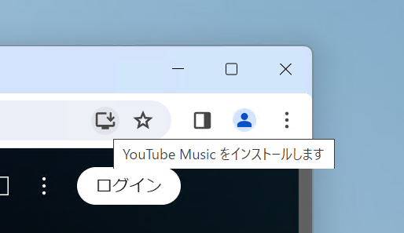
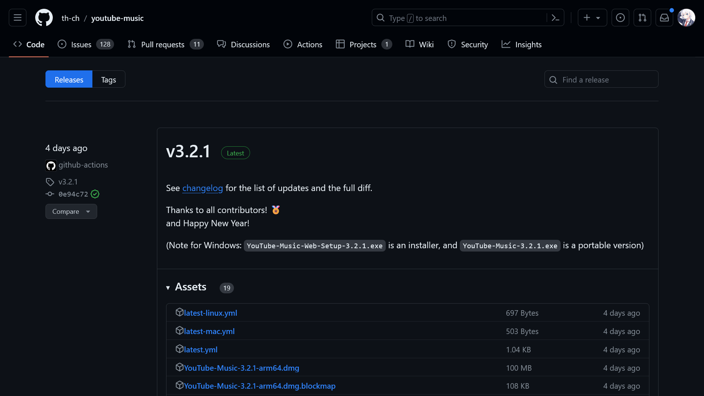
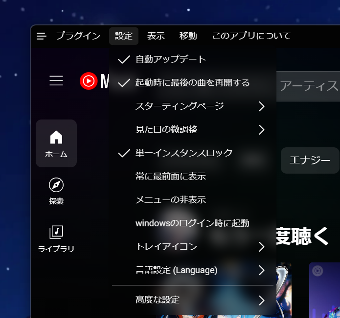
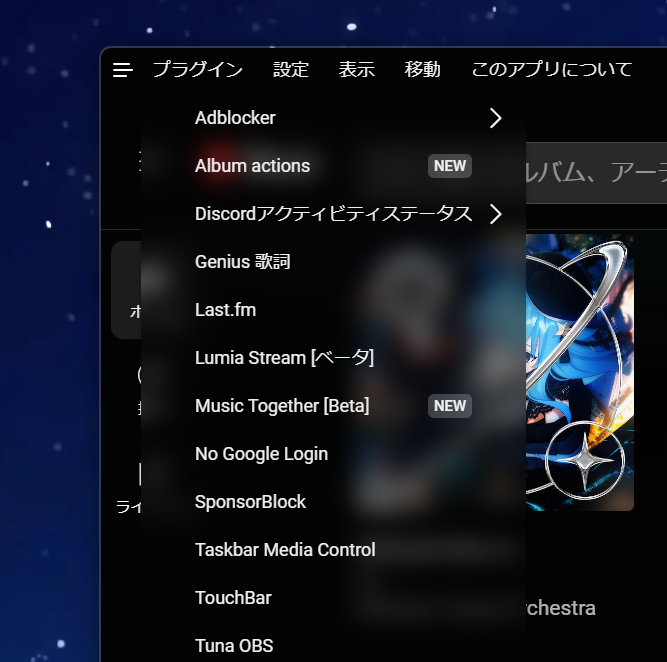

YouTube Musicは、数千万曲もの楽曲を楽しめる人気の音楽ストリーミングサービスです。

YouTube Musicは基本的にスマホアプリとWebで利用できます。しかし、音楽を聴くためにWebブラウザーを開くと気が散ったりするため、YouTube Musicを単体のアプリとして使いたいこともあるかと思います。

Windows・Macパソコンをお持ちの方なら、**YouTube Musicのデスクトップアプリをインストールすることで、Webブラウザーを開かなくても、充実した機能を余すところなく利用**できます。

この記事では、WindowsやMacのパソコンにYouTube Musicのデスクトップアプリをインストールする方法から、その活用方法まで詳しく解説します。

## 2つの無料のPC版アプリ

YouTube Musicのデスクトップアプリには、**公式のものと非公式のもの**があります。

公式のデスクトップアプリは、Web版のYouTube MusicをPWA（Progressive Web App）としてインストールするものです。PWAとは、Webページをアプリのように扱えるようにする技術のことです。

非公式のデスクトップアプリは、YouTube MusicのWebページをElectronというフレームワークを使ってデスクトップアプリ化したものです。Electronは、Web技術を使ってデスクトップアプリを作るためのフレームワークです。

公式のデスクトップアプリは安心感がありますが、非公式のデスクトップアプリの方が機能が充実しているというメリットがあります。

## 公式のデスクトップアプリ（ブラウザー版）をインストールする

YouTube Musicの公式サイトをPWAとしてインストールするには、**Google Chromeまたはその派生ブラウザー**を使います。現時点では、FirefoxなどのブラウザーではPWAとしてインストールできません。

Google Chromeを起動し、Web版の[YouTube Music](https://music.youtube.com/)にアクセスします。

アドレスバーに［YouTube Musicをインストールします］というボタンが表示されているので、クリックします。



しばらく待つと、インストールが完了します。他のアプリと同じように起動し、Web版のYouTube Musicと同じように使えます。

## 非公式のデスクトップアプリをインストールする

非公式のデスクトップアプリをインストールするには、GitHubの[配布ページ](https://github.com/th-ch/youtube-music/releases/latest)を開きます。記事執筆時点ではv3.2.1が最新ですが、頻繁に更新されています。

インストール方法を、Windows版とMac版に分けて説明します。


*配布ページのスクリーンショット*

### Windows版

Windows版のデスクトップアプリは、［Assets］の中の`YouTube-Music-Web-Setup-3.2.1.exe`というファイルです。`3.2.1`はバージョン番号なので、最新版のファイル名は異なる場合があります。

このファイルをダウンロードし、実行するとインストールされます。

:::note
インストールには**ネットワーク接続が必要**です。インストールが不要なポータブル版を使いたい場合は、`YouTube-Music-3.2.1.exe`をダウンロードします。
:::

または、`winget`コマンドでもインストールできます。

```console
winget install th-ch.YouTubeMusic
```

### Mac版

Mac版のデスクトップアプリは、［Assets］の中の`YouTube-Music-3.2.1.dmg`というファイルです。`3.2.1`はバージョン番号なので、最新版のファイル名は異なる場合があります。

このファイルをダウンロードし、インストールします。

または、Homebrewでもインストールできます。

```console
brew install th-ch/youtube-music/youtube-music
```

アプリを起動するときにエラーが出る場合は、次のコマンドを実行してください。

```console
xattr -cr /Applications/YouTube\ Music.app
```

## 非公式のデスクトップアプリの使い方

非公式のデスクトップアプリは、Web版のYouTube Musicをデスクトップアプリとして使えるようにしたものです。Web版のYouTube Musicがベースになっているため、**基本的な使い方は同じ**です。もちろんバックグラウンド再生もできます。

いくつかの機能が追加されているので、それらを紹介します。

### 設定

設定は、タイトルバーのメニューの［設定］から開けます。すべての設定項目は、この設定のリストの中にあります。



:::tip
タイトルバーにメニューが表示されていない場合は、タイトルバーの左端にある3本線のアイコンをクリックしてください。このボタンによって、メニューの表示・非表示を切り替えられます。

また、**設定の変更後はアプリを再起動**する必要があります。
:::

ここでは、設定の中でもとくに重要な項目を紹介します。

#### 自動アップデート

自動アップデートは、アプリの新しいバージョンがリリースされたときに、自動的にアップデートするかどうかを設定する項目です。デフォルトでは、自動アップデートが有効になっています。

アップデートによって頻繁に機能が追加されているので、自動アップデートを有効にしておくことをオススメします。

#### 起動時に最後の曲を再開する

起動時に最後に再生していた曲を再開するかどうかを設定する項目です。デフォルトでは、この項目は有効になっています。前回開いていたときの曲を再生したい場合は、この項目を有効にしておきましょう。

#### Windowsのログイン時に起動

Windowsのログイン時に自動的にアプリを起動するかどうかを設定する項目です。デフォルトでは、この項目は無効になっています。Windowsを起動したときに自動的にアプリを起動したい場合は、この項目を有効にしておきましょう。

#### トレイアイコン

トレイアイコンは、タスクバーの右端に表示されるアイコンです。デフォルトでは、この項目は無効になっています。トレイアイコンを表示したい場合は、この項目を有効にしておきましょう。

この設定が無効になっていると、YouTube Musicのウィンドウを閉じるとアプリが終了し、音楽の再生が停止してしまいます。有効にしておくと、ウィンドウを閉じても音楽を再生し続けられます。

### プラグイン

YouTube Musicの非公式デスクトップアプリには、豊富なプラグインが用意されています。プラグインは、タイトルバーのメニューの［プラグイン］から有効・無効を切り替えられます。すべてのプラグインは、このプラグインのリストの中にあります。



プラグインは大量にあり頻繁に追加されているので、すべては紹介できません。ここでは、私がよく使っているプラグインを紹介します。

:::tip
**プラグインの設定の変更後は、アプリを再起動**する必要があります。
:::

#### adblocker

adblockerは、YouTube Musicの広告をブロックするプラグインです。私はYouTube Premiumに加入しているので不要ですが、加入していない場合は、このプラグインで広告をブロックできます。

ただし、広告をブロックするとアーティストの収益が減ることに注意してください。

#### Discordアクティビティステータス

Discordアクティビティステータスは、Discordに再生中の曲を表示するプラグインです。このプラグインを有効にすると、Discordのアクティビティに再生中の曲が表示されます。Spotifyのアプリに付いているのと同じ機能です。


*Discordに再生中の曲が表示されているようす*

音楽の残り時間を表示するかどうか、YouTube Musicへのリンクを表示するかどうか、GitHubへのリンクを表示するかどうかを設定できます。

#### ダウンローダー

再生中の音楽のダウンロードボタンを追加するプラグインです。通常、ダウンロード（一時保存）はYouTube Premiumに加入していないとできませんが、このプラグインを使うと、YouTube Premiumに加入していなくてもダウンロードできます。

これによって、YouTube Premiumに加入していない人でも音楽をダウンロードして、オフライン再生できます。通信料を節約したい場合に便利です。

#### 動画の切り替え

動画の切り替えは、音楽と動画の切り替えボタンを追加するプラグインです。YouTube Premiumに加入していない場合、通常は音楽を再生するときに強制的に動画が再生されます。このプラグインを使うと、音楽と動画を切り替えられます。

これによって、YouTube Premiumに加入していない人でも、動画を再生せずに音楽だけを再生できます。

#### 通知

曲の再生を開始したときに、楽曲名の通知を表示するプラグインです。Windowsの場合は、通知に再生ボタンや次の曲に進む/戻るボタンが表示されます。

## まとめ

YouTube Musicのデスクトップアプリは、パソコン上で快適な音楽体験を提供するツールです。この記事を参考に、ぜひ活用してみてください。
