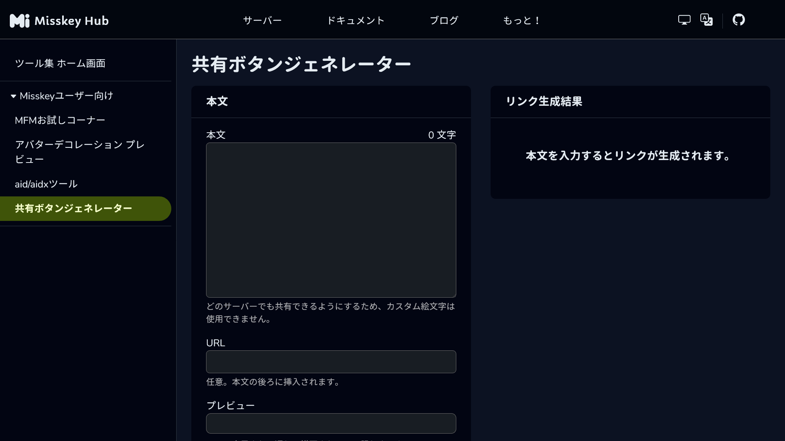
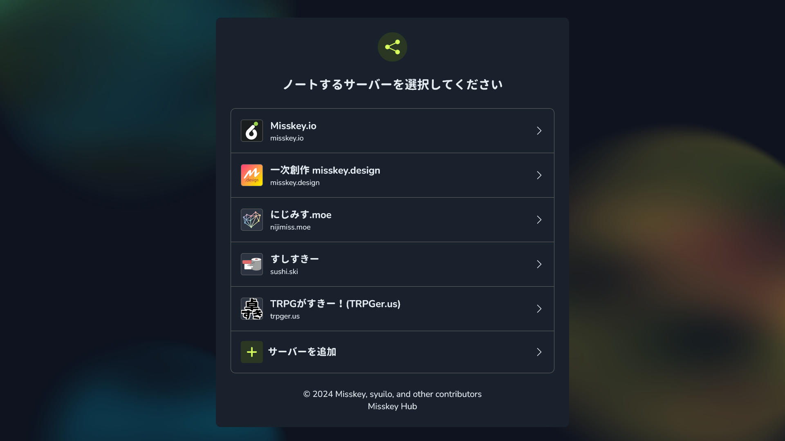
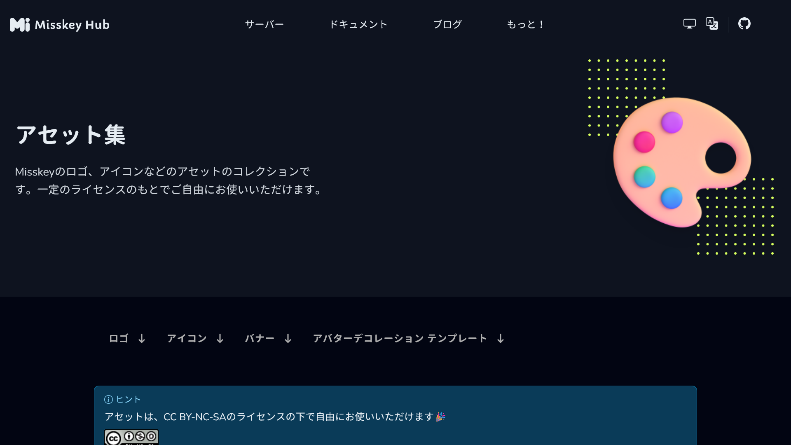

import ArticleCard from "@components/ArticleCard.astro";

MisskeyはMastodonと同様にActivityPubを採用した、オープンソースの分散型SNSです。最近では、Twitter（X）の代替のSNSの1つとして注目されています。

Misskeyの共有ボタンをWebサイトに設置することで、ユーザーは記事やコンテンツをMisskeyで簡単に共有できるようになります。この記事では、**Misskeyの共有ボタンを設置する方法**を徹底解説します。

## 前提知識

まず前提として、Misskeyは分散型のSNSです。したがって、MisskeyのURLやサーバーは1つではなく、複数存在します。

Misskeyの共有ボタンを設置するには、どのMisskeyインスタンスに共有するかをユーザーが選択できるようにする、**何らかの共有フォーム中継サービスを利用する必要があります**。

## 実装方法

### リンクの取得方法

他のSNSの共有ボタンと同様に、Misskeyでも特定のURLにさまざまなパラメーターを付与することで共有画面を開けます。まずは、そのリンクを取得する方法を説明します。

特定のページを共有するためのURLを生成したい場合は、[共有ボタンジェネレーター](https://misskey-hub.net/ja/tools/share-link-generator/)を利用すると便利です。共有ボタンジェネレーターは、共有したいテキストとURLを入力すると、それらを共有するためのリンクを生成してくれるサービスです。

- [共有ボタンジェネレーター | Misskey Hub](https://misskey-hub.net/ja/tools/share-link-generator/)


*共有ボタンジェネレーターのスクリーンショット*

このツールで生成したリンクを開くと、Misskey Hub（Misskeyプロジェクトの公式サイト）の共有フォーム中継サービスが表示されます。この画面でインスタンスを選択すると、そのインスタンスの共有画面が表示されます。


*Misskey Hubの共有フォーム中継サービスのスクリーンショット*

サードパーティーの類似のサービスもありますが、Misskey Hubの共有ボタンジェネレーターを使用すると、Misskeyの開発チーム（[Misskey Development Division](https://misskey-hub.net/ja/about-us/)）が運営しているサービスを利用できるので、安心です。

特定のページの共有URLを作る場合は共有ボタンジェネレーターを利用できますが、任意のページを共有するボタンを設置したい場合は共有ボタンジェネレーターを利用できません。その場合は、**共有用のURLを生成するコードを実装する**必要があります。

現在開いているページを共有するためのURLを生成するには、次のようなコードを利用します。

```javascript frame="terminal"
`https://misskey-hub.net/share/?text=${encodeURIComponent(`${document.title}\n${location.href}`)}&visibility=public&localOnly=0`
```

:::note
ここでは一部のURLパラメーターのみ使用していますが、利用可能なすべてのURLパラメーターについては、[公式ドキュメント](https://misskey-hub.net/en/docs/for-users/features/share-form/)を参照してください。
:::

:::caution
共有するURLやテキストに`http://localhost`が含まれていると、Cloudflareのセキュリティー機能によってブロックされるようです。私はこれのせいで1時間ほどハマりました。

開発環境で共有ボタンをテストするときは、URLを実際のものに置き換えてテストしてください。
:::

### Misskeyのアイコンの配布場所

さて、共有用のURLを生成できたので、次はMisskeyのアイコンを取得します。**Misskeyのアイコンは、Misskey Hubのアセット集からダウンロードできます**。

- [アセット集 | Misskey Hub](https://misskey-hub.net/ja/brand-assets/)



このページでは、MisskeyのアイコンがPNG形式で配布されています。このページで配布されているアセットは、**CC BY-NC-SAライセンスで利用できます**。

<small>（サードパーティーの共有ボタンサービスがこのライセンスに準拠しているようにはみえないので、そういった意味でも公式の共有ボタンジェネレーターを利用するのがオススメです）</small>

### 共有ボタンの実装

共有用のURLとMisskeyのアイコンが揃ったので、あとは共有ボタンを実装するだけです。共有ボタンは、次のようなコードで実装できます。

ただし、`アイコンのURL`の部分は、先ほどダウンロードしたアイコンのURLに置き換えてください。また、共有URLが事前に分かっている場合は`onclick`属性を削除して、`href`属性に共有URLを直接指定できます。

```html frame="terminal"
<a href="" onclick="this.href = `https://misskey-hub.net/share/?text=${encodeURIComponent(`${document.title}\n${location.href}`)}&visibility=public&localOnly=0`;" target="_blank" rel="noopener noreferrer">
  
</a>
```

## まとめ

Misskeyの共有ボタンを設置することで、SNSへの共有を促進できます。

この記事の方法を使えば、任意のMisskeyインスタンスでコンテンツを共有するボタンを安全に設置できます。Misskeyの共有ボタンを設置して、コンテンツがより多くの人に共有されるようにしましょう！

なお、Misskeyと同様にTwitterの代替のSNSとして注目されているBlueskyやThreadsの共有ボタンの実装方法は、こちらの記事で解説しています。

<ArticleCard link="/article/2024/02/11/bluesky-share-button/" />

https://qiita.com/Robot-Inventor/items/874e558cdbfaa14ce22e
