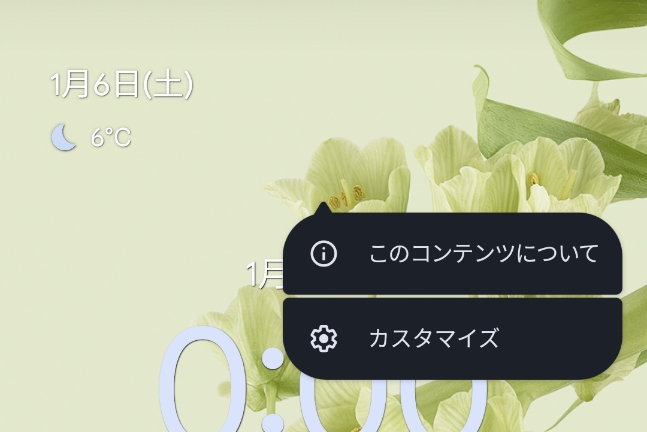
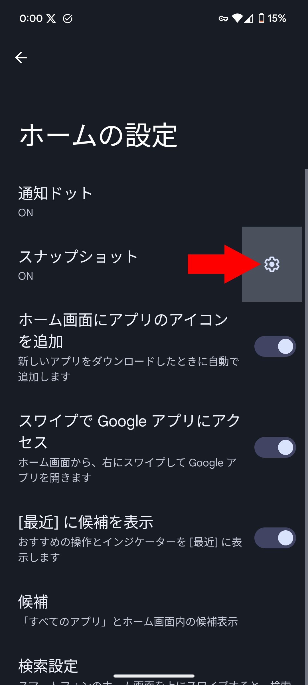
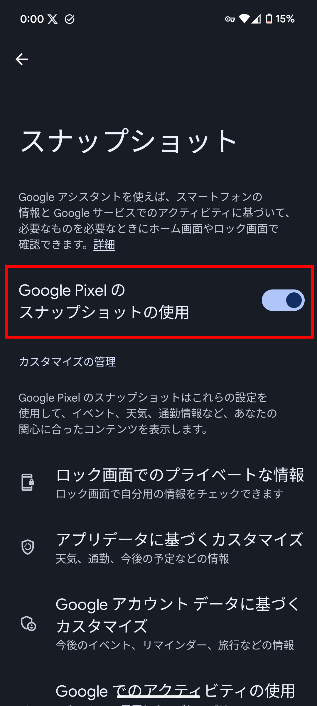

Pixelユーザーにとって、ホーム画面に常駐する日付や天気などは、日々の情報を一目で把握できる便利な機能です。しかし、その活用方法は人それぞれ。使わないので非表示にしたいという方もいるでしょう。

この記事では、**Pixelでホーム画面に表示される天気などのウィジェットを非表示にする方法**を紹介します。

## ホーム画面の日付の正体

Google Pixelのホーム画面には、日付や天気などの情報が表示されます。これは、Pixelに組み込まれている **「スナップショット」（海外表記では「At a Glance」）というウィジェット**です。

「スナップショット」は、Google Pixelのホーム画面上部に表示されるウィジェットです。天気、カレンダーの予定、音楽再生情報など、さまざまな情報をコンパクトに表示してくれます。

### メリット

- 日々の情報を一目で確認できる
- ホーム画面をスタイリッシュにカスタマイズできる
- Googleサービスとの連携で、よりパーソナライズされた情報が提供される

### デメリット

- 好みに合わない情報が表示される場合がある
- 画面スペースを占有する
- バッテリー消費が増える可能性がある

メリット・デメリットを踏まえた上で**スナップショットが邪魔だと感じる場合は、非表示にできます**。

## スナップショットを非表示にする方法

2024年1月の月例Androidアップデートを適用したGoogle Pixel端末では、スナップショットを非表示にする方法が用意されています。

まずは、スナップショットを長押しして表示されるメニューの［カスタマイズ］をタップします。

次に、［スナップショット］の横の設定アイコンをタップします。

設定画面が表示されるので、［Google Pixelのスナップショットの使用］のトグルスイッチをオフにします。

これで、スナップショットを非表示にできました。

:::caution
この方法で非表示にできるのは天気などの情報のみです。日付は非表示にできません。

Googleは現在、Androidのベータ版にて日付などを含めて、スナップショットをウィジェットとして完全に削除する機能に[取り組んでいるようです](https://9to5google.com/2023/12/12/pixel-launcher-at-a-glance-remove-relocate/)。
:::

## 設定が表示されない場合

スナップショットを非表示にする設定が見当たらない場合は、2024年1月の月例アップデートが適用されていない可能性があります。アップデートを確認し、適用してください。

## まとめ

今までスナップショットは無効化できませんでしたが、最近のアップデートで非表示にできるようになりました。スナップショットを非表示にすることで、ホーム画面をよりスタイリッシュにカスタマイズできます。ぜひ、お試しください。

## 参考

- [Google Pixel「スナップショット」新設定広く展開開始 – Jetstream BLOG](https://jetstream.bz/archives/181764)
- [Pixel Launcher will let you turn off At a Glance widget](https://9to5google.com/2023/11/15/pixel-launcher-at-a-glance-widget/)
