import ArticleCard from "@components/ArticleCard.astro";

この記事では最初にMisskeyの特徴を解説し、その次に用語と使い方を説明します。

使い方だけ知りたい場合は、前半部分を飛ばしていただいて構いませんが、**Misskeyのデメリットなども解説しているので、できるだけ最初から読むことをオススメします**。

## Misskeyとは？


*Misskeyプロジェクトの[公式サイト](https://misskey-hub.net/ja/)のスクリーンショット*

MisskeyはTwitter（X）の代替として注目されているSNSです。

Misskeyは分散型のSNSで、Twitterなどの大手のSNSと違い、**複数のサーバー（インスタンス）が存在**しています。それぞれのインスタンスによって運営者が異なり、ルールも異なります。

また、ActivityPubという仕組みに対応しており、Mastodonなど、**ActivityPubを採用した他のSNSと相互にやり取りできる**ことも特徴です。

### Misskeyのメリット

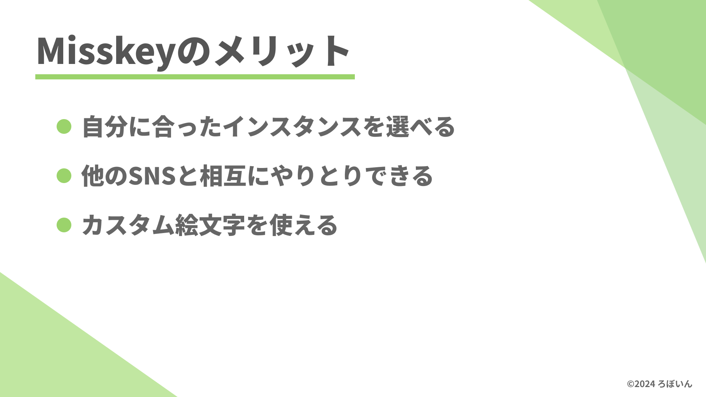

Misskeyのもっとも大きなメリットは、やはりActivityPubに対応している点です。

通常、TwitterなどのSNSは、そのSNSの中でしか投稿を閲覧できません。また、もしもサービスが終了したら、それまでの投稿はすべて消えてしまいます。

一方で、Misskeyは複数のインスタンスが存在しているため、**仮に使っているインスタンスのサービスが終了しても、他のインスタンスに移住できます**。

また、技術的な知識が要求されるものの、必要なら自分でインスタンスを立てることもできます。インスタンスごとに特徴やルールが異なるので、自分に合ったインスタンスを選べます。

さらに、ActivityPubに対応している他のSNSと相互にやり取りができます。

たとえば、MastodonもActivityPubに対応しているので、**MisskeyのアカウントでMastodonのアカウントをフォローする、といったこともできます**。逆に、MastodonのアカウントでMisskeyのアカウントもフォローできます。

Meta（旧Facebook）が開発したThreadsも、近いうちにActivityPubに対応することが発表されています。

Misskeyはカスタム絵文字が使えることも特徴です。**インスタンスで独自に用意されているカスタム絵文字を投稿の中で使ったり、投稿に対するリアクションをつけたりできます**。とくに、このカスタム絵文字は他のSNSと比べても特徴的な機能です。

### Misskeyのデメリット

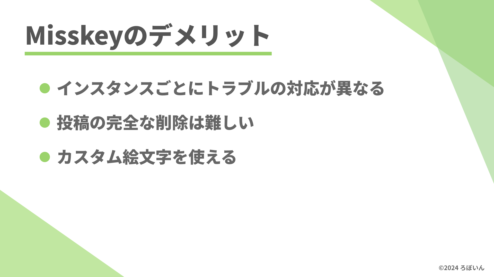

Misskeyは分散型なのがメリットですが、一方でこれはデメリットにもなります。

Twitterなどを大手のSNSは運営会社が存在し、トラブルが発生したときはその運営会社とやりとりすることになります。

一方でMisskeyは複数のインスタンスが存在し、トラブルへの対応もインスタンスごとにバラバラです。また個人が運営しているインスタンスもあり、そういったインスタンスでは**企業ほどの対応は望めない**かもしれません。

個人で運営しているインスタンスが多く、運営者個人のお財布や寄付に頼っているケースが多くあります。そのため、利用者が多い時間帯には不安定になることがあります。

さらに、通常のSNSよりも投稿を削除しにくいという問題もあります。

通常のSNSでも投稿を完全に削除することは困難です。たとえば、いわゆる魚拓やアーカイブなどによって投稿が保存されている場合がありますし、Googleのキャッシュなどにも保存されています。

Misskeyではこれらに加えて、他のインスタンスに投稿が保存されている場合があります。

Misskeyにアップロードした投稿は他のインスタンスに送信されます。自分のインスタンスから投稿を削除したとしても、**他のインスタンスからも投稿が消えるとは限りません**。

そのため、**通常のSNSでも投稿の完全な削除は困難ですが、Misskeyではさらに困難です**。

これらのメリットとデメリットを踏まえてMisskeyを利用しましょう。

## 知識編💡

さて、ここからはMisskeyを使う上で必要な基本的な知識を説明します。

### 用語📖

#### ノート

Misskeyでは、投稿のことを「ノート」といいます。Twitterのツイート（ポスト）、Mastodonのトゥートに相当します。

#### リノート

Misskeyでは、Twitterのリツイート（リポスト）やMastodonのブーストに相当する機能を「リノート」といいます。

#### インスタンス

Misskeyの個々のサーバーのことです。前述のようにMisskeyには複数のサーバーが存在しており、それらをそれぞれインスタンスと言います。

#### カスタム絵文字

そのインスタンスのみで使える特殊な絵文字です。Misskeyでは、他のパソコンやスマートフォンでも使える通常の絵文字に加えて、インスタンス独自の絵文字を利用できます。

Twitterでときどき話題になる「与謝野晶子」「レターパックで現金送れ」などはカスタム絵文字です。

#### MFM

Markup language For Misskeyの略です。このMFMという書き方で投稿を作成すると、投稿に装飾を加えられます。

#### 連合

Misskeyでは、複数のインスタンスが相互に連なってやり取りしています。このように連なったインスタンス（サーバー）の集合体のことを「連合」といいます。

#### Fediverse

Misskeyなどの分散型のSNSによって構築されたネットワークのことです。

#### その他

ここで紹介したもの以外にも、さまざまな用語があります。Misskeyを使っていて分からない用語があったら、公式の用語集を確認しましょう。

- [用語集 | Misskey Hub](https://misskey-hub.net/ja/docs/for-users/resources/glossary/)

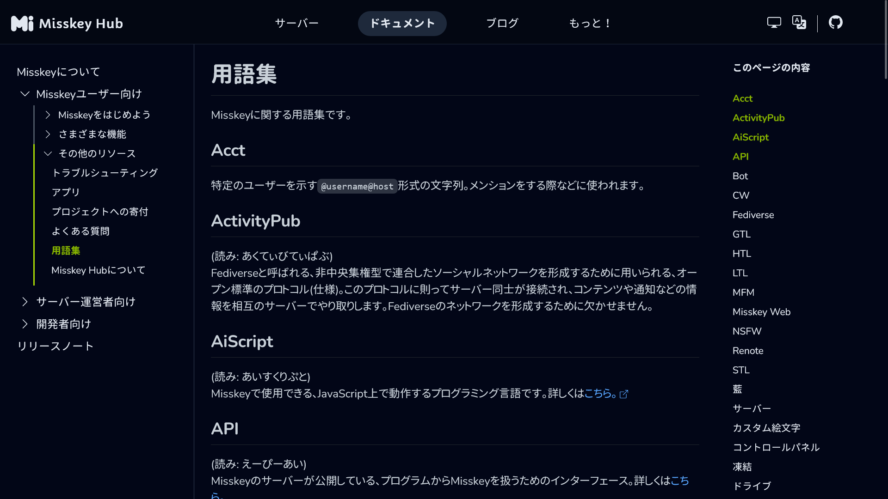
*用語集のスクリーンショット*

## アカウント作成編🔑

### Misskeyのインスタンスを選ぶ

Misskeyには複数のインスタンスが存在します。インスタンスごとに特徴やルールが異なるので、自分に合ったインスタンスを選びましょう。

Misskeyのサーバーの一覧は、公式サイトから確認できます。

- [サーバー一覧 | Misskey Hub](https://misskey-hub.net/ja/servers/)

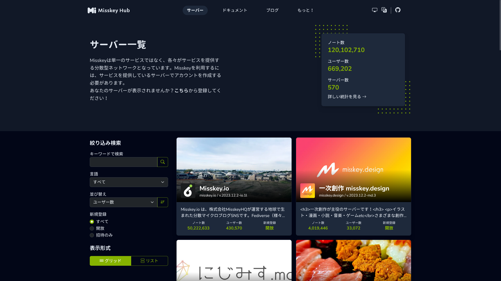
*公式サイトのサーバー一覧ページ*

絞り込み検索で［ユーザー数］で並べ替えると、人気のインスタンスが分かります。**一部のインスタンスは登録に招待コードが必要です**。招待コードの要・不要は、絞り込み検索の［新規登録］で絞り込めます。

記事執筆時点でもっとも人気のあるインスタンスは、「[Misskey.io](https://misskey.io/)」です。「与謝野晶子」や「レターパックで現金送れ」などのネタは（おそらく）Misskey.ioが発祥です。**迷ったらMisskey.ioを選ぶのが無難です**。

他にも、人気なインスタンスは次のとおりです。これ以外にもさまざまなインスタンスが存在するので、自分に合ったインスタンスを探してみてください。

- [Misskey.io](https://misskey.io/)：Misskeyの中でもっとも人気のあるインスタンスです。迷ったらここを選ぶのが無難
- [一次創作 misskey.design](https://misskey.design/)：一次創作が主役のサーバーです。オリジナルのイラストや小説などを投稿するのに適しています
- [にじみす.moe](https://nijimiss.moe/)：自分の「好き」を自由に語れることを目指したインスタンスです

### アカウントを作る

Misskeyのインスタンスを選んだら、実際にアカウントを作りましょう。

まず、招待コードが必要なインスタンスの場合は、招待コードを入手してください。招待コードの入手方法はインスタンスごとに異なるので、確認してみてください。

記事執筆時点では、**もっとも人気のあるMisskey.ioでは、招待コードなしで誰でもアカウントを作成できます**。

:::tip
一部のインスタンスでは、VPNを使っているとアカウントを作成できない場合があります。その場合は、VPNを切ってからアカウントを作成してください。

たとえばMisskey.ioでは、アカウント作成後はVPNを使っても問題ありませんが、アカウントの作成時にはVPNをオフにする必要があります。
:::

インスタンスごとに画面が多少異なる可能性がありますが、ここではMisskey.ioを例に説明します。まずは、サーバーのトップページを開きます。

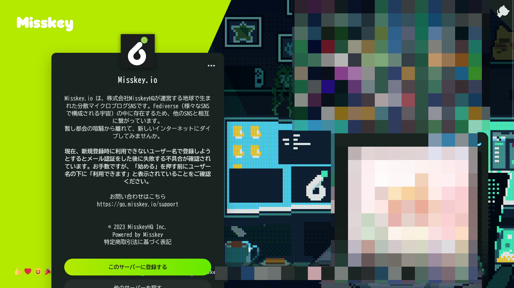
*Misskey.ioのトップページ*

次に、［このサーバーに登録する］をクリックします。ガイドラインや利用規約などが表示されるので、**必ずすべてをよく読んで理解してから**［同意する］をクリックしてください。すべてに同意したら［続ける］をクリックします。

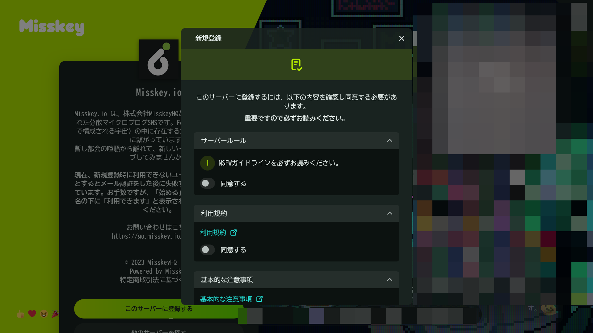
*ガイドラインや利用規約などの同意画面*

同意して［続ける］をクリックすると、アカウントの情報を入力する画面が表示されます。指示に従って必要事項を入力してください。

このとき、**@から始まるユーザー名はあとから変更できない**ので、慎重に決めてください。すでに他のSNSを使っている場合は、それに合わせるのがオススメです。

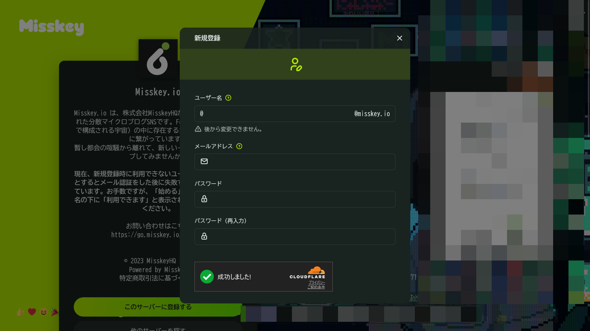
*アカウントの情報を入力する画面*

アカウント情報の入力が終わったら、［始める］をクリックします。あとは指示に従ってメールアドレスの確認などを済ませれば、アカウントの作成は完了です。

### プロフィールを設定する

アカウントを作成出来たら、次はプロフィールを充実させましょう。プロフィールは［設定］>［プロフィール］から編集できます。

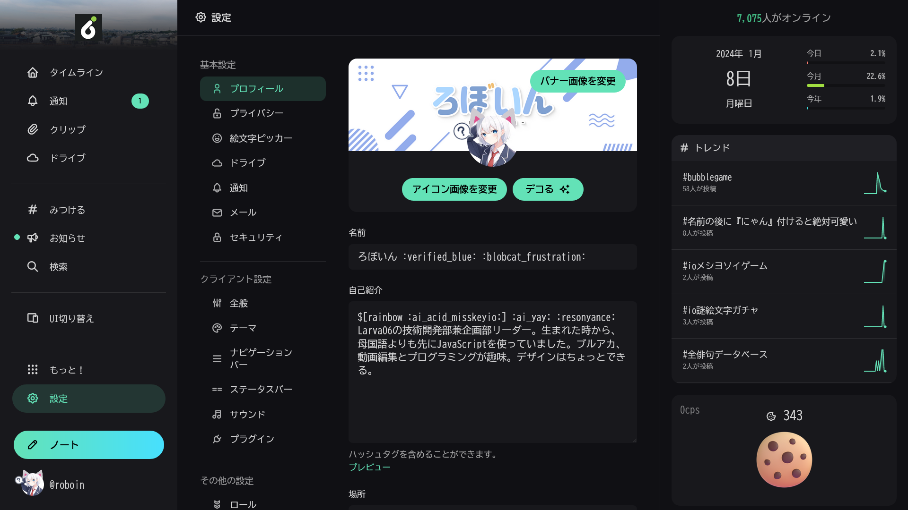
*プロフィールの設定画面*

プロフィールの「名前」「自己紹介」などは他のSNSと同じなので説明を省略します。他のSNSや公式サイトなどへのリンクを表示したい場合は、プロフィールの設定の［追加情報を編集］から設定できます。

Misskeyではアイコン関連でいくつかおもしろい設定があるので、紹介します。

まず、［高度な設定］で［にゃああああああああああああああ！！！！！！！！！！！！］をオンにすると、自分のアイコンに猫耳が付くようになります。

さらに、アイコンの変更ボタンの隣にある［デコる］をクリックすると、アイコンに吹き出しを付けたり赤面させたりといったデコレーションができます。

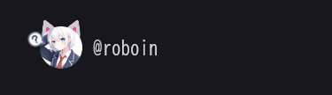
*猫耳やデコレーションが付いたアイコン*

### 本人確認する/公式バッジを取得する

Misskeyでは、本人確認をしたり公式バッジを取得したりすることで、**アカウントがなりすましではなく本人のものと証明できます**。Misskeyで本人確認したり公式バッジを取得したりする方法は、こちらの記事で詳しく解説しています。

<ArticleCard link="/article/2023/12/27/how-to-identify-yourself-in-misskey/" />

## 使い方編📝

### タイムラインを見る

**Misskeyには複数のタイムラインが存在します**。タイムラインとは、投稿が時系列順に表示される画面のことです。

Misskeyのタイムラインは、「ホームタイムライン（HTL）」「ローカルタイムライン（LTL）」「ソーシャルタイムライン（STL）」「グローバルタイムライン（GTL）」に分かれています。それぞれの役割は次のとおりです。

- **ホームタイムライン**：自分のフォローしているユーザーの投稿が時系列順に表示される
- **ローカルタイムライン**：自分のインスタンスのすべてのユーザーの投稿が時系列順に表示される（公開範囲が［ホーム］に設定されている投稿を除く）
- **ソーシャルタイムライン**：自分のフォローしているユーザーと、自分のインスタンスのすべてのユーザーの投稿が時系列順に表示される（公開範囲が［ホーム］に設定されている投稿を除く）
- **グローバルタイムライン**：自分のインスタンスのすべてのユーザーの投稿と、他のサーバーから届いたすべての投稿が時系列順に表示される（公開範囲が［ホーム］に設定されている投稿を除く）

他のSNSのタイムラインにもっとも似ているのは、ホームタイムラインです。ホームタイムラインは、自分のフォローしているユーザーの投稿が時系列順に表示されます。

また、Misskeyには「**リアクションシューティング**」という文化があります。これは、タイムラインに流れてくる大量の投稿に対して、素早くリアクションを付けていくという「ゲーム」です。Misskeyに慣れてきたら、リアクションシューティングに挑戦してみてください。

### ノートを投稿する

Misskeyでは、投稿のことを「ノート」といいます。ノートを投稿するには、画面の端にある［ノート］ボタン（スマホでは鉛筆マークのボタン）をクリックします。

ノートではMFMと呼ばれる独自の書き方を利用できます。MFMの利用は強制ではなく、ただのテキストだけでも投稿できます。**MFMを利用するとさまざまな装飾を利用できて楽しいので、ぜひ利用してみてください**。

MFMの詳細な書き方は、公式サイトを参照してください。

- [MFM | Misskey Hub](https://misskey-hub.net/ja/docs/for-users/features/mfm/)

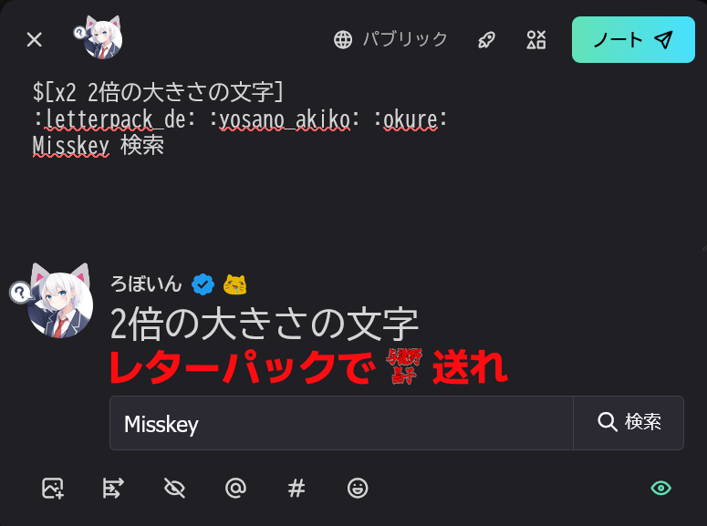
*MFMを使ったノートの投稿画面*

ノートの文章を書き終わったら、投稿前にどのように表示されるかを確認しましょう。**投稿画面の右下の目のアイコンをクリックすると、プレビューを表示できます**。

投稿画面の右上には、いくつかのボタンが並んでいます。

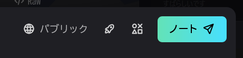

［パブリック］と書かれた地球のアイコンのボタンは、**ノートの公開範囲を設定するボタン**です。このボタンをクリックすると、公開範囲を［パブリック］［ホーム］［フォロワー］［ダイレクト］の中から選択できます。

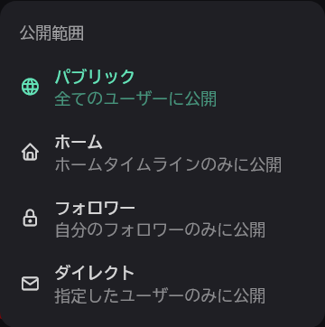

［パブリック］［フォロワー］［ダイレクト］は選択画面の説明に書かれているとおりです。［ホーム］はホームタイムラインにのみ表示されます。

公開範囲の設定ボタンの隣には、ロケットのアイコンのボタンがあります。このボタンでは、**ノートを連合に配信するかどうか**を設定できます。

デフォルトは「連合あり」で、これは他のインスタンスにもノートが配信されることを意味します。「連合なし」にすると、他のインスタンスにノートが配信されなくなります。

また、さらにその隣には、丸バツ三角四角で構成されたアイコンのボタンがあります。このボタンでは、**どのようなリアクションを受け入れるか**を設定できます。デフォルトでは、すべてのリアクションを受け入れるようになっています。

ノートの投稿画面の下にも、いろいろなボタンが並んでいます。これらは左から順に、画像の添付、アンケートの作成、内容を隠す、メンション、ハッシュタグ、絵文字のボタンです。

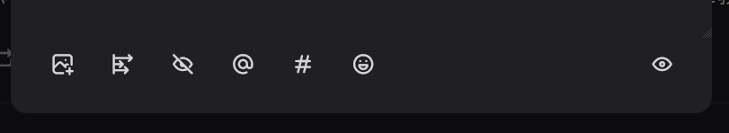

**［内容を隠す］は、ノートの内容の一部を隠せる機能**です。ネタバレやネガティブな話など、ワンクッション置いてから読んでもらいたい場合に利用できます。

［内容を隠す］をオンにすると、テキストボックスが2つに分かれます。上のテキストボックスに入力した内容は、そのまま表示されます。下のテキストボックスに入力した内容は、［もっと見る］ボタンをクリックしない限り表示されません。

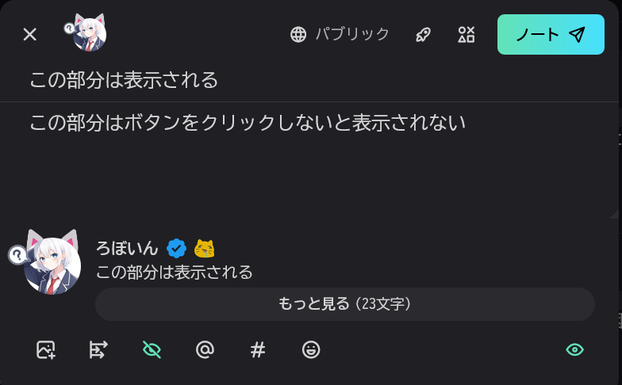
*ノートの投稿画面で［内容を隠す］をオンにしたようす*

**絵文字のボタンをクリックすると、カスタム絵文字を利用できます**。カスタム絵文字は、インスタンスごとに異なります。いろいろなカスタム絵文字を試してみてください。

#### 画像の添付について

ノートの投稿画面で、添付した画像を右クリックするとメニューが表示されます。このメニューでは、ファイル名の変更、センシティブ設定、キャプションの設定、画像のクロップ、添付の取り消しができます。

とくに、センシティブ設定については、**センシティブな画像を投稿するときには必ず設定**しましょう。センシティブ設定をすると、画像をクリックしない限り画像が表示されなくなります。

:::danger
ルールはインスタンスごとに異なりますが、たとえばMisskey.ioではセンシティブな画像に**センシティブ設定をしないと、投稿したアカウントはもちろん、その投稿をリノートしたアカウントも凍結される可能性があります**。基準やルールはインスタンスごとに異なるので、必ず確認しましょう。
:::

### アカウントを共有する

Misskeyのアカウントを作ったら、他のSNSでアカウントを宣伝しましょう。Misskeyのアカウントを他の人に共有する方法は2つあります。

#### URLをコピーする

MisskeyのアカウントのURLをコピーして、他のSNSに貼り付けましょう。プロフィールの画面を表示し、右上のメニューボタンから［プロフィールURLをコピー］を選択してください。

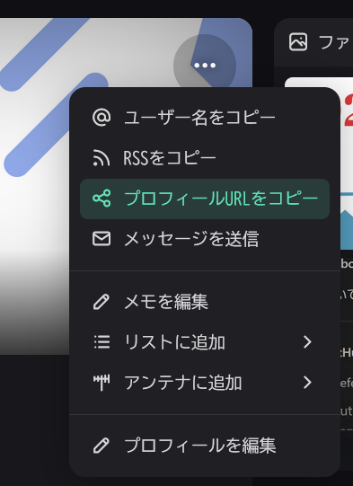

たとえば、私のアカウントの場合は次のようになります。

```markdown
https://misskey.io/@roboin
```

#### ハンドルネームをコピーする

`@`から始まるハンドルネームを共有できます。プロフィールの画面を表示し、右上のメニューボタンから［ユーザー名をコピー］を選択してください。

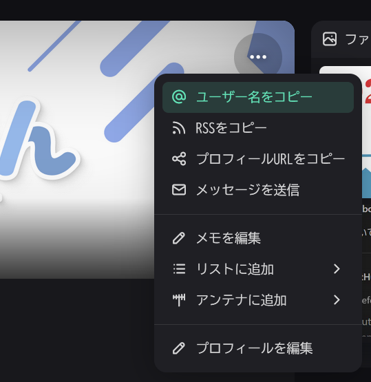

たとえば、私のアカウントの場合は次のようになります。

```text
@roboin@misskey.io
```

:::note
ハンドルネームを共有する場合は、2つ目の`@`以降を消さないでください。これは、Misskeyのアカウントがどのインスタンスにあるかを表しています。

前半で紹介したように、Misskeyには複数のインスタンスが存在します。**どのインスタンスかが分からないと、アカウントにたどり着けません**。
:::

### Misskeyをカスタマイズする

Misskeyの画面は、自分の好みに合わせてカスタマイズできます。

画面の配色は、設定の［テーマ］から変更できます。Misskeyでは豊富なテーマが用意されており、好きな配色を選択できます。私のオススメは「Mi Future Dark」です。これ以外にもさまざまなテーマが用意されているので、自分の好みに合わせて選んでみてください。

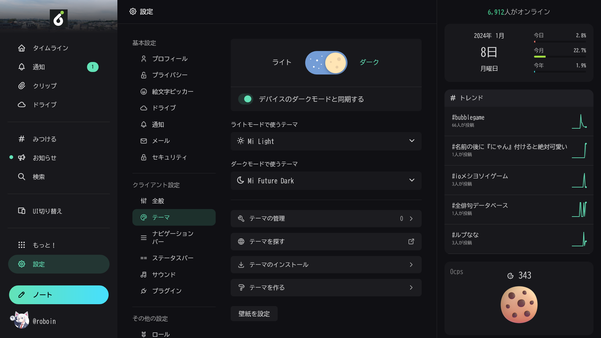

また、画面の右端に表示されるサイドバー（スマホではノートの作成ボタンの隣のボタンを押すと表示される）には、ウィジェットを配置できます。ウィジェットは、Misskeyの機能をより便利に使えるようにする機能です。［ウィジェットを編集］ボタンからウィジェットの追加・削除ができます。

### アプリを使ってMisskeyを利用する

記事執筆時点では、**Misskeyの公式アプリは存在しません**。少し前に公式アプリの開発者を募集していたので開発はしているようですが、まだ公開されていません。そのため、Misskeyをスマートフォンで利用する場合は、ブラウザーでMisskeyを開く必要があります。

ただし、Misskeyをアプリとして使う方法がないわけではありません。MisskeyはPWAという仕組みに対応しており、**Webサイトをアプリのようにインストールして使えます**。

MisskeyをPWAとしてインストールするには、スマートフォンでChromeかSafariを使う必要があります。筆者はiPhoneを持っていないためSafariでのインストール方法は分かりませんが、AndroidのChromeではメニューから［アプリをインストール］を選択するとインストールできます。

また、有志が開発した非公式のMisskeyアプリも複数存在しているので、それらを試してみるのもよいかもしれません。

### その他

Misskeyを使っていて何か問題が発生したり、動作がおかしいといった場合は、キャッシュを削除すると解決する場合があります。とくに、新しく追加されたばかりのカスタム絵文字が表示されないといった問題は、キャッシュの削除で解決することが多いです。

キャッシュを削除するには、設定画面を開いて［キャッシュをクリア］を選択します。

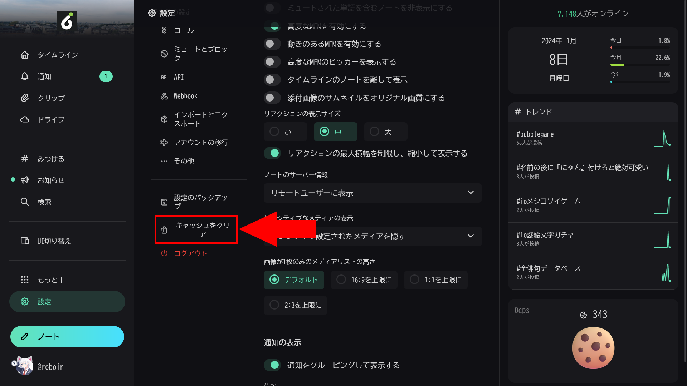

## まとめ

Twitterの代替のSNSとして注目されているMisskeyについて解説しました。

Misskeyを使う上で必要な基本的な知識はひと通り紹介しました。Misskeyでは、他のSNSとは違った雰囲気を楽しめます。気になった方はぜひ使ってみてください。
