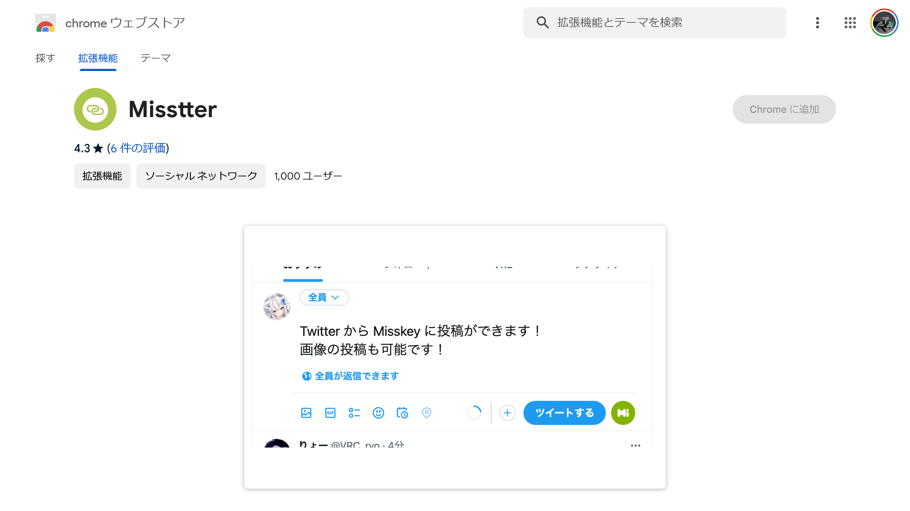
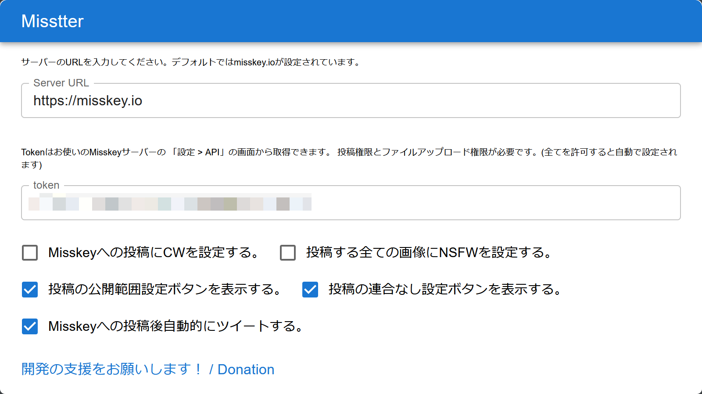
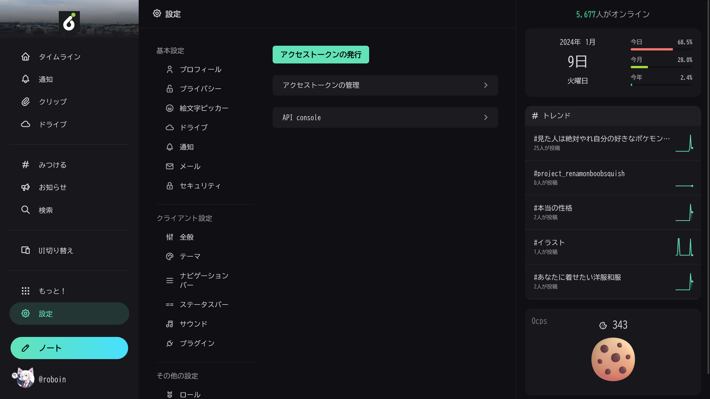
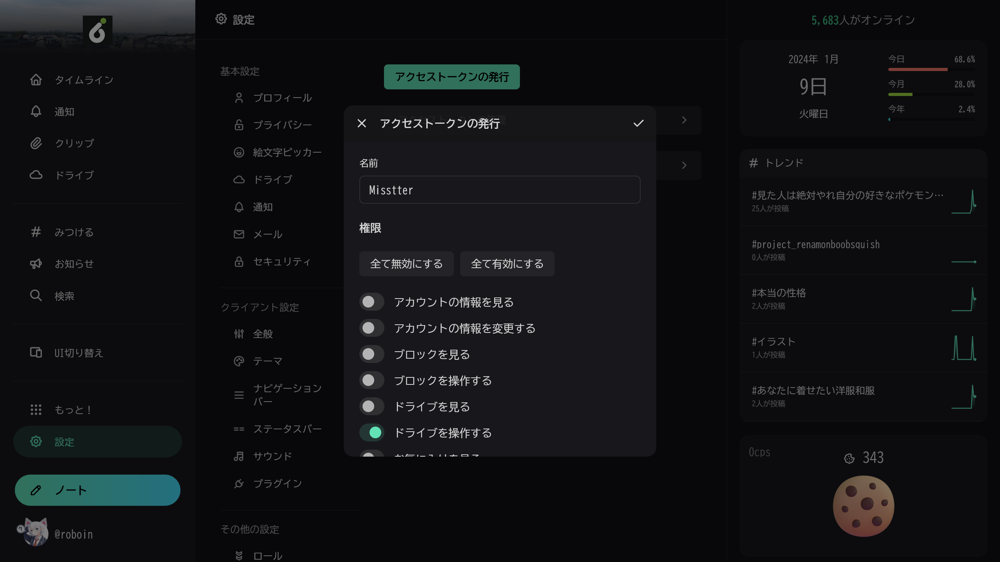
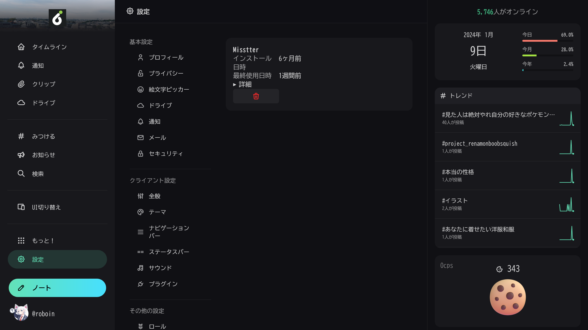
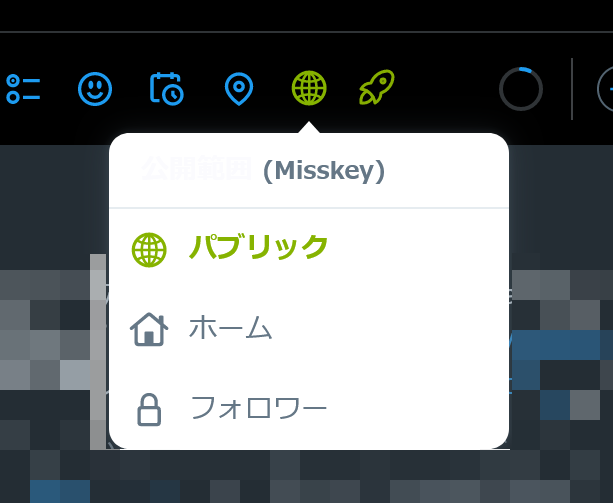
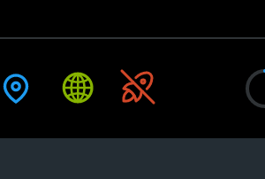

import ArticleCard from "@components/ArticleCard.astro";

最近ではTwitter（X）の代替のSNSとして、Misskeyが注目されています。この記事では、Twitterの投稿をMisskeyにクロスポスト（同時投稿）する方法を紹介します。

## Misskeyとは


*Misskeyプロジェクトの[公式サイト](https://misskey-hub.net/ja/)のスクリーンショット*

Misskeyは、**Twitterの代替のSNSとして注目されている分散型のSNS**です。アカウントの作り方や使い方などは、こちらの記事で詳しく解説しています。

<ArticleCard link="/article/2024/01/08/how-to-start-your-misskey-life/" />

Misskeyには複数のサーバー（インスタンス）があり、それらが相互に接続されています。また、ActivityPubという仕組みに対応しており、ActivityPubを採用した他のSNS（Mastodonなど）と相互にやり取りできることも特徴です。

たとえば、**MisskeyのアカウントでMastodonのアカウントをフォローしたり、逆にMastodonのアカウントでMisskeyのアカウントをフォロー**したりといったことができます。

Meta（旧Facebook）が開発したThreadsも、近いうちにActivityPubに対応すると発表されています。Threadsの登録方法や使い方はこちらの記事で紹介しています。

<ArticleCard link="/article/2023/07/06/meta-twitter-competing-app-threads/" />

## クロスポスト（同時投稿）する方法

Twitterで何か問題が発生したときに備えてMisskeyのアカウントを作ったものの、両方に同じ内容を投稿するのは面倒、といったことがあるかもしれません。

そんなときに便利なのが、**Twitterの投稿をMisskeyにクロスポスト（同時投稿）するツール**です。

クロスポストするツールは複数存在しますが、その中でもオススメなのが、「[Misstter](https://github.com/AranoYuki1/Misstter)」です。ここからは、Misstterのインストール方法や設定方法、使い方などを紹介します。

## Misstterとは


*MisstterのChrome版の[配布ページ](https://chromewebstore.google.com/detail/apepechijpaheieelimdgbnjcecobhpp)*

Misstterは、Twitterの投稿をMisskeyにクロスポストできるブラウザー拡張機能です。対応しているWebブラウザーにMisstterをインストールすると、**Twitterの投稿をMisskeyに自動でクロスポストできるようになります**。

テキストと画像のクロスポストに対応しており、Misskeyへの投稿の公開範囲や連合の有無の設定もできます。

また、すべての投稿が自動的にクロスポストされるわけではなく、**クロスポストするかどうかを投稿時に選択できる**ようになっています。これによって、Twitterにだけ投稿したい内容がMisskeyにも投稿されてしまう、といったことを防げます。

MisstterはWindowsとmacOSのGoogle Chrome、Mozilla Firefox、およびそれらの派生ブラウザーとAndroid版Firefoxで利用できます。（Safari版も存在しますが、更新されていないようです）

この拡張機能を使えば外部サービスを使わずに、手軽にTwitterの投稿をMisskeyに半自動クロスポストできます。

## Misstterのインストール方法

Misstterは、それぞれのWebブラウザーの拡張機能ストアで配布されています。使っているブラウザーに合わせて、次のリンクからインストールしてください。

- [Chrome・Edge版](https://chromewebstore.google.com/detail/apepechijpaheieelimdgbnjcecobhpp)
- [Firefox版](https://addons.mozilla.org/firefox/addon/misstter-fork-with-bugfix/)

:::note
Firefox版のリンクは、私が本家のMisstterに改良を加えたものです。

[本家のMisstterのFirefox版](https://addons.mozilla.org/ja/firefox/addon/misstter/)には[バグ](https://github.com/AranoYuki1/Misstter/issues/13)が存在しており、動作しません。[改良したバージョン](https://github.com/Robot-Inventor/Misstter)では、そのバグの修正に加えてAndroid版Firefoxへの対応が含まれています。

Misstterは一定の条件のもとで改変や再配布が許可されており、私が改良したバージョンはその条件に従っているので、安心してください。
:::

## Misstterの設定方法

Misstterはインストールしただけでは使えません。Misstterのインストールが終わったら、次の手順で設定する必要があります。

まずは、ブラウザーのツールバーの拡張機能アイコン（たいていはパズルのピースのようなアイコン）をクリックして、拡張機能のメニューを開きます。

その中でMisstterを探してクリックすると、画像のような設定画面が表示されます。この設定画面に必要事項を入力します。


*Misstterの設定画面*

### Server URL

Misskeyには複数のサーバー（インスタンス）が存在するので、どのサーバーに投稿するのかを設定する必要があります。

サーバーのURLは、［Server URL］というテキストボックスに入力します。たとえば、もっとも人気なMisskeyのサーバーである「[misskey.io](https://misskey.io/)」を使う場合は、次のように入力します。

```markdown
https://misskey.io
```

### token

MisskeyのAPIトークンを設定します。APIトークンは、外部のツールがMisskeyのアカウントにアクセスし、連携できるようにするためのものです。

:::danger
APIトークンは、**絶対に他人に見せたりネットにアップしたりしない**でください。

APIトークンさえあれば、トークンの権限の範囲内でアカウントを自由に操作できてしまいます。パスワードと同様に、大切に管理してください。

万が一、トークンが流出した場合は、直ちにトークンを無効化してください。トークンを無効化する方法は、後述の「トークンを削除する方法」を参照してください。
:::

APIトークンを取得するには、Misskeyの設定画面の［API］タブを開き、［アクセストークンの発行］をクリックします。



アクセストークンの発行画面が表示されます。［名前］は適当で大丈夫ですが、あとから分かりやすいように「Misstter」などにしておくといいでしょう。

［権限］は［ドライブを操作する］と［ノートを作成・削除する］の2つをオンにします。探すのが面倒だったら、［全て有効にする］でも問題ありません。



ダイアログの右上のチェックマークをクリックすると、アクセストークンが表示されます。このアクセストークンを、Misstterの設定画面の［token］というテキストボックスに入力します。

**このトークンは一度しか表示されないので注意してください**。もしもトークンが分からなくなったら、新しいトークンを発行する必要があります。

:::note[トークンを削除する方法]
トークンを使わなくなったり、トークンを他人に見せてしまったりした場合は、トークンを無効化（削除）できます。トークンを無効化すると、そのトークンは使えなくなります。

トークンを無効化するには、Misskeyの設定画面の［API］タブで［アクセストークンの管理］をクリックします。トークンの一覧が表示されるので、該当するトークンのゴミ箱マークをクリックします。また、トークンに付与されている権限を確認したい場合は、該当するトークンの［詳細］をクリックします。


:::

### その他の設定

さて、ここまでの設定で、Misstterを最低限使えるようになりました。必要に応じて、追加の設定を行いましょう。

- **Misskeyへの投稿にCWを設定する**：この設定をオンにすると、MisskeyにクロスポストするときにCW（Contents Warning）が設定されます
- **投稿する全ての画像にNSFWを設定する**：この設定をオンにすると、Misskeyにクロスポストするときに画像にNSFW（Not Safe For Work）が設定されます
- **投稿の公開範囲設定ボタンを表示する**：この設定をオンにすると、Twitterの投稿画面に、Misskeyの投稿の公開範囲を設定するボタンが追加されます
- **投稿の連合なし設定ボタンを表示する**：この設定をオンにすると、Twitterの投稿画面に、Misskeyの投稿の連合なしを設定するボタンが追加されます
- **Misskeyへの投稿後自動的にツイートする**：この設定をオンにすると、Twitterの投稿画面でMisskeyの投稿ボタンをクリックしたときに、自動的にTwitterにも投稿されます

## Misstterの使い方

Misstterの設定が終わったら、いよいよMisstterを使ってみましょう。Misstterを使うには、Twitterの投稿画面を開いて、投稿したい内容を入力します。


*MisstterをインストールしたブラウザーでTwitterの投稿画面を開いたようす*

緑のボタンがいくつか追加されていることが分かります。これらのボタンを使って、Misskeyにクロスポストできます。

地球のアイコンのボタンをクリックすると、Misskeyの投稿の公開範囲を設定するボタンが表示されます。ここで選択した公開範囲でMisskeyに投稿されます。


*Misstterの公開範囲設定ボタン*

公開範囲設定ボタンの隣には、ロケットのアイコンのボタンがあります。このボタンをクリックすると、Misskeyの投稿の連合あり・なしを切り替えられます。

ロケットが緑のときは「連合あり」、ロケットが赤で斜線が引かれているときは「連合なし」です。


*「連合なし」に設定したようす*

投稿内容を入力して投稿設定を終えたら、実際にMisskeyにクロスポストしましょう。

［ポストする］ボタンの右隣に表示されるMisskeyのアイコンをクリックすると、Misskeyに投稿されます。ツイート（ポスト）に画像が含まれる場合は、画像もMisskeyにクロスポストされます。


*［ポストする］ボタンの右隣にMisskeyのアイコンが表示されている*

設定で［Misskeyへの投稿後自動的にツイートする］をオンにしている場合は、Misskeyへの投稿処理の完了後に自動的にツイートが送信されます。オンにしていない場合は、手動でツイートを送信してください。

Twitterにだけ投稿したい場合は、Misskeyのアイコンをクリックせずにツイートを送信すれば大丈夫です。

## まとめ

この記事では、Twitterの投稿をMisskeyにクロスポスト（同時投稿）する方法を紹介しました。

Misstterは、Twitterと同じ投稿をMisskeyにアップロードしたいときに便利です。ぜひ、Misstterを使ってみてください。
