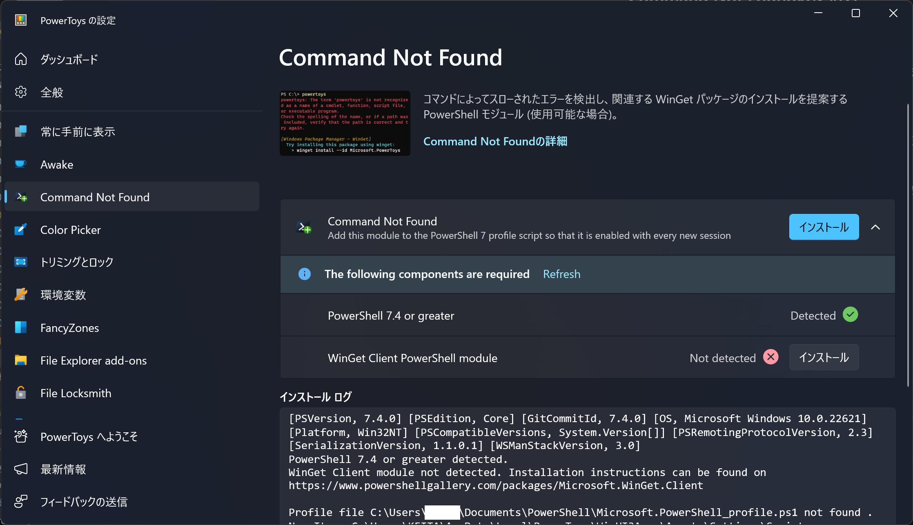
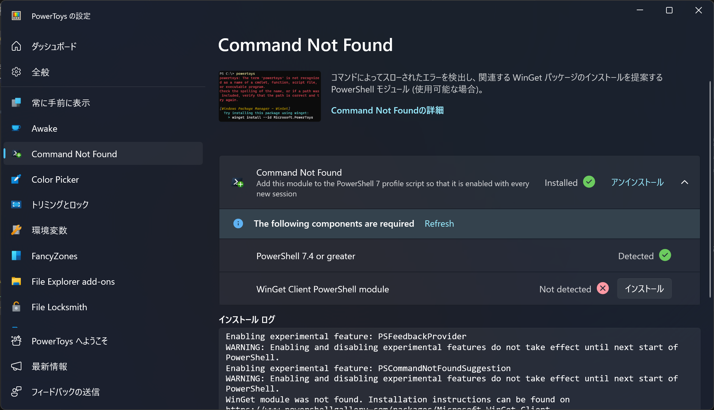
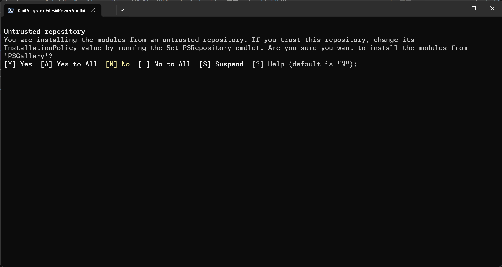
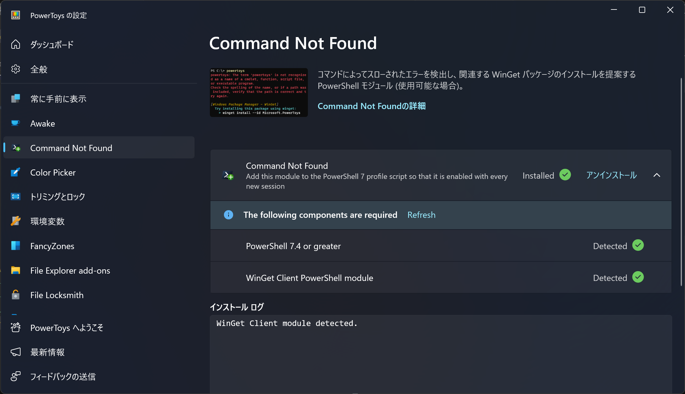
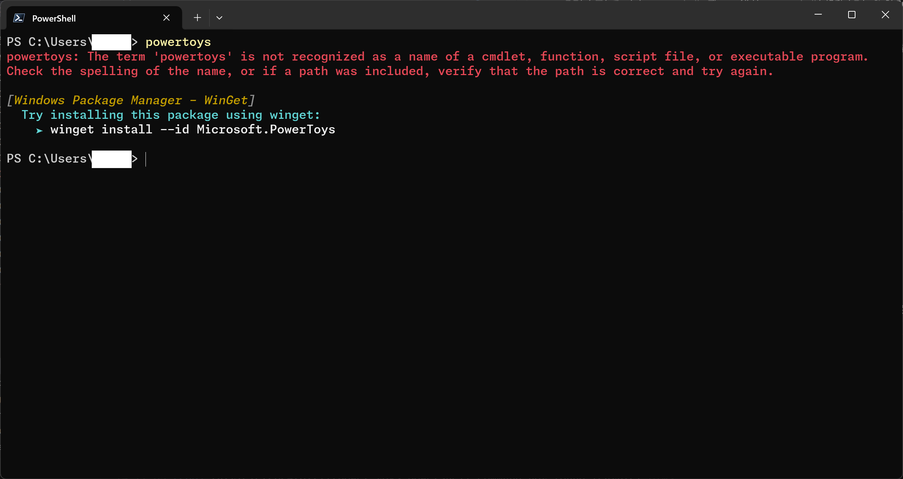

2023年1月10日にリリースされた[PowerToys](https://github.com/microsoft/PowerToys) v0.77.0では、**PowerShellでコマンドの実行に失敗したときに、足りないパッケージを提案する「Command Not Found」機能**が追加されました。

この記事では、Command Not Foundの特徴や使い方、動作しない場合の対処法などについて紹介します。

## Command Not Foundとは

「Command Not Found」は、パッケージの不足が原因でPowerShellコマンドの実行が失敗したときに、**インストールするべきパッケージを提案してくれる機能**です。

Windowsのパワーユーザー向けに高度で便利な機能を数多く提供している、Microsoft製のオープンソースツール「[PowerToys](https://github.com/microsoft/PowerToys)」のv0.77.0以降に搭載されています。

PowerShellでコマンドを実行しようとしたとき、次のようなエラーメッセージが表示されたことはありませんか？

```markdown
powertoys: The term 'コマンド名' is not recognized as a name of a cmdlet, function, script file, or executable program.
Check the spelling of the name, or if a path was included, verify that the path is correct and try again.
```

これは、実行しようとしたコマンドが見つからなかったときに発生するエラーです。

Command Not Foundは、PowerShellコマンドの実行時にコマンドが見つからないというエラーが発生すると、そのコマンドを提供しているパッケージをインストールするためのコマンドを表示してくれます。

パッケージ名を検索してインストールする必要がなくなるので、コマンドの実行に失敗したときに、すぐに対処できるようになります。

## Command Not Foundの使い方

### インストール方法

:::note[前提条件]
次のソフトがインストールされていることを前提としています。

- **PowerToys v0.77.0以降**
- **PowerShell v7.4以降**

Command Not Foundは、PowerToysのv0.77.0以降に搭載されています。また、PowerShell v7.4以降を利用している必要があります。
:::

Command Not Foundはデフォルトでは有効化されていないため、使用するには最初に必要なコンポーネントをインストールする必要があります。

動作に必要なコンポーネントをインストールするには、PowerToysの設定画面を開き、［Command Not Found］タブを表示します。


*Command Not Foundの設定画面*

［インストール］という青いボタンが表示されているので、これをクリックします。コマンドプロンプトが自動で起動し、必要なコンポーネントがインストールされます。

インストールが完了すると、［インストール］ボタンが［アンインストール］ボタンに代わり、横に［Installed ✅］という表示が追加されます。


*必要なコンポーネントをインストールしたようす*

また、追加で依存関係をインストールする必要がある場合は、該当する項目に［Not detected ✕］というテキストと［インストール］ボタンが表示されます。この［インストール］ボタンをクリックすると、その依存関係が自動的にインストールされます。

:::tip
依存関係をインストールする際に、リポジトリーを信頼するかどうかを確認するメッセージが表示されることがあります。その場合は、`Y`キーと`Enter`キーを押して、リポジトリーを信頼します。


:::

PowerToysの設定画面でCommand Not Foundモジュールが［Installed］になっており、すべての依存関係が［Detected］になっているのを確認したら、準備は完了です。PowerToysの設定画面は閉じてしまって大丈夫です。


*Command Not Foundの実行に必要なものをすべてインストールした画面*

### 実際に使ってみる

Command Not Foundを利用する準備が整ったので、実際に使ってみましょう。

Command Not Foundをインストールしてから初めてPowerShellを起動すると、次のようなメッセージが表示されます。このメッセージは、初回起動時にのみ表示されます。

```powershell mark={2}
PowerShell 7.4.0
Loading personal and system profiles took 637ms.
PS C:\Users\UserName>
```

このメッセージは、PowerShellのプロファイル（スタートアップスクリプト）を読み込んでいることを示しています。PowerShellのプロファイルは、PowerShellを起動するたびに読み込まれます。

PowerShellのプロファイルは、PowerShellの起動時に実行するコマンドを記述できる機能です。Command Not Foundは、PowerShellプロファイルを利用して動作します。

では、実際にインストールされていないコマンドを実行し、Command Not Foundを使ってみましょう。私の場合は`powertoys`コマンドをインストールしていないので、これで試してみます。


*powertoysコマンドを実行したようす*

`powertoys`コマンドが見つからないというエラーメッセージとともに、Command Not Foundが`powertoys`をインストールするための`winget`コマンドを提案してくれました。

提案されたコマンドを実行すると、`powertoys`コマンドを提供しているパッケージがインストールされます。

```powershell
winget install --id Microsoft.PowerToys
```

## Command Not Foundが動作しない場合の対処法

Command Not Foundが動作しない場合は、次の対処法を試してみてください。

### PowerShellのバージョンを確認する

Command Not Foundは、**PowerShell v7.4以降を利用している必要があります**。PowerShellのバージョンを確認して、v7.4以降を利用しているかどうかを確認してください。

PowerShellのバージョンは、PowerShellを起動して最初に表示されるメッセージか、`$PSVersionTable`コマンドで確認できます。

```powershell mark={1} "7.4.0" title="PowerShellを起動して最初に表示されるメッセージ"
PowerShell 7.4.0
PS C:\Users\UserName>
```

```powershell mark={5,7} "7.4.0" title="$PSVersionTableコマンドで確認した結果"
PS C:\Users\UserName> $PSVersionTable

Name                           Value
----                           -----
PSVersion                      7.4.0
PSEdition                      Core
GitCommitId                    7.4.0
OS                             Microsoft Windows 10.0.22621
Platform                       Win32NT
PSCompatibleVersions           {1.0, 2.0, 3.0, 4.0…}
PSRemotingProtocolVersion      2.3
SerializationVersion           1.1.0.1
WSManStackVersion              3.0
```

### PowerShellを再起動する

**PowerShellを一度終了してから再度起動**してみてください。これによって、PowerShellプロファイル（スタートアップスクリプト）が再読み込みされ、Command Not Foundが適用される可能性があります。

### PowerShellを再インストールする

Command Not Foundには[既知の問題](https://github.com/microsoft/PowerToys/issues/30818)が複数存在しています。とくに、**MSIXファイルを利用してPowerShellをインストールしている場合は、Command Not Foundが動作しない**ようです。

MSIX経由でインストールしている場合は、PowerShellを一度アンインストールしてから、次の`winget`コマンドを使って再インストールしてみてください。

```powershell
winget install --id Microsoft.Powershell --source winget
```

### PowerShellを使っていることを確認する

Windowsには、「Windows PowerShell」と「PowerShell」が存在し、これらは別のものです。Command Not Foundは「PowerShell」に対してのみ動作します。また、標準のコマンドプロンプトに対しても動作しません。

**Windows PowerShellではなくPowerShellを使っていることを確認してください**。

## まとめ

PowerShellでコマンドの実行に失敗したときに、足りないパッケージを提案してくれる「Command Not Found」機能について紹介しました。

Command Not Foundは、PowerToysのv0.77.0で追加された機能です。

PowerToysにはさまざまな便利機能が搭載されているので、ぜひ使ってみてください。
