import ArticleCard from "@components/ArticleCard.astro";

Misskeyのもっとも人気なインスタンス（サーバー）である **「Misskey.io」に最近流行りのスイカゲーム的な何かが追加された**ので、遊んでみました。

## Misskeyとは

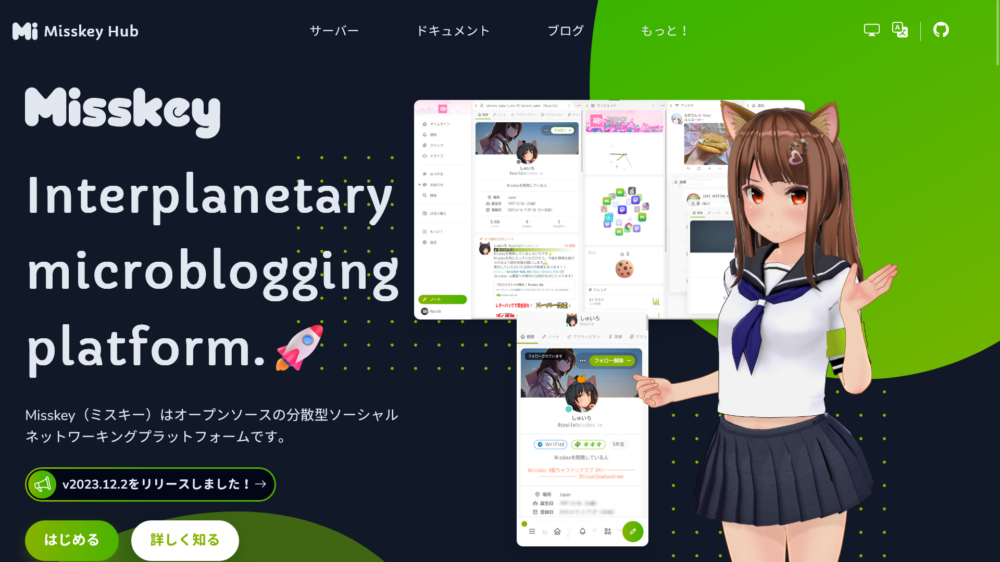
*Misskeyプロジェクトの[公式サイト](https://misskey-hub.net/ja/)のスクリーンショット*

Misskeyは、**Twitterの代替のSNSとして注目されている分散型のSNS**です。アカウントの作り方や使い方などは、こちらの記事で詳しく解説しています。

<ArticleCard link="/article/2024/01/08/how-to-start-your-misskey-life/" />

Misskeyには複数のサーバー（インスタンス）があり、それらが相互に接続されています。また、ActivityPubという仕組みに対応しており、ActivityPubを採用した他のSNS（Mastodonなど）と相互にやり取りできることも特徴です。

たとえば、**MisskeyのアカウントでMastodonのアカウントをフォローしたり、逆にMastodonのアカウントでMisskeyのアカウントをフォロー**したりといったことができます。

Meta（旧Facebook）が開発したThreadsも、近いうちにActivityPubに対応すると発表されています。Threadsの登録方法や使い方はこちらの記事で紹介しています。

<ArticleCard link="/article/2023/07/06/meta-twitter-competing-app-threads/" />

## スイカゲームとは

[スイカゲーム](https://www.aladdinx.jp/pages/suika-game)は、2023年9月ごろから流行したゲームです。

フルーツを落とすゲームで、同じ種類のフルーツ同士が衝突すると1つになり、1段階大きなフルーツになります。これを繰り返して、最終的にはスイカになるというものです。

プレイヤーはフルーツを落とすタイミングと横方向の位置を操作できるようになっています。

## バブルゲームとは

2024年1月7日に、Misskeyのもっとも人気なインスタンスである「Misskey.io」に、「バブルゲーム」という名前のスイカゲーム的な何かが[追加](https://github.com/MisskeyIO/misskey/pull/336)されました。

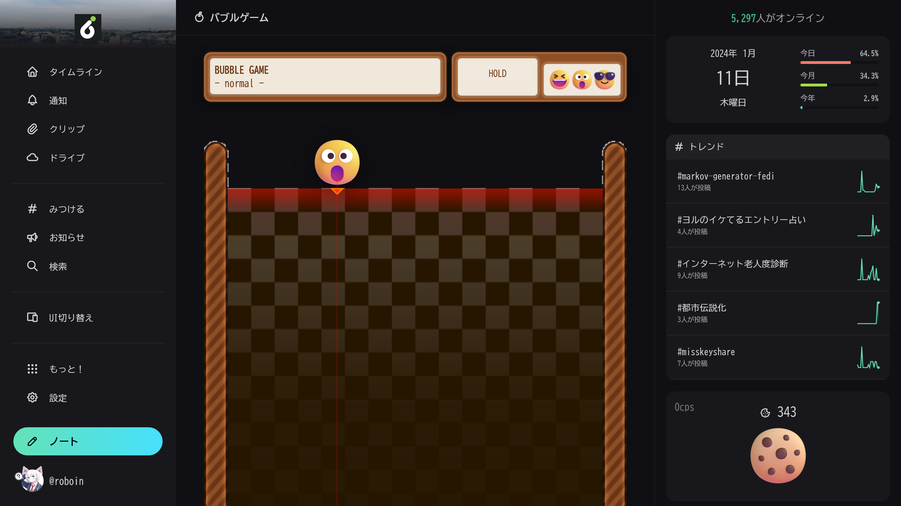
*バブルゲームのスクリーンショット*

本家のスイカゲームと違い、バブルゲームでは顔の絵文字または数字の絵文字を落とすようになっています。実際に試してみたのですが、かなり中毒性が高いですww

:::note
記事執筆時点でバブルゲームはMisskey本体には取り込まれていないので、Misskey.ioでのみプレイできます。

しかし、[Misskey本体に取り込む動き](https://github.com/misskey-dev/misskey/pulls?q=%E3%83%90%E3%83%96%E3%83%AB%E3%82%B2%E3%83%BC%E3%83%A0)はあるようなので、近いうちに他のインスタンスでもプレイできるようになるかもしれません。
:::

## バブルゲームの遊び方

バブルゲームをプレイするには、サイドバーの［もっと！］から［Misskey Games］を選択します。

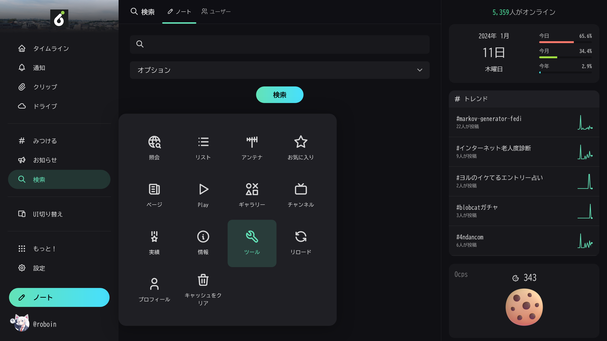

Misskeyに搭載されているゲームの一覧が表示されるので、［Bubble Game］をクリックします。

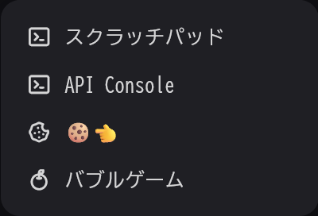

バブルゲームのタイトル画面が表示されます。

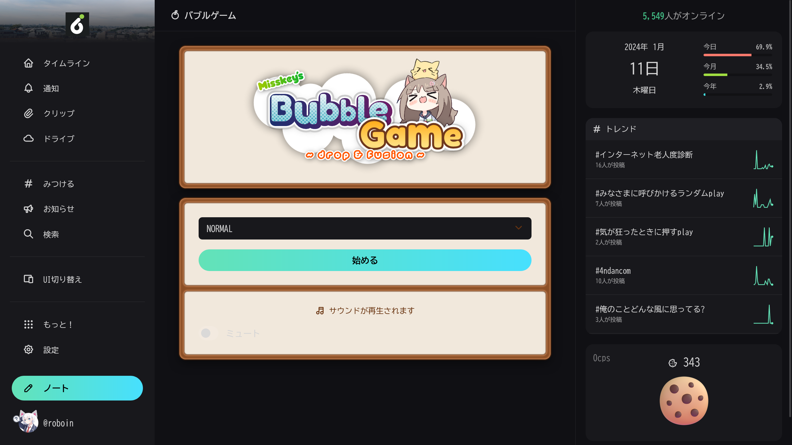

この画面で、［NORMAL］と書かれている部分をクリックすると、ドロップダウンリストが表示され、［NORMAL］［SQUARE］［YEN］［SWEETS］のいずれかを選択できます。

［NORMAL］は顔の絵文字、［SQUARE］は数字の絵文字、［YEN］はお金の絵文字、［SWEETS］はお菓子を落とすモードです。

*［NORMAL］モードのスクリーンショット*

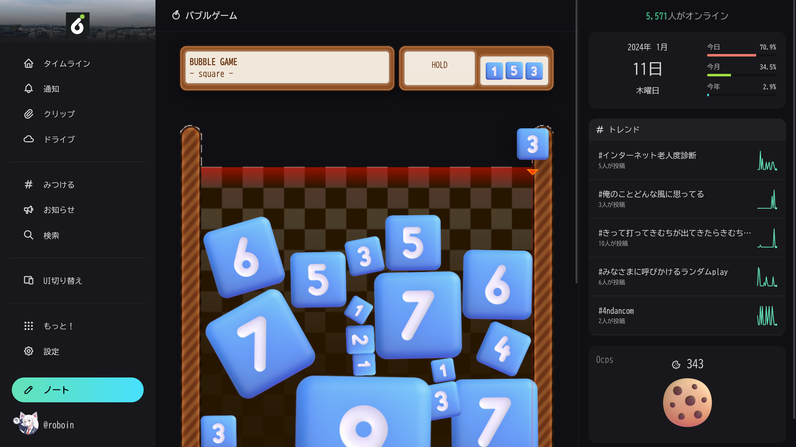
*［SQUARE］モードのスクリーンショット*

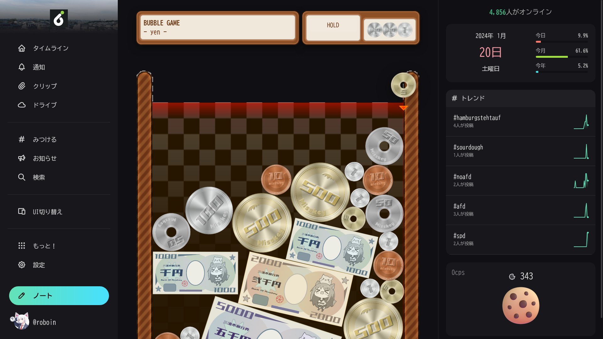
*［YEN］モードのスクリーンショット*

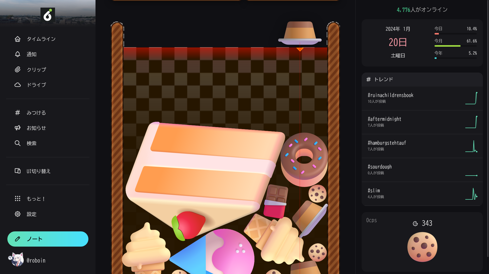
*［SWEETS］モードのスクリーンショット*

モードを選択したら、［始める］ボタンをクリックするとゲームがスタートします。

パソコンの場合は、マウスの位置に応じて絵文字を落とす位置を調整でき、クリックすると絵文字が落下します。スマホの場合は画面をタップしたまま横にスワイプすると位置を調整でき、指を離すと絵文字が落下します。

また、バブルゲームには［HOLD］という機能があり、このボタンをクリックすると絵文字を1つキープできます。すでにHOLDしている絵文字がある場合は、その絵文字と次の絵文字を交換できます。

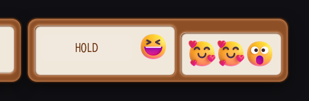
*絵文字をHOLDしたようす*

画面の下部には現在のスコアと最高スコアが表示されており、その隣には設定ボタンがあります。設定ボタンをクリックすると、BGMと効果音の音量を調整できます。［Surrender］というボタンをクリックすると、ゲームが終了します。

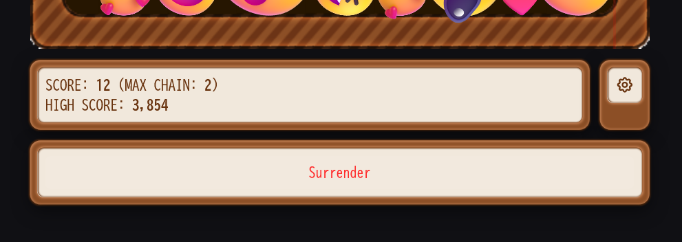
*バブルゲームの画面下部のスクリーンショット*

ゲームを終了するといくつかのボタンが表示されます。［完了］をクリックするとゲームのタイトル画面に戻ります。［リプレイを見る］をクリックすると、自分のプレイを見返せます。［共有］では、スコアとスクリーンショットをMisskeyに投稿できます。［Retry］をクリックするとタイトル画面に戻らずにもう一度プレイできます。

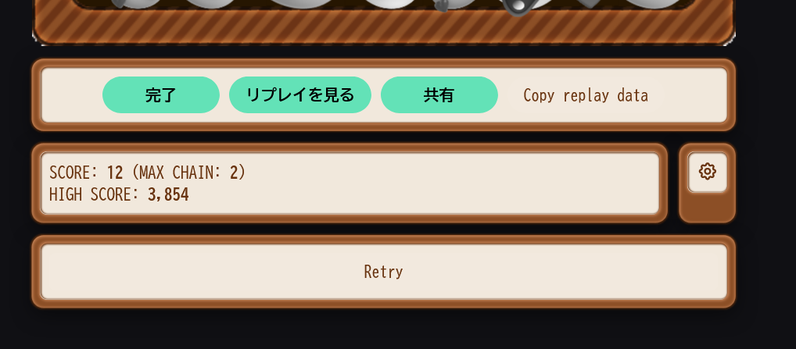
*ゲームを終了したときに表示されるボタン*

## まとめ

Misskey.ioのバブルゲームは頻繁に更新されており、この記事を執筆している間にもランキング機能の実装など、次々と新しい機能が追加されています。

このバブルゲームは、Misskey.ioを使っていれば誰でも遊べるので、ぜひ高得点を目指してみてください。
