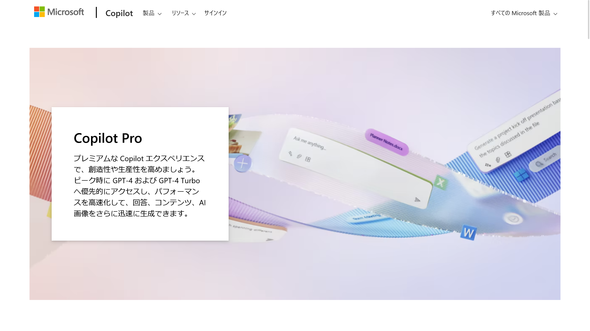
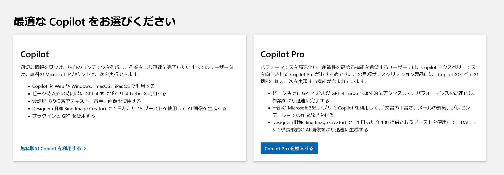
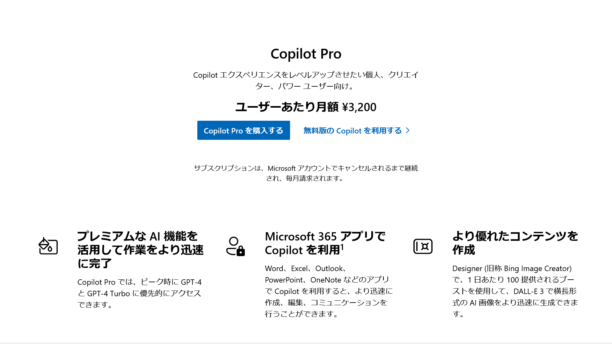

import ArticleCard from "@components/ArticleCard.astro";

Microsoftが提供するCopilotは、コードやテキストの生成を支援するAIツールです。Copilotには無料版と有料版（Copilot Pro）があり、無料版では基本的な機能のみが利用できます。

この記事では、**Copilot Proの無料版との違いや、料金、登録方法などを解説**します。Copilot Proの導入を検討している方は、ぜひ参考にしてください。

<!-- toc -->

## Copilot Proとは？無料版との違い

*画像：[Copilot Pro プラン & 価格 - 最新の AI モデル、チャット ツール & アシスタント | Microsoft Store](https://www.microsoft.com/ja-jp/store/b/copilotpro)*

Copilot Proは、**Copilotの有料のサブスク**です。無料版のCopilotと比較して、GPT-4とGPT-4 Turboへの優先アクセス、一部のMicrosoft 365アプリでのCopilotの使用、AI画像生成ブーストの増加などの追加機能を利用できます。

Copilot Proの公式ページには、次のように記載されています。

Copilot Proは、Wordでは文書の下書きや要約を作成し、PowerPointではアウンとラインやデザインを作成し、Outlookでは長いメールを要約したり返信の下書きを作成したりできます。

その他にも、OneNoteではノートの整理や書き換え、Excelでは数式の生成やデータの分析の補助ができます。

### Copilot Proの料金

Copilot Proの料金は、記事執筆時点では**1ユーザーあたり月額3,200円**です。将来的に価格が改定される可能性もあるため、実際に導入を検討する際には、公式ページで最新の情報を確認してください。

### Copilot Proは個人でも利用できる？

Copilot Proの[公式ページ](https://www.microsoft.com/ja-jp/store/b/copilotpro)には、次のように書かれています。したがって、Copilot Proは個人でも利用できます。

> Microsoft 365 Personal または Microsoft 365 Family サブスクリプションもお持ちの場合は、Copilot Pro サブスクリプションを購入すると、一部の Microsoft 365 アプリで Copilot を利用できます。

### Copilot Proは法人でも利用できる？

Copilot Proの[公式ページ](https://www.microsoft.com/ja-jp/store/b/copilotpro)には、次のように書かれています。したがって、**法人でCopilotをMicrosoft 365と連携して利用するには、Copilot ProではなくCopilot for Microsoft 365を購入する必要があります**。

> 一般法人向け Microsoft 365 サブスクリプション (Microsoft 365 Business Basic、Microsoft 365 Business Standard、Microsoft 365 Business Premium、Microsoft 365 Apps for Business) をお持ちの場合、Copilot Pro では Microsoft 365 アプリで Copilot を利用できません。一般法人向け Microsoft 365 Business サブスクリプションで Copilot を利用するには、[Copilot for Microsoft 365](https://www.microsoft.com/microsoft-365/microsoft-copilot) を購入してください。

Copilot for Microsoft 365を使うと、OneDriveとCopilotが統合された機能「Copilot in OneDrive」を利用できるようになります。Copilot in OneDriveを使うと、OneDrive内のファイルをCopilotで検索したり要約したりできます。

Copilot in OneDriveについては、こちらの記事で解説しています。

<ArticleCard link="/article/2024/03/02/copilot-in-onedrive/" />

## 他社との比較

Googleは、同社の高度なAI「Gemini Advanced」を利用できる「Google One AIプレミアム」を月額2,900円で提供しています。AIプレミアムプランの詳細については、次の記事で解説しています。

<ArticleCard link="/article/2024/02/09/google-one-ai-premium-features-and-differences-from-other-plans/" />

また、ChatGPTの開発元のOpenAIは、ChatGPTで高性能な「GPT-4」というモデルを利用できるChatGPT Plusプランを月額20ドル（約2,990円）で提供しています。

Copilot Proは、これらのサービスと比較して、Microsoft 365との連携が可能である点が特徴です。Office製品をよく利用している場合は、Copilot Proを検討してみるとよいでしょう。

## Copilot Proの登録方法

:::note[Copilot Proの無料体験]
Microsoftは、Copilot Proの30日間無料体験を提供しています。無料体験を利用する方法については、こちらの記事で解説しています。

<ArticleCard link="/article/2024/03/19/how-to-get-copilot-pro-30-days-free-trial/" />

:::

Copilot Proを購入するには、[公式サイト](https://www.microsoft.com/ja-jp/store/b/copilotpro)にアクセスします。少しスクロールすると［Copilot Proを購入する］というボタンがあるので、これをクリックします。

まだMicrosoftアカウントにログインしていない場合は、ログインを求められます。Microsoftアカウントを持っていない場合は、アカウントを作成し、ログインします。

ログインすると購入画面が表示されるので、画面の指示に従って購入します。

:::note
Copilot Proを利用するには、Microsoftアカウントが必要です。

また、Copilot ProとMicrosoft 365を連携して利用するには、Microsoft 365に登録しているのと同じアカウントでログインする必要があります。
:::

## まとめ

この記事では、Copilot Proの無料版との違いや、料金、登録方法などを解説しました。

Copilotは無料でも十分に便利ですが、より高度で高速なCopilotを利用したい場合は、Copilot Proを検討してみてはいかがでしょうか。
