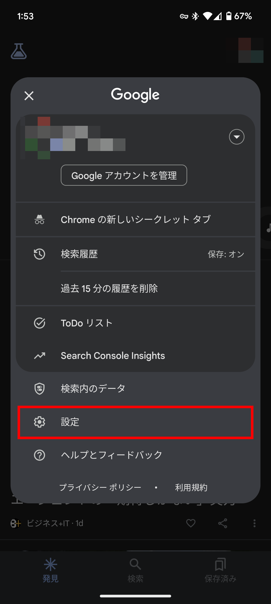
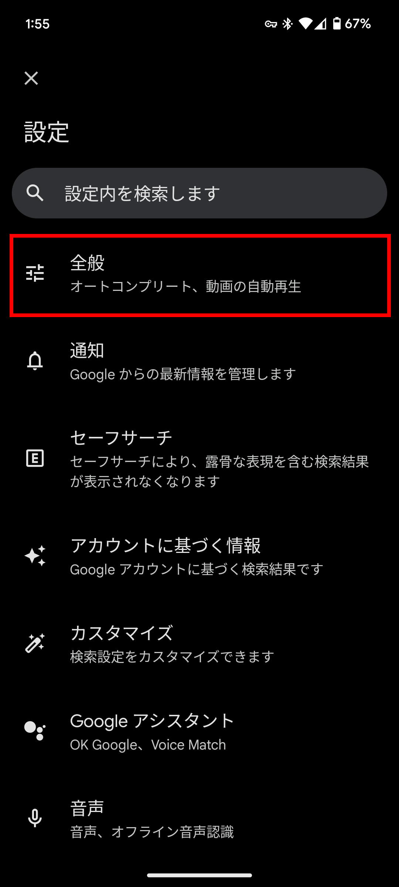
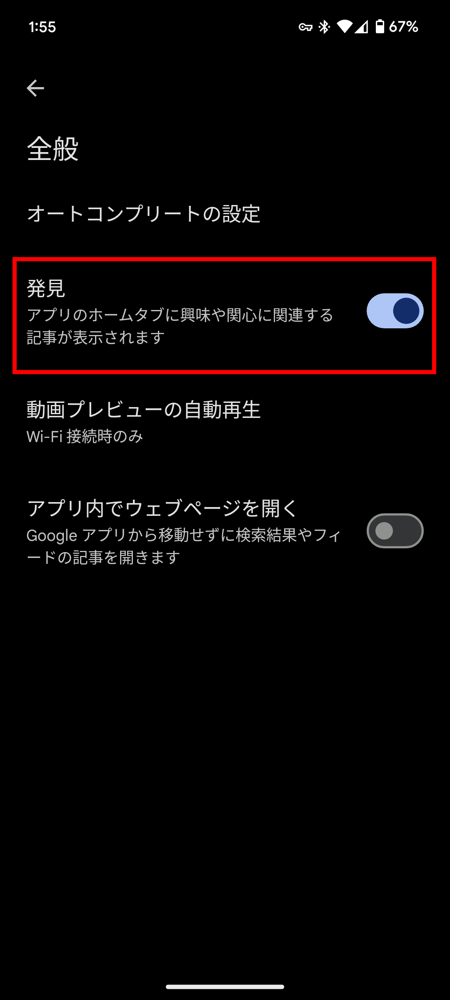
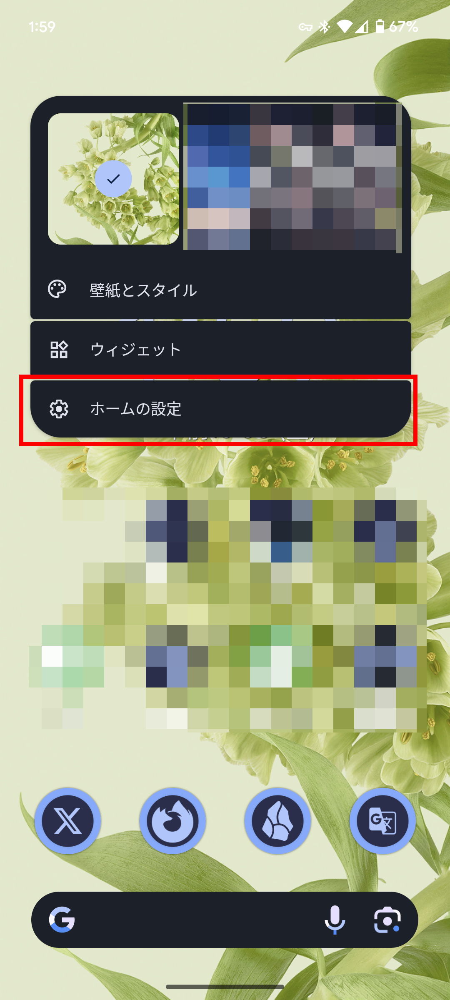
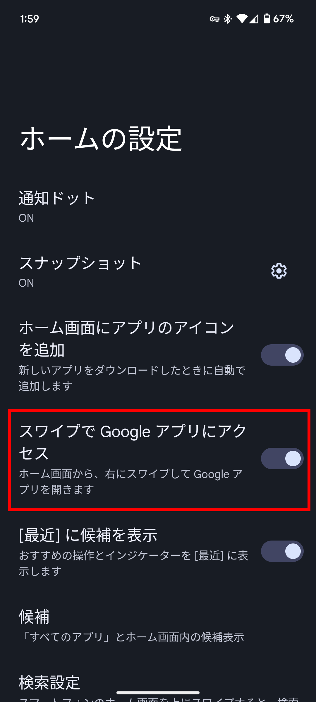

import ArticleCard from "@components/ArticleCard.astro";

Androidのホーム画面には、Google Discoverという機能がデフォルトで表示されています。

Discoverはホーム画面をスワイプすると表示される画面で、**ニュースや天気、スポーツ、エンタメなどの情報をまとめて表示してくれる機能**です。

しかし、**Discoverがいらない場合は非表示にできます**。この記事では、Androidのホーム画面からGoogle Discoverを消す方法を解説します。

PC版のGoogleのWebサイトに表示されるDiscoverを非表示にする方法は、こちらの記事で解説しています。

<ArticleCard link="/article/2023/12/15/how-to-hide-google-discover-recommendation-feeds/" />

## Discoverとは？

Discoverについて、Googleの公式ドキュメントでは、次のように説明されています。

> Discover は Google 検索の一部で、ウェブとアプリのアクティビティに基づいて、ユーザーの興味や関心に関連するコンテンツを表示する機能です。
>
> （中略）
>
> Discover に表示されるコンテンツには、ユーザーの興味や関心に合ったさまざまなトピックが含まれます。ユーザーの興味や関心に基づいて、古いコンテンツでも有用で関連性が高い場合は表示されることがあります。
>
> —— [Google Discover の概要、掲載、表示方法 | Google 検索セントラル  |  ドキュメント  |  Google for Developers](https://developers.google.com/search/docs/appearance/google-discover?hl=ja)

このように、Discoverは自分の興味に最適化したオススメのコンテンツを表示してくれる便利な機能です。しかし、この機能を使わない人にとっては、邪魔なだけの機能になってしまいます。

では、このDiscoverフィードがいらないという人のために、ホーム画面のDiscoverを非表示にする方法を見ていきましょう。

## Discoverを非表示にする方法

**ホーム画面のGoogle Discoverを非表示にする方法は2つあります**。

1つは、ホーム画面のスワイプで表示される画面自体は残して、そこにDiscoverフィードを表示しないようにする方法です。もう1つは、ホーム画面のスワイプで表示される画面自体を消す方法です。

### Discoverフィードを非表示にする方法

**Discoverフィードのみを非表示にしてスワイプ時の画面はそのままにしたい場合**は、次の手順で設定を変更します。

まず、ホーム画面をスワイプするかGoogleアプリを開き、アカウントのアイコンをタップします。

メニューが表示されるので、その中の［設定］を選択します。

設定画面で［全般］>［発見］と進み、トグルスイッチをオフにします。

### スワイプで表示される画面を非表示にする方法

**ホーム画面のスワイプで表示される画面自体を消したい場合**は、次の手順で設定を変更します。

まず、ホーム画面の何もないところを長押し、メニューを表示します。

メニューの中の［ホームの設定］を選択します。設定画面が開いたら、［スワイプでGoogleアプリにアクセス］をオフにします。

## まとめ

この記事では、Androidのホーム画面からGoogle Discoverを消す方法を解説しました。

Discoverは、ホーム画面をスワイプすると表示される画面で、ニュースや天気、スポーツ、エンタメなどの情報をまとめて表示してくれる機能です。しかし、Discoverを表示したくない場合は、非表示にできます。

Discoverが不要だと感じる人はこの記事を参考にして、Discoverを非表示にしてみてください。
