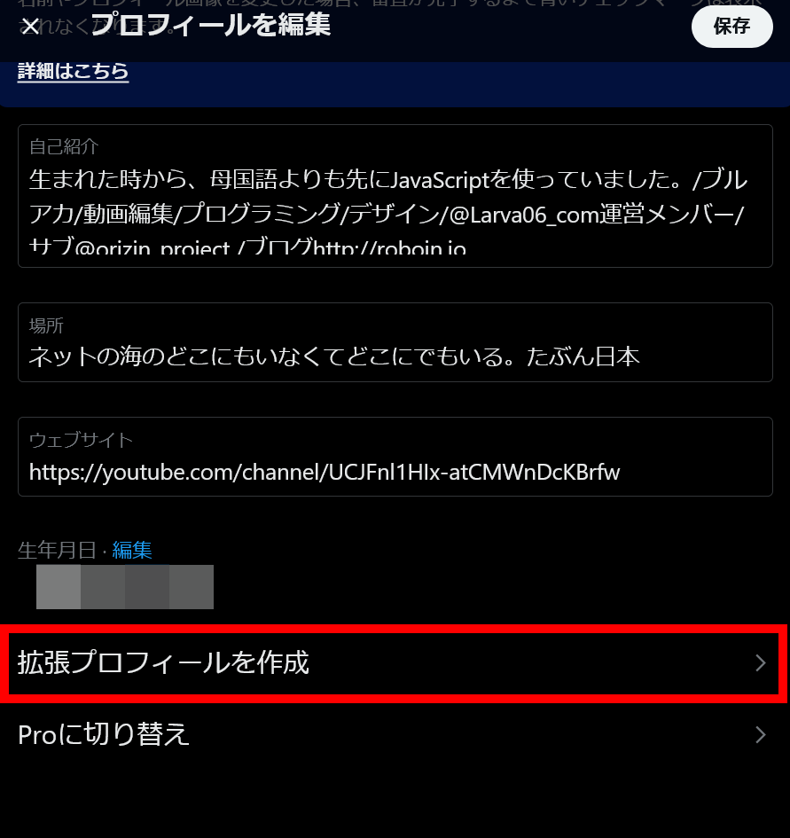
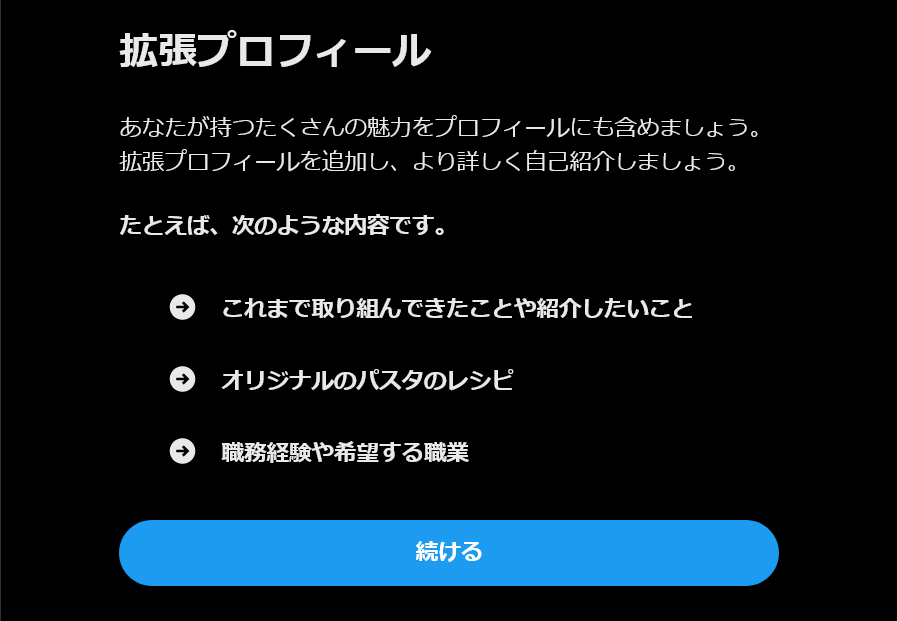
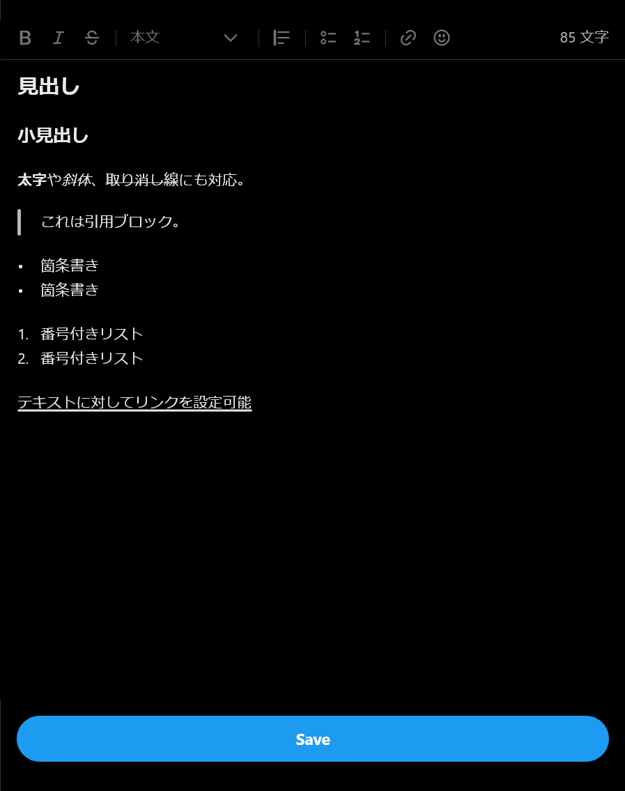

import ArticleCard from "@components/ArticleCard.astro";

**Twitter（X）に、プロフィールをより詳しく表示できる「拡張プロフィール」という機能が追加されました**。

この機能を使うと、プロフィールに「さらに表示」というボタンが追加され、そのボタンを押すと**通常よりも長いプロフィール**を表示できるようになります。

拡張プロフィールはプロフィール文の文字数制限を拡大するだけでなく、見出しや太字、斜体などの装飾も追加できます。

また、リンクを設定することもできるので、ポートフォリオや関連リンクを掲載したり、ホームページへのリンクを設定したりすることも可能です。

この記事では、拡張プロフィールの概要や使い方について解説します。

## 拡張プロフィールを使うには？

記事執筆時点では、拡張プロフィールを使うには**X Premiumに加入している必要があります**。

「プレミアム」と「プレミアムプラス」プランでは利用できるようですが、もっとも低価格なベーシックプランで利用できるかは不明です。

それぞれのプランの違いは、こちらの記事で解説しています。

<ArticleCard link="/article/2023/10/28/differences-between-3-twitter-plans/" />

また、Androidアプリは拡張プロフィールの編集・表示に対応していません。拡張プロフィールを編集したり表示したりするには、**iOSアプリかWeb版**を使う必要があります。

## 拡張プロフィールの設定方法

拡張プロフィールを使うにはまず、プロフィールの設定画面を開きます。プロフィールの設定画面を下までスクロールすると、［拡張プロフィールを作成］というボタンが表示されます。



ボタンをクリックすると、拡張プロフィールについての説明が表示されます。



説明を読んだら、［続ける］ボタンをクリックします。テキストボックスが表示されるので、拡張プロフィールに表示したい内容を入力します。



拡張プロフィールの編集画面には、いくつかのボタンが並んでいます。左半分に並んでいるボタンは、左から順に「<b>太字</b>」「*斜体*」「~~取り消し線~~」「見出し」の設定です。


右半分のボタンは、左から順に「引用ブロック」「箇条書き」「番号付きリスト」「リンク」「絵文字」の設定です。


拡張プロフィールの文字数の上限は不明ですが、筆者がテストしたところ**少なくとも2万字まで**は設定できました。画像の挿入には対応していないようです。

拡張プロフィールを入力し終わったら、必ず［Save］ボタンを押して保存してください。保存しないと、入力した内容は失われます。

## 拡張プロフィールの表示方法

拡張プロフィールを表示するには、iOSアプリかWeb版のTwitterでプロフィールを表示します。通常のプロフィールの文章の下に［さらに表示］というボタンが表示されているので、そのボタンをクリックします。

拡張プロフィールの画面を直接送りたい場合は、次のようなURLを使います。

```markdown
https://twitter.com/<スクリーンネーム>/bio
```

たとえば、スクリーンネームが`@x`なら、次のURLを使います。

```markdown
https://twitter.com/x/bio
```

ただし、URLを送ったとしても、拡張プロフィールに対応していないAndroidアプリでは表示できません。

## 拡張プロフィールが使えない場合

拡張プロフィールが使えない場合は、次の項目を確認してみてください。

### iOSアプリかWeb版を使っている

拡張プロフィールの表示と編集は、iOSアプリとWeb版のTwitterでのみ利用できます。現時点では、Androidアプリでは利用できません。

### アプリをアップデートする

iOSアプリを使っているのに拡張プロフィールを利用できない場合は、アプリを最新バージョンにアップデートしてみてください。

アプリのバージョンが古いと新しい機能を使えない可能性があります。

また、一般的に、アプリのアップデートでは新機能の追加やバグの修正、脆弱性の修正なども含まれています。アプリは常に最新バージョンにアップデートしておきましょう。

### ページを再読み込みする

Web版のTwitterを使っているにもかかわらず拡張プロフィールを使えない場合は、ページを再読み込みしてみてください。

また、Webブラウザーのキャッシュを削除すると使えるようになる可能性があります。

### X Premiumに加入していることを確認する

拡張プロフィールは、記事執筆時点ではX Premiumに加入しているユーザーのみが利用できます。

筆者はX Premiumの「プレミアム」プランで拡張プロフィールが使えることを確認しています。また、Twitterで検索すると「プレミアムプラス」プランでも利用できるようです。

もっとも安価な「ベーシック」プランで利用できるかどうかは、明確な情報がないため不明です。

## まとめ

拡張プロフィールは、Twitterのプロフィール機能を拡充する便利な機能です。プロフィール文の文字数制限を拡大したり、装飾を追加したり、リンクを設定したりすることで、より自分や自分の活動をアピールできます。

拡張プロフィールは課金していないと使えない機能ですが、閲覧は課金していなくても可能です。まだ利用していない方は、ぜひ試してみてください。
