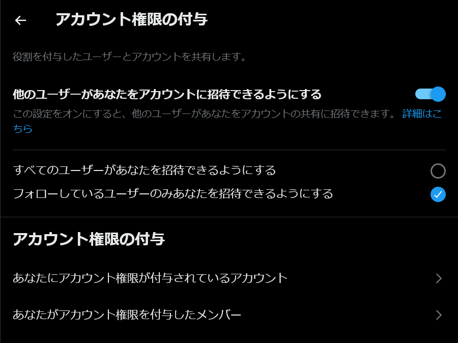
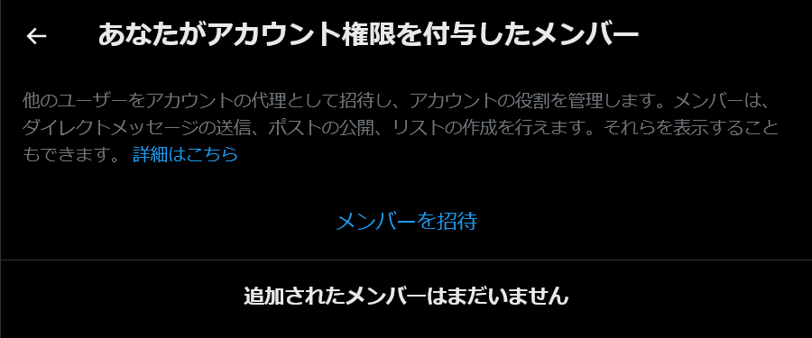
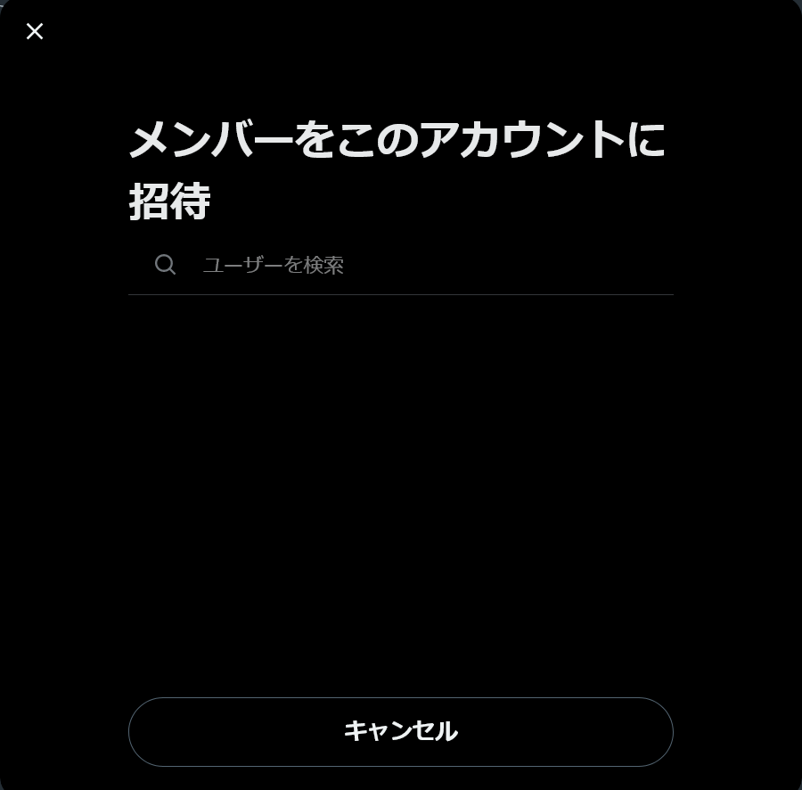
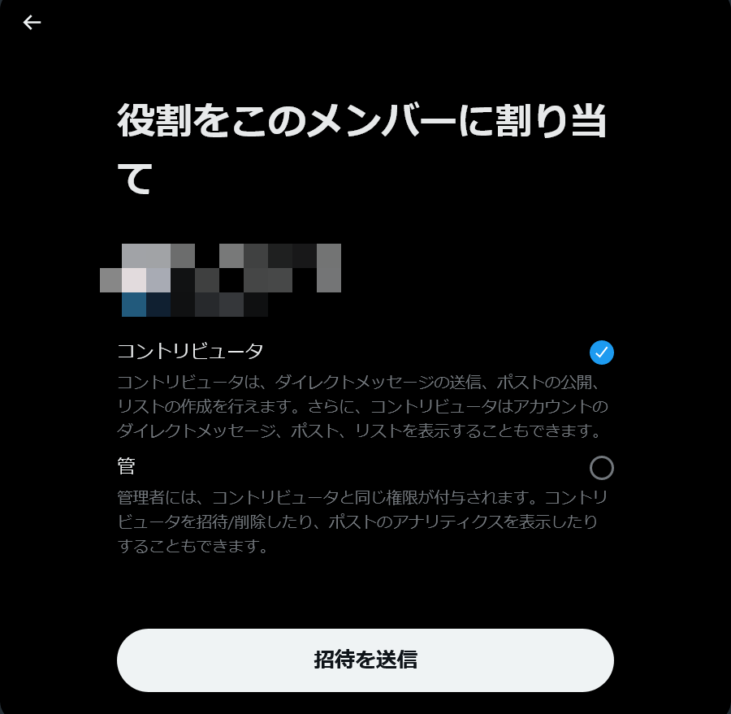

Twitter（現X）には、「**アカウント権限の付与**」という便利な機能があります。この機能を使うと、**パスワードを共有せずに複数のユーザーで1つのアカウントを共同利用できます**。

たとえば、企業アカウントやプロジェクトチーム等での活用に便利です。この記事では、アカウント権限の付与について、どのようにして使えるのかを分かりやすく紹介します。

## アカウント権限の付与とは？

「アカウント権限の付与」機能を使うことで、**パスワードを共有することなく、複数人で安全に1つのTwitterアカウントを利用できます**。管理者は他の利用者をアカウントに招待し、役割を割り当てたり削除したりできます。

アカウント権限の付与では、アカウントの「管理者」と「コントリビューター」の2種類の役割を設定できます。アカウントの所有者と管理者、コントリビューターの3種類の違いは次のようになっています。

- **所有者**：アカウントのパスワードを知っており、通常通りにログインしている人。他者を管理者やコントリビューターとして招待できる
- **管理者**：ツイートの投稿や削除、リストやコレクションの作成、ツイートアナリティクスの表示などができる。また、他者を管理者やコントリビューターとして招待できる。アカウントの設定の変更はできない
- **コントリビューター**：ツイートの投稿や削除、リストやコレクションの作成ができる。アカウントの設定の変更はできない

:::caution
この機能はWeb版のTwitterとX Pro（TweetDeck）に対応しています。権限の付与やコラボレーターの招待などの設定はWeb版のTwitterでのみ可能です。
:::

## アカウント権限の付与のメリット

アカウント権限の付与には、パスワードを共有する従来の方法と比べて次のようなメリットがあります。

### セキュリティーの強化

パスワードを共有する必要がなくなるため、**アカウントへの不正アクセスのリスクが大幅に減少**します。

アカウントのパスワードを共有すると、パスワードを知っている人を増やすことになります。パスワードを知っている人が増えれば増えるほど、パスワードの漏えいや不正アクセスのリスクが高まります。

信頼できる人にだけパスワードを教えていたとしても、パスワードを共有する過程で漏えいする可能性があります。また、アカウントが不正アクセスされた際には、パスワードを知っている人全員を疑わなければなりません。

アカウント権限の付与ではパスワードを共有する必要がないため、このようなリスクを回避できます。

### 適切な権限管理

アカウント権限の付与では**役割に応じた権限分担**ができます。

セキュリティーの観点では、各ユーザーには必要最低限の権限のみを与えるのが望ましいといえます。しかし、パスワードを共有すると、パスワードを知っている人はアカウントに関するすべての操作をできてしまいます。

アカウント権限の付与では、「管理者」「コントリビューター」という2つの権限に分かれており、これによって必要最低限の適切な権限を与えられます。

### 柔軟な役割の変更と管理

アカウントの使用目的に応じてユーザーの役割や権限を容易に変更できるため、**フレキシブルな運用が可能**になります。

また、不要になった権限は簡単に削除できるため、アカウントの管理が容易になります。アカウントにアクセスできる人を減らすときに、パスワードを変更する必要がないため、手間が省けます。

### 公式に提供されている機能

アカウント権限の付与は、公式に提供されている機能です。そのため、**セキュリティーの観点からも安心して利用**できます。

サードパーティー製のツールを使うと、そのツールの運営者に悪意があった場合にアカウントを不正に操作される可能性があります。また、悪意がなかったとしても、使うツールを増やすほど情報漏えいなど、セキュリティーのリスクが高まります。

アカウント権限の付与を使うことで、新しいツールを使う必要がなくなり、セキュリティーのリスクを減らせます。

## アカウント権限の付与のデメリット

Twitterのアカウント権限の付与機能は、複数人でアカウントを管理する必要がある場合に非常に便利ですが、注意すべきポイントも存在します。

### 誤操作のリスク

コントリビューターにもアカウントの代表として相応の操作が許可されるため、**誤った操作によるリスクが存在**します。

たとえば、コントリビューターではツイートのアナリティクスの表示やアカウントの設定の変更はできませんが、自由にツイートやリツイートができます。

人間が操作する以上、誤ったアカウントで投稿してしまう、いわゆる「誤爆」のリスクは存在します。また、コントリビューターのアカウントが乗っ取られたり不正アクセスを受けたりした場合には、悪意のある第三者によってアカウントを操作される可能性があります。

### 権限管理の複雑化

多数のユーザーに権限を付与することで、誰がどのような操作をできるのか、**管理が複雑化する可能性**があります。

パスワードを共有した場合は誰がパスワードを知っているかを把握しなければならず、一方でアカウント権限の付与では誰がどのような権限をもっているか一覧で確認できます。そういった意味では、アカウント権限の付与の方が管理しやすいかもしれません。

### 初期設定の手間

アカウント権限を付与するためには設定でユーザーを招待し、役割を割り当てる必要があります。しかも、**この設定は権限を付与する側と付与される側の両方で必要**です。

設定の手軽さでは、パスワードを共有する方が優れているといえます。しかし、アカウント権限の付与は一度設定すれば、その後は簡単に権限を変更できるため、長期的には手間が省ける可能性があります。

### 権限を付与される側にもアカウントが必要

アカウント権限の付与を受ける側にも、**アカウントが必要**です。

パスワードを共有する方法では、パスワードを知っている人はアカウントを持っていなくてもアカウントを操作できます。しかし、アカウント権限の付与では、権限を付与される側にもアカウントが必要です。

## アカウント権限を付与する方法

アカウント権限を付与するには、権限を付与される側と付与する側の両方で設定が必要です。まずは、権限を付与される側の設定方法を紹介します。

### 権限を付与される側の設定方法

まず、Web版のTwitterで設定を開きます。［セキュリティとアカウントアクセス］>［アカウント権限の付与］を選択します。

この画面で、［他のユーザーがあなたをアカウントに招待できるようにする］をオンにしてください。

*［アカウント権限の付与］の設定ページ*

［すべてのユーザーがあなたを招待できるようにする］と［フォローしているユーザーのみあなたを招待できるようにする］については、適切な方を選択してください。

権限を付与する側のアカウントをフォローしている場合は後者、そうでない場合は前者を選択してください。どちらを選択すればよいか分からない場合は、前者を選択しておけば問題ありません。

さて、これで権限を付与される側の設定は完了です。次に、権限を付与する側の設定方法を紹介します。

### 権限を付与する側の設定方法

まず、Web版のTwitterで設定を開きます。［セキュリティとアカウントアクセス］>［アカウント権限の付与］を選択します。

*［アカウント権限の付与］の設定ページ*

［あなたがアカウント権限を付与したメンバー］を開き、［メンバーを招待］をクリックします。

*［あなたがアカウント権限を付与したメンバー］の設定ページ*

アカウントの検索画面が表示されるので、権限を付与したいユーザーを検索してください。アカウント名やスクリーンネームで検索できます。

*アカウントの検索画面*

検索結果から該当するユーザーをクリックすると、権限の設定画面が表示されます。ここで、役割を選択して［招待を送信］をクリックしてください。なお、［管］となっているのはおそらく翻訳ミスで、［管理者］のことです。

*権限の設定画面*

### 権限の付与の承認

権限を付与するための招待を送ると、付与される側に通知が届きます。付与される側は、［アカウント権限の付与］の設定ページかメールから、招待を承認する必要があります。

## 権限を管理する方法

権限を付与したユーザーの権限を変更したり削除したりするには、権限を付与する側のアカウントで設定を開きます。アカウント権限の付与の設定画面を開き、［あなたがアカウント権限を付与したメンバー］をクリックします。

権限を付与したメンバーの一覧が表示されるので、この画面で権限を変更したり削除したりできます。とくに、セキュリティーの観点から、権限が不要になったユーザーは直ちに削除することをオススメします。

## 権限を付与されたアカウントに切り替える方法

アカウント権限の付与の設定が完了したら、権限を付与されたアカウントに切り替えられるようになります。

Web版のTwitterの左下（スマホでは左上）には、現在ログインしているアカウントが表示されます。これをクリックすると、［委任アカウント］として権限を付与されたアカウントが表示されます。委任アカウントに切り替えると、そのアカウントとしてツイートやリツイートなどができるようになります。

なお、この機能はアプリ版のTwitterでは利用できません。

## その他

### どの権限を付与すればよいか

アカウント権限の付与では、管理者とコントリビューターの2種類の権限があります。

一般に、セキュリティーの観点から権限は必要最小限にしておくのが望ましいといえます。したがって、**どちらの権限を付与すればよいか迷ったら、コントリビューターを選択するのが無難**です。

一方で、管理者しか使えない機能を使う必要がある場合は、管理者を選択しましょう。

### 設定項目が見つからない

アカウント権限の付与の設定項目が見つからない場合は、**Web版のTwitterを使っていることを確認してください**。

アカウント権限の付与は、アプリ版のTwitterには対応していません。また、X Pro（TweetDeck）では付与された権限を使って投稿などができますが、権限の設定の変更は通常のWeb版のTwitterでしかできません。

### アカウント権限を付与できない

アカウント権限を付与できない場合は、**相手が権限の付与を受け入れる設定にしていない可能性があります**。

[権限を付与される側の設定方法](#権限を付与される側の設定方法)で説明したように、権限を付与される側は、［セキュリティとアカウントアクセス］>［アカウント権限の付与］の設定ページで、［他のユーザーがあなたをアカウントに招待できるようにする］をオンにする必要があります。

## まとめ

Twitter（X）のアカウント権限の付与機能を使いこなすことで、企業やプロジェクトチームでは効率的にアカウントを管理し、より一層の情報発信の強化に繋げられます。

Twitter（X）のアカウント権限の付与機能は、多くの点でパスワードの共有やアカウント管理ツールよりも優れていますが、特定のデメリットや注意するべき点も存在します。代替手段を含めて、ニーズや運用スタイルにもっとも適した方法を選択しましょう。
