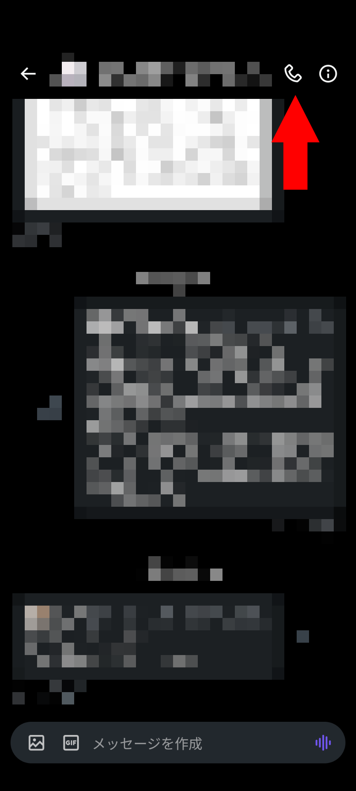
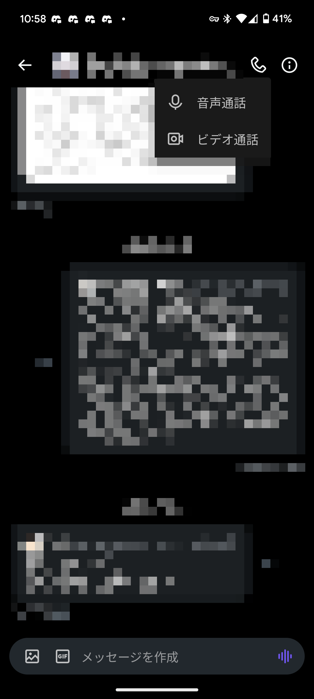
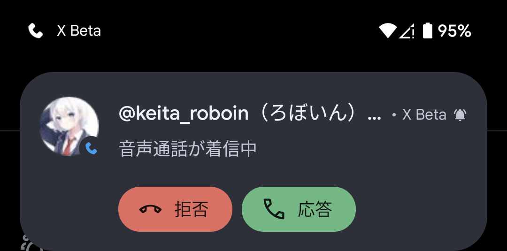
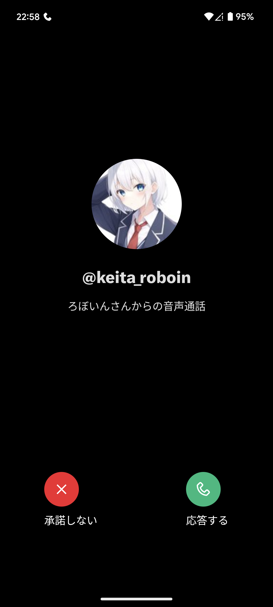
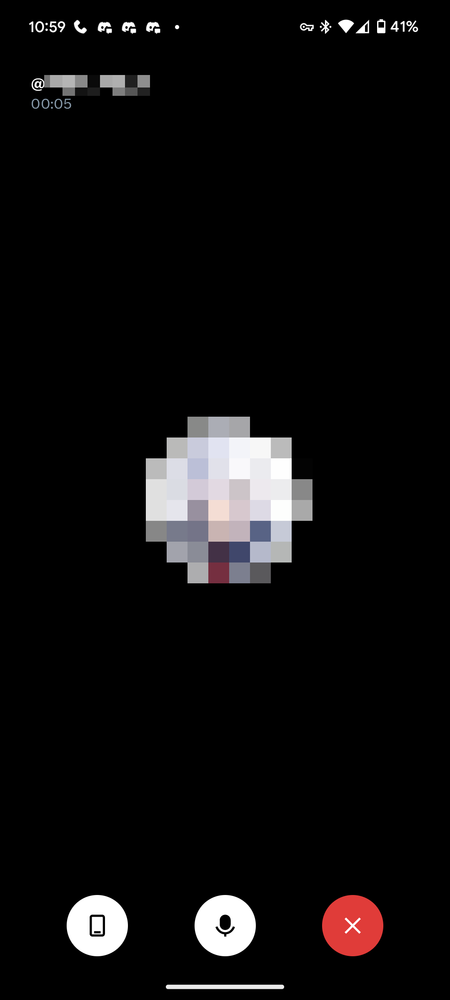
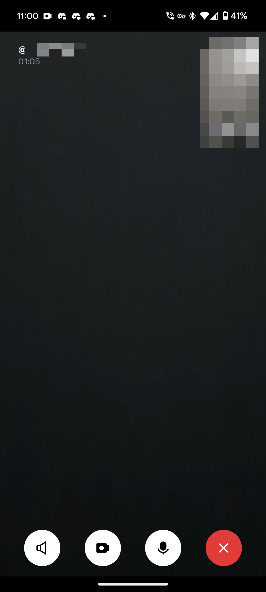

import ArticleCard from "@components/ArticleCard.astro";

Twitter（X）に新機能、**ビデオ通話と音声通話**が追加されました。

今回は、この新機能について詳しく解説します。**通話機能は便利なだけでなくリスクもあるので、通話機能をオフにする方法と、安全のために必須な設定についても紹介します**。

## 通話機能とは？

Twitterは最近、通話機能を追加しました。Twitterアカウントさえあれば、音声通話やビデオ通話ができるようになります。この新機能はiOSとAndroidの両方のデバイスで利用できます。

しかし、この機能には制限や注意点があります。次はそれらについて、詳しく見ていきましょう。

## 通話機能は危険？注意点など

通話機能は活用すれば便利な機能ですが、いくつかの注意点があります。

### デフォルトでオンになっている

通話機能は**デフォルトでオン**になっており、後述の**通話可能なユーザーは誰でも電話をかけられる**状態になっています。

そのため、通話機能を使う予定がなければオフにしておくと安心です。

### 相手にIPアドレスがバレる

デフォルトではP2P（ピア・トゥ・ピア）形式で通話が行われ、**相手にIPアドレスが伝わる可能性**があります。

IPアドレスから正確な住所は割り出せませんが、大まかな現在地は特定できます。

IPアドレスはもともと位置情報を特定するためのものではないので、GPSのような精度はありません。しかし、おおむね市区町村くらいの粒度で場所が分かります。（隣の市区町村にいることになったり、まったく違う場所にいることになったりすることもありますが）

正確な住所を割り出せないとはいえ、わざわざオープンにしておく必要があるものでもないので、**とくに理由がなければIPアドレスを隠す設定をオンにしておくと安心**です。設定方法は後述します。

## 通話機能の制限

また、通話機能はいくつかの制限があります。それらの制限についても見ていきましょう。

通話機能は**デフォルトで有効化**されており、**誰でも通話を受けられます**。しかし、**通話をかけられるのは課金ユーザー（有料プランのユーザー）からのみ**となっています。Twitterの有料プランには3種類あり、それぞれのプランの違いはこちらの記事で解説しています。

<ArticleCard link="/article/2023/10/28/differences-between-3-twitter-plans/" />

また、デフォルトではフォローしている人やアドレス帳に登録されている人からの通話だけを受けるようになっています。設定にかかわらず、過去に直接メッセージ（DM）を送った相手だけが通話をかけられます。

## 通話機能の使い方

通話機能の使い方は簡単です。通話したい相手のDM画面を開き、画面右上の電話アイコンをタップするだけです。

電話アイコンをタップすると、音声通話とビデオ通話を選択できます。使いたい方を選ぶと、通話が開始されます。

通話をかけると、相手のスマートフォンには通話の着信通知が届きます。拒否する場合は［拒否］、通話に出る場合は［応答］をタップします。

通知をタップすると、電話に出るか確認する画面が表示されます。出ない場合は［承諾しない］、出る場合は［応答する］をタップします。

通話が始まると、次のような画面になります。画面の中央には相手のアイコンが表示され、画面下部にはいくつかのボタンが並んでいます。

ボタンは左から順に、音声出力先の変更、ミュート、通話の終了です。

ビデオ通話の場合は次のような画面になります。画面の中央には相手の映像が表示され、右上には自分の映像が表示されます。画面下部には音声通話と同じく、いくつかのボタンが並んでいます。

ボタンは左から順に、スピーカーの切り替え、映像のオン・オフ、ミュート、通話の終了です。使用するカメラを切り替えたい場合は、自分の映像に表示されている回転矢印をタップします。

## 通話機能をオフにする方法

通話機能をオフにするには、設定を開き、［プライバシーと安全］>［ダイレクトメッセージ］>［音声通話とビデオ通話を有効にする］をオフにします。

なお、**iOSでは通話を許可する相手のチェックボックスをすべて外さないと、通話機能をオフにできません**。

## 通話機能を安全に使う方法

### 通話をかけられる相手を制限する

通話機能を使いたい場合は、**自分に対して通話をかけられる相手を最小限にしておくと安心**です。通話をかけられる相手は、［プライバシーと安全］>［ダイレクトメッセージ］>［次のユーザーからの音声通話とビデオ通話を許可する］で設定できます。

デフォルトでは［アドレス帳に登録されているユーザー］と［フォローしているユーザー］が選択されています。アドレス帳を連携していない場合は、［フォローしているユーザー］だけが選択されています。

この項目では、［アドレス帳に登録されているユーザー］［フォローしているユーザー］［認証済みアカウント］のそれぞれについて、オン・オフを切り替えられます。

### IPアドレスを隠す

**設定内の［通話のプライバシーを高める］をオンにすると通話がTwitterのサーバーを経由するようになり、プライバシーが保護されます**。

この設定をオンにするには、設定を開き、［プライバシーと安全］>［ダイレクトメッセージ］>［通話のプライバシーを高める］をオンにします。

## その他

通話機能がうまく使えない場合、次のような可能性が考えられます。

### 通話の設定項目が見つからない

通話機能の設定項目が見つからない場合は、アプリを最新バージョンにアップデートしてみてください。通話機能は最近追加されたばかりなので、アプリのバージョンが古い場合は設定項目が表示されない場合があります。

また、通話機能は現時点ではアプリでのみ使用できます。Web版では通話機能を使えないため、設定項目も表示されません。

### 通話をかけられない

課金しているか、また相手が通話を受け入れる設定にしているか確認してください。通話を受けるのは誰でもできますが、通話をかけるには課金している必要があります。また、相手が通話を受け入れない設定にしていると、通話をかけられません。

### 着信時に通知が届かない

Androidスマホで着信時に通知を受け取るには、プッシュ通知を許可する必要があります。スマホの設定でTwitterアプリのプッシュ通知を許可してみてください。

## まとめ

Twitterの通話機能は、利便性を高める一方で、制限や注意点があります。通話機能はデフォルトで有効になっているため、この記事を参考にして自分にあった設定にしてみてください。

## 参考

- [Audio and Video Calls](https://help.twitter.com/en/using-x/direct-messages/audio-video-calls)
