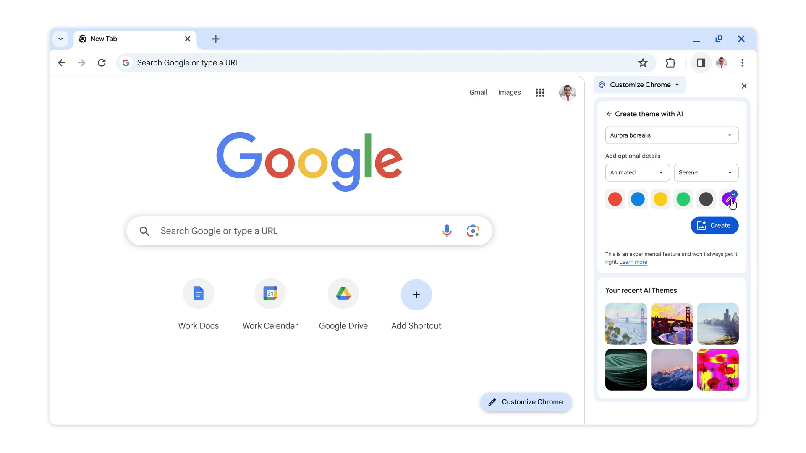

私たちの身の回りのテクノロジーは日々進化しており、その最前線がAIです。とくに、最近では生成AIが話題になっています。

Chrome v121では **「AIによるテーマ生成」** 機能が搭載されました。この機能により、これまでにない形でChromeのカスタマイズが可能になりました。

ブラウザーを自分好みにカスタマイズすることは、Webを閲覧する上での楽しみのひとつです。今までChromeでは、アップロードした写真やChrome Web Storeのテーマコレクションを活用してカスタマイズができました。

今回追加されたAIテーマ生成機能では、**生成AIを使ってテーマを自動生成できます**。

## AIによるテーマ生成機能とは

*[3 new generative AI features coming to Google Chrome](https://blog.google/products/chrome/google-chrome-generative-ai-features-january-2024/#custom-themes)より*

2024年1月23日の[公式プレスリリース](https://blog.google/products/chrome/google-chrome-generative-ai-features-january-2024/#custom-themes)によると、この機能は、Android 14やPixel 8デバイスで昨年[導入](https://blog.google/products/android/android-14-customizations/)されたテキストから画像を生成する拡散モデルをもとにしています。

ユーザーがテーマの「主題」、「スタイル」、「ムード」、「色」を選び、それに基づいてAIがカスタムテーマを即座に作成するというわけです。

たとえば、「オーロラ」を「アニメーション」スタイルで、「穏やか」なムードで見たいと考えている場合、これらのオプションを選択するだけでAIがそれに合ったテーマを提供してくれます。

:::note
Googleは選択したオプション、フィードバック、テーマの使用データを収集し、この機能を改善するために使用するとのことです。
:::

## 使用方法

### 必要条件

ChromeのAIテーマ生成機能は、**すべてのユーザーが使えるわけではありません**。記事執筆時点では、次のすべての条件を満たしているユーザーだけが利用できます。

1. 米国内に居住し、18歳以上であること
2. Googleアカウントにログインしていること
3. 実験的なAI機能をオンにしていること

### 実験的なAI機能をオンにする方法

1. Chromeを開く
2. ［その他（More）］を選択し、［設定（Settings）］の［実験的AI（Experimental AI）］を選択
3. ［実験的なAI機能を試す（Try out experimental AI features）］の［AIでテーマを作成する（Create themes with AI）］をオンにする
4. Chromeを再起動

### AIテーマの作成方法

1. Chromeを開いて新しいタブページの右下で［Chromeをカスタマイズ（Customize Chrome）］を選択
2. ［テーマを変更（Change theme）］の［AIで作成（Create with AI）］を選択
3. 「AIでテーマを作成（Create theme with AI）」の画面で、次の手順でテーマを作成する
   - 主題を選択
   - ［詳細を追加（Add optional details）］でスタイル、ムード、カラーを選択
   - ［作成（Create）］をクリック

### それぞれのパラメーターの意味

AIを使ったテーマ作成機能では、次のようなパラメーターを選択することで、テーマの生成をコントロールできます。

#### 主題

**主題を選択することで、テーマの基本的なイメージが決まります**。たとえば「オーロラ」を選ぶと、オーロラが主題になります。

#### スタイル

**スタイルを選ぶことで、テーマのビジュアル表現が変わります**。エレガントなものからアニメーションスタイル、抽象的なものまで、幅広い選択肢から選べます。それぞれのスタイルにはサムネイルが用意されているので、イメージを膨らませやすくなっています。

#### ムード

**ムードの選択は、テーマの全体的な雰囲気を決定します**。たとえば「穏やか」を選ぶと、穏やかで心地よい雰囲気のテーマが、また「活動的」を選ぶと、エネルギッシュで明るい雰囲気のテーマが生成されます。

#### カラー

**カラーの選択でテーマの色調が決まります**。好きな色をもとにして、AIがテーマの色合いを調整します。より細かい色の調整が必要な場合は、「カスタムカラー」を使用して独自の色を選択できます。

:::note
AIテーマ生成のプロセスには最大で10秒程度かかる場合があります。
:::

## AIテーマが使えない場合

この機能を使えない場合は、次のような理由が考えられます。

### 条件を満たしていない

記事執筆時点では、すべてのユーザーが使えるわけではありません。前述のすべての条件を満たしているか確認してください。

### Chromeのバージョンが古い

この機能は、Chrome v121以降で利用できます。Chromeのバージョンを最新にアップデートしてください。

## まとめ

Chromeの最新機能、「AIによるテーマ生成」は、ブラウザーのカスタマイズをさらに進化させるものです。この機能により、ユーザーは自分の好みや現在の気分に基づいて、独自のテーマを即座に生成できるようになりました。

スタイル、ムード、カラーの選択を通じて、無限に近いバリエーションの中から自分だけのテーマを見つけ出すことが可能です。使い方も簡単で、AIの力を借りてブラウザーを一層パーソナライズできます。

## 参考

- [3 new generative AI features coming to Google Chrome](https://blog.google/products/chrome/google-chrome-generative-ai-features-january-2024/#custom-themes)
- [Customize Chrome themes with AI - Google Chrome ヘルプ](https://support.google.com/chrome/answer/14516713?visit_id=638420549295068093-3832364767&p=create_themes_with_ai&rd=1)
