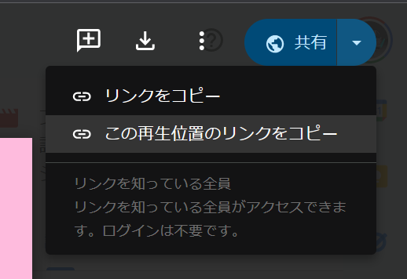

動画を使ったコミュニケーションは、学校のプレゼンテーションからビジネスの会議まで、私たちの生活にとって欠かせないものになっています。とくに最近では、リモートワークやオンライン学習が一般的になったことで、動画共有の機会も増え続けています。

そんな中、Google Driveが新たに追加した「**動画の特定の時間へのリンク共有機能**」は、あらゆるシーンで役立つ便利な機能です。今回はその使い方を解説します。

## 動画の特定の部分へリンクするメリット

動画の長さはさまざまで、数十秒のものから数時間に及ぶものまであります。

通常、動画の紹介や共有時には、動画の最初から見始めることが一般的ですが、特定の情報やハイライト部分だけを素早く共有したい場合もあります。

そうしたときに、**動画の特定の時間へ直接リンクで飛べるのは大きなメリットです**。

たとえば、教育現場では、授業内で特定の実験や解説部分だけを素早く見せたい時や、ビジネスシーンでは、プレゼンテーションの特定の箇所を後から確認したいときなど、多くのシーンで役立ちます。

## Google Driveで特定の時間へリンクを共有する方法

2024年1月12日、GoogleはGoogle Driveの「共有」ボタンに、動画の特定の部分へのタイムスタンプ付きリンクを共有する新機能を[追加](https://workspaceupdates.googleblog.com/2024/01/release-notes-01-12-2024.html)しました。

この機能を使うと、動画の特定の時間へのリンクを簡単に共有できます。

この機能を使うにはまず、共有したい動画をGoogle Driveで開きます。次に、共有したい特定の再生位置に動画を進めます。そして、右上の［共有］ボタンの横にあるプルダウンをクリックし、［この再生位置のリンクをコピー］をクリックします。

これで、特定の時間へのリンクがクリップボードにコピーされたので、あとはそれを共有したい相手に送るだけです。

:::caution
動画を再生するためには、サードパーティのCookieが必要です。Cookieの設定方法がわからない方は、GoogleのヘルプまたはWebを参照してください。

- [Cookie を有効または無効にする - パソコン - Google アカウント ヘルプ](https://support.google.com/accounts/answer/61416?sjid=14194685258937013425-AP)
:::

## まとめ

Google Driveにおけるこの新機能は、教育からビジネス、さらには個人的な利用まで、多岐にわたるシーンでのコミュニケーションをよりスムーズにします。動画の共有がこれまで以上に便利になること間違いなしです。情報共有の効率化にぜひ活用してみてください。

## 参考

- [Google Workspace Updates: Google Workspace Updates Weekly Recap - January 12, 2024](https://workspaceupdates.googleblog.com/2024/01/release-notes-01-12-2024.html)
- [Google ドライブで動画を保存、再生する - パソコン - Google ドライブ ヘルプ](https://support.google.com/drive/answer/2423694?hl=ja&sjid=14194685258937013425-AP)
