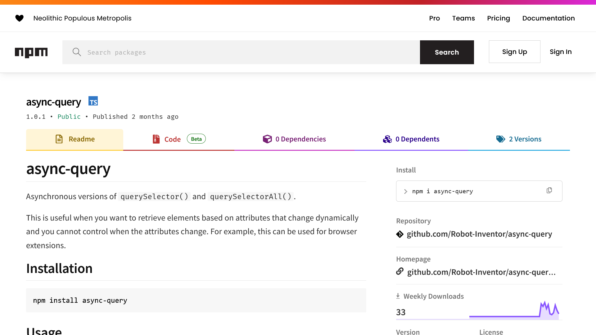

Web開発をしていると、動的に変化する属性を元にDOM要素を取得したい場面にしばしば出くわします。

そんなときに使えるライブラリーが見当たらなかったので、「async-query」というnpmライブラリを作りました。この記事では、その概要から特徴、使い方などを詳しく解説します。

## async-queryとは



「async-query」は、`querySelector()` と `querySelectorAll()` の非同期版を提供するnpmライブラリです。動的に変更される属性を基に要素を取得したい場合、とくにブラウザー拡張機能を作成する際などに役立ちます。

実際に、私が開発している[Shadowban Scanner](https://shadowban-scanner.roboin.io/)という拡張機能の内部で使われています。

## 作った理由

Web開発において、DOM要素の属性が動的に変更されるというケースは珍しくありません。しかしながら、そのタイミングを完全にコントロールするのは難しい場合があります。とくに、ブラウザー拡張機能を開発する際には、属性の変更タイミングなどはサイト側に依存するため、コントロールできません。

こうした場合、`querySelector()` や `querySelectorAll()` などの同期的なDOM要素取得関数を使うと、取得したい要素が取得できないという問題が発生します。

代わりに、`setTimeout()` などを使って一定時間待機するという方法がありますが、PCのスペックによっては待機時間が足りない場合もあります。また、高性能なPCでは必要以上に待ち時間が発生してしまうという問題もあります。

こうした課題を解決するために生まれたのが「async-query」です。

## async-queryの特徴

「async-query」の大きな特徴は、非同期処理を用いてDOM要素を取得できる点にあります。これにより、ページのロード状況や動的なDOMの変更にも柔軟に対応できます。

## 基本的な使い方

まずは、基本的な使い方から紹介します。まずは、ライブラリーをプロジェクトにインストールします

```sh
npm install async-query
```

async-queryは次のようなコードで利用できます。

```js
import { asyncQuerySelector, asyncQuerySelectorAll } from "async-query";

const element = await asyncQuerySelector("#my-element");
const elements = await asyncQuerySelectorAll(".my-elements");
```

これで、IDが`my-element`の要素や、クラスが`my-elements`の要素を非同期処理で取得できます。

## 応用的な使い方

さらに応用的な使い方として、`asyncQuerySelector()`と`asyncQuerySelectorAll()`関数は次のシグネチャーを持ちます。

```ts
asyncQuerySelector(selectors: string, parentElement: Element | Document, timeoutMs: number): Promise<Element | null>
asyncQuerySelectorAll(selectors: string, parentElement: Element | Document, timeoutMs: number): Promise<NodeListOf<Element>>
```

セレクター、親要素、タイムアウト（ミリ秒）を指定することで、さらに精密な要素取得が可能です。

また、TypeScriptに対応しており、次のようにすることで戻り値の型を指定できます。

```ts
const element = await asyncQuerySelector<HTMLDivElement>("#my-element");
```

さらに、HTMLタグのみを指定した場合は、戻り値の型が自動的に絞り込まれます。

```ts
// HTMLDivElement | null
const element = await asyncQuerySelector("div");
```

## その他

このライブラリーに関するバグの報告や機能の要望があれば、[GitHub](https://github.com/Robot-Inventor/async-query)のissueやPull Requestへお願いします。

## まとめ

この記事では、非同期でHTML要素を取得する「async-query」について解説しました。このライブラリーを使うことで、動的に変化する属性を元にDOM要素を取得できます。ぜひ、開発に役立ててみてください。
