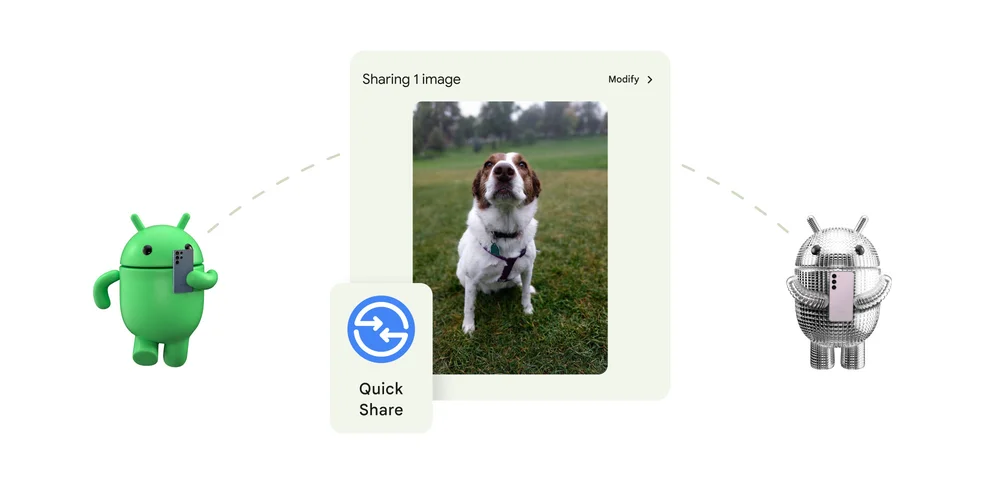

Androidでファイルや写真、テキストを簡単に、速く、そして便利に共有できることをご存知ですか？

2024年のCESで発表されたばかりの「**クイック共有**」について、その使い方を詳しく紹介します。

## クイック共有とは？

*画像：[Google at CES 2024: New Android features and updates](https://blog.google/products/android/ces-2024-android-updates/)より*

**クイック共有（旧ニアバイシェア）は、Androidデバイス間、さらにはChromebookやWindows PCとファイルを共有できる、Androidの標準機能です**。iPhoneのAirDropのような機能と考えてもらえれば、イメージしやすいでしょう。

GoogleとSamsungが力を合わせ、以前から存在する「Nearby Share」とSamsung独自の「Quick Share」の機能を統合し、さまざまなデバイス間でのコンテンツ共有をよりシームレスにしました。

:::note
クイック共有の利用には、Androidデバイス間での互換性があること、またGoogle Playサービスのバージョンが最新であることが必須です。機能がまだ利用できない場合は、デバイスやGoogle Playサービスのアップデートを確認しましょう。
:::

## クイック共有の基本的な使い方

### 1. 送信したいファイルを選ぶ

共有したいファイルや写真、テキストを開き、「共有」ボタンをタップします。

### 2. アイコンを探す

クイック共有を利用するには、共有メニューからクイック共有アイコンを見つけましょう。このアイコンは、二つの矢印が相互に向かい合う形で配置されたシンプルなデザインです。

### 3. 受信デバイスを選択

クイック共有を選択すると、近くにある利用可能なデバイスのリストが表示されます。ここで、ファイルを送信したいデバイスを選びます。

### 4. 送信

選択したら、あとは画面の指示に従って送信しましょう。シンプルな操作で、簡単で高速なファイル共有が可能になります。

## プライバシー設定

クイック共有では、自身のプライバシーをしっかりとコントロールできます。設定メニューから、自分のデバイスを誰が発見できるかを選べます。

オプションは「全員」、「連絡先のみ」、または「自分のデバイスのみ」です。自分にとって適切な設定を選びましょう。

## まとめ

「クイック共有」は、Androidエコシステム全体でのファイル共有をより簡単に、より速く、より便利にする機能です。

ぜひ、この機能を使って、Androidデバイス間でファイルを共有してみてください。

## 参考

- [Google at CES 2024: New Android features and updates](https://blog.google/products/android/ces-2024-android-updates/)
- [Google starts rolling out Quick Share on Pixel, non-Samsung ](https://9to5google.com/2024/01/31/google-quick-share-pixel/)
