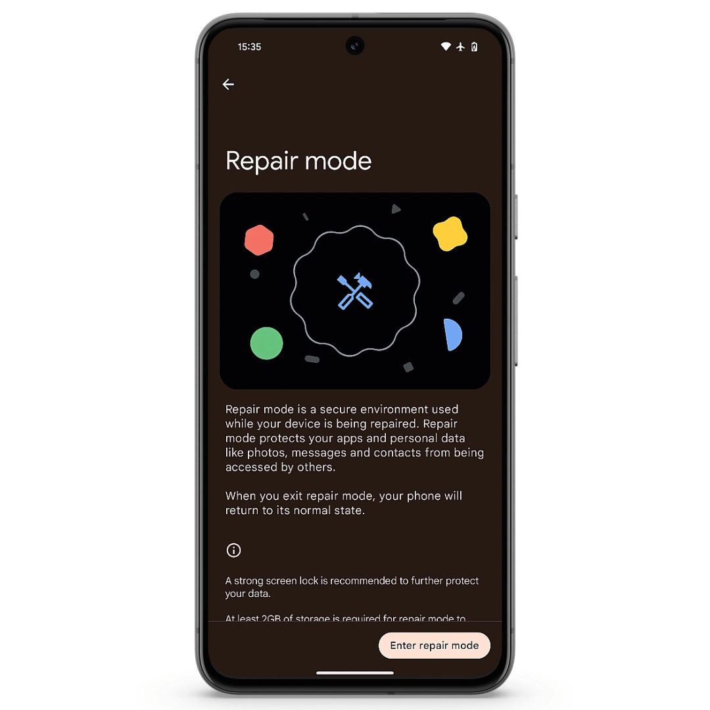

スマホを修理に出すとき、「**データのバックアップを取ったり、リセットしたりするのが面倒…**」「**修理の間、大切な写真や個人情報が他人の目に触れるのが不安…**」といった不安があるかもしれません。

そんなときに役立つのが、Google Pixelの「**修理モード**」です。この記事では、修理モードのメリットと使い方を分かりやすく紹介します。

## はじめに

スマホを修理に出す際、データを守りつつ手間なく進められる方法を知っておくと、ずいぶん安心できますよね。

実はGoogle Pixelでは、修理モードという便利な機能が提供されています。この機能を使えば、修理をシンプルに、そして安全に進めることが可能です。

## 修理モードとは

*画像：[Google announces more ways to repair Pixel phones](https://blog.google/products/pixel/pixel-phone-repair-update/)より*

修理モードは文字どおり修理のときに使うための機能で、2023年12月にPixelに実装されました。**工場出荷時の設定にリセットすることなく、個人データや情報の無断アクセスを防ぎながら修理できます**。

修理モードは、修理を依頼する際にスマホのデータを保護し、技術者が診断やサービスをするための安全な環境を提供します。修理サービスでは一部のアプリのみを利用でき、修理モードの間に加えられた変更は修理モードを終了すると削除されます。

:::note
修理モードを使用できるのは、Android 14の2023年12月のアップデート以降を搭載し、かつ2GB以上の空き容量があるPixel端末です。
:::

## 修理モードの使い方

では、Google Pixelで修理モードを使う手順を見ていきましょう。

なお、ストレージに関する部品を交換することになった場合は修理モードでもデータが削除されるので、**必ずバックアップを取っておきましょう**。

1. ［設定］アプリを開く
2. ［システム］を選択し、［修理モード］をタップ
3. 画面の指示に従って修理モードを有効化する
4. ロック画面と同じセキュリティPIN、パスワード、パターンなどを入力する
5. システムが再起動される

:::tip
修理に出す前にSIMカードを取り外して自分で保管しておきましょう。
:::

## 修理モードを解除する方法

修理モードの解除も簡単です。

1. ［設定］アプリを開く
2. ［システム］>［修理モード］と進み、解除フローを開始する
3. セキュリティPIN、パスワード、パターンなどを入力する
4. システムが再起動される

:::tip
画面上部の通知ドロップダウンメニューからも修理モードを終了できます。
:::

## まとめ

Google Pixelの修理モードは、データを守りながら安全かつスムーズに修理するための便利な機能です。

設定や解除もシンプルなので、修理が必要になった際は、ぜひ活用してみてください。

## 参考

- [Google announces more ways to repair Pixel phones](https://blog.google/products/pixel/pixel-phone-repair-update/)
- [修理サービス向けの修理モードを使用する - Google Pixel ヘルプ](https://support.google.com/pixelphone/answer/14266732)
